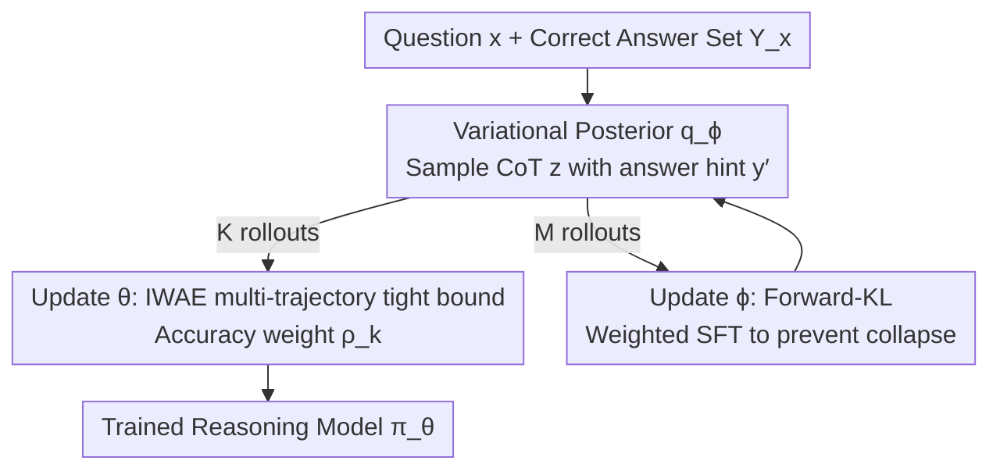

# Variational Reasoning for Language Models

**Conference**: ICLR 2026  
**OpenReview**: [https://openreview.net/forum?id=fGGcovg6oW](https://openreview.net/forum?id=fGGcovg6oW)  
**Code**: Available (Link provided in paper)  
**Area**: LLM Reasoning  
**Keywords**: Variational Inference, Latent CoT, ELBO, IWAE, Forward-KL

## TL;DR
This paper treats the "Chain-of-Thought" (CoT) as a latent variable and "correct answer" as an observation, deriving a training objective from ELBO using variational inference. It introduces a variational posterior with an "answer hint" to sample CoT trajectories more likely to be correct. The model is updated using the IWAE multi-trajectory tight bound with accuracy-based weights, while the posterior is updated using forward-KL to prevent collapse. The authors further prove that RFT and GRPO are "accuracy-weighted local forward-KL," revealing an implicit bias toward easy problems. The method consistently outperforms strong baselines across multiple scales of Qwen2.5/Qwen3.

## Background & Motivation

**Background**: To enable Large Language Models (LLMs) to learn reasoning, two mainstream paths exist: Supervised Fine-Tuning (SFT) directly mimicking long CoTs curated by humans/teachers, and Reinforcement Learning (RL, e.g., GRPO) using verifiable rewards (correctness) to optimize the policy. Both have achieved significant empirical results.

**Limitations of Prior Work**: SFT relies on expensive human CoT data, lacks generalization as an offline method, and is prone to catastrophic forgetting. RL training is unstable, and output diversity often collapses; for difficult problems where correct answers are sparse, the Pass@K may even fall below that of the base model. Both paths lack a unified objective with a principled foundation.

**Key Challenge**: Existing methods optimize "CoT $z$ + answer $y$" as a single joint output, failing to distinguish how "reasoning" and "answering" should be learned. The true objective should be maximizing the probability of being correct after marginalizing over all possible reasoning paths: $P_\theta(Y_x|x)=\sum_z \pi_\theta(y\in Y_x|x,z)\pi_\theta(z|x)$. However, this summation over $z$ is intractable, forcing existing methods to optimize the entire sequence and lose the structural benefits of probabilistic modeling.

**Goal**: To explicitly decompose reasoning into "reasoning process $z$ (latent variable) + answer $y$ (observation)," providing a unified training objective that directly optimizes $\log P_\theta(Y_x|x)$, remains compatible with verifiable rewards, and explains existing methods.

**Key Insight**: CoT is naturally a latent variable—the answer's correctness is observable, but the "optimal reasoning path" is hidden. Variational Inference (VI) is designed for such "Maximum Likelihood Estimation with latent variables." By introducing a variational posterior to approximate the true posterior of "how to think given a correct answer," the intractable marginalization is replaced with a computable lower bound.

**Core Idea**: Replace "whole-sequence optimization" with variational inference. A variational posterior $q_\phi(z|x,y')$ conditioned on an answer hint $y'$ is introduced to sample reasoning paths more likely to be correct. Using ELBO/IWAE as optimizable tight lower bounds, SFT and RL are unified within a single probabilistic framework.

## Method

### Overall Architecture

The method can be viewed as an "EM-style" alternating optimization loop. The log-likelihood of the probability of being correct, $\log P_\theta(Y_x|x)$, is the final objective. Since the sum over $z$ is intractable, it is relaxed into an Evidence Lower Bound (ELBO). The framework involves two trained networks: the reasoning model $\pi_\theta(z,y|x)$ and the variational posterior $q_\phi(z|x,y')$. Each iteration alternates: first, $q_\phi$ samples several reasoning paths $z$ conditioned on the correct answer hint $y'$; then, these trajectories are used to update $\theta$ (via IWAE tight bound + accuracy weights) and $\phi$ (via forward-KL weighted SFT). In practice, a single iteration ($T=1$) is sufficient.

The training pipeline is shown below (the three contribution nodes correspond to Key Designs 1/2/3; Key Design 4 is the theoretical unification of RFT/GRPO):

### Key Designs

**1. Treating CoT as a Latent Variable: ELBO and Hinted Variational Posterior**

Maximizing $\log P_\theta(Y_x|x)$ requires summing over all $z$, which is intractable. This paper applies variational inference to derive the Evidence Lower Bound:

$$\log P_\theta(Y_x|x)\ \ge\ \mathbb{E}_{q_\phi(z|x,y')}\big[\log \pi_\theta(Y_x|x,z)\big]-D_{\mathrm{KL}}\big(q_\phi(z|x,y')\,\|\,\pi_\theta(z|x)\big).$$

A key innovation is that $q_\phi(z|x,y')$ is conditioned not just on $x$, but also on an "answer hint" $y'$ (wrapped in `<hint>y'</hint>` and appended to $x$), where $y'$ is drawn from the correct answer set $Y_x$. This "peeking at the answer to back-infer the reasoning" guides the posterior to generate trajectories more likely to be correct. The authors prove that maximizing ELBO w.r.t. $q_\phi$ is equivalent to minimizing the reverse KL between $q_\phi(z|x,y')$ and the true posterior $P_\theta(z|x,Y_x)=\pi_\theta(Y_x|x,z)\pi_\theta(z|x)/P_\theta(Y_x|x)$, where the optimal solution is $q_\phi^\*=P_\theta(z|x,Y_x)$.

**2. IWAE Multi-trajectory Tight Bound + Accuracy Weights: Tightening the Bound & Reducing Variance**

Borrowing from RL practices of parallel rollouts, the single-trajectory ELBO is expanded into an IWAE-style multi-trajectory lower bound using $K$ trajectories $z_{1:K}\sim q_\phi$:

$$\mathcal{L}^K_{\mathrm{ELBO}}=\mathbb{E}_{z_{1:K}\sim q_\phi}\Big[\log \tfrac{1}{K}\textstyle\sum_{k=1}^{K}\tfrac{\pi_\theta(z_k,Y_x|x)}{q_\phi(z_k|x,y')}\Big],$$

where a larger $K$ results in a tighter bound. When updating $\theta$, each trajectory is assigned a normalized importance weight $\tilde\rho_k$. The term $\pi_\theta(Y_x|x,z)$ can be estimated using either likelihood-based or accuracy-based estimators. Theorem 1 states that when $|Y_x|>1$ and accuracy $\pi_\theta(Y_x|x,z)\ge 1/|Y_x|$, the accuracy estimator has a lower worst-case variance ($\max_{\pi_\theta}\mathrm{Var}_{\mathrm{acc}}\le \max_{\pi_\theta}\mathrm{Var}_{\mathrm{like}}$). Given that correct expressions are often numerous ($|Y_x|\gg 1$), the accuracy estimator is used by default. The likelihood ratio $\pi_\theta(z_k|x)/q_\phi(z_k|x,y')$ is also per-token geometric-mean normalized (to the power of $1/|z_k|$) to reduce variance at the cost of some bias, preventing ratio explosion in long CoTs.

**3. Forward-KL Training for the Variational Posterior: Preventing Shortcut Collapse**

Training $q_\phi$ using the original ELBO form (reverse KL) causes issues: base LLMs $\pi_\theta(z|x)$ are usually well-trained, and $q_\phi$ with the hint $y'$ can easily find a shortcut—leaking answer tokens directly into the CoT to "pretend to think." This leads to posterior collapse where reasoning is not learned. This paper instead uses forward KL $D_{\mathrm{KL}}(P_\theta(z|x,Y_x)\,\|\,q_\phi(z|x,y'))$, which shares the same optimal solution but results in a weighted SFT gradient:

$$\nabla_\phi \mathcal{L}^M_{\mathrm{forward}}=\mathbb{E}_{z_{1:M}\sim \pi_\theta(z|x)}\Big[\textstyle\sum_{m=1}^{M}\tilde w_m\,\nabla_\phi \log q_\phi(z_m|x,y')\Big],\quad \tilde w_m=\tfrac{w_m}{\sum_j w_j},\ w_m=\pi_\theta(Y_x|x,z_m).$$

Crucially, training data $z_m$ is sampled from $\pi_\theta(z|x)$ (no answer peeking) and weighted by correctness $w_m$. The posterior thus learns from "reasonable CoTs the model can actually produce," weighted by success probability. This mode-covering approach avoids the shortcut collapse of copying the answer.

**4. Unified Perspective: RFT/GRPO as Weighted Forward-KL**

By decomposing the output into $z$ and $y$, the authors show that mainstream methods can be re-expressed in this framework. The gradient for the CoT part of Rejection Sampling Fine-Tuning (RFT) can be written as:

$$\nabla_\theta \mathcal{L}_{\mathrm{RFT}}=-P_{\mathrm{ref}}(Y_x|x)\cdot \nabla_\theta D_{\mathrm{KL}}(P_{\mathrm{ref}}(z|x,Y_x)\,\|\,\pi_\theta(z|x)),$$

which is "forward KL weighted by model accuracy $P_{\mathrm{ref}}(Y_x|x)$." Binary reward RL (including GRPO) is similar: GRPO's group-relative reward normalization makes the per-problem weight $\sqrt{P_\theta(Y_x|x)/(1-P_\theta(Y_x|x))}$, which increases monotonically with accuracy. This weighting scheme suppresses hard problems and amplifies easy ones, creating an implicit bias toward easier tasks. In contrast, the Eq.(9) forward-KL objective treats all problems equally, making it more robust for hard tasks.

### Loss & Training

Training follows Algorithm 1, alternating between parameter sets (with $T=1$ in experiments):

- **Update $\phi$ (Variational Posterior)**: Rollout $M$ trajectories from $\pi_{\theta_{t-1}}(z|x)$, compute accuracy weights $\tilde w_m$, and perform weighted SFT via $\nabla_\phi\mathcal{L}^M_{\mathrm{forward}}$.
- **Update $\theta$ (Reasoning Model)**: Rollout $K$ trajectories from $q_{\phi_t}(z|x,y')$, estimate $\tilde\rho_k$ via Eq.(8) (geometric-mean likelihood ratio × accuracy), and update via the IWAE gradient $\sum_k \tilde\rho_k\nabla_\theta(\log\pi_\theta(z_k|x)+\log\pi_\theta(Y_x|x,z_k))$.

In practice, $\pi_{\theta_0}$ (using Bespoke-Stratos) and $q_\phi$ (via forward-KL) are first fine-tuned independently from the same base. Then, $q_\phi$ generates 8 responses per sample, which are weighted for the final training. Data settings include 17K (full set, taking highest-weighted $q_\phi$ response + original) and 1K (subset, using all 8 responses).

## Key Experimental Results

### Main Results

Models were trained on Bespoke-Stratos-17k and evaluated on 10 benchmarks (GPQA-D and MMLU-Pro are OOD). "-Acc / -GML" denote weight estimators; "-PA / -PB" denote prompt templates.

| Base | Method | Math Group Avg | General/Code Group Avg |
|------|------|-----------|-----------|
| Qwen3-4B-Base | Base | 21.38 | 18.26 |
| Qwen3-4B-Base | Bespoke-Stratos-4B† | 51.35 | 40.40 |
| Qwen3-4B-Base | **Ours-PB-Acc-4B** | **55.72** | **46.12** |
| Qwen3-8B-Base | Bespoke-Stratos-8B† | 58.54 | 49.46 |
| Qwen3-8B-Base | **Ours-PB-Acc-8B** | **62.77** | **54.69** |
| Qwen2.5-32B-Inst | Bespoke-Stratos-32B | 70.34 | 66.32 |
| Qwen2.5-32B-Inst | RLT-32B | 70.43 | 65.82 |
| Qwen2.5-32B-Inst | **Ours-PA-Acc-32B** | **72.01** | **67.21** |

> Math Group includes MATH500/AIME24/AIME25/AMC23/OlympiadBench; General/Code Group includes GPQA-D/LCB-E/LCB-M/LCB-H/MMLU-Pro. Ours outperformed the strong Bespoke-Stratos-4B† baseline by ~8.5% in Math and ~14% in General domains. Reasoning gains generalized to OOD tasks.

### Ablation Study

| Configuration | Math Group Avg | General Group Avg | Description |
|------|-----------|-----------|------|
| Ours-4B (Full) | 55.72 | 46.12 | With answer hint $y'$ |
| w/o $y'$ | 48.18 | 37.80 | Posterior not conditioned on hint |
| Qwen2.5-7B-1K · Ours-Acc | 45.41 | — | Accuracy estimator |
| Qwen2.5-7B-1K · Ours-GML | 45.38 | — | Geometric mean likelihood |
| Qwen2.5-7B-1K · Ours-L | 43.01 | — | Naive likelihood estimator |

### Key Findings
- **The answer hint $y'$ is the crux of the posterior**: Removing $y'$ lead to a drop of 7.5+ in Math and 8+ in General, proving that "peeking at the answer to back-infer CoT" is vital for high-quality sampling.
- **Accuracy/Geometric-mean estimators significantly outperform naive likelihood**: Acc(45.41) ≈ GML(45.38) > L(43.01), aligning with Theorem 1's variance analysis.
- **Pass@K advantage increases with $K$ on complex tasks** (e.g., LiveCodeBench-Hard), while the gap narrows on simple multiple-choice tasks, showing VI's value for difficult problems.
- **More stable training**: Fig.1 shows the method has lower loss and gradient norms than the Bespoke-Stratos baseline.
- **Robustness to prompt templates**: Performance across PA and PB templates was consistently high.

## Highlights & Insights
- **Asymmetric design is clever**: The variational posterior uses the answer hint $y'$ to navigate toward quality CoTs, but the IWAE weights and training data for the posterior are derived from $\pi_\theta(z|x)$ without peeking, ensuring hints aid discovery without leaking into the final model.
- **Using Forward-KL instead of Reverse-KL to cure "collapse" is a transferable trick**: For any latent variable training where conditional generation might take shortcuts to the target, Forward-KL (mode-covering) is a robust substitute for Reverse-KL (mode-seeking).
- **The unification of RFT/GRPO as "accuracy-weighted Forward-KL"** reveals an implicit bias toward easy tasks. This explains why RL struggles with hard problems and suggests how to correct this bias.
- **Theorem 1 provides a clear boundary for estimator selection**: Choosing the accuracy estimator is theoretically grounded when $|Y_x|>1$ and accuracy $\ge 1/|Y_x|$.

## Limitations & Future Work
- Only a single-turn iteration ($T=1$) was evaluated; the potential gains of multi-turn alternating Variational EM remains unexplored.
- The method depends on a correct answer set $Y_x$ and verifiable rewards (Math/Code). How to define $y'$ and estimate weights in open-ended domains without rule-based verifiers remains an open question.
- Accuracy weight estimation requires additional sampling from each CoT to estimate $\mathbb{E}_{y\sim\pi_\theta}[\mathbb{1}(y\in Y_x)]$, increasing training costs.
- Geometric-mean likelihood ratios involve a biased variance trade-off whose quantitative impact on final performance requires further analysis.

## Related Work & Insights
- **vs RFT / GRPO**: Ours demonstrates these are weighted Forward-KL variants biased toward easy tasks. Ours treats tasks with equal importance and utilizes IWAE bounds.
- **vs VeriFree (Zhou et al. 2025)**: While VeriFree uses policy gradient to optimize $P_\theta(y|x)$ directly, Ours provides a systematic probabilistic framework from ELBO, incorporating hinted posteriors and multi-trajectory bounds.
- **vs RLT (Reinforcement Learning Teachers)**: The Reverse KL term in this paper corresponds to RLT’s dense rewards. This paper provides the theoretical basis for RLT’s intuitive reward design and enhances it through IWAE bounds and accuracy estimators.

## Rating
- Novelty: ⭐⭐⭐⭐⭐ Systematically introduces VI to LLM reasoning and provides a unified explanation of RFT/GRPO.
- Experimental Thoroughness: ⭐⭐⭐⭐ Covers 4 model scales and 10 benchmarks with extensive ablations; lacks multi-turn or non-verifiable domain validation.
- Writing Quality: ⭐⭐⭐⭐⭐ Clear derivation from ELBO to a unified perspective; logical progression of motivation and algorithms.
- Value: ⭐⭐⭐⭐⭐ Provides a principled, stable, and verifiable reward-compatible training objective for reasoning.

<!-- RELATED:START -->

## Related Papers

- [\[ICLR 2026\] On the Thinking-Language Modeling Gap in Large Language Models](on_the_thinking-language_modeling_gap_in_large_language_models.md)
- [\[ICLR 2026\] On the Reasoning Abilities of Masked Diffusion Language Models](on_the_reasoning_abilities_of_masked_diffusion_language_models.md)
- [\[ICLR 2026\] Improving Reasoning for Diffusion Language Models via Group Diffusion Policy Optimization](improving_reasoning_for_diffusion_language_models_via_group_diffusion_policy_opt.md)
- [\[ICLR 2026\] SLM-MUX: Orchestrating Small Language Models for Reasoning](slm-mux_orchestrating_small_language_models_for_reasoning.md)
- [\[ICLR 2026\] Pushing on Multilingual Reasoning Models with Language-Mixed Chain-of-Thought](pushing_on_multilingual_reasoning_models_with_language-mixed_chain-of-thought.md)

<!-- RELATED:END -->
