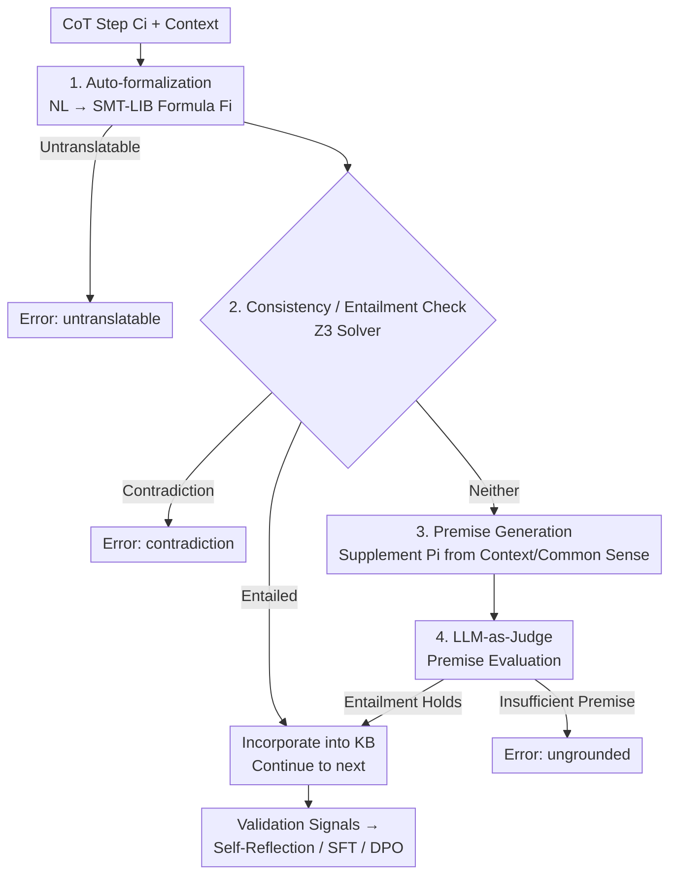

# VERICOT: Neuro-Symbolic Chain-of-Thought Validation via Logical Consistency Checks

**Conference**: ICLR 2026  
**OpenReview**: [https://openreview.net/forum?id=zHuV3Vatov](https://openreview.net/forum?id=zHuV3Vatov)  
**Code**: None  
**Area**: LLM Reasoning  
**Keywords**: CoT Validation, Neuro-Symbolic, First-Order Logic, Auto-formalization, SMT Solver

## TL;DR
VERICOT translates each step of an LLM's Chain-of-Thought (CoT) into First-Order Logic (FOL) formulas and uses an SMT solver to check if each step is entailed by "established premises." This process localizes "ungrounded / contradictory / untranslatable" reasoning steps; these validation signals predict final answer correctness and drive self-reflection, SFT, and DPO to generate more verifiable reasoning.

## Background & Motivation
**Background**: CoT has become the mainstream method for enhancing LLM reasoning, as demonstrated by models like DeepSeek-R1 and o1. However, "getting the right answer" and "possessing a logically sound reasoning process" are distinct concepts.

**Limitations of Prior Work**: LLMs frequently make logical errors in reasoning chains. Even if the final answer is correct, intermediate steps may be flawed (e.g., the paper notes a model stating "no more than 15 years old" when the correct derivation was "no more than 18"). In high-stakes scenarios like medicine or law, users demand correctness in the reasoning path. The root cause is that language models predict text probabilistically **without explicit mechanisms to verify the logical validity of generated semantics**.

**Key Challenge**: Existing error correction works either rely on external knowledge base retrieval, independent critic models, or symbolic checks (code/math), but none guarantee the logical validity of full-text LLM outputs. The closest work, Explanation-Refiner, uses iterative formalization for NL explanations but is restricted to NLI tasks. There is a lack of a validator that **simultaneously satisfies** three criteria: ① operates on each CoT step; ② formalizes the "contextual evidence" for each step; and ③ improves logical validity in domains beyond code/math.

**Goal**: Construct a neuro-symbolic validator that, given a context (question + optional history + documents) and CoT steps $C_1,\dots,C_n$, incrementally determines if each step is entailed by a self-consistent set of logical premises inferred from the context, providing interpretable error reasons upon failure.

**Key Insight**: The authors observe that CoT steps appear "fluent but ungrounded" because they implicitly reference unstated premises. By translating steps into FOL and **forcing the validator to explicitly list the supporting implicit premises**, logical gaps are exposed.

**Core Idea**: Utilize "Auto-formalization + Incremental Premise Inference + SMT Solver Entailment Check" to validate CoT steps. Each step is formalized into a logic formula and checked for entailment against existing knowledge. If not entailed, the system attempts to supplement premises from context/common sense; if missing, it reports the step as ungrounded or contradictory.

## Method

### Overall Architecture
VERICOT models CoT validation as a **progressively growing knowledge base** process. It maintains two sets: established logical formulas $\mathcal{F}_{i-1}$ and premises $\mathcal{P}_{i-1}$ (initially empty). For each CoT step $C_i$, it is first **auto-formalized** into an FOL formula $F_i$ (encoded in SMT-LIB for Z3). A solver then determines the relationship between $F_i$ and $\mathcal{F}_{i-1}$: entailed (necessarily true), contradictory (conflicts with knowns), or neither. If entailed, it is absorbed into the KB; if contradictory, a `contradiction` error is flagged. If neither, **premise generation** is triggered to infer a set of supporting premises $P_i$ from the context or common sense. An **LLM-as-Judge** then checks if these premises are reliable (grounded/reasonable). If all steps are entailed by consistent premises, the CoT is valid.

### Key Designs

**1. Two-stage Auto-formalization: Translating CoT into SMT-LIB with Vocabularies**
To verify logic, NL must become a machine-decidable language. Since "NL→FOL" is error-prone, VERICOT uses a two-stage LLM translation: first, the LLM receives the **existing logical vocabulary** as context to generate a intermediate representation using current variables/types; second, if the LLM identifies relevant text that the vocabulary cannot express, it generates new SMT-LIB declarations (e.g., `declare-fun`). This cycle repeats up to three times. Reusing vocabulary is crucial for the solver to perform cross-step entailment.

**2. Incremental Premise Inference + SMT Entailment Check**
CoT steps often depend on unstated details. VERICOT handles three logical relations: if $\mathcal{F}_{i-1} \models F_i$, it is accepted; if $\mathcal{F}_{i-1} \models \neg F_i$, it flags `contradiction`; otherwise, it triggers premise generation. The LLM produces multiple NL premises, formalizes them, and the solver filters those inconsistent with $\mathcal{F}_{i-1}$. If $\mathcal{F}_{i-1}\cup\{P_i\}\not\models F_i$ still holds after filtering, it flags `ungrounded`. This exposes "hallucinated assumptions" commonly found in CoT.

**3. LLM-as-Judge Premise Evaluation: Closing the "Valid but Nonsensical" Loophole**
A solver only ensures logical consistency, not whether a premise is **acceptable**. A model might invent a premise like "the sky is purple" to force entailment. VERICOT adds an LLM-as-Judge after premise generation: contextual premises are checked for **grounding** in the source text, while common-sense premises are checked for **acceptability**. This significantly reduces the probability of false premises passing validation.

**4. Three Downstream Applications: From Passive Validation to Active Improvement**
The structured feedback (error types, supplemented premises, solver details) is used in three ways: **Self-reflection** during inference (re-generating failed steps based on feedback); **SFT** (distilling high-fidelity CoTs that pass validation to fine-tune smaller models); and **DPO** (using "pass/fail" as preference signals).

### Mechanism: A Four-Step Validation Example (SARA Tax Law)
Using the CoT from Figure 1:
- **Step 1** "Charlie born in 2005, lives with Bob": Formalized as $F_1$. Supplemental premise $P_1$ inferred from question. Validated.
- **Step 2** "Charlie is at most 18 in 2023": $F_2: \texttt{age(charlie, 2023) <= 18}$. Supplements common-sense $P_2: \forall x,y. \text{age}(x,y) \le y-\text{birthYear}(x)$. Entailment holds.
- **Step 3** "Those 18 or under living with parents qualify": Supplements $P_3$ from document rules. Entailment holds.
- **Step 4** "Therefore Charlie qualifies": Entailed by $\mathcal{F}_3$ without new premises. Total CoT: Valid.

### Loss & Training
SFT uses a teacher model for distillation, retaining only validated CoTs as high-fidelity supervision. DPO uses "Pass/Fail" pairs for preference alignment. Implementation uses Qwen2.5-7B-Instruct as the learner and Claude-3.5-Sonnet-v2 as the executor.

## Key Experimental Results

### Main Results
Three datasets: ProofWriter (Logic), LegalBench-SARA (Law), BioASQ (Biomedical). Metrics: Pass Rate, Precision (Accuracy of Validated CoTs), VCAR (Validated and Correct Answer Rate), Task Acc.

| Dataset | Metric | Ours | ER | DSB | VERICOT-NoPrem |
|--------|------|---------|-----|-----|----------------|
| ProofWriter | Pass Rate | **45.2** | 14.8 | 10.0 | 3.3 |
| ProofWriter | VCAR | **42.5** | 12.3 | 9.5 | 3.3 |
| BioASQ | Pass Rate | **25.3** | 1.5 | 5.9 | 2.9 |
| BioASQ | VCAR | **21.3** | 1.2 | 4.2 | 1.6 |
| SARA | Pass Rate | **15.2** | 6.8 | 4.8 | 0.6 |
| SARA | VCAR | **13.2** | 6.3 | 4.5 | 0.3 |

Key takeaway: Ours achieves the highest Pass Rate and VCAR. Crucially, **Precision is consistently higher than Task Accuracy** (e.g., ProofWriter Precision 94.1 > Task Acc 75.8), proving that validation is a reliable proxy for correctness.

### Ablation Study
Self-reflection (Table 4) shows the strongest Gain for Ours:

| Config | Dataset | ΔPass Rate | ΔVCAR | Description |
|------|--------|-----------|-------|------|
| VERICOT-Base | ProofWriter | +14.9 | +11.6 | Solver signals only |
| VERICOT-w LLMaJ | ProofWriter | +15.4 | +12.3 | Solver + LLMaJ signals |
| VERICOT-Base | BioASQ | +8.1 | +7.5 | — |

Fine-tuning results (Table 5): On ProofWriter, `SFT w Verified CoTs + DPO` improved Task Acc from 47.5 to 51.8 and VCAR from 16.7 to 23.0, outperforming random distillation.

### Key Findings
- **`ungrounded` is the most common failure type**: LLMs tend to over-generate assumptions; self-reflection significantly reduces these errors.
- **Premise generation is vital**: Disabling it (NoPrem) causes a collapse in Pass Rate, proving that supplementing implicit premises is key to coverage.
- **Validation Precision > Accuracy**: Validation can identify correct reasoning even without ground-truth labels, which is valuable for high-risk, unlabeled scenarios.

## Highlights & Insights
- **Turning "Implicit Premises" into First-Class Citizens**: Rather than just judging right/wrong, it forces the system to list what assumptions must be accepted for the reasoning to hold.
- **First Neuro-Symbolic CoT Validator for Non-Math/Code Domains**: Successfully applies FOL and SMT solvers to the "informal" reasoning of law and biomedicine.
- **Validator as a Reward Source**: The same signal serves self-reflection, SFT filtering, and DPO, creating a closed loop of "reliable verifier training a reasoner."

## Limitations & Future Work
- **Restricted to FOL Fragment**: Only supports reasoning translatable into SMT-LIB's FOL fragment (linear arithmetic, uninterpreted functions, quantifiers).
- **Dependency on Strong LLM Executor**: Relies on Claude-3.5 for formalization and judging, risking hallucinations in the validator itself.
- **High Overhead**: Multiple LLM calls + solver execution per step lead to significant latency/cost.
- **Future Work**: Expanding logical theories to reduce `untranslatable` errors and exploring process-based RL using these signals.

## Related Work & Insights
- **vs Explanation-Refiner (ER)**: ER handles the whole explanation as one object for NLI; Ours validates step-by-step and formalizes the context, leading to much higher coverage (Pass Rate 45.2 vs 14.8).
- **vs Direct SMT Baseline (DSB)**: DSB lack incremental premise generation; Ours captures implicit premises that DSB misses.

## Rating
- Novelty: ⭐⭐⭐⭐⭐ First step-by-step neuro-symbolic validator for non-math CoT that explicitly formalizes contextual premises.
- Experimental Thoroughness: ⭐⭐⭐⭐ Extensive datasets and metrics; however, lacks cost/efficiency analysis.
- Writing Quality: ⭐⭐⭐⭐⭐ Excellent progression from abstract algorithms to concrete four-step examples.
- Value: ⭐⭐⭐⭐⭐ Strongly demonstrates the potential of "validator-as-reward" to build trustworthy reasoning models.

<!-- RELATED:START -->

## Related Papers

- [\[ICLR 2026\] A Balanced Neuro-Symbolic Approach for Commonsense Abductive Logic](a_balanced_neuro-symbolic_approach_for_commonsense_abductive_logic.md)
- [\[ICLR 2026\] Learning to Reason via Mixture-of-Thought for Logical Reasoning](learning_to_reason_via_mixture-of-thought_for_logical_reasoning.md)
- [\[ACL 2026\] Accurate Legal Reasoning at Scale: Neuro-Symbolic Offloading and Structural Auditability for Robust Legal Adjudication](../../ACL2026/llm_reasoning/accurate_legal_reasoning_at_scale_neuro-symbolic_offloading_and_structural_audit.md)
- [\[ICML 2026\] On Robustness and Chain-of-Thought Consistency of RL-Finetuned VLMs](../../ICML2026/llm_reasoning/on_robustness_and_chain-of-thought_consistency_of_rl-finetuned_vlms.md)
- [\[AAAI 2026\] NeSTR: A Neuro-Symbolic Abductive Framework for Temporal Reasoning in Large Language Models](../../AAAI2026/llm_reasoning/nestr_a_neuro-symbolic_abductive_framework_for_temporal_reasoning_in_large_langu.md)

<!-- RELATED:END -->
