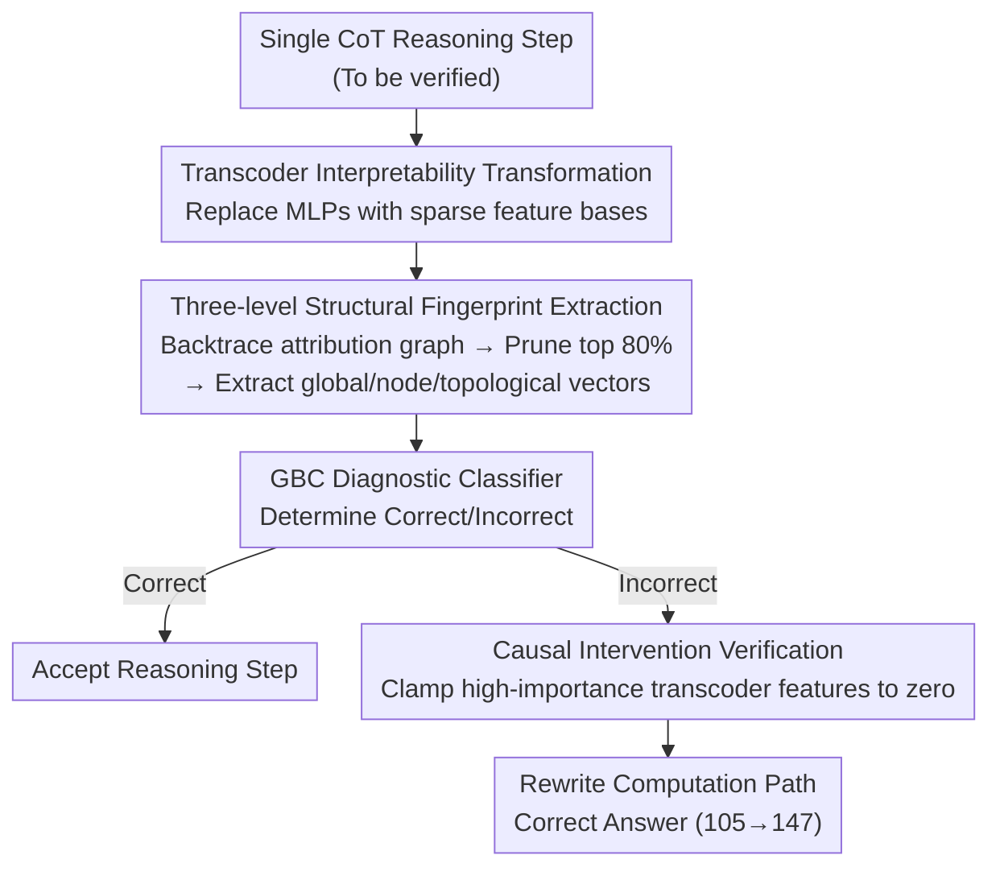

# Verifying Chain-of-Thought Reasoning via Its Computational Graph

**Conference**: ICLR 2026 Oral  
**arXiv**: [2510.09312](https://arxiv.org/abs/2510.09312)  
**Code**: [Available](https://github.com/facebookresearch/CRV)  
**Area**: LLM Reasoning / Mechanistic Interpretability  
**Keywords**: Chain-of-Thought, Attribution Graph, Transcoder, Reasoning Verification, Causal Intervention

## TL;DR

Proposes CRV (Circuit-based Reasoning Verification), which constructs interpretable attribution graphs by replacing LLM MLPs with transcoders. It extracts "fingerprints" of reasoning errors from the structural features of these graphs to achieve white-box CoT reasoning verification and enables correcting erroneous reasoning through causal intervention.

## Background & Motivation

Existing CoT verification methods are divided into two categories: **black-box methods** (analyzing output text or logit distributions) and **gray-box methods** (utilizing probes on hidden layer activations or hidden state trajectories). While these methods can detect "correlations" with errors, they fail to reveal **why** the reasoning went wrong—specifically, they cannot understand the causes of failure at the level of the model's computational process.

The authors' core hypothesis is that models implement specific "latent algorithmic circuits" to complete reasoning tasks, and reasoning failure is essentially a flaw in the execution of these circuits. By constructing attribution graphs (similar to execution traces in software debugging), identifiable signals of errors can be detected from the structural properties of the computational graph.

## Method

### Overall Architecture

CRV reformulates "verifying if a single reasoning step is correct" as "checking the characteristics of the computational circuit behind that step." It first replaces the MLP of each model layer with an interpretable transcoder, then backtraces a sparse attribution graph for each reasoning step. A fixed-dimensional "fingerprint" vector $\mathbf{x}_i = \phi(G_i)$ is extracted from the graph structure, and a lightweight classifier $\hat{y}_i = f_\theta(\mathbf{x}_i)$ determines whether the step is correct. Erroneous reasoning leaves identifiable structures on the computational graph that differ from correct reasoning. Once an error is diagnosed, the system can back-locate key features in the graph and suppress them via causal intervention to correct the answer.

### Key Designs

**1. Transcoder Interpretability Transformation: Replacing opaque MLPs with sparse feature bases**

To make attribution graphs semantic, forward propagation must pass through an interpretable bottleneck. Original MLPs are dense activations where individual dimensions do not correspond to clear concepts. CRV trains a transcoder for each MLP layer to directly fit the MLP's input-output function $f(x) \approx \text{MLP}(x)$, rather than reconstructing the input like an autoencoder. Outputs reside in an overcomplete feature space (dimension $D \gg d$), with TopK activations forcing most elements to zero. Each non-zero element corresponds to an interpretable concept. Thus, the transcoder acts as a "functional surrogate" for the MLP: it performs equivalent computation in an interpretable way, ensuring each node in the subsequent attribution graph has explicit semantics. Standard SAEs only reconstruct inputs and cannot fulfill this computational replacement role.

**2. Three-level Structural Fingerprint Extraction: Compressing a graph into a fixed vector for the classifier**

For each reasoning step, CRV uses greedy pathfinding to backtrace high-attribution connections from the final logit, yielding a sparse directed graph $G_i = (\mathcal{V}, \mathcal{E})$ (nodes include input tokens, transcoder features, and output logits), pruned to retain segments accounting for the top 80% of influence. Features are then extracted from three complementary levels: global graph statistics (number of active feature nodes, logit probability, and entropy) to characterize overall computational complexity and uncertainty; node influence statistics (mean/max/std of activation values and influence scores, and layer-wise active feature histograms) to distinguish between "driven by a few high-activation features" and "diffused across many weak features"; and topological/path features (graph density, degree centrality, betweenness centrality, connectivity) to characterize information flow structure. Ablation shows node influence statistics are most critical—removing them increases the FPR@95 for arithmetic tasks from 37.09% to 49.07%.

**3. Causal Intervention Verification: Closing the loop from "detecting an error" to "fixing it"**

Detecting an error only suggests a correlation between the fingerprint and the failure; CRV further demonstrates a causal relationship. When a step is classified as incorrect, the system traces back to high-importance transcoder features in the graph (e.g., a feature corresponding to a "multiplication" concept). By using a forward hook to clamp the activation of that feature to zero, the model's computational path is rewritten. In experiments, inhibiting a multiplication feature (ID 91814) successfully corrected an erroneous operation order (multiplying before adding) to the correct order (adding before multiplying), changing the answer from 105 to 147. This closed loop from detection to diagnosis to repair is unattainable for traditional probing methods that only provide correlation signals.

### Loss & Training

Transcoders are trained using L2 reconstruction loss plus TopK activation. The diagnostic classifier utilizes a Gradient Boosting Classifier (GBC), learning directly on the extracted tabular features. Training labels for synthetic tasks (Boolean/Arithmetic) are automatically annotated by parsers, while GSM8K utilizes Llama 3.3 70B Instruct for semi-automatic annotation followed by human review.

## Key Experimental Results

### Main Results

| Method | Paradigm | Boolean AUROC↑ | Arithmetic AUROC↑ | GSM8K AUROC↑ |
|------|------|----------------|-------------------|-------------|
| MaxProb | Black-box | 58.81 | 61.87 | 54.91 |
| Energy | Black-box | 51.08 | 76.45 | 62.55 |
| CoE-C | Gray-box | 51.03 | 69.39 | 53.57 |
| MLP Probe | Gray-box | 53.63 | 54.41 | 56.02 |
| **CRV (Ours)** | **White-box** | **75.87** | **92.47** | **70.17** |

Ours outperforms both black-box and gray-box baselines across all datasets. On Arithmetic tasks, it achieves an AUROC of 92.47 and reduces FPR@95 to 37.09% (compared to 63.33% for the strongest baseline).

### Ablation Study

| Feature Set | Arithmetic AUROC↑ | Arithmetic FPR@95↓ |
|--------|-------------------|--------------------|
| CRV (All three types) | 92.47 | 37.09 |
| w/o Global Stats | 89.62 | 44.54 |
| w/o Node Stats | 88.31 | 49.07 |
| w/o Topological Stats | 90.89 | 39.19 |

Node influence statistics represent the most critical feature category.

### Key Findings

- **Error fingerprints are domain-specific**: Errors in different reasoning tasks (Boolean logic vs. Arithmetic vs. Natural Language Math) manifest as different structural patterns on computational graphs. A classifier trained solely on arithmetic achieves only 57.04 AUROC on GSM8K.
- **Joint training can recover performance**: A classifier trained on joint data from three tasks reaches 70.62 AUROC on GSM8K, slightly exceeding the task-specific model (70.17).
- **Causal intervention success**: In arithmetic tasks, suppressing a "multiplication" transcoder feature (ID 91814) successfully corrected an incorrect operation order, changing the final answer from 105 to 147.

## Highlights & Insights

- First instance of using attribution graphs as "reasoning execution traces" for automated verification, bridging the gap between detection and understanding.
- Reveals the existence of "computational integrity regions"—correct reasoning occupies a structural space unreachable by erroneous reasoning.
- The closed-loop design of causal intervention—from detection to diagnosis to repair—is a capability traditional probing methods lack.

## Limitations & Future Work

- High computational overhead: Requires training per-layer transcoders, constructing attribution graphs, and training classifiers, making it less suitable as a plug-and-play verifier.
- Verified only on standard instruction-tuned models; advanced reasoning models with search/backtracking (e.g., o1) were not tested.
- Limited cross-domain generalization, requiring re-collection of annotated data and retraining of the classifier for new tasks.
- Experiments limited to Llama 3.1 8B Instruct; performance on larger models remains unknown.

## Related Work & Insights

- Complementary to PRM (Process Reward Models): While PRMs are step-level discriminators trained as black boxes, CRV provides white-box interpretable diagnosis.
- Based on transcoder attribution graph techniques (Ameisen et al., 2025), but advances from qualitative visualization to quantitative automated verification.
- Insight: Potential to combine CRV's diagnostic capabilities with PRM's scalability to build hybrid verification systems.

## Rating

⭐⭐⭐⭐ High methodological novelty. White-box attribution graph verification is a fresh perspective, and causal intervention confirms causation rather than just correlation, though computational overhead limits practicality.

<!-- RELATED:START -->

## Related Papers

- [\[ICLR 2026\] DAG-Math: Graph-of-Thought Guided Mathematical Reasoning in LLMs](dag-math_graph-of-thought_guided_mathematical_reasoning_in_llms.md)
- [\[ICML 2026\] Clustering as Reasoning: A $k$-Means Interpretation of Chain-of-Thought Graph Learning](../../ICML2026/llm_reasoning/clustering_as_reasoning_a_k-means_interpretation_of_chain-of-thought_graph_learn.md)
- [\[ICLR 2026\] Are Reasoning LLMs Robust to Interventions on Their Chain-of-Thought?](are_reasoning_llms_robust_to_interventions_on_their_chain-of-thought.md)
- [\[ICLR 2026\] SceneCOT: Eliciting Grounded Chain-of-Thought Reasoning in 3D Scenes](scenecot_eliciting_grounded_chain-of-thought_reasoning_in_3d_scenes.md)
- [\[ICLR 2026\] FaithCoT-Bench: Benchmarking Instance-Level Faithfulness of Chain-of-Thought Reasoning](faithcot-bench_benchmarking_instance-level_faithfulness_of_chain-of-thought_reas.md)

<!-- RELATED:END -->
