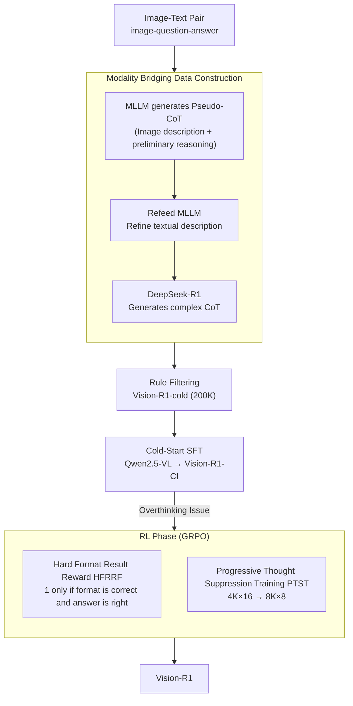

# Vision-R1: Incentivizing Reasoning Capability in Multimodal Large Language Models

**Conference**: ICLR 2026  
**arXiv**: [2503.06749](https://arxiv.org/abs/2503.06749)  
**Code**: [GitHub](https://github.com/Osilly/Vision-R1)  
**Area**: Multimodal VLM  
**Keywords**: Multimodal Reasoning, Reinforcement Learning, Chain-of-Thought, GRPO, Cold-start Initialization

## TL;DR

Vision-R1 is proposed, which constructs 200K high-quality multimodal CoT data via Modality Bridging for cold-start initialization. By combining a Progressive Thought Suppression Training (PTST) strategy with GRPO reinforcement learning, it achieves multimodal mathematical reasoning capabilities close to OpenAI o1 at a 7B parameter scale.

## Background & Motivation

DeepSeek-R1 successfully demonstrated that pure RL can stimulate complex reasoning capabilities (e.g., self-reflection, questioning) in LLMs. Can this success be transferred to Multimodal LLMs (MLLMs)?

The authors first attempted to train MLLMs directly with RL (named Vision-R1-Zero) and identified key difficulties:

**Direct RL training fails to stimulate complex reasoning**: Due to the lack of large-scale high-quality multimodal reasoning data, the model cannot generate complex CoT.

**Existing multimodal CoT data quality is insufficient**: It lacks human cognitive processes like self-reflection and questioning, serving only as formatted "pseudo-CoT."

**The overthinking problem after cold start**: After SFT with CoT data, the model generates excessively long reasoning chains, but correct reasoning is concentrated in shorter chains, making RL optimization difficult.

## Method

### Overall Architecture

Vision-R1 follows a two-stage "teach then release" route. The true challenges lie not in Reinforcement Learning (RL) itself, but in two preceding hurdles: the lack of high-quality multimodal reasoning data with self-reflection and the tendency of the model to "overthink" after cold start. The overall pipeline is: first, bridge modality information by converting images to text; use the text-only DeepSeek-R1 to create a batch of high-quality multimodal Chain-of-Thought (CoT) data, Vision-R1-cold (200K samples); perform cold-start supervised fine-tuning (SFT) on the base model (Qwen2.5-VL) to obtain Vision-R1-CI; then apply GRPO reinforcement learning with a Progressive Thought Suppression Training (PTST) strategy to constrain reasoning length in stages and use a Hard Format Result Reward to force complex yet correct reasoning, resulting in Vision-R1.

### Key Designs

**1. Modality Bridging: Leveraging Text-only R1 for Multimodal CoT**

DeepSeek-R1 generates human-like reasoning with self-reflection and questioning but cannot process images, preventing direct multimodal data labeling. The authors bypass this via an "Image → Text → R1 → CoT" bridging pipeline: first, image-text pairs are fed to an MLLM to generate a "Pseudo-CoT" containing image descriptions and preliminary reasoning, forcing the model to explicitly write visual details into text; this Pseudo-CoT is refed to the MLLM along with the original image to extract a near-lossless textual description, completing the modality bridge; finally, this text is sent to DeepSeek-R1 to obtain a high-quality complex CoT. After rule filtering, 200K Vision-R1-cold samples are obtained. The reflection marker "Wait" appears ~585K times, compared to only 2.3K in LLaVA-CoT, indicating a self-reflection density two orders of magnitude higher—this is key to "stimulating" rather than just "formatting" reasoning during cold start.

**2. Hard Format Result Reward (HFRRF): Identifying the Overthinking Pathology and Anchoring Optimization Goals**

While cold start teaches the model to reflect, it introduces a side effect: the model tends to generate extremely long reasoning chains for all questions, even though correct answers are mostly found in shorter chains (the "overthinking optimization problem"). If RL is performed directly with a 16K length limit, the model is guided toward longer but more error-prone reasoning, causing performance to drop. Thus, the RL phase uses a Hard Format Result Reward Function (HFRRF): a reward $r_i=1$ is given only if the output format is compliant **and** the final answer is correct; otherwise, it is $0$. This avoids rewarding "long and plausible but incorrect" reasoning, anchoring the optimization goal strictly on correctness.

**3. Progressive Thought Suppression Training (PTST): Forcing Correct Reasoning via Length Constraints**

Since overthinking is the issue, PTST does the opposite: it strictly compresses the reasoning budget in early stages, forcing the model to learn to "think correctly" within short spaces, then gradually relaxes the budget as training progresses, allowing the model to use saved space for problems that truly require complex reasoning. This is implemented in two stages: Stage 1 uses $4\text{K}\times16$ and Stage 2 uses $8\text{K}\times8$ (reasoning length $L_s$ × sample size $G_s$). The product of length and sample size remains constant across stages to ensure the total computation budget per step is unchanged, making training signals comparable. Ablations show this "short-to-long" progressive constraint outperforms fixed 4K or 16K limits.

### Loss & Training

Standard SFT is performed on the base model (Qwen2.5-VL) using Vision-R1-cold during the cold-start phase. The GRPO objective function for the RL phase (with PTST staged constraints) is:

$$J_{\text{GRPO}}^{(s)}(\theta) = \mathbb{E}\left[\frac{1}{G_s}\sum_{i=1}^{G_s}\min\left(\frac{\pi_\theta(o_i^{(s)}|q)}{\pi_{\theta_{\text{old}}}(o_i^{(s)}|q)}A_i^{(s)}, \text{clip}(\cdot, 1-\varepsilon, 1+\varepsilon)A_i^{(s)}\right) - \beta D_{\text{KL}}\right]$$

where $s$ denotes the PTST stage, clipping coefficient $\varepsilon=0.2$, KL coefficient $\beta=10^{-2}$, and advantages are estimated via group relative normalization $A_i = \frac{r_i - \text{mean}(\{r_j\})}{\text{std}(\{r_j\})}$. Reward $r_i$ is the HFRRF (0 or 1) mentioned above.

## Key Experimental Results

### Main Results

| Model | Params | MathVista | MathVerse | MM-Math | DynaMath | Avg |
|------|--------|-----------|-----------|---------|----------|------|
| OpenAI o1 | - | 73.9 | - | - | - | - |
| GPT-4o | - | 63.8 | 37.6 | 31.8 | 64.9 | - |
| Qwen2.5-VL-7B | 7B | 68.1 | 46.7 | 34.1 | 50.7 | 49.9 |
| Qwen2.5-VL-72B | 72B | 73.5 | 51.3 | 45.6 | 61.2 | 57.9 |
| **Vision-R1-7B** | **7B** | **73.5** | **52.4** | **40.2** | **56.3** | **55.6** |
| **Vision-R1-32B** | **32B** | **76.4** | **62.1** | **55.3** | **65.6** | **64.9** |
| **Vision-R1-72B** | **72B** | **78.2** | **63.2** | **59.3** | **66.4** | **66.8** |

Vision-R1-7B vs. base Qwen2.5-VL-7B: GEO +13.4, ALG +10.3, GPS +164, overall MathVista +5.4.

### Ablation Study

| Method | Cold Start | GRPO | PTST | Avg Reasoning Length | Avg (MathVista/MathVerse/MM-Math) |
|------|-----------|------|------|------------|------|
| Vision-R1-Zero | ✗ | ✓ | ✗ | 1285 | 50.7 |
| Vision-R1-CI | ✓ | ✗ | ✗ | 3566 | 44.5 |
| Vision-R1-Long | ✓ | ✓ | ✗ | 3107 | 47.7 |
| **Vision-R1** | **✓** | **✓** | **✓** | **2057** | **55.4** |

| PTST Config | Stage1 | Stage2 | MathVista | Avg | Note |
|----------|--------|--------|-----------|------|------|
| Fixed 16K | 16K×4 | 16K×4 | 70.3 | 47.7 | Early unconstrained overthinking |
| Fixed 4K | 4K×16 | 4K×16 | 72.6 | 54.3 | Effective but limits complex reasoning |
| **PTST 2-stage** | **4K×16** | **8K×8** | **73.5** | **55.4** | Optimal, progressive relaxation |
| PTST 3-stage | 4K×16 | 6K×12 → 8K×8 | 73.0 | 55.1 | Extra stage yields no significant gain |

### Key Findings

- **7B beats 70B**: Vision-R1-7B reaches 73.5% on MathVista, only 0.4% lower than OpenAI o1, surpassing Qwen2.5-VL-72B.
- **Direct RL is insufficient**: Vision-R1-Zero achieves only a 50.7 average score, failing to stimulate effective reasoning.
- **Cold start is necessary but insufficient**: The CI model scores 44.5 (severe overthinking); it must be paired with PTST.
- **PTST is simple and effective**: Two stages (4K→8K) reach the optimum; additional stages are not beneficial, indicating strategy robustness.
- **Data quality is critical**: "Wait" appears 586K times in Vision-R1-cold vs. 2.3K in LLaVA-CoT; self-reflection markers are two orders of magnitude more frequent.
- Cross-model generalization verified on Llama-3.2-11B-V: Vision-R1-cold SFT surpasses LLaVA-CoT and Mulberry across all benchmarks.

## Highlights & Insights

- First systematic exploration of R1-style RL in MLLMs, clearly revealing the roles of direct RL, cold start, and PTST.
- Modality Bridging cleverly addresses the limitation of DeepSeek-R1 in processing images.
- Deep insight into the PTST strategy: learning to "think correctly" before "thinking complexly," analogous to human learning patterns.
- High data efficiency, gaining ~6% average improvement using only 10K samples for RL.
- "Aha moments" (e.g., self-correction and reflection) observed for the first time in MLLMs.

## Limitations & Future Work

- RL training uses only math data; generalization to general reasoning tasks remains to be verified.
- PTST stage counts and length settings are currently empirical, lacking theoretical guidance.
- Risk of information loss in Modality Bridging (vision → text conversion).
- 32B and 72B versions used additional data, not fully comparable to the 7B version.
- Cold-start data scale (200K) might be a bottleneck; benefits of larger-scale data require exploration.

## Related Work & Insights

- Serves as the multimodal counterpart to DeepSeek-R1, indicating a feasible path for MLLM reasoning enhancement.
- PTST concepts can be applied to other RL scenarios requiring generation length control.
- Modality Bridging can be extended to other scenarios where text-only LLMs process multimodal data.

## Rating

- Novelty: ⭐⭐⭐⭐⭐ First successful transfer of R1-style reasoning to MLLM; PTST strategy is original.
- Experimental Thoroughness: ⭐⭐⭐⭐⭐ Comprehensive benchmarks (MathVista/MathVerse/MM-Math/DynaMath), multiple scales (7B/32B/72B), and extensive ablations.
- Writing Quality: ⭐⭐⭐⭐ Fluid argumentation with a problem-driven narrative, though some notation is dense.
- Value: ⭐⭐⭐⭐⭐ Achieving o1-level multimodal reasoning with 7B parameters is of great significance to the community.

<!-- RELATED:START -->

## Related Papers

- [\[ICLR 2026\] Efficient Test-Time Scaling for Small Vision-Language Models](efficient_test-time_scaling_for_small_vision-language_models.md)
- [\[NeurIPS 2025\] VideoRFT: Incentivizing Video Reasoning Capability in MLLMs via Reinforced Fine-Tuning](../../NeurIPS2025/llm_reasoning/videorft_incentivizing_video_reasoning_capability_in_mllms_via_reinforced_fine-t.md)
- [\[ICLR 2026\] AgentMath: Empowering Mathematical Reasoning for Large Language Models via Tool-Augmented Agent](agentmath_empowering_mathematical_reasoning_for_large_language_models_via_tool-a.md)
- [\[ICLR 2026\] Co-rewarding: Stable Self-supervised RL for Eliciting Reasoning in Large Language Models](co-rewarding_stable_self-supervised_rl_for_eliciting_reasoning_in_large_language.md)
- [\[ICLR 2026\] Inpainting-Guided Policy Optimization for Diffusion Large Language Models](inpainting-guided_policy_optimization_for_diffusion_large_language_models.md)

<!-- RELATED:END -->
