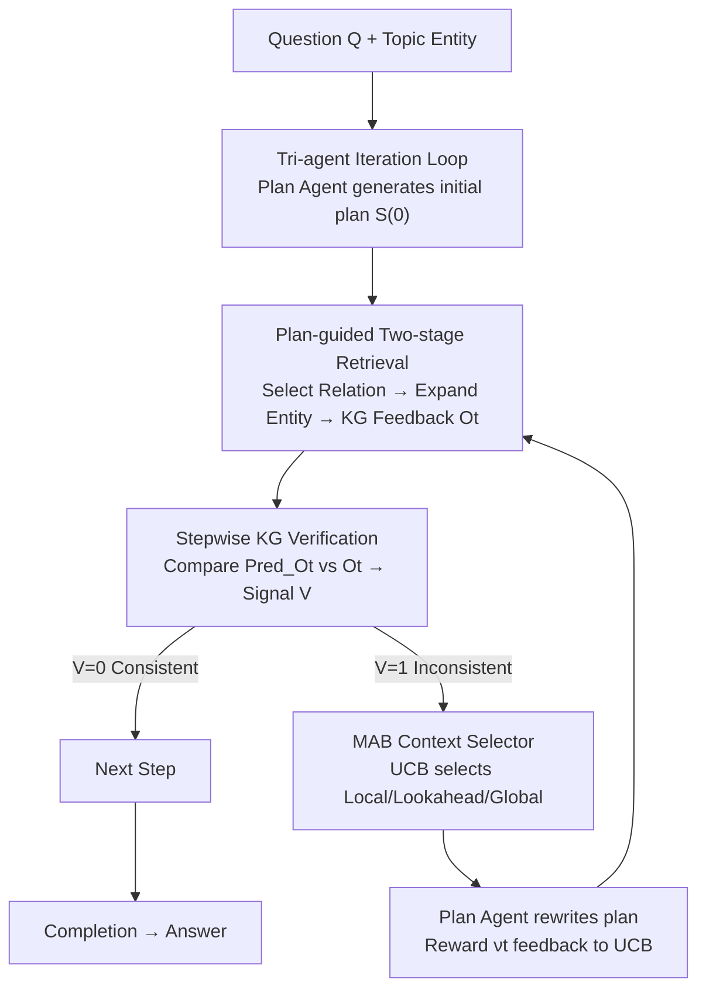

# VoG: Enhancing LLM Reasoning through Stepwise Verification on Knowledge Graphs

**Conference**: ICLR 2026  
**OpenReview**: [https://openreview.net/forum?id=0RdAmwfVku](https://openreview.net/forum?id=0RdAmwfVku)  
**Code**: https://github.com/WenxinAZhao/VoG  
**Area**: LLM Reasoning  
**Keywords**: Knowledge Graph Question Answering, Multi-hop Reasoning, Stepwise Verification, Multi-Armed Bandit, Adaptive Revision

## TL;DR
VoG utilizes a "plan-retrieve-verify-revise" iteration loop with three agents to enable multi-hop reasoning over Knowledge Graphs (KG). Per-step retrieval results (KG triplets) are checked against current reasoning plans. Upon detecting inconsistencies, a Multi-Armed Bandit (MAB) is used to adaptively select a context range for plan rewriting, improving both accuracy and efficiency across three KGQA benchmarks (with lower token consumption than baselines).

## Background & Motivation
**Background**: LLMs are prone to hallucinations and factual inconsistencies in knowledge-intensive tasks requiring multi-hop reasoning. This stems from a lack of up-to-date/specialized knowledge in pre-training and non-transparent reasoning processes. Mainstream remedies involve integrating Knowledge Graphs (KG) as external sources. Existing KG enhancement solutions generally fall into two categories: planning (generating structured paths or SPARQL queries) and retrieval (optimizing step-by-step triplet feeding for agents).

**Limitations of Prior Work**: The authors decompose failure modes of existing paradigms using a multi-hop question (e.g., "Costa Rican anthem → currency"): (1) **Rigid Reasoning**: Pure planning methods generate potentially unexecutable paths (e.g., connecting `composition.language` to `country.languages_spoken`), while retrieval-only methods rely on fixed depth/width pruning, leading to incomplete evidence capture and error propagation. (2) **Limited Information Utilization**: Most agent frameworks focus only on local triplets at each step, ignoring global context (previous steps, look-ahead relations). Consequently, intermediate steps stall when encountering uninterpretable entities (e.g., anonymous MIDs like `m.0h_1h3x`) or reach incorrect conclusions prematurely.

**Key Challenge**: Existing frameworks utilize **static integration**, where plans are executed as generated. The retrieval mechanism does not dynamically adjust to context or new evidence. The fundamental issue is the lack of a closed-loop system that "accounts for alignment as it proceeds and revises upon mismatch" between the reasoning plan and KG feedback.

**Goal**: (i) Enable reasoning to perform stepwise error correction based on KG feedback to block error propagation; (ii) Dynamically determine the appropriate amount of context for revisions.

**Key Insight**: Rather than trusting an initial static plan, the reasoning plan should be treated as a "verifiable and revisable living entity." For each executed step, KG evidence validates the predicted observation. Mismatches trigger revision, modeled as an exploration-exploitation problem to find the optimal context range.

**Core Idea**: Replace "static plan execution" with "stepwise verification + adaptive revision." Three specialized LLM agents (Plan, Retrieve, Verify) collaborate iteratively, using a KG-aware Multi-Armed Bandit (MAB) to dynamically select the most informative context subset for each revision step.

## Method

### Overall Architecture
VoG decomposes multi-hop KGQA into an iterative feedback loop: First, the **Plan Agent** generates a complete plan $S^{(0)}=[s_1,\dots,s_T]$ based on question $Q$, where each step $s_t=(T_t, A_t, \text{Pred\_}O_t)$ is a "Thought-Action-Predicted Observation" triplet (inspired by ReAct). The **Retrieval Agent** executes action $A_t$ for two-stage retrieval, obtaining KG feedback $O_t$. The **Verify Agent** compares $O_t$ against $\text{Pred\_}O_t$, outputting a $0/1$ revision signal. If inconsistent, the Plan Agent uses an MAB selector to choose a context range and rewrite plans from $t+1$ onwards, guided by reward signals. This continues until all steps are validated.

### Key Designs

**1. Tri-agent Iteration Loop: Transforming static plans into verifiable, living plans**

To address "rigid reasoning and error propagation," VoG separates plan, retrieval, and verification into specialized agents. The Plan Agent provides a global roadmap $S^{(0)}=[s_1,\dots,s_T]$ with explicit $\text{Pred\_}O_t$ (i.e., "what I expect to find"). The reasoning depth $T$ is adaptively determined during execution rather than being a pre-set constant, preventing premature halts or over-expansion common in retrieval-only methods.

**2. Plan-guided Two-stage Retrieval: Relation selection then entity expansion with adaptive sampling**

To focus retrieval on the current sub-goal while avoiding KG noise, a two-stage process is used. **Relation Retrieval**: In step $t$, candidate relations $R^{cand}_t$ are enumerated for entities $E_{t-1}$. The Retrieval Agent selects relevant relations $R_t$; **entropy-aware sampling** via Sentence-BERT filters large/noisy candidate sets. **Entity Retrieval**: For $r \in R_t$, candidates $E^{cand}_t$ are retrieved via $(e, r, ?)$ and $(?, r, e)$ patterns. "Plan-guided sampling" reduces irrelevant expansions, significantly lowering token usage compared to beam-search methods like ToG.

**3. Stepwise KG Verification: "Accounting" for reasoning with retrieved facts**

Given step $s_t$ and feedback $O_t=\{(e^{(t)}_{head}, r, e^{(t)}_{tail})\}$, the Verify Agent uses KG triplets as factual evidence to validate $\text{Pred\_}O_t$. A pre-trained DeBERTa verifier is included for high-reliability secondary checking. The signal is defined as:

$$V(Q, s_t, O_t) = \begin{cases} 1 & \text{if } \text{Pred\_}O_t \text{ and } O_t \text{ are inconsistent} \\ 0 & \text{otherwise} \end{cases}$$

When $V=1$, revision is triggered. This intercepts errors immediately rather than letting them propagate to the end of the chain.

**4. MAB Context Selector + Reward Design: Modeling context range as an exploration-exploitation problem**

Revision faces two challenges: sensitivity to context range and potential for generated hallucinations. VoG uses a **KG-aware MAB** with three complement strategies as "arms": **Local** (only $O_t$), **Lookahead** (adds future relations $R_{t+1}$), and **Global** (aggregates entire plan/history $O_{1:t}$). Selection uses UCB with context-aware priors:

$$\text{UCB}_t(c) = \underbrace{\frac{R_c}{N_c}}_{\text{Exploitation}} + \underbrace{\alpha\sqrt{\frac{\log N}{N_c}}}_{\text{Exploration}} + \underbrace{B_{ent}(H_t) + B_{KG}(t, E_{rep}) + B_{div}(c)}_{\text{Context-aware Priors}}$$

The reward $\nu_t$ combines **Task Reward** $\nu_{local}$ (Validation, Quality, Alignment, Coherence, Efficiency) and **Confidence Reward** $\nu_{conf}$ (consensus across candidate plans). These are fused via **entropy-aware weighting**: $\lambda_t = \beta\cdot\exp(-H_t)$, where $\nu_t = (1-\lambda_t)\nu_{local} + \lambda_t\nu_{conf}$. High entropy (uncertainty) favors the Global consensus reward.

### Key Experimental Results

### Main Results
VoG outperforms LLM-only, fine-tuned, and agent+KG baselines (ToG, PoG) on CWQ, WebQSP, and WebQuestions:

| Backbone | Method | CWQ EM | WebQSP EM | WebQuestions EM |
|----------|------|--------|-----------|-----------------|
| GPT-4 | ToG | 67.6 | 82.6 | 57.9 |
| GPT-4 | PoG | 75.0 | 87.3 | 71.7 |
| GPT-4 | **VoG** | **77.6** | **88.7** | **72.3** |
| Qwen2.5-7B | PoG | 46.0 | 58.5 | 46.2 |
| Qwen2.5-7B | **VoG** | **53.3** | **67.3** | **52.8** |

### Ablation Study (GPT-3.5)

| Configuration | CWQ | WebQSP | WebQuestions |
|------|-----|--------|--------------|
| VoG (Full) | 64.7 | 83.2 | 63.0 |
| w/o Context Selector (Local only) | 60.1 (↓4.6) | 80.6 (↓2.6) | 58.2 (↓4.8) |
| w/o Verify+Revise | 51.7 (↓13.0) | 72.1 (↓11.1) | 55.8 (↓7.2) |

### Key Findings
- **Verify+Revise is crucial**: Removing it causes double-digit drops (e.g., 13.0 on CWQ), proving that stepwise correction is the core performance driver.
- **Context strategies are heterogeneous**: No single strategy (Local/Lookahead/Global) dominates, justifying the MAB-based adaptive selection.
- **Efficiency Gain**: VoG reduces token consumption (WebQSP tokens are only 57% of ToG) by controlling retrieval and utilizing the plan as implicit memory.

## Highlights & Insights
- **"Predictive Observation" is a key trick**: Making predictions ahead of retrieval provides a target for verification, transforming validation from "post-hoc judgment" to "stepwise accounting."
- **MAB for Context Selection**: Modeling context range as a learning decision is robust. This approach is transferable to RAG depth or memory window optimization.
- **Entropy-aware Reward Fusion**: Switching weights between local quality and global consensus based on uncertainty compensates for LLM instability.

## Limitations & Future Work
- Dependency on DeBERTa and score-based reward models may compromise reliability in new domains or low-resource languages.
- MAB arms are manually discretized into three categories; finer-grained context control may further improve performance but increase exploration costs.
- Anonymous MIDs remain challenging for revision when KG feedback is uninformative.

## Related Work & Insights
- **vs ToG/PoG**: VoG introduces verification-driven revision and adaptive context selection, leading to higher accuracy and lower token costs compared to fixed-width/depth KG agents.
- **vs Fine-tuned methods**: VoG is model-agnostic and parameter-efficient, matching or exceeding fine-tuned SOTA performance without training costs.
- **vs Pure Planning**: By allowing plans to be revised based on KG feedback, VoG mitigates the vulnerability of planning methods to unexecutable paths.

## Rating
- Novelty: ⭐⭐⭐⭐ (Stepwise verification + MAB-based adaptive context is a distinct framework).
- Experimental Thoroughness: ⭐⭐⭐⭐ (Multiple datasets, backbones, efficiency analysis, and ablation).
- Writing Quality: ⭐⭐⭐⭐ (Clear motivation and well-structured methodology).
- Value: ⭐⭐⭐⭐ (Practical for cost-effective, scalable KGQA deployment).

<!-- RELATED:START -->

## Related Papers

- [\[ICLR 2026\] MolecularIQ: Characterizing Chemical Reasoning Capabilities Through Symbolic Verification on Molecular Graphs](moleculariq_characterizing_chemical_reasoning_capabilities_through_symbolic_veri.md)
- [\[AAAI 2026\] Graph of Verification: Structured Verification of LLM Reasoning with Directed Acyclic Graphs](../../AAAI2026/llm_reasoning/graph_of_verification_structured_verification_of_llm_reasoning_with_directed_acy.md)
- [\[ICLR 2026\] Plan-Answer-Refine-on-Graph: Structured Planning and Self-Refinement for Large Language Model Reasoning on Knowledge Graphs](plan-answer-refine-on-graph_structured_planning_and_self-refinement_for_large_la.md)
- [\[ICLR 2026\] MathFimer: Enhancing Mathematical Reasoning by Expanding Reasoning Steps through Fill-in-the-Middle Task](mathfimer_enhancing_mathematical_reasoning_by_expanding_reasoning_steps_through_.md)
- [\[ICLR 2026\] Generative Adversarial Reasoner: Enhancing LLM Reasoning with Adversarial Reinforcement Learning](generative_adversarial_reasoner_enhancing_llm_reasoning_with_adversarial_reinfor.md)

<!-- RELATED:END -->
