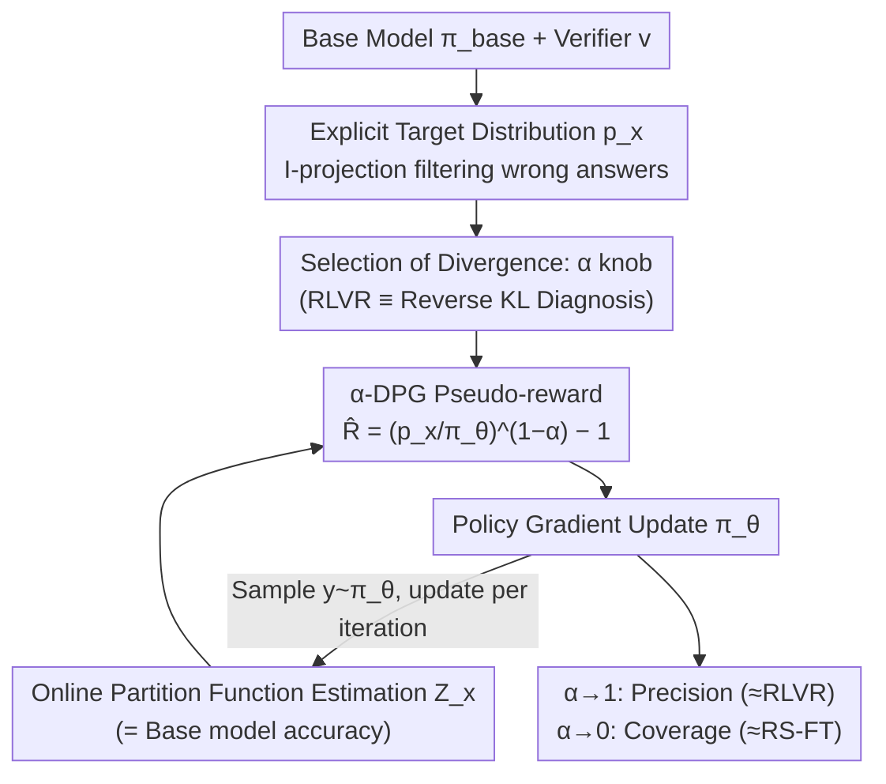

# Whatever Remains Must Be True: Filtering Drives Reasoning in LLMs, Shaping Diversity

**Conference**: ICLR 2026  
**arXiv**: [2512.05962](https://arxiv.org/abs/2512.05962)  
**Code**: [https://github.com/naver/alpha-dpg](https://github.com/naver/alpha-dpg)  
**Area**: LLM NLP / Reinforcement Learning / LLM Reasoning  
**Keywords**: α-divergence, Distributional Matching, RLVR, Diversity Preservation, Theorem Proving

## TL;DR
The DMVR framework and α-DPG algorithm are proposed by explicitly defining a target distribution that "filters out incorrect answers" and approximating it via the α-divergence family. This approach unifies RLVR (Reverse KL) and Rejection Sampling Fine-Tuning (Forward KL), achieving optimal performance on the precision-coverage Pareto frontier in Lean theorem proving.

## Background & Motivation

**Background**: Reinforcement Learning with Verifiable Rewards (RLVR, e.g., GRPO/PPO) has become the standard for tuning LLM reasoning capabilities. However, increasing evidence suggests that models trained via RLVR suffer from **significant diversity loss** (mode collapse)—while pass@1 improves, generative strategy diversity drops sharply, leading to pass@k (at large k) being worse than the base model.

**Limitations of Prior Work**: RLVR (GRPO/PPO, etc.) implicitly optimizes the Reverse KL divergence toward a target distribution, which is "mode-seeking"—it causes the model to concentrate on a few high-reward regions while ignoring other valid solutions. When $\beta=0$, it degenerates into pure REINFORCE with zero diversity protection. Existing mitigation methods (KL penalties, Rw-Ulkly, etc.) address symptoms rather than the root cause.

**Key Challenge**: A fundamental trade-off exists between precision (pass@1) and coverage (pass@k). Existing RL methods are biased toward the precision end and lack systematic means to control this trade-off.

**Goal**: How to retain the solution diversity already present in the base model while maintaining correctness? How to provide a continuous and controllable mechanism for the precision-coverage trade-off?

**Key Insight**: RLVR is re-examined from the perspective of **Distributional Matching**. The target distribution is explicitly defined as one that "filters out wrong answers while preserving the relative probabilities of correct answers": $p_x(y) \propto \pi_{\text{base}}(y|x) \cdot v(y,x)$. This target is then approximated using the α-divergence family, where different α values correspond to different precision-diversity trade-offs.

**Core Idea**: The root of diversity loss is not the target distribution (filtering itself), but the choice of divergence used to approximate it. Replacing Reverse KL with α-divergence allows for systematic control over the balance between precision and diversity.

## Method

### Overall Architecture
This paper addresses the paradox where RLVR improves pass@1 but degrades pass@k under large sampling budgets. The authors frame this problem as **Distributional Matching**: the objective of training should not be merely "maximizing reward" but pulling the policy $\pi_\theta$ toward an explicit target distribution $p_x(y) \propto \pi_{\text{base}}(y|x) \cdot v(y,x)$. 

Once the target distribution is fixed, the remaining degree of freedom lies in the choice of divergence. The DMVR (Distributional Matching with Verifiable Rewards) framework utilizes the α-divergence family $D_{f_\alpha}(\pi_\theta \,\|\, p_x)$ and trains via the f-DPG policy gradient. The scalar α serves as a "knob" for the precision-diversity trade-off: α→1 is mode-seeking (behaving like RLVR), while α→0 is mass-covering (behaving like Rejection Sampling Fine-Tuning).

### Key Designs

**1. Explicit Target Distribution: Decoupling Objectives from Approximation**
RLVR suffers from implicit targeting; the reward contains a temperature $\beta$, approximating $p_{x,\beta}(y) \propto \pi_{\text{base}}(y|x) \cdot \exp(v(y,x)/\beta)$. Here, the target and the approximation method are coupled. This work defines the ideal target as $p_x(y) \propto \pi_{\text{base}}(y|x) \cdot v(y,x)$, which is the I-projection of the base model onto the set of distributions satisfying the verifier. It is the distribution "closest to the base model while guaranteeing correctness," thus naturally preserving diversity.

**2. RLVR ≡ Reverse KL: Diagnosing the Source of Diversity Loss**
To prove the issue lies in the divergence, the work clarifies what RLVR minimizes. Lemma 1 shows that maximizing the RLVR pseudo-reward is equivalent to minimizing the **Reverse KL** from the policy to $p_{x,\beta}$. Lemma 2 links the smoothed target to the hard-filtering target as $\lim_{\beta\to 0} p_{x,\beta} = p_x$. Since Reverse KL is zero-forcing (mode-seeking), it allows the policy to ignore entire modes of the target distribution as long as it captures a few high-reward points. Thus, mode collapse is an inherent behavior of Reverse KL.

**3. α-DPG: Traversing the Pareto Frontier with a Scalar α**
The α-DPG algorithm rewrites the f-DPG pseudo-reward using the α-divergence family:

$$\hat{R}_\theta(y,x) = \min\left(\left(\frac{p_x(y)}{\pi_\theta(y|x)}\right)^{1-\alpha} - 1,\; M\right)$$

This formula covers various special cases: α→1 yields REINFORCE (mode-seeking/RLVR), α→0 yields KL-DPG (mass-covering/Rejection Sampling FT), and α=0.5 corresponds to Hellinger distance. Adjusting α allows for continuous sliding between precision and coverage. Two stability patches are used: a leave-one-out baseline per context to reduce variance and clipping the pseudo-reward to $M=10$ to prevent explosion at small α.

**4. Online Partition Function Estimation**
The target distribution $p_x$ requires a partition function $Z_x = \mathbb{P}_{y\sim \pi_{\text{base}}(\cdot|x)}[v(y,x)=1]$, which is the base model's accuracy on a given problem. This is estimated online using the current batch of samples, incurring near-zero overhead. The estimate is clamped to $\epsilon = 10^{-4}$ to avoid division by zero.

### Loss & Training
- **Pseudo-reward**: $\hat{R}_\theta(y,x) = \min((\frac{p_x(y)}{\pi_\theta(y|x)})^{1-\alpha} - 1, M)$
- **Gradient**: $\nabla_\theta \mathcal{L} = \mathbb{E}_{x,y\sim\pi_\theta}[-\hat{A}^f(y,x) \nabla_\theta \log \pi_\theta(y|x)]$
- **Baseline**: Leave-one-out context-wise pseudo-reward mean.
- **Training Details**: 4×A100, 512 sequences/step, 200 iterations (~3 epochs), max response 1024 tokens, float16.

## Key Experimental Results

### Main Results
Pass@k results on the Lean theorem proving task (10K training, 200 test problems):

| Method | pass@1 | pass@16 | pass@256 | Features |
|------|--------|---------|----------|------|
| Base-SFT | Low | Mid | Mid-High | Diverse but imprecise |
| GRPO (β=0) | **High** | Mid | Low | Precise but collapsed |
| GRPO (High-KL) | Mid-High | Mid-High | Mid-High | KL penalty mitigation |
| Rw-Ulkly | Mid-High | Mid-High | Mid-High | Rank-based diversity |
| Pass@k Training | Mid | Mid-High | High | Coverage optimized |
| α-DPG (α=0.999) | **High** | **High** | Mid-High | RLVR precision + Better coverage |
| α-DPG (α=0.25) | Mid | **High** | **Highest** | Best coverage |

### Ablation Study

| α value | Behavior | Precision (pass@1) | Coverage (pass@256) |
|-----|------|--------------|------------------|
| α=0.25 | Strong mass-covering | Moderate | Highest (SOTA) |
| α=0.5 | Balanced | Moderate | High |
| α=0.75 | Mode-seeking bias | High | Mid-High |
| α=0.999 | Near Reverse KL | Highest | Similar to GRPO |
| Pareto Frontier | All on/near frontier | Continuously controllable | Continuously controllable |

### Key Findings
- **α-DPG models reside on the Pareto frontier**: A single hyperparameter α traverses the precision-coverage trade-off space.
- **α=0.999 dominates GRPO**: Better coverage with similar precision.
- **α=0.25 achieves highest pass@256**: Outperforms Base-SFT, Pass@k training, and KL regularization.
- **Difficulty Shift**: GRPO and α=0.999 simplify many medium problems but make some hard problems unsolvable; α=0.25 is more conservative, losing fewer solvability points.
- **Diversity Analysis**: Strategy/premise diversity (Shannon index) correlates positively with pass@256 and negatively with pass@1.
- **Perplexity Analysis**: RL does not create new capabilities but re-weights existing behaviors within the base model's distribution.

## Highlights & Insights
- **Root Cause Analysis**: The insight that "diversity loss resides in the divergence, not the target" reframes the problem from "is RL harmful" to "which divergence should we use."
- **Unification**: α-DPG unifies REINFORCE/GRPO, KL-DPG, and Rejection Sampling FT into a single framework distinguished only by α.
- **Pareto Controllability**: Using α as a knob is more intuitive and effective than tuning KL penalty coefficients $\beta$.
- **Reflections on RLVR**: The proof that RLVR ≡ Reverse KL explains why such models underperform under large sampling budgets despite strong pass@1 performance.

## Limitations & Future Work
- **Domain Scope**: Validated only on Lean theorem proving; generalization to code or math is unknown.
- **Model Scale**: Tested only on 7B models.
- **Stability**: Low α values require clipping, which introduces bias.
- **Estimation Noise**: $Z_x$ estimation is noisy for extremely difficult problems.
- **Future Directions**: Curriculum learning for α; non-binary rewards; integration with search strategies like MCTS.

## Related Work & Insights
- **vs GRPO/PPO**: These optimize Reverse KL and sacrifice diversity. α-DPG at α≈1 preserves more coverage.
- **vs KL-DPG**: KL-DPG uses Forward KL (α=0), maximizing coverage but lacking precision. α-DPG provides the full spectrum.
- **vs Rw-Ulkly**: While Rw-Ulkly uses rank penalties for diversity, α-DPG is grounded in information-geometric theory.
- **Inspiration**: This work clarifies that mode collapse is a choice of divergence, not an inevitable consequence of verifiable reward training.

## Rating
- Novelty: ⭐⭐⭐⭐⭐ Elegant conceptual contribution via α-divergence unification.
- Experimental Thoroughness: ⭐⭐⭐⭐ Comprehensive on Lean (Pareto, difficulty, diversity), but limited to one task/model size.
- Writing Quality: ⭐⭐⭐⭐⭐ Rigorous derivation and precise academic expression.
- Value: ⭐⭐⭐⭐⭐ Provides both a theoretical framework and a practical solution for a core problem in LLM post-training.

<!-- RELATED:START -->

## Related Papers

- [\[ICLR 2026\] Diversity-Enhanced Reasoning for Subjective Questions](diversity-enhanced_reasoning_for_subjective_questions.md)
- [\[ICLR 2026\] FROST: Filtering Reasoning Outliers with Attention for Efficient Reasoning](frost_filtering_reasoning_outliers_with_attention_for_efficient_reasoning.md)
- [\[ICLR 2026\] Smarter Not Harder: Generative Process Evaluation with Intrinsic-Signal Driving and Ability-Adaptive Reward Shaping](smarter_not_harder_generative_process_evaluation_with_intrinsic-signal_driving_a.md)
- [\[ACL 2025\] Fine-Tuning on Diverse Reasoning Chains Drives Within-Inference CoT Refinement in LLMs](../../ACL2025/llm_reasoning/dcot_diverse_cot_refinement.md)
- [\[ICLR 2026\] Executable Counterfactuals: Improving LLMs' Causal Reasoning Through Code](executable_counterfactuals_improving_llms_causal_reasoning_through_code.md)

<!-- RELATED:END -->
