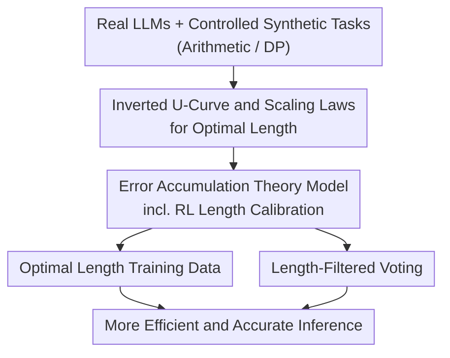

# When More Is Less: Understanding Chain-of-Thought Length in LLMs

**Conference**: ICLR 2026  
**OpenReview**: [https://openreview.net/forum?id=6QDFsYxtI1](https://openreview.net/forum?id=6QDFsYxtI1)  
**Code**: https://github.com/PKU-ML/CoT-Length  
**Area**: LLM Reasoning  
**Keywords**: Chain-of-Thought, CoT length, error accumulation, overthinking, RL calibration

## TL;DR
This paper systematically reveals that the belief "the longer the Chain-of-Thought, the better" is a misconception—task accuracy follows an **inverted U-shaped** curve relative to CoT length. There exists an **optimal length** that shortens as model capability increases and task difficulty decreases. The authors explain this phenomenon using a theoretical model of error accumulation, derive a scaling law, and provide two practical recipes: "constructing training data based on optimal length" and "length-filtered voting during inference."

## Background & Motivation
**Background**: Chain-of-Thought (CoT) has become the core technology for LLMs to solve complex reasoning tasks, allowing models to explicitly generate intermediate steps and decompose difficult problems into a sequence of manageable sub-problems, similar to divide-and-conquer. With the rise of reasoning models like o1, "scaling test-time compute and generating longer CoT" has become a default belief for improving reasoning capabilities.

**Limitations of Prior Work**: Mainstream intuition (and many early studies) suggests that longer and finer CoT leads to better performance, especially on difficult tasks. However, contrary evidence indicates that concise CoT is sometimes more effective. These conflicting views lack a unified explanation: does reasoning performance improve monotonically with CoT length, or is there an inherent upper bound? Furthermore, in current training practices, supervised fine-tuning often **reuses the same CoT data for different models and different tasks**, lacking any adaptability.

**Key Challenge**: There are two opposing forces when lengthening CoT—decomposition makes each step simpler, reducing single-step difficulty; however, increasing the number of steps causes **single-step errors to accumulate continuously**. If the CoT is too short (underthinking), each step is too difficult, leading to a high single-step error rate. The trade-off between the two implies the existence of a compromise optimal length rather than a "longer is better" rule.

**Goal**: (1) Prove the existence of an optimal CoT length; (2) Characterize how it scales with task difficulty and model capability; (3) Provide a theoretical explanation; (4) Translate these insights into actionable training and inference recipes.

**Key Insight**: Real-world LLM CoT contains too many uncontrollable variables (reflection, backtracking, planning, heterogeneous pre-training), making mechanistic analysis difficult. The authors designed **controlled synthetic tasks** (arithmetic addition, Dynamic Programming triangle maximum path sum) to isolate the impact of the "reasoning structure itself" by precisely controlling the CoT length $N \approx T/t$ via the step size $t$ (number of operators processed per step) under a fixed total difficulty $T$.

**Core Idea**: Use the perspective of "step-wise error accumulation" to unifiedly explain the inverted U-curve, the scaling laws of optimal length, and why RL can calibrate length—then use this to guide CoT data design and inference-time voting.

## Method

### Overall Architecture
This paper does not propose a new model but rather a research pipeline: "phenomenon $\rightarrow$ controlled verification $\rightarrow$ theoretical explanation $\rightarrow$ practical application." First, the inverted U-relationship between CoT length and accuracy is observed in the real Qwen2.5 series (1.5B–72B). Then, controlled experiments using synthetic arithmetic/DP tasks precisely characterize the scaling of optimal length $N^*$ with task difficulty $T$ and model capability $M$. Next, an error accumulation theoretical model is established to derive the inverted U-curve, closed-form solutions for optimal length, and scaling laws, while explaining why RL converges to the optimal length. Finally, two proof-of-concept recipes are provided: training data based on optimal length and length-filtered voting during inference. The four stages are closely linked, and theoretical predictions align highly with empirical observations.

### Key Designs

**1. Inverted U-Curve and Scaling Laws for Optimal Length: Disproving "Longer is Better" and Quantifying Optimal Length Shifts**

The authors first confirmed the core phenomenon in both real and synthetic settings: for a fixed task difficulty $T$, changing the number of CoT steps $N$ results in an inverted U-shaped accuracy curve—both too short (underthinking, single step too hard) and too long (overthinking, error accumulation) lead to performance drops, with an optimal length $N^*$ in between. On MMLU STEM, reasoning with the optimal length outperformed the longest possible CoT by over 60% on a 72B model. The key is not just that an "optimum exists," but that it **shifts systematically with two variables**:

- **Increases with task difficulty**: Using $(1-\text{acc})$ as a proxy for difficulty, a significant positive correlation between difficulty and optimal length was found on Qwen2.5-7B ($p = 1\times10^{-4} \ll 0.05$); in synthetic experiments, the optimal peak shifts right as $T$ increases.
- **Shortens as model capability increases**: The optimal length drops from 11 and 10 steps for 1.5B/7B models to 3 and 4 steps for 32B/72B models. Stronger models can "compress" reasoning into fewer, more powerful steps, echoing Simplicity Bias.
- **Optimal steps for difficult tasks are also more difficult**: Synthetic experiments (Fig 3a) show that as $T$ increases, the optimal "operators per step" $t^*$ also increases—difficult problems cannot just rely on stacking simple steps; they require higher complexity for sub-tasks in each step. This points directly toward adaptive depth structures like **Recurrent Transformers** (adjustable loop counts to allocate more compute per step).

This section also exposes systematic mismatches in practice: reusing the same CoT data for different model scales or distilling CoT from large models directly into small models violates the conclusion that "optimal length should adapt to the model and task," sometimes causing large models to perform worse than small models.

**2. Error Accumulation Theoretical Model: Deriving the Inverted U-Curve and Closed-form Optimal Length from Single-step Success Rates**

To explain these phenomena, the authors build a minimal yet sufficient theoretical model. The final accuracy of an $N$-step CoT is decomposed as the product of the likelihood of each step's "sub-problem + sub-answer," focusing on two types of errors: sub-problem error $\sigma(T) \in [0,1)$ increases with difficulty; sub-answer error $E(N,M,T) \in [0,1]$ depends on model capability $M$ and effective single-step difficulty $T/N$. Capability $M(\theta)$ is defined using a "reasoning boundary"—the maximum sub-problem scale a model can reliably solve in one step. Assuming step-wise stationarity and conditional independence, the final accuracy is:

$$A(N) = \alpha\big[(1-\sigma(T))(1-E(N,M,T))\big]^N.$$

Taking a linear special case where $\sigma(T)=T/C$ and $E=T/(NM)$, we get $A(N)=\alpha(1-T/C)^N(1-T/(NM))^N$. For small $N$, decomposition is beneficial (accuracy rises); for large $N$, error accumulation dominates (accuracy falls)—the inverted U naturally emerges. Further derivation of the extremum yields the closed-form solution for optimal length:

$$N^*(M,T) = \frac{TZ}{M(Z+1)}, \quad Z = W_{-1}\!\Big(-\big(1-\tfrac{T}{Ce}\big)\Big),$$

where $W_{-1}$ is the lower branch of the Lambert W function. From this, the **three scaling laws mentioned earlier are formally derived**: $N^*$ increases with $T$, decreases with $M$, and the optimal single-step difficulty $t^*=T/N^*=M(1+1/Z)$ increases with $T$. This analysis also extends to non-linear, stochastic error functions with good robustness.

The value of this model lies in the fact that it is not post-hoc fitting; rather, from the single intuition that "there is a success probability at each step, and errors compound over steps," it **simultaneously** derives the existence, the closed-form solution, and all empirically observed scaling trends.

**3. RL Leads Reasoning Toward Optimal Length: Explaining why RL outperforms Supervised Fine-tuning**

The authors model "selecting CoT length" as a stateless bandit: selecting $N_i$ from a discrete action set $A=\{N_1,\dots,N_k\}$ yields a binary reward with success probability $A(N_i)$. Using a softmax policy with gradient ascent, it is proven that the policy converges to a deterministic optimum $\pi_\theta(N_i)=1 \iff i=\arg\max_j A(N_j)$, meaning **RL automatically converges to the optimal CoT length**. Synthetic experiments confirm this: starting from a GPT-2 pre-trained on mixed lengths, RL causes the length distribution to collapse from 5/12/24 to the accuracy-optimal length of 5. Real GRPO training (Qwen2.5-7B on LeetCode-2K) also shows that the average CoT length **decreases** as accuracy increases—overturning the common belief that "RL necessarily produces longer CoT." This provides a new perspective on the difference between SFT and RL: even if the CoT length in supervised data is suboptimal, RL can adaptively calibrate model behavior back to the optimal length range. The authors also found that **self-correction training** (injecting "error then fix" snippets with probability $p=0.3$) significantly shortens the optimal length while raising the optimal single-step difficulty $t^*$—learning to fix local errors makes the model more robust to single-step mistakes, allowing it to use fewer but stronger steps.

**4. Optimal Length Training Data + Length-Filtered Voting: Turning Insights into Operable Recipes**

The theory is implemented into two proof-of-concepts. **Training side**: Construct CoT data using the "optimal length for that model scale and task difficulty" versus uniformly mixed length data. Results show that a small 6-layer model trained with optimal length data can outperform a 9-layer model trained with mixed length data, with the gap widening as task difficulty increases, proving that CoT length alignment in training data is crucial. **Inference side**: Proposed **Length-Filtered Vote**. Standard majority voting (self-consistency) treats all sampled paths equally, but paths that are too short or too long inject noise into the voting pool. The authors first partition candidate answers into equal-width buckets ($D=2$) based on CoT length $\ell(c_i)$, calculate the Shannon entropy $H(L_i)$ of the final answers for each bucket, and perform majority voting only among the $K=3$ groups with the lowest entropy. Theory suggests accuracy peaks at a certain length, and low uncertainty is a signal for good predictions. Experiments on GPQA show it consistently outperforms standard voting and random group filtering voting, with almost no degradation as the number of samples increases. The beauty of this recipe is that **CoT length is the easiest-to-calculate feature correlated with accuracy** when token-level probabilities are unavailable.

## Key Experimental Results

### Main Results
Real LLMs and synthetic tasks consistently exhibit the inverted U-curve and predictable scaling; reasoning with optimal length significantly outperforms the longest CoTs in large models.

| Scenario | Key Observation | Data |
|------|---------|------|
| MMLU STEM (72B) | Optimal Length vs. Longest CoT | Accuracy higher by **>60%** |
| Qwen2.5 1.5B→72B | Optimal length shortens as model increases | 11/10 steps → 3/4 steps |
| Qwen2.5-7B | Task Difficulty vs. Optimal Length | Positive correlation $r=0.39$, $p=1\times10^{-4}$ |
| Synthetic Training ($T=32/64$) | 6-layer (Opt. Length) vs. 9-layer (Mixed Length) | Small model outperforms large model |
| GPQA (Llama3-8B / Qwen2.5-7B) | Length-Filtered Vote vs. Standard Voting | Consistently higher and no degradation |

### Ablation Study
The impact of self-correction training (SC) on optimal length $N^*$ and optimal single-step difficulty $t^*$ (Arithmetic task, 6-layer GPT-2):

| Task Difficulty $T$ | 16 | 24 | 32 | 40 | Description |
|------|----|----|----|----|------|
| $N^*$ w/o SC | 4 | 5 | 8 | 10 | Without Self-Correction |
| $N^*$ w/ SC | 2 | 2 | 3 | 5 | Steps significantly reduced after SC |
| $t^*$ w/o SC | 4 | 5 | 4 | 4 | Single-step difficulty |
| $t^*$ w/ SC | 8 | 12 | 11 | 8 | Single-step difficulty significantly increased |

### Key Findings
- **The inverted U is universal**: Consistently appears in arithmetic, DP, and real MMLU/MATH/WinoGrande; the peak shifts right with difficulty and left with model capability.
- **RL does not necessarily lengthen CoT**: In GRPO training, average length decreased as accuracy increased, with distribution collapsing to the optimal value, suggesting RL "calibrates length" rather than "lengthening reasoning."
- **Self-correction enables fewer but stronger steps**: Injecting "error then fix" signals nearly halved $N^*$ and doubled $t^*$, suggesting models learn to use fewer but more difficult steps—directly inspiring training data design.
- **Length is a signal**: In black-box scenarios where token probabilities are unavailable, filtering by CoT length alone can robustly improve self-consistency.

## Highlights & Insights
- **A single intuition supports the entire theory**: From "step-wise success rate and compounding errors," the existence of the inverted U, the Lambert-W closed-form optimal length, and three scaling laws are all derived. Theory and empirical data align seamlessly—a rare "simple yet explanatory" framework.
- **Clever design of controlled synthetic tasks**: Using "operators per step $t$" in arithmetic addition to precisely tune CoT length $N\approx T/t$ under fixed total difficulty $T$ cleanly isolates the "reasoning structure" variable, which is impossible in real LLMs.
- **Attributing RL advantages to "length calibration"**: Formalizing RL length selection as a stateless bandit provides a new and specific explanation for why RL is stronger than SFT, transferable to any analysis treating test-time behavior as actions.
- **Two actionable strategies**: Optimal length data generation (small models outperforming large ones) and Length-Filtered Vote (available for black-box models). Both are lightweight and do not require modifying model architecture.

## Limitations & Future Work
- **Precise estimation of optimal length in real scenarios is difficult**: The closed-form theoretical solution depends on assumptions about the forms of $\sigma(T)$, $E$, and the capability parameter $M$. The authors admit that in real problems, these can only be roughly estimated, and training recipes remain proof-of-concept.
- **Synthetic tasks are relatively simple**: Arithmetic and DP triangles are highly structured and automatically synthesizable; whether abstracting reflection/backtracking/planning into "different choices of task decomposition" covers everything remains questionable.
- **Capability $M$ proxied by "layer count"**: Synthetic experiments use GPT-2 layer count to represent capability and "reasoning boundary" to define $M$, which is not equivalent to real LLM capability dimensions (pre-training data, width, alignment). Caution is needed when extrapolating.
- **Adaptive single-step compute is yet to be explored**: The authors note that Recurrent Transformers are natural structures for matching "adaptive single-step difficulty" but admit this direction is "not yet fully investigated," providing only preliminary 6-loop vs 9-loop verification.

## Related Work & Insights
- **vs. "longer is better" intuition (Fu et al. 2023; Jin et al. 2024)**: Previous works suggested finer-grained CoT is generally better and advocated for filtering out short CoT. Ours proves that this only held for small models in 2023; the inverted U is a more universal picture, and filtering should target the "optimal length range" rather than blindly removing short sequences.
- **vs. Concise CoT efficiency (Nayab et al. 2024)**: They observed concise CoTs are sometimes superior but involve trade-offs on difficult tasks. Ours unifies "when to be short vs. long" into a framework determined by $T$ and $M$ through the inverted U and scaling laws.
- **vs. CoT theory (Feng et al. 2023; Chen et al. 2024b reasoning boundaries)**: Reuses DP triangle tasks and the "reasoning boundary" concept but shifts focus from "whether CoT can express a class of problems" to "how CoT length affects error accumulation and optimality."
- **vs. RL length growth (Gandhi et al. 2025)**: They noted RL impacts on length are base-model dependent and growth might just be backtracking. Ours further proves via bandits that RL converges to optimal length and empirically measures GRPO shortening CoT.

## Rating
- Novelty: ⭐⭐⭐⭐⭐ Disproving "longer is better" while providing a unified inverted U + scaling laws + closed-form optimal length is novel and self-consistent.
- Experimental Thoroughness: ⭐⭐⭐⭐ Triangulated through real 1.5B–72B models + controlled synthetic tasks + theoretical proofs, though real-world optimal length estimation remains proof-of-concept.
- Writing Quality: ⭐⭐⭐⭐⭐ Logical flow from phenomenon to control to theory to practice is clear, with tight correspondence between figures and conclusions.
- Value: ⭐⭐⭐⭐⭐ Provides a principled explanation for "overthinking" and produces actionable guidance for training/inference with broad impact.

<!-- RELATED:START -->

## Related Papers

- [\[ICLR 2026\] Are Reasoning LLMs Robust to Interventions on Their Chain-of-Thought?](are_reasoning_llms_robust_to_interventions_on_their_chain-of-thought.md)
- [\[ICLR 2026\] When Reasoning Meets Compression: Understanding the Effects of LLMs Compression on Large Reasoning Models](when_reasoning_meets_compression_understanding_the_effects_of_pruning_and_quant.md)
- [\[ICML 2026\] SmartThinker: Progressive Chain-of-Thought Length Calibration for Efficient Large Language Model Reasoning](../../ICML2026/llm_reasoning/smartthinker_progressive_chain-of-thought_length_calibration_for_efficient_large.md)
- [\[ICLR 2026\] When Silence is Golden: Can LLMs Learn to Abstain in Temporal QA and Beyond?](when_silence_is_golden_can_llms_learn_to_abstain_in_temporal_qa_and_beyond.md)
- [\[ICLR 2026\] DAG-Math: Graph-of-Thought Guided Mathematical Reasoning in LLMs](dag-math_graph-of-thought_guided_mathematical_reasoning_in_llms.md)

<!-- RELATED:END -->
