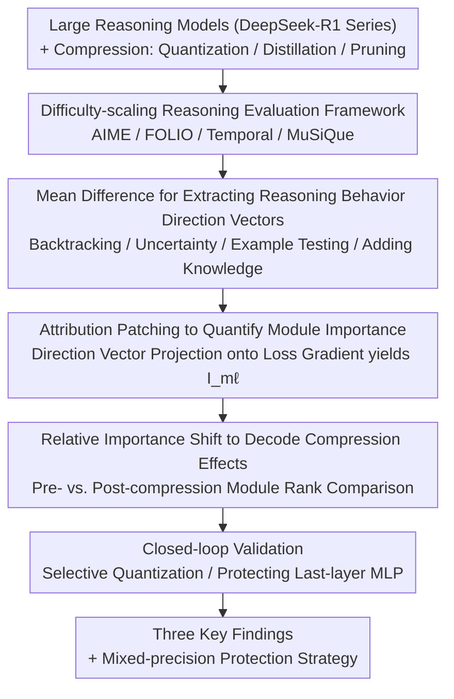

# When Reasoning Meets Compression: Understanding the Effects of LLMs Compression on Large Reasoning Models

**Conference**: ICLR2026  
**arXiv**: [2504.02010](https://arxiv.org/abs/2504.02010)  
**Code**: [github.com/psunlpgroup/Compression-Effects](https://github.com/psunlpgroup/Compression-Effects)  
**Area**: LLM Reasoning  
**Keywords**: Model Compression, Reasoning Models, Quantization, Distillation, Pruning, Interpretability, DeepSeek-R1

## TL;DR
Ours systematically investigates the impact of quantization, distillation, and pruning on Large Reasoning Models (LRM). Through performance benchmarking and mechanistic interpretability analysis, the study reveals core findings: the number of weights affects knowledge memory more than reasoning, the last-layer MLP up_proj is the most critical component, and current quantization methods over-compress the final layers.

## Background & Motivation
- Large reasoning models like DeepSeek-R1 demonstrate superior performance on complex reasoning tasks but suffer from high deployment costs.
- Existing compression research faces two bottlenecks:
    - **Evaluation Bottleneck**: Prior quantization/pruning evaluations primarily use perplexity and simple tasks, failing to thoroughly test on complex reasoning benchmarks.
    - **Analysis Bottleneck**: There is a lack of in-depth mechanistic interpretability analysis of compression effects.
- **Core Problem**: How is the reasoning capability of LRMs damaged during compression? Which weights are most vital for reasoning?

## Method

### Overall Architecture
Ours establishes a dual-layer analysis framework consisting of "Performance Benchmarking + Mechanistic Interpretability." First, compression damage from quantization, distillation, and pruning on DeepSeek-R1 series models is systematically measured across reasoning benchmarks of increasing difficulty. Then, activation direction vectors and attribution patching are employed to locate which linear modules are critical for reasoning and which are damaged by compression. Finally, interpretability conclusions are validated through selective quantization and protection experiments.

### Key Designs

**1. Difficulty-scaling Reasoning Evaluation Framework: Exposing Damage via Complex Tasks**

Prior compression evaluations often stop at perplexity or simple tasks, masking the degradation of reasoning abilities. Ours covers three compression variants—Quantization (Unsloth dynamic 2.51/1.73/1.58-bit, AWQ, GPTQ, GPTAQ, ANY4/ANY3), Distillation (R1-Distill-Llama 70B/8B, R1-Distill-Qwen 32B/7B), and Pruning (SparseGPT, AlphaPruning with multiple sparsities)—testing them across four benchmarks of increasing difficulty: AIME 2024 (mathematical reasoning), FOLIO (logical reasoning), Temporal Sequences (time-series reasoning from BIG-Bench Hard), and MuSiQue (multihop reasoning, using a closed-book setup to simultaneously examine knowledge and reasoning). The introduction of MuSiQue is crucial, as it separates the degradation paths of "knowledge memory" and "pure reasoning," directly supporting the conclusion that "pruning damages knowledge, while quantization preserves parameters."

**2. Mean Difference for Extracting Reasoning Behavior Direction Vectors: Mapping Abstract Reasoning to Activation Directions**

To determine if a specific weight is critical for reasoning, reasoning behaviors must be characterized in activation space. Ours focuses on four core reasoning behaviors—backtracking, uncertainty estimation, example testing, and adding knowledge. Using a contrastive dataset $\mathcal{D}_+$ (containing the behavior) and $\mathcal{D}_-$ (not containing it), a direction vector for behavior $c$ is constructed for each linear module $m$ at layer $\ell$:

$$\mathbf{u}_{m\ell}^c = \frac{1}{|\mathcal{D}_+|} \sum_{s_i^c \in \mathcal{D}_+} \bar{\mathbf{a}}_{m\ell}^c(s_i^c) - \frac{1}{|\mathcal{D}_-|} \sum_{s_j \in \mathcal{D}_-} \bar{\mathbf{a}}_{m\ell}(s_j)$$

Where $\bar{\mathbf{a}}_{m\ell}^c(s_i^c)$ is the average activation over the behavior token sequence. This direction vector provides an actionable representation of how much and in what direction a module participates in a specific reasoning behavior, serving as input for subsequent causal attribution.

**3. Attribution Patching to Quantify Module Importance: Translating Vectors to Causal Strength via Gradients**

Having a direction vector is insufficient; its causal effect on model output is what matters. Ours uses attribution patching to project the direction vector $\tilde{\mathbf{u}}_{m\ell}^c$ onto the gradient of the loss with respect to activations, yielding an importance score for module $m$ regarding behavior $c$:

$$\mathbf{I}_{m\ell}^c \approx \frac{1}{|\mathcal{D}_+|} \left| \sum_{s_i^c \in \mathcal{D}_+} (\tilde{\mathbf{u}}_{m\ell}^c)^\top \frac{\partial}{\partial \mathbf{a}_{m\ell}} \mathcal{L}(s_i^c) \right|$$

A higher $\mathbf{I}_{m\ell}^c$ indicates that perturbing module activations along the direction of that behavior has a greater impact on loss, signifying a stronger causal relationship. Compared to layer-wise analysis, this module-specific score can precisely identify fine-grained critical components such as the "last-layer MLP up_proj."

**4. Relative Importance Shift to Decode Compression Effects: Aligning Changes as Readable Signals**

To answer what exactly compression destroys, Ours compares the relative importance $\mathbf{RI}_{m\ell}^c$ (normalized ranking of module importance under the same behavior) before and after compression. Tracking shifts in these rankings reveals that if a critical module's importance is abnormally weakened after compression, it has been over-compressed. This signal directly led to validation experiments: quantizing only the last-layer up_proj (0.7% of total weights) dropped average accuracy by 16.3%, while conversely, keeping only ~2% of the last-layer MLP in full precision recovered 6.57% accuracy, turning interpretability findings into a deployable mixed-precision protection strategy.

## Key Experimental Results

### Main Results

| Model | Params | Compression | AIME 2024 | FOLIO | Temporal | Avg | MuSiQue (EM, F1) |
|------|--------|----------|-----------|-------|----------|-----|-------------------|
| DeepSeek-R1 | 671B | None | 73.3 | 76.4 | 99.6 | 83.1 | (17.0, 27.51) |
| DeepSeek-R1 | 671B | 2.51-bit | 76.7 | 77.8 | 100.0 | **84.8** | (17.0, 24.43) |
| DeepSeek-R1 | 671B | 1.58-bit | 66.7 | 75.4 | 94.0 | 78.7 | (14.0, 22.34) |
| R1-Distill-Llama | 70B | Distill | 65.6 | 79.8 | 99.9 | 81.8 | (13.3, 21.57) |
| R1-Distill-Qwen | 32B | Distill | 64.4 | 82.3 | 99.9 | 82.2 | (2.7, 10.95) |
| R1-Distill-Llama | 8B | Distill | 42.2 | 71.9 | 81.5 | 65.2 | (0.0, 4.43) |
| R1-Distill-Llama | 70B | 50% SparseGPT | 23.3 | 71.6 | 97.6 | 64.2 | (6.7, 13.49) |

### Ablation Study: Validating Importance via Selective Quantization

| Quantized Component | Rank | AIME 2024 | FOLIO | Temporal | Avg |
|----------|------|-----------|-------|----------|-----|
| 32_up (Last layer up_proj) | Global No.1 | 20.0 | 63.1 | 63.6 | 48.9 |
| 32_gate | Column No.2 | 33.3 | 62.1 | 67.2 | 54.2 |
| 32_v | Column last | 43.3 | 68.0 | 79.6 | 63.6 |
| Unquantized Baseline | - | 42.2 | 71.9 | 81.5 | 65.2 |

Quantizing only 32_up (0.7% of total weights) resulted in a **16.3%** drop in average accuracy!

### Effects of Protecting Critical Weights

| Compression | Protection | AIME 2024 | FOLIO | Temporal | Avg |
|----------|---------|-----------|-------|----------|-----|
| 3-bit AWQ | No | 10.0 | 59.6 | 68.4 | 46.0 |
| 3-bit AWQ | Protect Last Layer MLP | **16.7** | **67.0** | **74.0** | **52.57** |

Protecting ~2% of weights in full precision improved average accuracy by **6.57%**, outperforming SOTA quantization methods by up to **23.17%**.

### Collapse Point Analysis (SparseGPT Sparsity Levels)

| Sparsity | R1-Distill-Llama-70B AIME | R1-Distill-Llama-70B FOLIO |
|--------|---------------------------|---------------------------|
| 0% | 63.3 | 78.8 |
| 30% | 63.3 | 79.3 |
| 40% | 56.7 | 73.9 |
| 50% | 26.7 | 70.9 |
| 60% | 0.0 | 65.0 |
| 70% | 0.0 | 49.8 |

The collapse point is negatively correlated with task difficulty: AIME collapses at 40-50%, while FOLIO collapses at 60-70%.

## Key Findings

### Finding 1: Weight Quantity Impacts Knowledge Memory More Than Reasoning
- While Qwen's reasoning is stronger than Llama's, its MuSiQue (knowledge-intensive) score is much lower than Llama-70B's.
- Pruning causes knowledge memory to collapse earlier than reasoning (MuSiQue collapses at 30-40% sparsity).
- **Conclusion**: Knowledge-intensive tasks should prioritize quantization (maintaining parameter count) over pruning or distillation.

### Finding 2: Last-layer MLP up_proj is the Most Critical Component
- This pattern was observed in both R1-Distill-Llama-8B and R1-Distill-Qwen-7B.
- Distillation is the primary cause for the prominence of this component (original Llama does not exhibit this feature).
- This complements existing research claiming o_proj is most important.

### Finding 3: Current Quantization Methods Over-compress Last Layers and gate_proj
- Both AWQ and GPTQ over-compress last-layer modules and gate_proj in intermediate layers.
- Protecting the last-layer MLP module significantly improves performance (+6.57% on average).
- This finding also applies to pruning methods.

## Highlights & Insights
1. **First systematic comparison of three compression methods on LRMs**: Fills the research gap in LRM compression.
2. **Fine-grained Interpretability Analysis**: Module-level importance analysis surpasses existing layer-wise approaches.
3. **High Practical Value**: Achieving significant gains by protecting only 2% of weights provides clear guidance for future compression.
4. **Generalizability**: Core findings hold across both R1 and non-R1 model families.
5. **Synergy of Theory and Practice**: Every finding is supported by validation experiments.

## Limitations & Future Work
- Interpretability analysis used only 120 instances, a relatively small sample size.
- Optimal strategies for mixed-precision quantization were not fully explored (only verified simple last-layer protection).
- Pruning analysis was less extensive than quantization/distillation due to the unavailability of high-sparsity models.
- Distillation analysis was limited to SFT, omitting distillation during the RL phase.
- Specific data on inference time and deployment efficiency were not discussed.

## Related Work & Insights
- Compared to existing compression benchmarks (e.g., EleutherAI harness): Ours uses more challenging reasoning datasets.
- Compared to layer-level analysis by Venhoff et al.: Ours provides module-level fine-grained analysis.
- Compared to Shao & Wu's claim that o_proj is most important: Ours finds up_proj more critical in distilled models.
- Compared to surveys by Liu et al. and Feng et al.: Ours provides a unique mechanistic interpretability perspective.

## Rating
- Novelty: ⭐⭐⭐⭐ (Combination of systematic study and interpretability is novel, though basic methods are not original)
- Experimental Thoroughness: ⭐⭐⭐⭐⭐ (Covers quantization/distillation/pruning, multiple models, benchmarks, and validation tests)
- Writing Quality: ⭐⭐⭐⭐ (Clear structure, refined findings, though many tables make it slightly dense)
- Value: ⭐⭐⭐⭐⭐ (Three core findings directly applicable to improving compression; protecting 2% weights for a 6.57% gain is highly practical)

<!-- RELATED:START -->

## Related Papers

- [\[ICLR 2026\] When More Is Less: Understanding Chain-of-Thought Length in LLMs](when_more_is_less_understanding_chain-of-thought_length_in_llms.md)
- [\[ACL 2026\] Can Reasoning Path still be Effective as Input? Bridging Post-Reasoning to Chain-of-Thought Compression](../../ACL2026/llm_reasoning/can_reasoning_path_still_be_effective_as_input_bridging_post-reasoning_to_chain-.md)
- [\[ICLR 2026\] Variation in Verification: Understanding Verification Dynamics in Large Language Models](variation_in_verification_understanding_verification_dynamics_in_large_language_.md)
- [\[ICML 2026\] Internalizing Safety Understanding in Large Reasoning Models via Verification](../../ICML2026/llm_reasoning/internalizing_safety_understanding_in_large_reasoning_models_via_verification.md)
- [\[ICLR 2026\] Characterizing and Mitigating Reasoning Drift in Large Language Models](characterizing_and_mitigating_reasoning_drift_in_large_language_models.md)

<!-- RELATED:END -->
