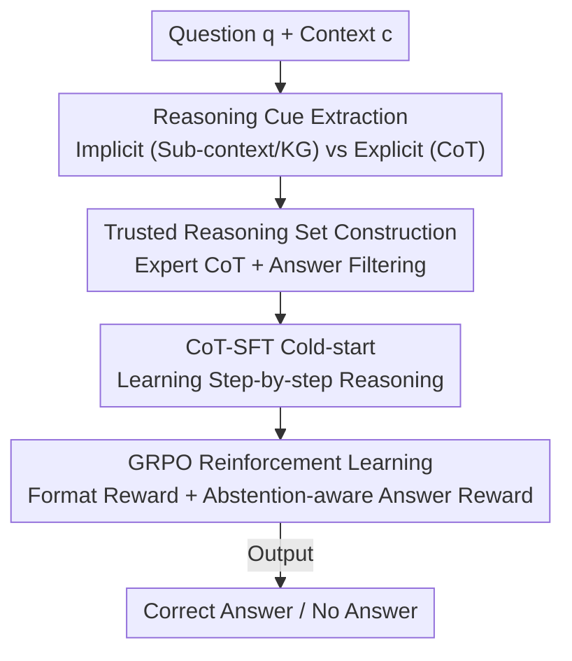

# When Silence is Golden: Can LLMs Learn to Abstain in Temporal QA and Beyond?

**Conference**: ICLR 2026  
**Paper**: [OpenReview](https://openreview.net/) (⚠️ Subject to the original text)  
**Code**: https://github.com/Blackzxy/AbstentionTemporalQA  
**Area**: LLM Reasoning / Reliability & Abstention  
**Keywords**: Abstention, Temporal QA, CoT Cold-start, GRPO, Reward Design

## TL;DR
This paper systematically investigates "how to teach LLMs to abstain when they don't know the answer in temporal QA," proposing a pipeline involving **CoT-SFT cold-start + GRPO reinforcement learning (with abstention-aware rewards)**. This allows a 1.5B small model to outperform GPT-4o in Exact-Match (EM) on TimeQA (+3.46% on Easy / +5.80% on Hard). It also reveals the trade-offs where SFT causes overconfidence and RL improves accuracy but degrades abstention behavior on difficult problems.

## Background & Motivation
**Background**: LLMs perform impressively in various QA tasks but possess a persistent flaw—**they prefer to fluently hallucinate an answer rather than admit "I don't know."** Making the model abstain (i.e., return "No Answer") when evidence is lacking is critical for reliability. Common remedies include confidence calibration, auxiliary training objectives, prompt engineering, consistency voting, and multi-model aggregation.

**Limitations of Prior Work**: While these methods show some efficacy in standard QA, they fail significantly in **temporal QA**. Temporal questions require models to understand that "events evolve over time and answers expire." For example, for "Who was the spouse of Anna Karina in 1966–1967?", if the couple divorced in 1965, the correct answer should be "unanswerable," yet GPT-4o confidently hallucinates a name. Temporal expressions themselves are often ambiguous ("before"/"after"/"early 1980s") and contradictory, making abstention judgments harder than in general QA.

**Key Challenge**: Calibration-based methods cannot accurately characterize uncertainty in **complex multi-step reasoning** scenarios; training-based methods require extra supervision and generalize poorly. A deeper contradiction exists between **overall accuracy ↔ abstention capability**: making the model bolder increases performance on answerable questions but also raises hallucinations, while encouraging abstention may lead to "abstaining from everything."

**Goal**: The authors state they do not aim merely to "build a stronger model" but to systematically answer three sub-questions: (1) Which **information cues** (original context, temporal sub-context, knowledge graphs, explicit CoT) best assist temporal reasoning with abstention; (2) How **model scale** influences performance; and (3) What side effects **SFT vs. RL** strategies have on reasoning and abstention behaviors.

**Key Insight**: Abstention is treated as a **teachable skill** rather than a post-hoc confidence threshold. The authors hypothesize that using CoT distilled from expert models for cold-starting, followed by RL with rule-based rewards to reinforce "honestly saying I don't know," can jointly optimize reasoning ability and abstention behavior.

**Core Idea**: **CoT-SFT provides a reasoning cold-start + GRPO uses rule-based rewards (points for correct answers, full points for appropriate abstention, zero for hallucinations)** to enable small models to learn both temporal reasoning and when to remain silent.

## Method

### Overall Architecture
The paper first categorizes "reasoning cues provided to the model" into two types for comparative experiments before presenting the final training pipeline. **Implicit reasoning cues** refer to backgrounds that support reasoning indirectly without explicit steps, including two types: temporal sub-contexts (`tc`) and temporal knowledge graphs (KG quadruples) extracted from the context. **Explicit reasoning cues** refer to **CoT reasoning chains** generated by GPT-o1, which provide step-by-step thought processes.

The main methodology is a three-stage **CoT+RL pipeline**: first, generate and filter a "trusted reasoning set" using an expert model; second, perform CoT-SFT cold-starting; third, refine with GRPO reinforcement learning using **format rewards + abstention-aware answer rewards**. The input is `(question q, context/cue e)`, and the output `o` is either the correct answer or "No Answer" if unanswerable.

### Key Designs

**1. Reasoning Cue Extraction: Determining the best information for temporal QA with abstention**

To address the issue of noisy temporal contexts where models fail to capture facts related to question timestamps, three types of cues were designed. **Temporal sub-context** uses GPT-4o-mini with a time-filtering prompt to extract fragments from the original `c` that relate only to the timestamp `tq`: $tc = \text{ExtractTimeRelated}(q, c)$. **Knowledge Graphs** extract the context into temporal quadruples $(h, r, t, \tau)$ (head, relation, tail, timestamp), retrieve the top-$k$ using semantic similarity (Faiss) or keyword matching (KeyBERT): $KG_k = \text{Top-}k(\text{Sim}(q, s_i))$, and rewrite them into natural language. **Explicit CoT** uses GPT-o1 to generate `{reasoning steps r, answer â}` for each question. This comparison concludes that implicit cues offer limited help while explicit CoT is critical.

**2. Trusted Reasoning Set Construction: Ensuring clean supervision for cold-start**

Cold-starting requires high quality rather than massive quantity—noisy reasoning chains can mislead small models. After generating CoTs with GPT-o1, the authors **retain only samples where the generated answer `â` matches the ground truth `a`**, discarding the rest to form a "trusted reasoning set." This resulted in 2,119 samples for TimeQA-Easy and 1,045 for TimeQA-Hard. This emphasizes "quality over quantity" to prevent the model from learning incorrect reasoning trajectories during cold-start.

**3. CoT-SFT Cold-start: Teaching small models to "think step-by-step" before RL**

Performing RL directly on the base model fails (as shown in experiments where RL training cannot converge without CoT-SFT). Therefore, supervised fine-tuning is used on the trusted reasoning set, **requiring the model to generate reasoning steps `r` and the final answer `a` simultaneously**. This "plants" the expert's step-by-step reasoning capability into the small model, activating its latent reasoning potential. The authors emphasize that small models benefit significantly more from CoT-SFT than from KG or context cues.

**4. GRPO + Abstention-aware Reward: Jointly optimizing correctness and abstention via rule-based rewards**

This is the core of transforming abstention into a trainable skill. Using GRPO, for each question, a group of $G$ outputs $\{o^{(1)}, \dots, o^{(G)}\}$ is sampled. The policy is updated based on relative advantage within the group, and KL divergence penalizes deviation from the reference model. The reward is **purely rule-based with no reward model** (avoiding reward hacking), consisting of two parts. Total reward $R = R_{format} + R_{ans}$. The format reward $R_{format}=0.5$ requires thoughts in `<think></think>` and answers in `<answer></answer>`. The crucial answer reward is:

$$R_{ans}(o,a)=\begin{cases}1.0, & o=\text{No Answer} \text{ and } a=\text{No Answer}\\ \text{Rouge-L}(o,a)+\text{EM}(o,a), & o\neq\text{No Answer} \text{ and } a\neq\text{No Answer}\\ 0, & \text{otherwise}\end{cases}$$

The first case is vital: **when a question is unanswerable and the model correctly returns "No Answer," it receives a full reward of 1.0**, explicitly rewarding "honest abstention." The third case penalizes both "over-abstention" and "hallucination" by giving 0. This design jointly optimizes "abstention" and "correctness" within a single scalar signal.

### Loss & Training
The GRPO objective (Equation 1) takes the form of intra-group PPO-clip:
$$J_{GRPO}=\mathbb{E}\Big[\tfrac{1}{G}\sum_{i=1}^{G}\min\big(\tfrac{\pi_\theta}{\pi_{\theta_{old}}}A_i,\ \text{clip}(\tfrac{\pi_\theta}{\pi_{\theta_{old}}},1-\epsilon,1+\epsilon)A_i\big)-\beta D_{KL}(\pi_\theta\|\pi_{ref})\Big]$$
Training config: SFT full fine-tuning for 2 epochs ($lr=1\text{e-}5$, weight decay $1\text{e-}2$); RL starts after 1 epoch of CoT-SFT, then GRPO for 3 epochs with group size $G=4$, KL coefficient $\beta=0.01$, $\epsilon=0.2$, trained on 4×H100.

## Key Experimental Results

### Main Results
TimeQA contains 20K+ QA pairs, 5.5K temporal facts, and 70 relations, split into Easy (explicit time expressions) and Hard (implicit time references), both containing answerable/unanswerable samples. Principal Exact-Match (%) results:

| Setting | Model | TimeQA-Easy EM | TimeQA-Hard EM |
|------|------|------|------|
| Question only (INF) | GPT-4o | 21.56 | 20.72 |
| + Original context (INF) | GPT-4o | 39.95 | 29.95 |
| + Temporal sub-context (INF) | GPT-4o | 45.15 | 34.12 |
| + Original context (INF) | o4-mini | 44.14 | 37.12 |
| + Original context, **RL** | **Qwen2.5-1.5B** | **43.41** | **35.75** |
| + Original context, SFT | Qwen2.5-7B | 3.70 | 0.37 |

The 1.5B model trained with RL surpasses GPT-4o EM (+3.46% Easy / +5.80% Hard, ⚠️ based on main text, slightly different from INF values in table; refer to original text). Remarkably, **the 7B model using full SFT drops to near zero EM**, indicating that SFT alone cannot teach temporal reasoning with abstention.

### Ablation Study
Reward design and hyperparameters (TimeQA, Qwen2.5-1.5B):

| Configuration | Easy EM(%) | Hard EM(%) | Note |
|------|-----------|-----------|------|
| RL ($\beta{=}0.01$, ROUGE+EM) | 43.41 | 35.75 | Default full reward |
| RL (ROUGE only) | 42.74 | 26.67 | Removing EM causes Hard to crash |
| RL ($\beta{=}0.04$, ROUGE) | 41.56 | 25.40 | Larger β is worse |
| RL (ROUGE+BERTScore) | 34.40 | 35.46 | Semantic score hurts Easy |
| RL (ROUGE+BERTScore+EM) | 33.71 | 37.62 | Best Hard but worst Easy |

### Key Findings
- **CoT-SFT cold-start is the lifeblood of RL success**: RL fails on the base model without first using expert CoT to activate reasoning capability.
- **Implicit cues provide limited help**: Temporal sub-contexts are slightly better than original contexts, but KGs are often worse. Simply including the context in the prompt is the most practical solution. Explicit CoT is the true key to unlocking reasoning.
- **SFT causes overconfidence**: Compared to direct reasoning, SFT reduces False Positives (FP) but also lowers True Positives (TP) and raises False Negatives (FN). It still attempts to answer unanswerable questions, improving coverage rather than uncertainty identification.
- **RL abstention behavior differs by difficulty**: On Easy tasks, RL significantly improves honesty (TP↑, hallucinations↓). On Hard tasks, it avoids abstention, causing FN to soar—correctly abstaining in complex reasoning is harder than guessing.
- **Sensitivity to data ratio**: When only 12.4% of Easy samples are unanswerable, the model ignores abstention. Increasing the unanswerable ratio to 50% leads to "abstaining from everything," requiring tuning of both data distribution and rewards.
- **More KGs lead to less abstention**: Increasing KG quantity makes the model "confident," decreasing FP. While answerable performance rises, abstention capability degrades, creating a practical dilemma.

## Highlights & Insights
- **Encoding abstention into a single line of rule-based reward**—"unanswerable and returns No Answer → full reward of 1.0"—is a simple yet powerful way to treat "honesty" as an optimizable signal. This approach, which avoids reward models and reward hacking, is highly transferable to other tasks requiring abstention (e.g., medical or legal QA).
- **First systematic study of abstention in temporal QA**, creating a comprehensive matrix across "information cues × model scale × training strategy." Key findings (limited utility of implicit cues, necessity of CoT cold-start, SFT-induced overconfidence) are highly valuable.
- **Extreme contrast of 1.5B model vs. GPT-4o**: In narrow and difficult temporal reasoning, "Small Model + Correct Recipe > Large Model Direct Inference."

## Limitations & Future Work
- Authors admit a **trade-off between accuracy and abstention capability**; designing effective rewards and optimal data ratios remains an open problem.
- **Abstention capability generalizes poorly to OOD**: On MMLU/HellaSwag/SQuAD, while SFT transfers some TP, RL induces overconfidence, making cross-domain abstention unstable.
- Methodological dependence on closed-source experts (GPT-4o-mini/GPT-o1) for cue extraction and CoT generation limits cost-efficiency and reproducibility.
- Future directions: Explore long CoT training without KL ($\beta=0$), adaptive data ratios, and using the model's own consistency to replace closed-source experts for CoT distillation.

## Related Work & Insights
- **vs. Calibration methods (Tian et al. 2023)**: These adjust confidence to align with correctness. This paper argues calibration is inaccurate in multi-step reasoning and instead uses RL to reinforce abstention as a skill.
- **vs. Math-domain RL abstention (Song et al. 2025)**: Similarly uses RL for abstention but this paper is the first to target **temporal QA**, where dynamic event structures and ambiguous expressions make failure modes unique.
- **vs. Multi-model aggregation (Feng et al. 2024b)**: Those rely on model consensus to abstain. This work internalizes the skill within a single model, making it more lightweight though still weak on OOD generalization.

## Rating
- Novelty: ⭐⭐⭐⭐ First systematic study of temporal QA abstention with simple, effective rewards.
- Experimental Thoroughness: ⭐⭐⭐⭐⭐ Comprehensive comparisons across cues, scale, strategy, rewards, and OOD; detailed TP-FP-FN analysis.
- Writing Quality: ⭐⭐⭐⭐ Clear conclusions and thorough discussion of trade-offs, though some metrics require careful cross-referencing between text and tables.
- Value: ⭐⭐⭐⭐ The paradigm of "Honest Abstention = One-line Rule Reward" is highly relevant for reliable LLM development.

<!-- RELATED:START -->

## Related Papers

- [\[ICLR 2026\] When More Is Less: Understanding Chain-of-Thought Length in LLMs](when_more_is_less_understanding_chain-of-thought_length_in_llms.md)
- [\[ICLR 2026\] Off-Trajectory Reasoning: Can LLMs Collaborate on Reasoning Trajectories?](off-trajectory_reasoning_can_llms_collaborate_on_reasoning_trajectories.md)
- [\[ICLR 2026\] Hybrid Reinforcement: When Reward Is Sparse, Better to Be Dense](hybrid_reinforcement_when_reward_is_sparse_better_to_be_dense.md)
- [\[ICLR 2026\] Beyond English-Centric Training: How Reinforcement Learning Improves Cross-Lingual Reasoning in LLMs](beyond_english-centric_training_how_reinforcement_learning_improves_cross-lingua.md)
- [\[ICLR 2026\] Tracing the Traces: Latent Temporal Signals for Efficient and Accurate Reasoning](tracing_the_traces_latent_temporal_signals_for_efficient_and_accurate_reasoning.md)

<!-- RELATED:END -->
