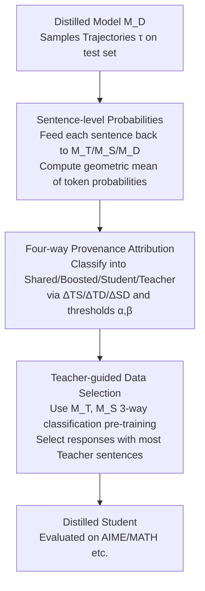

# Where Did This Sentence Come From? Tracing Provenance in LLM Reasoning Distillation

**Conference**: ICLR 2026  
**Paper**: ICLR 2026 Conference Paper  
**Code**: None  
**Area**: LLM Reasoning  
**Keywords**: Reasoning Distillation, Provenance Tracing, Teacher-guided Data Selection, Sentence-level Attribution, Generalization Analysis

## TL;DR
This work attributes each sentence output by a distilled student model at test time to its true source model across four categories: Teacher, Student, Shared, and Boosted. It demonstrates that students indeed reuse teacher sentences in new scenarios and that these sentences correlate with correct answers. Based on this, a "Teacher-guided Data Selection" strategy is proposed to select training samples with the most teacher sentences, yielding average improvements of 1.7%–2.5% across multiple teacher-student pairs.

## Background & Motivation
**Background**: Reasoning distillation is currently the primary method for "cheaply transferring" reasoning capabilities from strong Large Language Models (LLMs) to smaller ones. High-quality reasoning trajectories are sampled from teacher models like DeepSeek-R1 or QwQ, and students are trained to imitate these trajectories via cross-entropy loss. Recent works (e.g., OpenThoughts, AceReason, GRAPE) mainly focus on strategies for selecting and filtering training samples.

**Limitations of Prior Work**: Existing methods focus almost exclusively on "final performance" but fail to address a critical question: while the student learns to imitate the teacher within the training context, **does it continue to follow the teacher's logic or secretly regress to its original output distribution when facing entirely new contexts at test time?** Without attributing every step of the distilled model's test-time behavior to a source, it remains unclear whether distillation truly transfers reasoning capabilities or merely reinforces the student's existing patterns.

**Key Challenge**: Behavioral consistency during training does not guarantee behavioral consistency during testing. Students might perfectly replicate the teacher on the training distribution but regress to original patterns when out-of-context, which is the root of skepticism regarding distillation generalization. Answering this requires an attribution tool capable of comparing the teacher, student, and distilled models at a **sentence-level** granularity.

**Key Insight**: Instead of costly re-sampling and hard-to-quantify similarity metrics, the authors propose a different perspective: sample a single trajectory from the distilled model and **feed it back** into the teacher, the original student, and the distilled model. By observing the probability each model assigns to the "next sentence," one can determine the primary source of that sentence based on which model provides a significantly higher probability.

**Core Idea**: Use the "prediction probability difference among the three models under the same context" as a provenance signal to categorize each sentence. This signal is then moved upstream to the pre-training phase to select training responses containing the highest number of "Teacher sentences."

## Method

### Overall Architecture
The work is divided into two phases: an **analysis framework** (explaining why distillation works) and a **training method** (using conclusions to guide data selection).

Phase 1: **Reasoning Distillation Provenance Tracing**. Trajectories $\tau^i$ are sampled from the distilled model $M_D$ on the test set $\{Q^i_{test}\}$, segmented into action sequences $\{a_{(i,j)}\}$. Each action $a_{(i,j)}$ and its context are fed back into three models: $M_T$ (Teacher), $M_S$ (Original Student), and $M_D$ (Distilled). This yields three sentence-level probabilities $p^T_{(i,j)}, p^S_{(i,j)}, p^D_{(i,j)}$. Sentences are classified into four sources (Shared/Boosted/Student/Teacher) using thresholds $\alpha, \beta$. Statistical profiling reveals which provenance source the distilled model tends to output at specific sentence positions.

Phase 2: **Teacher-guided Data Selection**. Before training, only $M_T$ and $M_S$ are available. The four-way classification is collapsed into three categories (Teacher/Student/Common). For multiple candidate teacher responses to the same problem, the response with the **highest absolute count** of "Teacher sentences" is selected for the training set.

### Key Designs

**1. Sentence-level Probability: Replacing "Re-sampling" with "Score-based Feedback"**
Truncating and re-sampling from each model to measure similarity has two flaws: the reasoning chains are long, making re-sampling costs explosive, and quantifying similarity between new generations is unreliable. The authors take a more efficient view: they do not re-generate but instead **feed the sentence already generated by the distilled model into each model to read the probability it assigns to that sentence.** To handle vocabulary inconsistencies, sentence-level probability $p_{(i,j)}$ is defined as the geometric mean of token probabilities within the sentence:

$$p_{(i,j)} = \exp\big(\text{mean}(\log p_k)\big)$$

where $p_k$ is the probability of the $k$-th token. This requires only one forward pass per sentence, making $p^T, p^S, p^D$ directly comparable.

**2. Four-way Provenance Attribution: Determining Source via Probability Differences**
Using $p^T_{(i,j)}, p^S_{(i,j)}, p^D_{(i,j)}$, define pairwise differences $\Delta_{SD}=p^S-p^D, \Delta_{TD}=p^T-p^D, \Delta_{TS}=p^T-p^S$, and two thresholds $\alpha, \beta$:

$$
\begin{cases}
\text{Shared}, & |\Delta_{SD}|\le\alpha \wedge |\Delta_{TD}|\le\alpha \wedge |\Delta_{TS}|\le\alpha\\
\text{Teacher}, & \Delta_{TS} > \beta\\
\text{Student}, & -\Delta_{TS} > \beta\\
\text{Boosted}, & |\Delta_{TS}| < \beta
\end{cases}
$$

The attribution follows the order: Shared → Teacher → Student → Boosted.
- **Shared**: All three models assign similar probabilities; the student already knew this, and distillation provided no boost.
- **Boosted**: $M_T$ and $M_S$ have similar probabilities, but $p^D$ is significantly higher, indicating an internal student pattern amplified by distillation.
- **Teacher**: High $\Delta_{TS}$ ($M_T$ significantly higher than $M_S$); primarily sourced from teacher-transferred knowledge.
- **Student**: $M_S$ significantly higher than $M_T$.
$\alpha$ filters noise, while $\beta$ separates types and is determined adaptively.

**3. Key Findings: Teacher Sentences Explain Generalization Gains**
Attribution on DeepSeek-Distill-Qwen-7B, DeepSeek-R1-0528-Qwen3-8B, and LIMO-v2 over AIME24/GPQA-D yielded three conclusions:
(i) **High teacher sentence probability in early reasoning**: Early sentences are more likely to be Teacher sentences, suggesting students learn the teacher's "initial analysis and planning" patterns.
(ii) **Internal patterns (Boosted) are frequent but not always beneficial**: Teacher+Boosted sentences account for over 0.7 probability; however, for 7B models, Boosted sentences have higher probabilities in **incorrect** responses, suggesting not all internal patterns are worth amplifying.
(iii) **Teacher sentences correlate strongly with correctness**: Teacher sentences are assigned higher probabilities in correct answers, as the teacher's superior performance means closer alignment with the teacher leads to higher accuracy.

**4. Teacher-guided Data Selection: Moving Provenance Signals Upstream**
Given that "more teacher sentences lead to higher correctness," the strategy **proactively selects samples with more teacher sentences** before training. Since $M_D$ does not exist yet, the classification collapses to:

$$
\begin{cases}
\text{Common}, & |\Delta_{TS}|\le\beta\\
\text{Teacher}, & \Delta_{TS} > \beta\\
\text{Student}, & -\Delta_{TS} > \beta
\end{cases}
$$

Among multiple candidate responses, the one with the **maximum absolute count of Teacher sentences** is selected. This contrasts with GRAPE, which selects samples "closest to the student distribution." This method targets the **teacher-student divergence** directly.

### Loss & Training
Standard SFT is used: minimizing cross-entropy between student predictions and teacher actions $(Q^i_{train}, a_{(i,1)}, a_{(i,2)}) \to a_{(i,3)}$. The loss function is unchanged; only the **training data selection** is modified. Standardized training set sizes ensure comparability. $\beta$ is selected adaptively in a training-free manner.

## Key Experimental Results

### Main Results
Average accuracy across four reasoning benchmarks comparing Vanilla (random selection), GRAPE, and Ours:

| Setting (Teacher+Student+Data) | AIME24 | AIME25 | MATH500 | OlympiadBench | Avg |
|------|------|------|------|------|------|
| DeepSeek-R1 + Qwen3-4B-Base + AceReason, Vanilla | 44.4 | 33.3 | 91.2 | 55.9 | 56.2 |
| Same as above, GRAPE | 43.0 | 34.1 | 88.6 | 54.8 | 55.1 |
| Same as above, **Ours** | **49.3** | **37.9** | 90.8 | **56.6** | **58.7** (+2.5) |
| DeepSeek-R1 + Qwen3-8B-Base + AceReason, **Ours** | 57.3 | 41.5 | 92.8 | 58.7 | **62.6** (+1.7) |
| QwQ-32B + Qwen2.5-7B-Instruct + OpenThought3, **Ours** | 48.1 | 36.3 | 90.0 | 56.3 | **57.7** (+1.7) |
| GPT-OSS-120B + Qwen3-4B-Instruct-2507 + AceReason, **Ours** | 77.9 | 68.3 | 94.6 | 64.9 | **76.4** (+2.4) |

Ours ranks best across all groups (+1.7% to +2.5%) and remains stable across DeepSeek, QwQ, and GPT-OSS families.

### Ablation Study

| Selection Metric (DeepSeek-R1+Qwen3-4B-Base+AceReason) | AIME24 | AIME25 | MATH500 | OlympiadBench | Avg |
|------|------|------|------|------|------|
| Maximize Absolute Count (Ours) | 49.3 | 37.9 | 90.8 | 56.6 | **58.7** |
| Longest (Longest response) | 48.1 | 37.5 | 90.0 | 55.9 | 57.9 |
| Relative Proportion (Teacher sentence ratio) | 46.9 | 35.0 | 88.8 | 55.1 | 56.4 |
| Vanilla (Random) | 44.4 | 33.3 | 91.2 | 55.9 | 56.2 |
| Minimize Absolute Count (Reverse: fewest Teacher) | 42.9 | 35.2 | 87.8 | 54.2 | 55.0 |

### Key Findings
- **"Absolute Teacher Count" is the optimal metric**: Maximize Absolute Count (58.7) > Longest > Relative Proportion. Selecting responses with the fewest teacher sentences resulted in the worst performance (55.0).
- **β is insensitive and pre-determinable**: $\beta=0.1$ provides the cleanest classification and the best accuracy. Values like 0.05 or 0.15 still outperform Vanilla.
- **Cross-domain effectiveness**: Training on GPT-OSS-120B selected data from scientific domains improved performance not only on GPQA-D (42.9 vs Vanilla 39.9) but also on math benchmarks (OlympiadBench 48.0 vs 44.0).
- **Scale Limitations**: Verified only up to 8B models due to resources. Whether teacher sentences benefit larger models remains an open question.

## Highlights & Insights
- **Efficiency via feedback scoring**: Attribution uses existing generated sentences to read probabilities rather than re-sampling, reducing costs and providing a quantifiable similarity metric.
- **Explanation-Training Closed Loop**: The work uses the attribution framework to **explain** distillation generalization and then **reverses** the signal for data selection.
- **Cross-model vs. Single-model Signals**: Upgrading data selection from "aligning with student distribution" (GRAPE) to "explicit teacher-student divergence" provides a more principled criteria.
- **Dialectics of "Boosted" Sentences**: Distillation amplifies inherent student patterns, but in small models, this "activation" might degrade accuracy.

## Limitations & Future Work
- **Scale**: Limited to models $\le$ 8B; effects on larger models are unknown. LIMO-v2's small sample size (800) makes conclusions about mid-to-late stage teacher sentence benefits less certain.
- **Threshold Sensitivity**: Graduation into four categories depends on $\alpha, \beta$; classification near boundaries might be unstable. Sentence-level geometric means might mask local token-level signals.
- **Future Directions**: Weighting metrics by sentence position (early teacher sentences might be more critical) or using provenance signals for **online** weight adjustment during training.

## Related Work & Insights
- **vs. GRAPE (Zhang et al., 2025)**: GRAPE selects samples closest to the student's original distribution based on student logits. This work selects samples based on teacher-student divergence, focusing on pulling the student toward the teacher.
- **vs. Reasoning Distillation Data Engineering**: While existing works focus on "performance" via quality/correctness checks, this work adds "provenance interpretability" to determine if distillation transfers capability or shifts patterns.
- **vs. Model Auditing**: Auditing focuses on data membership; this work focuses on "model-level provenance tracing"—tracing which upstream model a specific output primarily originates from.

## Rating
- Novelty: ⭐⭐⭐⭐⭐ 
- Experimental Thoroughness: ⭐⭐⭐⭐ 
- Writing Quality: ⭐⭐⭐⭐ 
- Value: ⭐⭐⭐⭐ 

<!-- RELATED:START -->

## Related Papers

- [\[ICLR 2026\] Tracing the Traces: Latent Temporal Signals for Efficient and Accurate Reasoning](tracing_the_traces_latent_temporal_signals_for_efficient_and_accurate_reasoning.md)
- [\[ICLR 2026\] Probing to Refine: Reinforcement Distillation of LLMs via Explanatory Inversion](probing_to_refine_reinforcement_distillation_of_llm_reasoners_via_explanatory_in.md)
- [\[ICLR 2026\] KaVa: Latent Reasoning via Compressed KV-Cache Distillation](kava_latent_reasoning_via_compressed_kv-cache_distillation.md)
- [\[ICLR 2026\] Explain in Your Own Words: Improving Reasoning via Token-Selective Dual Knowledge Distillation](explain_in_your_own_words_improving_reasoning_via_token-selective_dual_knowledge.md)
- [\[ICLR 2026\] SkillFactory: Self-Distillation for Learning Cognitive Behaviors](skillfactory_self-distillation_for_learning_cognitive_behaviors.md)

<!-- RELATED:END -->
