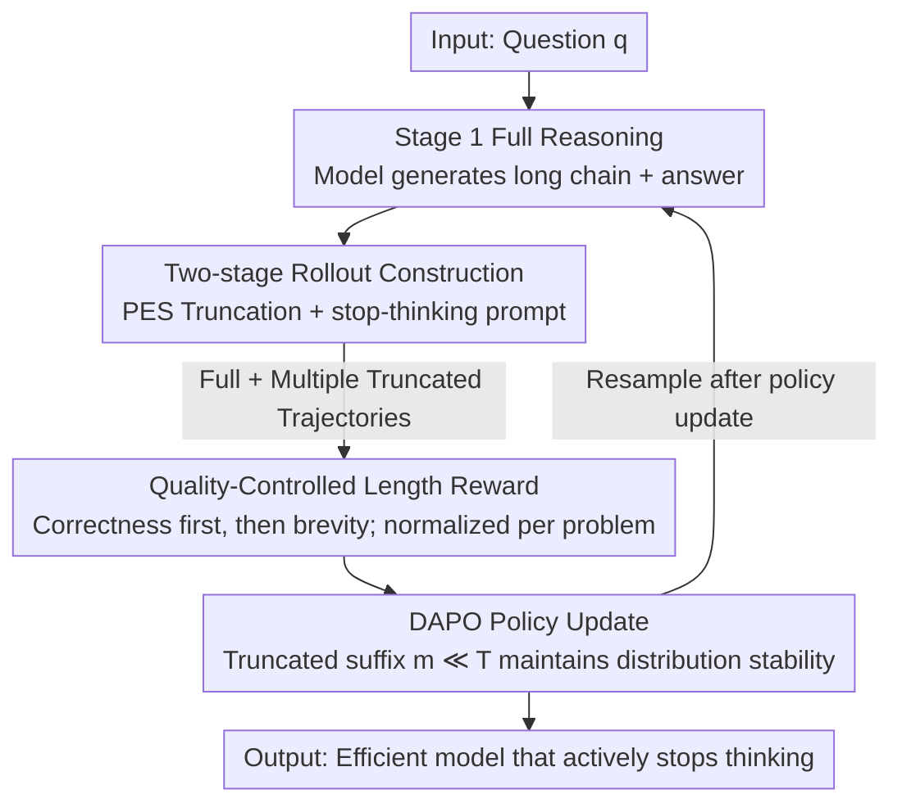

# Your Models Have Thought Enough: Training Large Reasoning Models to Stop Overthinking

**Conference**: ICLR 2026  
**Code**: https://github.com/JinyiHan99/Just-Enough-Think/ (Available)  
**Area**: LLM Reasoning  
**Keywords**: Efficient reasoning, overthinking, trajectory truncation, length reward, reinforcement learning

## TL;DR
Addressing the "overthinking" problem in Large Reasoning Models (LRMs), this paper proposes JET (Just-Enough Thinking). During the RL rollout phase, the model's self-generated long reasoning chains are **progressively truncated** and appended with a "stop-thinking" prompt to construct short reasoning samples consistent with the model's own distribution. Combined with a "correctness-first, brevity-second" quality-controlled length reward, the model learns to actively stop thinking when information is sufficient. Using a 1.5B model, JET achieves a +4.6% accuracy improvement on Olympiad while reducing output length by 46.3%.

## Background & Motivation

**Background**: Large Reasoning Models (LRMs) such as OpenAI o1 and DeepSeek-R1 achieve significant performance gains in difficult tasks like math competitions and coding through System-2 style long-chain reasoning—involving lengthy intermediate steps, repeated self-checking, and exploring multiple solution paths. Reinforcement Learning (RL) has become the mainstream post-training paradigm for enhancing reasoning capabilities.

**Limitations of Prior Work**: This long-form reasoning leads to massive computational waste, as models often generate far more steps than necessary to reach a correct answer—a phenomenon termed "overthinking." To make reasoning more efficient, existing RL methods follow two paths: (i) adaptive mode selection, using SFT to give the model "think/no-think" modes followed by RL reward-based selection; (ii) length-based optimization, directly adding a length reward to encourage brevity.

**Key Challenge**: Effective reward learning depends on exposing the model to **diverse** samples. However, LRMs naturally favor wordy outputs and rarely generate short reasoning trajectories spontaneously (Paper Figure 1a shows that outputs shorter than 1000 tokens are extremely rare among 500 responses). Training data becomes heavily biased toward "long" sequences, distorting length reward signals and failing to teach concise reasoning. A direct remedy is compressing long answers or feeding external short answers, but this introduces significant **distributional mismatch** between the "natural model distribution" and "manually shortened samples," undermining gradient stability and harming internal learning.

**Key Insight**: The authors draw inspiration from **Evidence Accumulation Models** in cognitive science—human decision-making is a dynamic process where information accumulates until a threshold is crossed, after which additional evidence merely "supports" the decision without contributing to the conclusion. The authors hypothesize that LRM reasoning follows a similar pattern: the early parts of a trajectory often accumulate enough information to determine the final answer, making later steps redundant. Pilot experiments confirmed this: retaining only the first 75% of a reasoning chain on MATH500 still preserves 90%+ of the original correct solutions, and keeping the first 50% still answers approximately three-quarters correctly. Furthermore, **truncation sometimes corrects originally wrong answers** (as redundant reasoning can lead the model astray).

**Core Idea**: Since short and correct reasoning is already "hidden" within the model's own long chains, the model should be trained on **truncated, distribution-consistent trajectories extracted from its own long reasoning** rather than external short answers. This leads to JET—training the model to actively terminate thinking when "information is enough."

## Method

### Overall Architecture
JET is an RL method built upon DAPO, aimed at ensuring the model is both correct and concise. Its key lies in transforming the rollout (sampling) phase and reward design: the model first generates **full reasoning trajectories** in its own way (Stage 1), then **PES (Progressive Early-Stopping)** is used to truncate these trajectories at various positions and append a "stop-thinking" prompt, forcing the model to provide an immediate conclusion. This constructs a batch of **truncated trajectories** of varying lengths that remain within the model's natural distribution (Stage 2). Both full and truncated trajectories are fed into RL training with a **quality-controlled length reward** (correctness first, then brevity), updating the policy via the DAPO objective. The pipeline allows the model to see multiple paths for the same problem—varying in length and correctness—to learn when to stop.

### Key Designs

**1. Two-stage Rollout Construction: Tailoring consistent short samples from the model's own long chains**

This design directly addresses the conflict between "models not spontaneously generating short trajectories" and "external short answers causing distributional mismatch." Stage 1 allows the model to generate full reasoning trajectories via standard auto-regression, serving as both a reference for natural behavior and a template for truncation. Stage 2 truncates these full trajectories at various intermediate points and inserts an explicit stop-thinking prompt (e.g., "Wait, I have enough information to get the final answer. Therefore, the final answer is..."), causing the model to output a conclusion based on partial reasoning. Crucially, tokens before the truncation point are sampled by the model itself, and only a very short mandatory suffix follows; thus, **truncated trajectories remain within the model's generation distribution**, avoiding distribution drift from compression or external samples. This yields multiple "long, short, correct, and incorrect" paths for the same problem, providing truly diverse contrastive samples for reward learning.

**2. PES (Progressive Early-Stopping): Approximating the optimal stopping point with equidistant truncations**

Determining "where to stop" is difficult—stopping too early causes errors, while stopping too late leaves redundancies. Exhaustive search for truncation points is computationally expensive. PES (Progressive Early-Stopping) bypasses this with a simple, effective progression: generating a series of truncated variants along each full trajectory at positions
$$t_k = t_0 + k\Delta t,\quad k = 0, 1, \dots, K$$
where $t_0$ is the initial truncation point, $\Delta t$ is a preset step size (based on quantile intervals), and $K$ controls the number of truncations; each point is followed by a stop-thinking prompt. This sequence of equidistant points (i) maintains consistency with the model's distribution, (ii) increases the probability of hitting an optimal or near-optimal point $t^*$, and (iii) provides trajectories of varying lengths to teach the model "when stopping is worth it." It also offers massive engineering gains: truncated trajectories are shorter, require fewer forward passes, and facilitate faster gradient computation—achieving up to **5×** acceleration in rollout and optimization compared to full-chain strategies.

**3. Quality-Controlled Length Reward: Ensuring correctness before rewarding brevity**

Direct length penalties can force the model to be "short for the sake of being short," leading to errors. The rewards in this paper follow three principles: **Correctness Priority** (only correct answers are eligible for length rewards; accuracy remains the primary goal), **Brevity Preference** (shorter correct answers receive higher rewards), and **Intra-question Normalization** (measured relative to the shortest/longest correct answers for that specific problem to avoid bias across different problem difficulties). Let $C=\{i\mid r_{acc}(i)=1\}$ be the set of correct responses for a problem, and let $\ell_{min}=\min_{j\in C}\ell_j$ and $\ell_{max}=\max_{j\in C}\ell_j$. The length reward is:
$$r_\ell(i) = \begin{cases}\left(\dfrac{\ell_{max}-\ell_i}{\ell_{max}-\ell_{min}+\varepsilon}\right)\cdot\alpha\cdot(1-\delta)+\delta, & i\in C\\[2mm] 0, & i\notin C\end{cases}$$
where $\alpha$ controls the decay rate with length, $\delta\in(0,1)$ sets a minimum reward floor for correct answers (preventing the penalization of essential steps), and $\varepsilon>0$ prevents division by zero. The total reward combines format, accuracy, and length: $R(i)=w_f r_f(i)+w_{acc} r_{acc}(i)+w_\ell r_\ell(i)$, where $r_f$ requires the answer inside `\boxed{}`, and $r_{acc}$ determines correctness via exact string matching.

### Loss & Training
JET follows the DAPO objective, sampling a set of outputs $\{o_i\}_{i=1}^G$ for each query $q$ to perform policy gradient updates with clipping, where the advantage is $\hat A_{i,t}=\frac{R_i-\mathrm{mean}(\{R_i\})}{\mathrm{std}(\{R_i\})}$. Unlike standard DAPO which only calculates loss on full trajectories, JET includes **truncated-then-completed** trajectories in the objective, teaching the policy to "stop when information is enough." Gradient analysis shows that for a truncated trajectory $\hat o_i^{(T)}$, the first $T$ tokens come from the old policy $\pi_{\theta_{old}}$ and the subsequent $m$ tokens are a fixed suffix with $m\ll T$. Thus, the sequence-level probability can be decomposed as $\pi_\theta(\hat o_i)=\pi_\theta(o_{i,1:T})\cdot C$, where the suffix factor $C$ has a negligible contribution. The importance ratio for prefix tokens $r_{i,t}(\theta)\approx 1$ falls within the clip range, and suffix tokens are few and also clipped—thus the sequence-level importance ratio $\frac{\pi_\theta(\hat o_i)}{\pi_{\theta_{old}}(\hat o_i)}\approx 1$. Adding short suffixes **does not disrupt stable updates within the trust region**. Training data consists of 14,564 mixed-difficulty samples from MATH and DAPO-MATH (Chinese problems removed).

## Key Experimental Results

### Main Results
The backbone models are DeepSeek-R1-Distill-Qwen 1.5B / 7B, compared against efficient reasoning methods like SFT, DPO, DAPO, AdaptThink, Laser-D/DE, and LCR1. The table below shows accuracy and token compression rates on math benchmarks for the 1.5B model (parentheses show change relative to Base):

| Dataset (1.5B) | Base ACC | JET ACC | Δacc | JET Length Change |
|----------------|----------|---------|---------|-------------------|
| GSM8K          | 76.0     | 83.8    | +7.8    | +29.3% (Easy, ⚠️ see below) |
| MATH500        | 79.6     | 83.0    | +3.4    | -42.7%            |
| AIME24         | 28.7     | 32.0    | +3.3    | -39.9%            |
| AMC            | 63.3     | 66.1    | +2.8    | -49.3%            |
| Olympiad       | 47.0     | 51.6    | +4.6    | -46.3%            |
| **AVG**        | **58.9** | **63.3**| **+4.4**| **-29.8%**        |

> ⚠️ For easy tasks like GSM8K, the Base length is already short (468 tokens). The JET length is 605 (+29.3%) in the original text, a rare case of length increase; however, the AVG remains at -29.8% compression, with significant compression on hard tasks. Refer to the original paper.

On the 7B model, JET achieved an AVG ACC of 75.2 (+0.8) and -26.3% length; in contrast, while LCR1 reduced MATH500-7B length by >50%, it lost 4.4pp in accuracy, contradicting the goal of "efficient reasoning." JET's advantage is significant compression **without sacrificing—and even improving**—accuracy. JET was also validated on DeepSeek-R1-Distill-Llama-8B: in-domain accuracy +2, tokens -31%, showing robustness across scales and model families.

**Out-of-domain Generalization (Table 2)**: Though designed for mathematical reasoning, JET excels in commonsense/professional/multidisciplinary tasks, particularly the difficult GPQA-Diamond:

| Dataset | Model | Base ACC | JET ACC | Δacc | JET Length Comp. |
|---------|-------|----------|---------|---------|------------------|
| GPQA-Diamond | 1.5B | 32.3 | 43.4 | +11.1 | -25.6% |
| GPQA-Diamond | 7B | 47.5 | 52.5 | +5.0 | -13.0% |
| AVG(CSQA/GPQA/MMLU) | 1.5B | 40.1 | 44.5 | +4.4 | -39.7% |
| AVG(CSQA/GPQA/MMLU) | 7B | 57.1 | 60.9 | +3.8 | -14.9% |

The substantial +11.1 gain on GPQA for the 1.5B model indicates that JET enhances the model's ability to capture deep reasoning structures rather than relying on surface pattern matching.

### Ablation Study
The paper's ablations are primarily visual (Figures 3/4/5); key comparisons are as follows (values are approximate, ⚠️ refer to the original text):

| Configuration | Key Effect | Description |
|---------------|------------|-------------|
| **PES (Full)**| Acc↑, Len↓, Optimal | Progressive truncation yields diverse lengths, teaching optimal stopping rewards. |
| Fix (Fixed position) | Worse than PES | Fixed points cannot adapt to problem complexity. |
| w/o PES (Full-length) | Worst | Error accumulation and slow rollout. |
| PES vs. no PES (Efficiency) | Up to **5×** speedup | Fewer forward passes and faster gradients (Figure 4). |
| Length Reward: Ours vs Linear/Exp/Sigmoid | Ours is best | Balances length while preserving essential steps with a floor (Figure 5). |

### Key Findings
- **PES strategy is the largest contributor**: Removing PES and using full-length reasoning (w/o PES) results in the worst performance, proving that "constructing distribution-consistent short samples" is the foundation of JET, rather than simple length penalties.
- **Distributional consistency is key**: JET's KL divergence remains lower than DAPO (Figure 3b), indicating that truncated suffixes do not push the model away from its native distribution, ensuring stable RL updates—consistent with the $m \ll T$ gradient analysis.
- **Greater gains on hard tasks**: JET shows the most significant improvements on AIME24, AMC, and GPQA, suggesting it cuts "redundant steps that lead the model astray" rather than useful reasoning.
- **Length rewards require a lower bound**: The design using weighted linear rewards with a minimum $\delta$ prevents "shortness at all costs" and ensures accuracy does not drop.

## Highlights & Insights
- **"Tailoring short samples from the model's own long chains" is clever**: It simultaneously solves the paradox of "needing short training samples" vs "short samples causing distribution mismatch"—the prefix is entirely self-sampled, and only a short suffix is added, keeping distribution nearly unchanged. This can be transferred to any scenario where one wants to teach concise/controlled behavior via RL without natural model samples.
- **Cognitive science analogies are mapped to actionable mechanisms**: The Evidence Accumulation Model isn't just decoration; it directly leads to the "early information is enough" pilot and the PES design, forming a complete theoretical-experimental loop.
- **Efficiency-Accuracy win-win with "free" 5x training speedup**: While many efficient reasoning methods trade accuracy for length, JET's truncation makes the rollout faster, making training acceleration an added benefit.
- **Gradient analysis provides a clear reason for stability**: $m \ll T \implies$ sequence-level importance ratio $\approx 1$. This clarifies why adding mandatory suffixes doesn't break RL, serving as a template for other "trajectory rewriting + RL" methods.

## Limitations & Future Work
- **Truncation still relies on a hard-coded stop-thinking prompt**: Textual framing and PES hyperparameters ($t_0/\Delta t/K$) are not yet task-adaptive; domain-specific prompts remain unexplored.
- **Correctness depends on exact string matching**: Effective for math/standard answers, but the "correctness-first" premise for length rewards may fail in open generation or tasks without unique answers.
- **Length may not decrease on simple tasks** (e.g., GSM8K-1.5B), indicating diminishing returns where reasoning is already short. High-difficulty, long-chain reasoning is the primary battlefield.
- **Future Directions**: Replacing fixed prompts with learnable "stop tokens / stop policies" or using a lightweight value head to predict truncation points instead of equidistant scanning could further approach optimal stopping.

## Related Work & Insights
- **vs SFT / DPO (using shortest correct answers as samples)**: Both select shortest correct answers from rollouts for supervision/preference, but these are "external" compared to the current distribution. JET keeps samples internal to the distribution, yielding a better trade-off.
- **vs AdaptThink (think/no-think mode selection)**: AdaptThink uses two coarse modes; JET learns "where to stop" at a fine-grained continuous level, providing smoother adaptation to difficulty (preventing length explosions on GSM8K).
- **vs Laser-D/DE (stepped rewards based on target length)**: Laser uses difficulty-aware stepped rewards; however, its dynamic mechanism struggles with simple tasks, whereas JET maintains a consistent balance across all difficulties.
- **vs LCR1 (Aggressive Pruning)**: LCR1 has the highest compression but a high cost in accuracy (dropping 4.4pp on MATH500-7B). JET preserves accuracy while achieving high compression through "quality-controlled" rewards.

## Rating
- Novelty: ⭐⭐⭐⭐⭐ "Truncating from the model's own chains to create consistent short samples" is a truly novel and elegant solution to the overthinking-RL data bias.
- Experimental Thoroughness: ⭐⭐⭐⭐ Coverage of two backbones + 8B validation, 8 benchmarks, and extensive ablation; however, some ablations are only graphical and lack standalone values.
- Writing Quality: ⭐⭐⭐⭐⭐ Clear logic from motivation to pilot to gradient analysis to experiments. The cognitive science analogy is well-integrated.
- Value: ⭐⭐⭐⭐⭐ Efficient reasoning is a core pain point for LRM deployment; the method is simple, provides clear speedup, and can be integrated into DAPO/GRPO pipelines.

<!-- RELATED:START -->

## Related Papers

- [\[ICLR 2026\] Training Large Reasoning Models Efficiently via Progressive Thought Encoding](training_large_reasoning_models_efficiently_via_progressive_thought_encoding.md)
- [\[ICLR 2026\] Pruning Long Chain-of-Thought of Large Reasoning Models via Small-Scale Preference Optimization](pruning_long_chain-of-thought_of_large_reasoning_models_via_small-scale_preferen.md)
- [\[ICLR 2026\] ProofOptimizer: Training Language Models to Simplify Proofs without Human Demonstrations](proofoptimizer_training_language_models_to_simplify_proofs_without_human_demonst.md)
- [\[ICLR 2026\] Vision-R1: Incentivizing Reasoning Capability in Multimodal Large Language Models](vision-r1_incentivizing_reasoning_capability_in_multimodal_large_language_models.md)
- [\[ICLR 2026\] AgentMath: Empowering Mathematical Reasoning for Large Language Models via Tool-Augmented Agent](agentmath_empowering_mathematical_reasoning_for_large_language_models_via_tool-a.md)

<!-- RELATED:END -->
