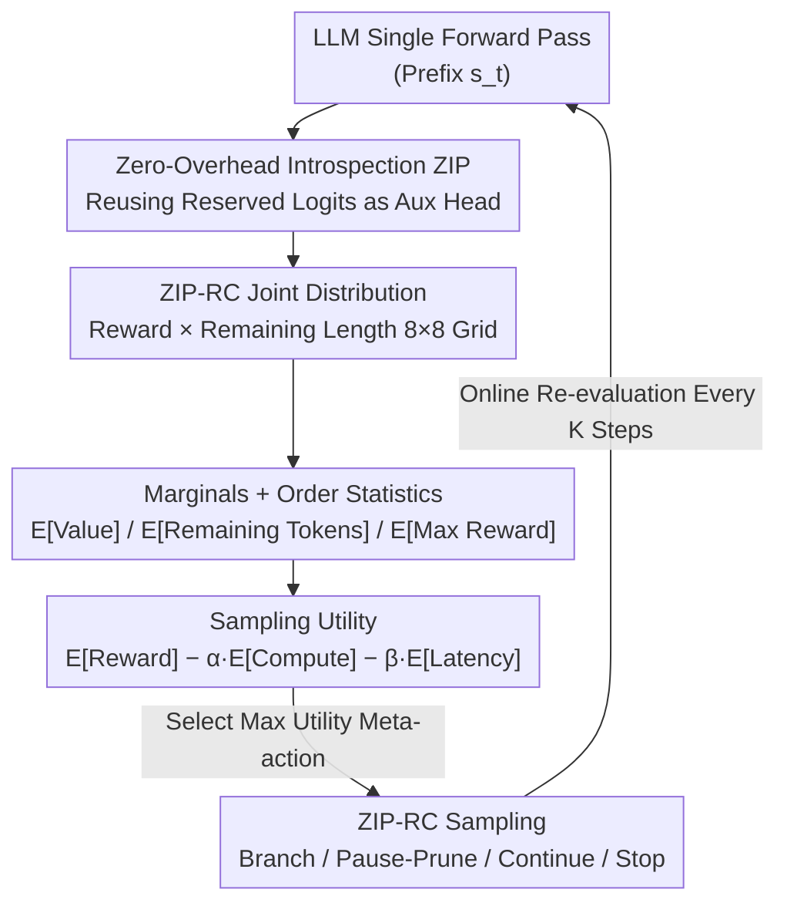

# Zero-Overhead Introspection for Adaptive Test-Time Compute

**Conference**: ICLR 2026  
**OpenReview**: [https://openreview.net/forum?id=GqZYGOYuF2](https://openreview.net/forum?id=GqZYGOYuF2)  
**Code**: TBD  
**Area**: LLM Inference / Test-Time Compute  
**Keywords**: Introspective Prediction, Reward-Cost Joint Distribution, Adaptive Test-Time Compute, Best-of-N, Sampling Utility

## TL;DR
ZIP-RC enables LLMs to **reuse unused reserved logits in the output head** during each decoding step to predict the joint distribution of "final reward × remaining length" with zero extra overhead. This distribution is used to optimize a "sampling utility" that balances quality, compute, and latency online, adaptively deciding when to sample more, prune, or stop—improving accuracy by up to 12% at equal or lower costs on mixed-difficulty math benchmarks.

## Background & Motivation

**Background**: Test-time scaling has become a mainstream method for enhancing LLM reasoning capabilities, with Best-of-N (BoN) being a typical example—sampling $N$ trajectories in parallel and selecting the best one via a verifier/reward model/majority vote. It gains performance through parallelism, as theoretically, larger $N$ allows for more thorough exploration.

**Limitations of Prior Work**: BoN suffers from two fatal "non-adaptive" issues. First, it treats all trajectories **equally until the end**, regardless of how hopeless a trajectory looks mid-way—wasting compute on easy problems and increasing latency on hard problems because "wall-clock time is determined by the longest trajectory." Second, obtaining confidence signals requires training an additional verifier or reward model, which means mounting an extra model and running additional forward passes, **effectively doubling inference costs**. Existing early-stopping/pruning methods (using a classifier's confidence score to cut weak samples) are a first step toward adaptivity, but they only provide a **scalar signal**.

**Key Challenge**: A scalar cannot characterize the truly critical **reward-cost trade-off** in the reasoning process—a low-confidence trajectory might still be worth keeping if it is nearly finished; conversely, a high-confidence trajectory might be inefficient if it requires generating thousands more tokens. Furthermore, a scalar cannot quantify the "marginal benefit of sampling one more instance," as this benefit depends on the entire reward **distribution** (especially variance) rather than just its expectation.

**Goal**: To enable models with true "introspection"—predicting their own **final success (reward)** and the **required resources (cost)** at every moment of generation to allocate compute effectively; meanwhile, this introspection mechanism itself must **not introduce any additional inference overhead**.

**Key Insight**: The authors observe that LLM output heads contain a set of **reserved/unused tokens**. These logits are masked during next-token prediction and do not participate in sampling. Why not let them "moonlight" to encode auxiliary predictions? In this way, auxiliary signals and next-token probabilities are computed in the **same forward pass**, requiring zero extra models, zero architectural changes, and zero extra forward passes.

**Core Idea**: Use reserved logits to encode the **joint distribution** of "reward × remaining length" (rather than a scalar), feed it into a sampling utility function that balances reward/compute/latency, and online select meta-actions to adaptively allocate test-time compute.

## Method

### Overall Architecture
The method consists of two layers. The bottom layer is **ZIP (Zero-overhead Introspective Prediction)**: a general mechanism that reinterprets a fixed segment of reserved token logits in the output head as parameters for an auxiliary predictor. Before sampling, the probability mass of these logits is masked, allowing the same forward pass to yield both the "decoding distribution over the vocabulary" and the "auxiliary prediction on reserved slots." Built upon ZIP is **ZIP-RC (reward-cost)**: instantiating the auxiliary prediction as a $B_V \times B_T$ grid modeling the joint distribution of "final expected reward" and "remaining generation length." The top layer is **ZIP-RC Sampling**: formalizing test-time compute as a meta-MDP (where the state is the prefix tree of all current partial generations and the meta-action is "selecting which prefixes to continue/branch"), using the ZIP-RC joint distribution to calculate a **sampling utility** in closed form, and selecting the meta-action that maximizes utility online—thereby adaptively balancing quality, compute, and latency.

The pipeline is a serial-plus-feedback structure: "reserved logits → joint distribution → marginals/order statistics → sampling utility → meta-action decision," as illustrated below:

### Key Designs

**1. ZIP: Transforming Reserved Logits into Zero-Overhead Auxiliary Heads**

Addressing the pain point "introspection doubles inference cost." ZIP's approach: let $V$ be the vocabulary, containing a fixed continuous set of reserved tokens $\mathcal{R}\subset V$ (typically 64 in the paper). At step $t$, the model outputs logits $z_t\in\mathbb{R}^{|V|}$. ZIP interprets the portion of $z_t$ corresponding to $\mathcal{R}$ as auxiliary predictor parameters. Before sampling the actual token, the probability mass of $\mathcal{R}$ is zeroed out, applying softmax only over $V\setminus\mathcal{R}$:

$$\pi_\theta(a_t\mid s_t)=\begin{cases}\dfrac{\exp(z_t[a_t])}{\sum_{v\in V\setminus\mathcal{R}}\exp(z_t[v])}, & a_t\in V\setminus\mathcal{R}\\[2mm] 0, & a_t\in\mathcal{R}\end{cases}$$

Thus, one forward pass simultaneously provides (i) the decoding distribution over $V\setminus\mathcal{R}$ and (ii) the auxiliary prediction read from $z_t[\mathcal{R}]$, the latter with **zero extra inference cost**. Why it works: next-token prediction would not sample reserved tokens anyway, so these logits were originally "wasted" capacity; ZIP simply requisitions their expressivity without changing the architecture or adding forward passes. During training, an auxiliary loss $\mathcal{L}_{\text{aux}}$ is applied (Cross-Entropy, MSE, or Bernoulli NLL), along with a KL term to keep the policy close to the frozen original policy $\pi$, preventing the requisitioned logits from damaging generation performance: $\mathcal{L}(s_t)=\mathcal{L}_{\text{aux}}(s_t)+\alpha_{\text{KL}}\,\mathrm{KL}(\pi_\theta(\cdot\mid s_t)\,\|\,\pi(\cdot\mid s_t))$. ZIP is **agnostic** to the prediction target itself; it merely standardizes how auxiliary predictions are produced with zero overhead during inference.

**2. ZIP-RC: Predicting the Joint Reward-Cost Distribution instead of a Scalar**

Addressing the pain point "scalar signals cannot characterize reward-cost trade-offs or quantify marginal benefits." ZIP-RC uses ZIP to predict two random variables starting from any prefix $s_t$ and finishing with policy $\pi$: expected terminal reward $Z^\pi(s_t)=\mathbb{E}[R(s_T)]$ and remaining length $L^\pi(s_t)=|s_T|-|s_t|$. The reward range is discretized into $B_V$ bins and the length into $B_T$ bins (e.g., 8×8). Each $(b,\ell)$ grid cell is assigned a reserved token with index $i_{b,\ell}=i_{\mathcal{R}}+(b-1)B_T+(\ell-1)$, then softmaxed into a joint distribution:

$$p_\theta(b,\ell\mid s_t)=\frac{\exp(z_t^{\text{aux}}(b,\ell))}{\sum_{b'}\sum_{\ell'}\exp(z_t^{\text{aux}}(b',\ell'))}$$

The training objective is Cross-Entropy $\mathcal{L}_{\text{aux}}(s_t)=-\log p_\theta(b^*,\ell^*\mid s_t)$ against the true bins $(b^*,\ell^*)$. A critical and counter-intuitive choice is: the reward axis models the **estimated value** $\hat V(s_T)$ (provided by a critic) rather than the actual 0/1 reward $R(s_T)$. This is because (i) it aligns with BoN’s true selection target ($\arg\max_i \hat V(s_T^{(i)})$), and (ii) while actual environment rewards are not necessarily independent, their expectations $V(s_T)$ can be treated as such, allowing order statistics like "expected maximum reward" to be computed in closed form. From the joint distribution, two interpretable signals can be marginalized: expected value $V^\pi(s_t)\approx\sum_b \frac{v_b+v_{b+1}}{2}q^V_\theta(b\mid s_t)$ (for confidence) and expected remaining tokens $\mathbb{E}[L^\pi(s_t)]\approx\sum_\ell \frac{t_\ell+t_{\ell+1}}{2}q^L_\theta(\ell\mid s_t)$ (for "thinking-time" signals). Why it works: Having the **entire distribution** allows for variance calculation—when the predicted reward variance is high, multiple sampling can significantly raise the expected maximum reward; when variance is low (one trajectory clearly dominates), further sampling is wasteful.

**3. Sampling Utility: Turning Test-Time Compute into Closed-Form Resource Allocation**

Addressing the pain point "previous pruning relied on heuristic thresholds without optimizing success and cost on principle." The authors formalize test-time search as a meta-MDP: the meta-state is the **prefix tree** of partial generations, and the meta-action decides which prefixes to continue/branch (unselected ones are **paused**, not discarded). The meta-reward is "final correctness of the best answer − generation cost," where cost includes both **total compute** (sum of tokens) and **latency** (depth of the longest trajectory), weighted by coefficients $\alpha, \beta$. Since the optimal meta-policy is intractable, a **sampling utility** approximates the optimal value function—evaluating a specific strategy of rolling out from the current candidates but being able to pause them at optimized future moments. Essentially, it balances "the marginal gain of an extra sample (finding a higher reward answer)" against "the compute and time spent." Because ZIP-RC provides a joint distribution, order statistics such as expected maximum reward and expected latency under a given pause schedule can be **calculated in closed form** with negligible CPU overhead. The sampling loop runs as a meta-policy: every fixed number of steps, it evaluates several candidate meta-actions (pausing weak samples / branching strong samples / maintaining status quo) and executes the one with the maximum utility. Formally, utility takes the form $E[\text{Reward}]-\alpha\,E[\text{Compute}]-\beta\,E[\text{Latency}]$; ⚠️ refer to original Appendix A.1/A.2 for full derivations. Why it works: It upgrades BoN's "fixed budget blind sampling" to "online, state-dependent dynamic allocation"—automatically sampling more for hard problems/weak models and pruning early for easy problems/strong models.

### Loss & Training
Training data: Combined DeepScaleR + MATH training set + GSM8K training set. For each prompt, 2 on-policy rollouts were sampled per model, totaling ~100k samples; correctness was labeled by ground-truth to train model-specific ZIP-RC predictors. The loss is the auxiliary Cross-Entropy + Policy KL (Eq. 3). $\alpha$ controls compute vs. latency (0.1 favors latency, 1.0 favors compute), and $\beta$ is similar to $N$ in BoN—increasing it swaps generation cost for higher performance.

## Key Experimental Results

Models used: Qwen3-1.7B (reasoning mode), LFM2-1.2B Math, and LFM2-350M Math. Benchmarks: AIME 2024 / AMC 2023 / MATH-500 / GSM8K, plus a "Mixed" benchmark (detecting adaptive allocation across difficulties). Metrics include accuracy, normalized compute (2N FLOPs rule, counting KV cache), and normalized optimal latency (serial forward passes of the longest trajectory). Generation cost is defined as $\text{GenCost}=\alpha\cdot\text{NormCompute}+(1-\alpha)\cdot\text{NormLatency}$.

### Main Results: Accuracy Comparison at Equal Cost (α=0.1)

The table below shows accuracy for Qwen3-1.7B across benchmarks when matching generation cost (ZIP-RC uses β=0.01, caps at 8 samples):

| Method | Gen Cost | AIME2024 | AMC2023 | MATH-500 | GSM8K | Mixed |
|------|---------|----------|---------|----------|-------|------|
| **ZIP-RC Sampling (Ours)** | 1.43 | **65.8** | **90.9** | **94.1** | **92.2** | **92.2** |
| Majority Vote (MV) | 1.40 | 53.1 | 87.9 | 93.0 | 91.2 | 91.0 |
| MV + Length Pruning | 1.46 | 25.1 | 58.5 | 84.7 | 91.6 | 88.0 |
| Weighted BoN (Ext. RM) | 1.43 | 54.7 | 86.5 | 92.6 | 91.4 | 91.0 |
| Weighted BoN (Self-eval GenRM) | 1.40 | 59.4 | 89.1 | 93.6 | 91.6 | 91.6 |
| ZIP-RC reward pruning (Ablation) | 1.33 | 43.3 | 86.0 | 90.3 | 89.6 | 88.9 |

On the hardest AIME 2024, ZIP-RC outperforms MV by **12.7 pts** (65.8 vs 53.1) at lower cost and significantly exceeds both Weighted BoN versions. Conclusions are consistent across model sizes: on LFM2-350M, ZIP-RC raises Mixed benchmark accuracy from 68.8 (MV) to 74.1, while reducing cost (1.49 vs. 1.70, ~40% relative reduction).

### Prediction Accuracy & Ablation

ZIP-RC's auxiliary prediction must be reliable. The table below shows prediction quality (Joint distribution measured by Total Variation at generation start; reward prediction via threshold 0.5 at end):

| Model | Start TV (lower better) | F1 | Accuracy | Error Recall |
|------|----------------------|----|--------|--------------|
| Qwen3-1.7B | 0.46 | 0.91 | 0.88 | 0.82 |
| LFM2-1.2B | 0.45 | 0.91 | 0.87 | 0.69 |
| LFM2-350M | 0.48 | 0.80 | 0.82 | 0.87 |

Critical ablation: "**ZIP-RC reward pruning**"—using the same ZIP-RC signals but simply cutting weak samples based on an expected reward threshold (0.4) **without utility optimization**. This version performs lower than full ZIP-RC across all models (e.g., AIME 43.3 vs 65.8), proving that gains come from "joint distribution + utility optimization" principled decisions rather than just having a real-time signal. "MV + Length Pruning" failed on AIME/AMC (25.1 / 58.5), showing that ZIP-RC's latency gains are not from crude termination of infinite loops.

### Key Findings
- **Utility optimization is the main driver**: Removing utility and pruning solely by reward thresholds (reward pruning ablation) leads to significant drops, especially on hard problems. This confirms that "joint distribution + order statistics" is far superior to a "scalar threshold."
- **Adaptive allocation actually happens**: ZIP-RC automatically samples more for hard problems (AIME/AMC) and weak models, while aggressively pruning early for easy problems/strong models—most evident in the Mixed benchmark.
- **Tunable Pareto Frontier**: $\alpha$ controls compute vs. latency, while $\beta$ acts like BoN's $N$. Sweeping these coefficients yields a smooth Pareto front that strictly dominates MV; it saturates at pass@8 due to the 8-sample limit.
- **Well-calibrated**: Start joint distribution TV ≈ 0.45–0.48 and final reward F1 up to 0.91 indicate that "tagging along in the same forward pass" does not sacrifice prediction reliability.

## Highlights & Insights
- **"Zero-Overhead" is truly zero-overhead**: Reusing masked reserved/unused logits as auxiliary heads avoids extra models, forward passes, or architecture changes—a far more elegant solution than "training a verifier and doubling inference cost."
- **Evolution from scalar to distribution is the core cognitive upgrade**: Only with the full reward distribution (especially variance) can order statistics like "expected maximum reward" and "expected latency" be calculated in closed form to answer "is an extra sample worth it." Modeling estimated value $\hat V(s_T)$ rather than actual rewards is a clever detail to align with BoN targets and ensure closed-form statistics.
- **Reasoning as a Resource Allocation Problem**: The meta-MDP framework + sampling utility shifts "test-time compute" from a static budget to dynamic online scheduling, a transferable concept for any parallel sampling + selection scenario (e.g., code generation, agent exploration).
- **Generality of auxiliary heads**: ZIP is agnostic to targets; reward-cost is just one instance. The same "requisitioning reserved logits" idea can be used for any token-level auxiliary prediction (confidence, difficulty, tool-calling signals, etc.).

## Limitations & Future Work
- **Dependency on sampling diversity**: Gains rely on the LLM's ability to sample diverse trajectories. If new samples are identical to old ones, ZIP-RC (and any BoN-like method) cannot further boost performance. The authors list "enhancing test-time sample diversity" (e.g., hybrid prompts or models) as a key future direction.
- **Reward axis depends on a critic $\hat V$**: The joint distribution models estimated value rather than ground truth rewards. Bias/calibration issues in the critic propagate into utility calculations. Performance on types of problems outside the training distribution (100k rollouts) needs more evaluation.
- **Validated only on math reasoning**: All experiments were conducted on math benchmarks; whether this generalizes to code, open-domain QA, or agents where rewards are harder to define remains to be verified.
- **Saturation at 8-sample limit**: Performance saturates at the pass@8 level; behavior under much larger-scale parallelism requires further validation.
- ⚠️ The full closed-form expressions for sampling utility and meta-MDP derivations are in the original Appendix (A.1/A.2). The main text provides a high-level overview. Implementation details like coefficient normalization and search space pruning should follow the original paper.

## Related Work & Insights
- **vs Best-of-N / Weighted BoN**: BoN uses fixed budget blind sampling and runs every trajectory to completion. Ours uses real-time joint distributions to decide pause/branch/continue, achieving higher accuracy at equal cost (+12% on AIME) while saving compute and latency. Weighted BoN doubles FLOPs via external RMs; ZIP-RC is zero-overhead.
- **vs Scalar Confidence Pruning** (Fu et al. 2025, Manvi et al. 2024): These use scalar scores + heuristic thresholds and cannot characterize reward-cost trade-offs or quantify marginal gains. Our ablation (reward pruning) proves "distribution + utility" is superior to "scalar threshold."
- **vs Process Reward Models (PRM)**: PRMs are often used for training signals or step-wise scoring. This paper turns process-level signals into **direct inference control knobs** (utility-aware inference) rather than just training supervision.
- **vs Reusing logits as rewards** (Ren et al. 2023): This work advances the "introspection" direction by upgrading from scalar correctness prediction to predicting the joint distribution of future reward and future cost at every token.
- **Complementary to speculative decoding**: While speculative decoding speeds up token-level generation, this work optimizes trajectory/search-level allocation. They are orthogonal and stackable.

## Rating
- Novelty: ⭐⭐⭐⭐⭐ "Reusing reserved logits for zero-overhead introspection" + "predicting reward-cost joint distributions" + "meta-MDP sampling utility" is a highly imaginative combination.
- Experimental Thoroughness: ⭐⭐⭐⭐ Three model sizes × five benchmarks + prediction accuracy verification + strong ablation (reward pruning) is solid, though limited to math and 8-sample caps.
- Writing Quality: ⭐⭐⭐⭐ Clear motivation and Fig. 1 visualizes the mechanism well. Utility derivations being in the appendix makes the main text slightly abstract.
- Value: ⭐⭐⭐⭐⭐ Zero-overhead + adaptive efficiency gains in compute/latency provide direct value for test-time scaling in the era of "reasoning models."

<!-- RELATED:START -->

## Related Papers

- [\[ICLR 2026\] Strategic Scaling of Test-Time Compute: A Bandit Learning Approach](strategic_scaling_of_test-time_compute_a_bandit_learning_approach.md)
- [\[ICLR 2026\] T1: Tool-Integrated Verification for Test-Time Compute Scaling in Small Language Models](t1_tool-integrated_verification_for_test-time_compute_scaling_in_small_language_.md)
- [\[ICLR 2026\] Mode-conditioning unlocks superior test-time compute scaling](mode-conditioning_unlocks_superior_test-time_compute_scaling.md)
- [\[ICLR 2026\] e3: Learning to Explore Enables Extrapolation of Test-Time Compute for LLMs](e3_learning_to_explore_enables_extrapolation_of_test-time_compute_for_llms.md)
- [\[ICLR 2026\] ROC-n-Reroll: How Verifier Imperfection Affects Test-Time Scaling](roc-n-reroll_how_verifier_imperfection_affects_test-time_scaling.md)

<!-- RELATED:END -->
