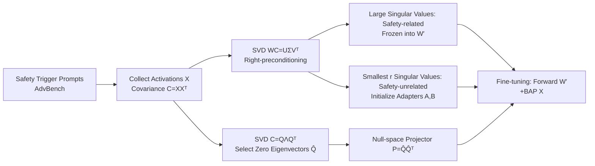

# A Guardrail for Safety Preservation: When Safety-Sensitive Subspace Meets Harmful-Resistant Null-Space

**Conference**: ICLR 2026  
**OpenReview**: [https://openreview.net/forum?id=887vde4ZAW](https://openreview.net/forum?id=887vde4ZAW)  
**Code**: To be confirmed  
**Area**: LLM Safety / Safety Alignment Maintenance / Parameter-Efficient Fine-Tuning  
**Keywords**: Safety Alignment, Fine-tuning Safety, LoRA, Subspace Decomposition, Null-space Projection

## TL;DR
GuardSpace utilizes a two-stage guardrail—"covariance-preconditioned SVD to isolate and freeze safety-related weights + null-space projection to constrain adapter updates"—ensuring that LLMs lose almost no safety alignment during downstream fine-tuning while slightly improving downstream accuracy.

## Background & Motivation
**Background**: Aligned LLMs (GPT-4, Llama, etc.) learn refusal behaviors for malicious instructions through SFT/RLHF. However, in practical deployment, engineers often use full fine-tuning or LoRA to adapt models to downstream tasks.

**Limitations of Prior Work**: Safety alignment is extremely fragile during the fine-tuning stage—**even if the fine-tuning data is entirely harmless or only a few parameters are trained using LoRA, the original refusal behavior can be easily compromised**, leading the model to provide harmful answers to prompts such as "how to make a bomb."

**Key Challenge**: Existing defenses are categorized into three stages: alignment-time, fine-tuning-time, and post-fine-tuning. Alignment-time and post-fine-tuning methods struggle to balance safety and downstream performance; meanwhile, existing fine-tuning-time methods **fail to explicitly identify which weight components are safety-related and which update directions are harmful**, thus failing to resolve the training conflict between "preserving safety" and "preserving task performance."

**Goal**: To preserve safety alignment throughout the low-rank adaptation process without sacrificing (and potentially improving) downstream task accuracy.

**Core Idea**: **Explicit Separation + Dual Constraints**—first, decompose pre-trained weights into "safety-related" and "safety-unrelated" components, allowing only the safety-unrelated parts to be learnable; then, use a null-space projector to constrain adapter updates within a subspace that "exerts zero influence on harmful inputs," ensuring the output for harmful prompts remains unchanged regardless of how the adapter is trained.

## Method

### Overall Architecture
Before fine-tuning, GuardSpace feeds a set of "safety trigger prompts" (harmful prompts from AdvBench) into the aligned model to collect input activations $X$ and calculate the covariance $C = XX^\top$ for each linear layer. Two actions are taken based on $C$: first, $C$ is used as a right-preconditioner for SVD of the weights to freeze safety-related components and use safety-unrelated components to initialize low-rank adapters; second, the null-space of $C$ is computed to construct a projector that constrains adapter updates. The combination of these two stages forms the "guardrail" protecting safety alignment.

### Key Designs

**1. Safety-Sensitive Subspace Initialization: Isolate and freeze safety weights using covariance-preconditioned SVD.** Standard SVD only considers the energy distribution of the weights $W$ and cannot distinguish which directions are responsible for safety. This paper follows the intuition that "right-preconditioning highlights capabilities related to $C$" and performs SVD on $WC$: $\text{SVD}(WC) = U\Sigma V^\top = \sum_i \sigma_i u_i v_i^\top$. Since $C$ originates from safety trigger prompt activations, **the components corresponding to large singular values $\sigma_i$ dominate the model's safety capability for harmful inputs, while small singular value components contribute minimally.** To ensure initialization does not alter the pre-trained model's output, weights are reconstructed as $\hat{W} = \text{SVD}(WC)C^{-1} = U\Sigma(V^\top C^{-1})$ (adaptive diagonal loading is used if $C$ is non-invertible). By freezing large singular value components to preserve safety, the safety-unrelated components corresponding to the **smallest $r$ singular values** are split into two adapters: $B = U[:,-r:]\sqrt{\Sigma[-r:]}$ and $A = \sqrt{\Sigma[-r:]}(V^\top C^{-1})[-r:,:]$. Compared to LoRA's zero initialization, starting from $BA$ (the safety-stripped pre-trained weights) allows for faster and better learning of new tasks.

**2. Harmful-Resistant Null-Space Optimization: Making adapter updates "invisible" to harmful inputs.** Even with correct initialization, once adapters are updated during fine-tuning, the output activations for harmful prompts may drift, damaging safety mechanisms. This paper performs SVD on the covariance of the same safety trigger prompts: $\text{SVD}(C) = Q\Lambda Q^\top$. Since $C$ is positive semi-definite, $\lambda_i \ge 0$. **Eigenvectors corresponding to non-zero eigenvalues are discarded, and only $\hat{Q}$ (eigenvectors with zero eigenvalues) are kept** to construct the projector $P = \hat{Q}\hat{Q}^\top$, which maps any matrix into the null-space of $C$. Lemma 1 in the paper proves that $C=XX^\top$ shares the same left null-space as the harmful activations $X$. Therefore, applying $P$ to the adapter product $BA$ maps $BA$ into the null-space of $X$. By adjusting the frozen weights $W' = W - BAP$, for any trained adapter $B^*A^*$, the equality $(W' + B^*A^*P)X = W'X,\ X\in H$ holds—**output activations for harmful inputs remain unchanged under adapter updates** (formal proof provided in Lemma 2), preserving the original model's refusal behavior. As long as the harmful prompt space $H$ covers sufficient malicious patterns, the null-space constraint generalizes to unseen harmful data.

**3. Constrained Optimization Perspective of Safety-Preserving Fine-tuning.** The problem is formulated as constrained optimization: $\min_\Delta \mathcal{L}_{\text{task}}(f_{W+\Delta};D)$, s.t. $\|f_{W+\Delta}(x) - f_W(x)\| \le \epsilon,\ \forall x\in H$. Design 1 places trainable capacity in safety-insensitive directions (softening conflict), and Design 2 strictly enforces the $\epsilon$ constraint via null-space (canceling harmful direction perturbations at first order). Together, they approximate the constrained optimal solution.

## Key Experimental Results

### Main Results (Llama-2-7B-Chat, Multiple Datasets, p=0.10 harmful sample ratio)
Lower HS↓ is better, higher FA↑ is better:

| Method | SST2 HS↓/FA↑ | AGNEWS | GSM8K | Dialog Sum | Avg HS↓ | Avg FA↑ |
|---|---|---|---|---|---|---|
| Base Model | 4.40/26.26 | 4.40/66.30 | 4.40/13.00 | 4.40/32.90 | 4.40 | 34.62 |
| LoRA | 48.00/94.50 | 17.60/84.30 | 56.00/23.80 | 50.80/48.21 | 43.10 | 62.70 |
| AsFT (SOTA) | 6.00/93.32 | 4.00/84.30 | 14.40/26.00 | 8.00/47.50 | 8.10 | 62.78 |
| SABT | 7.20/91.74 | 14.00/80.70 | 4.00/21.80 | 6.00/48.40 | 7.80 | 60.66 |
| **GuardSpace** | **1.20/95.64** | **2.40/85.60** | **3.60/28.00** | **3.60/48.20** | **2.70** | **64.36** |

GuardSpace reduces average HS from the SOTA's 8.10% to 2.70% (lower than the base's 4.40%), while improving average FA from 62.78% to 64.36%.

### Cross-model generalization (GSM8K, Average of 5 Models)

| Method | Avg HS↓ | Avg FA↑ |
|---|---|---|
| LoRA | 53.50 | 60.80 |
| AsFT | 13.20 | 62.50 |
| **GuardSpace** | **7.60** | **64.60** |

Across Qwen-2-7B / Gemma-2-9B / Mistral-7B / Llama-3.1-8B, HS is consistently the lowest or near-lowest, and FA remains competitive.

### Ablation Study (Llama-2-7B-Chat, GSM8K)

| Configuration | HS↓ | FA↑ |
|---|---|---|
| Full GuardSpace | 3.60 | 28.00 |
| w/o Subspace Init | 5.20 (+1.60) | 26.20 |
| w/o Null-space Projector | 52.00 (≈14.4×) | 28.60 |

### Key Findings
- **Null-space Projector is the primary engine for safety**: Removing it causes HS to surge from 3.60% to 52.00% (approx. 14.4x), while FA remains nearly constant.
- **Subspace Initialization exchanges minimal utility for safety**: Removing it increases HS by 1.6% and decreases FA by only 1.8%.
- **Robustness against Poisoning**: As the harmful sample ratio $p$ increases from 0 to 0.20, most baselines show significant safety drift (LoRA HS rises from 8.8% to 60%, AsFT from 2.4% to 20.8%). GuardSpace's HS remains stable and low (avg 2.56%) with the highest average FA (25.88%).

## Highlights & Insights
- **Geometric isolation of "Safety" from weights**: Using covariance-preconditioned SVD to map singular values directly to "safety relevance" turns an abstract safety preservation problem into a concrete subspace partitioning task.
- **Null-space projection provides first-order safety guarantees**: The equation $(W'+B^*A^*P)X = W'X$ means that regardless of adapter training, output for harmful inputs remains static at the first order—a hard constraint that is more reliable than soft regularization, as evidenced by the 14x gap in the ablation.
- **Safety and utility are no longer zero-sum**: GuardSpace does not degrade safety (HS is lower than base) and actually improves downstream accuracy, as the safety-unrelated subspace initialization provides a better optimization starting point than zero initialization.

## Limitations & Future Work
- **Reliance on coverage of safety trigger prompts**: The generalization of the null-space projector assumes the sampled harmful prompts $H$ cover enough malicious patterns; it is sensitive to the sampling dataset and volume.
- **Null-space existence assumption**: The method relies on $C$ having a non-trivial null-space (rank deficiency in activation covariance). If activations are nearly full-rank in certain layers, the available null-space dimensions might be small.
- **Pre-processing costs of SVD and inversion per layer**: The initialization stage requires covariance SVD and $C^{-1}$ calculations for every layer, which introduces overhead for large models.
- **Focus on fine-tuning stage only**: The method does not address robustness against explicit inference-time jailbreak attacks.

## Related Work & Insights
- **vs. Fine-tuning-time Defenses (AsFT, SaLoRA, Lisa)**: These rely on safety data injection or regularizing harmful directions without explicitly isolating safety weights; GuardSpace separates safety components at initialization and enforces hard null-space constraints.
- **vs. Post-fine-tuning Repair (Safe LoRA)**: Post-repair methods project or reuse safety weights after alignment is lost; GuardSpace prevents safety degradation from the start.
- **Methodological Lineage**: Covariance right-preconditioned SVD stems from work highlighting task capabilities in weight decomposition (Yang et al. 2024b/2025b). Null-space constraints adapt the idea of "projecting gradients to the null-space of old tasks" from continual learning to "safety preservation," representing a clever cross-domain application.

## Rating
- **Novelty**: ⭐⭐⭐⭐ — The combination of covariance-preconditioned SVD for subspace separation and null-space projection for update constraints is novel, effectively migrating continual learning concepts to the safety domain.
- **Experimental Thoroughness**: ⭐⭐⭐⭐ — Tested across 5 models, 4 datasets, and multiple poisoning ratios against 8 baselines with clear ablation studies.
- **Writing Quality**: ⭐⭐⭐⭐ — Clear logical flow from motivation to formal proof; geometric intuitions for components are well-explained.
- **Value**: ⭐⭐⭐⭐ — Addresses a critical pain point in LLM deployment; the plug-and-play nature for LoRA with safety/utility wins makes it highly practical.

<!-- RELATED:START -->

## Related Papers

- [\[ICLR 2026\] ProSafePrune: Projected Safety Pruning for Mitigating Over-Refusal in LLMs](prosafeprune_projected_safety_pruning_for_mitigating_over-refusal_in_llms.md)
- [\[ICLR 2026\] The Alignment Waltz: Jointly Training Agents to Collaborate for Safety](the_alignment_waltz_jointly_training_agents_to_collaborate_for_safety.md)
- [\[ICLR 2026\] SOSBench: Benchmarking Safety Alignment on Six Scientific Domains](sosbench_benchmarking_safety_alignment_on_six_scientific_domains.md)
- [\[ICLR 2026\] Teach to Reason Safely: Policy-Guided Safety Tuning for MLRMs](teach_to_reason_safely_policy-guided_safety_tuning_for_mlrms.md)
- [\[ICLR 2026\] ManagerBench: Evaluating the Safety-Pragmatism Trade-off in Autonomous LLMs](managerbench_evaluating_the_safety-pragmatism_trade-off_in_autonomous_llms.md)

<!-- RELATED:END -->
