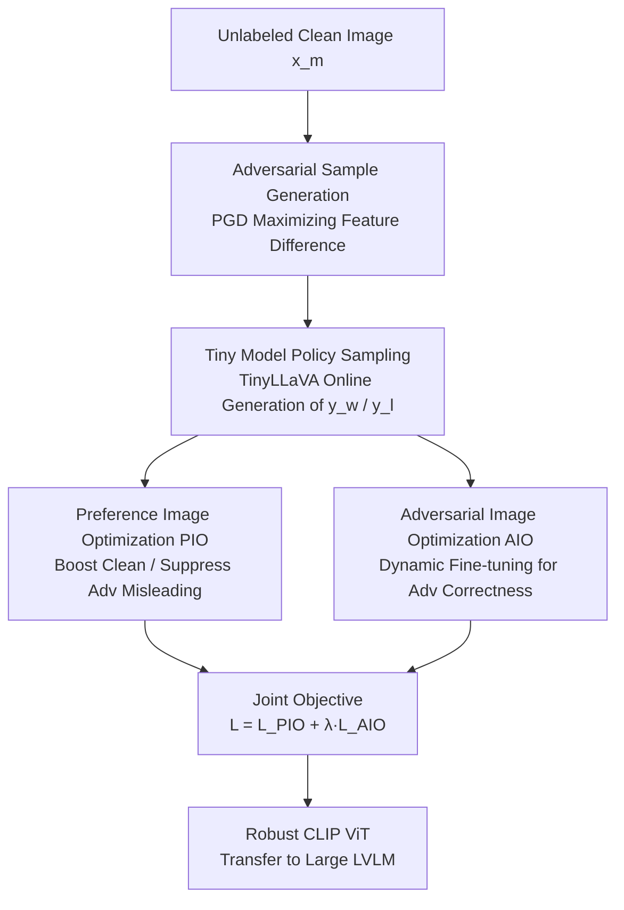

# AdPO: Enhancing the Adversarial Robustness of Large Vision-Language Models with Preference Optimization

**Conference**: ICLR2026  
**OpenReview**: [https://openreview.net/forum?id=FEMv4lHJ2C](https://openreview.net/forum?id=FEMv4lHJ2C)  
**Code**: To be confirmed  
**Area**: Multimodal VLM / Adversarial Robustness / Preference Optimization  
**Keywords**: Large Vision-Language Models, Adversarial Defense, Preference Optimization, DPO, CLIP Image Encoder

## TL;DR
AdPO is the first to reformulate the adversarial training of Large Vision-Language Models (LVLMs) as a preference optimization problem. By ensuring the model "prefers" correct outputs on clean images and "rejects" misleading outputs on adversarial images, and by fine-tuning only the CLIP image encoder, the method transfers from small models to large ones. This significantly improves adversarial robustness with almost no degradation in clean performance.

## Background & Motivation
**Background**: LVLMs (e.g., LLaVA, Qwen2.5-VL) are generally composed of a "pre-trained image encoder (CLIP ViT) + projection layer + LLM." The image encoder is responsible for aligning image features into the language model's input space and is critical to performance. However, it also inherits the vulnerability of visual neural networks to adversarial perturbations—injecting noise nearly imperceptible to the human eye can cause the model to produce incorrect or even malicious outputs.

**Limitations of Prior Work**: Existing solutions to enhance LVLM adversarial robustness fall into two categories. One is **multimodal contrastive learning** (TeCoA, FARE), which aligns adversarial image features with text/clean image features to obtain a robust encoder; this is computationally efficient but only performs coarse-grained alignment. The other is **generative pre-training**, which uses the full LVLM for fine-grained alignment but suffers from poor generalization and significantly reduces clean performance. Both categories fail to escape the trade-off between adversarial robustness and clean performance: either the model is robust but clean performance drops, or clean performance is maintained but robustness is insufficient.

**Key Challenge**: Traditional adversarial fine-tuning essentially imposes a "single-target constraint"—optimizing only to "not make mistakes under adversarial input" without explicitly preserving "correct output under clean input," resulting in sacrificed clean performance.

**Key Insight**: The authors noted that the objective of adversarial training (improving robustness while maintaining clean performance) is naturally isomorphic to preference optimization (DPO: increasing the probability of preferred samples and decreasing that of non-preferred samples). If the "correct interpretation of a clean image" is treated as the preferred sample $y_w$ and the "misleading interpretation of an adversarial image" as the non-preferred sample $y_l$, a single relative preference objective can manage both ends simultaneously.

**Core Idea**: Replace single-target adversarial fine-tuning with preference optimization (DPO framework), making the model simultaneously prefer clean outputs and reject adversarial guidance. Only the CLIP ViT parameters are updated, trained on a lightweight LVLM, and then transferred to larger models.

## Method

### Overall Architecture
AdPO reformulates adversarial training into a DPO-style preference optimization problem. The pipeline is as follows: given an unlabeled clean image $x_m$, PGD is first used to generate an adversarial image $x_{adv}$ (maximizing the encoding feature difference between the adversarial and clean images). Then, a lightweight TinyLLaVA is used to online generate interpretation texts for both the clean and adversarial images, serving as the preferred sample $y_w$ and non-preferred sample $y_l$, respectively. Two complementary objectives are then used for joint optimization: **Preference Image Optimization (PIO)** is responsible for "increasing clean output and suppressing adversarial misleading" to preserve clean performance; **Adversarial Image Optimization (AIO)** is responsible for "explicitly encouraging correct answers even under adversarial input" to compensate for robustness weaknesses. The entire training only updates the parameters of the CLIP ViT, resulting in a robust image encoder that can be used plug-and-play in larger models such as LLaVA-1.5-7B.

### Key Designs

**1. Online Preference Pair Construction: Reformulating Adversarial Training as DPO**

Traditional offline DPO requires existing "win/loss" annotation pairs, which are unavailable in adversarial training. AdPO extends DPO from an offline to an online setting: the policy model is directly queried for both clean and adversarial images (e.g., "What is in the image?"). The two generated interpretations are treated as the preference pair—the interpretation of the clean image is the preferred response $y_w$, and the interpretation of the adversarial image is the non-preferred response $y_l$. This step completely eliminates reliance on image annotations and CLIP text encoders, allowing generalization to unseen datasets. Notably, it does not assume the negative sample is "always wrong": the core of DPO is a relative objective. When positive and negative samples are indistinguishable (e.g., the perturbation is too weak), no relative preference exists, and the model does not update, making training stable across different attack strengths. The target for generating the adversarial image is $x_{adv}=\arg\max_{\|x_{adv}-x_m\|_\infty\le\varepsilon}\|\phi(x_{adv})-\phi_{org}(x_m)\|_2^2$, which iteratively maximizes the distance between encoded features of adversarial and clean images using PGD within an $\ell_\infty$ ball.

**2. Preference Image Optimization (PIO): Using Relative Objectives to Preserve Clean Performance and Suppress Misleading**

This is specifically designed to address the "adversarial fine-tuning sacrificing clean performance" pain point. PIO introduces the DPO objective into multimodal adversarial scenarios: the preferred term uses the correct interpretation $y_w$ on the clean image $x_m$, and the non-preferred term uses the misleading interpretation $y_l$ on the adversarial image $x_{adv}$. The objective is written as:

$$L_{PIO}(\pi_\theta;\pi_{ref})=-\mathbb{E}\Big[\log\sigma\Big(\beta\log\tfrac{\pi_\theta(y_w|x_m,x_{text})}{\pi_{ref}(y_w|x_m,x_{text})}-\beta\log\tfrac{\pi_\theta(y_l|x_{adv},x_{text})}{\pi_{ref}(y_l|x_{adv},x_{text})}\Big)\Big]$$

Compared to single-target methods that only suppress adversarial output, here "boosting clean" and "suppressing adversarial misleading" are tied into the same relative objective. Consequently, clean performance is preserved almost entirely while enhancing robustness (qualitative results in Figure 1 of the paper show clean metrics significantly leading all baselines). Using the model's own generated text as labels also mitigates distribution shifts, similar to semi-supervised learning, and focuses attention on the adversarial image itself.

**3. Adversarial Image Optimization (AIO): Using Dynamic Fine-tuning to Explicitly Force Correctness Under Attack**

While PIO preserves clean performance, robustness remains insufficient for two reasons: first, multimodal DPO is easily dominated by pure linguistic preferences, causing the model to ignore visual conditions (the "unconditional preference" failure mode leading to hallucinations); second, the PIO objective only ensures "correctness under clean conditions and rejection of misleading under adversarial conditions" without **explicitly** requiring "correct answers even when adversarial perturbations exist." AIO fills this gap. The simplest approach would be SFT on adversarial images: $L_{SFT}=-\mathbb{E}[\log\pi_\theta(y_w|x_{adv},x_{text})]$, but SFT is prone to overfitting and harms generalization. AdPO instead uses **dynamic fine-tuning**, weighting the loss by the model's own token-level confidence:

$$L_{AIO}(\pi_\theta)=-\mathbb{E}\Big[\sum_{t}\mathrm{sg}\big(\pi_\theta(y_w^t|y_w^{<t},x_{adv},x_{text})\big)\log\pi_\theta(y_w^t|y_w^{<t},x_{adv},x_{text})\Big]$$

where $\mathrm{sg}(\cdot)$ is the stop-gradient operator. It assigns higher weights to high-confidence predictions, thereby explicitly enhancing adversarial robustness while minimizing the impact on generalization. The final AdPO objective is the joint of both: $L_{AdPO}=L_{PIO}+\lambda L_{AIO}$, where $\lambda$ balances the two (default is 1).

**4. Small Model Training + Transfer: Eliminating the Cost of Tuning LLMs**

Training complete LVLMs like LLaVA-7B directly is expensive. AdPO builds a lightweight **TinyLLaVA** (CLIP ViT-L/14 + OpenELM-450M-Instruct), performing adversarial training only on the small model and updating only the CLIP ViT parameters. The trained robust image encoder is then transferred to large models such as LLaVA-1.5-7B as a plug-and-play component. This efficiency is comparable to previous CLIP-based methods, mitigates the risk of overfitting during evaluation, and ensures a fair comparison with existing CLIP-based methods (as neither has access to the final language model).

### Loss & Training
Training is conducted on ImageNet (images only, no class labels, online learning); adversarial perturbations use 10-step PGD with $\ell_\infty$ norm and radius $\varepsilon=2/255$; $\lambda=1$, preference parameter $\beta=0.1$; AdamW optimizer with weight decay 1e-4, learning rate 1e-5, batch size 128, and training for 2 epochs.

## Key Experimental Results

### Main Results
Clean and adversarial performance under untargeted attacks were compared on COCO / Flickr30k (CIDEr) and TextVQA / VQAv2 (VQA accuracy), with LLaVA-1.5-7B as the evaluation model:

| Dataset | Metric | CLIP (Orig) | AdvSimplex | AdPO |
|---------|--------|-------------|------------|------|
| COCO | clean | 115.5 | 111.5 | **115.3** |
| COCO | ℓ∞ 4/255 | 3.1 | 32.6 | **47.6** |
| Flickr30k | clean | 77.5 | 72.5 | **75.9** |
| Flickr30k | ℓ∞ 4/255 | 1.0 | 18.9 | **27.9** |
| TextVQA | ℓ∞ 4/255 | 0.0 | 10.0 | **17.6** |
| VQAv2 | ℓ∞ 4/255 | 0.0 | 26.1 | **37.6** |

The clean performance of AdPO is nearly identical to the original CLIP (COCO 115.3 vs 115.5), whereas all baselines show a significant drop. Simultaneously, adversarial robustness achieves SOTA across all tasks. Despite being trained on a 2/255 budget, it maintains its lead on unseen 4/255 perturbations, demonstrating good generalization from weak to strong attacks.

Targeted attack ($\varepsilon=4/255$, lower ASR is better):

| Metric | CLIP | FARE | AdvSimplex | AdPO |
|--------|------|------|------------|------|
| Mean ASR | 100% | 3% | 3% | **0%** |

AdPO reduces the targeted attack success rate to 0%, compared to 100% for the original CLIP.

### Ablation Study

| Configuration | Observation | Explanation |
|---------------|-------------|-------------|
| DPO variants (IPO/KTO/StepDPO) | Good performance | AdPO is a general preference framework not bound to a specific algorithm. |
| DPO variant (SimPO) | Relatively worse | Likely due to the removal of the reference model. |
| Multiple attacks (C&W/sC&W/BIM/CroPA/Verbose) | Remains robust | Includes attacks specifically designed for LVLMs. |
| λ value 0→1.5 | Clean stays constant; Adv rises with λ | Clean performance is insensitive to AIO; λ≈1 is optimal. |

### Key Findings
- **PIO governs clean performance, while AIO governs robustness**: The λ sweep shows that clean performance is largely insensitive to AIO, while increasing λ significantly improves adversarial robustness, validating that the two objectives fulfill distinct and complementary roles.
- **Framework compatibility with backbone algorithms**: Replacing DPO with IPO/KTO/StepDPO remains effective, indicating that AdPO is a general preference-based adversarial training framework rather than a special case of one algorithm.
- **Cross-attack and cross-model generalization**: The model remains stable against attacks like CroPA and Verbose designed for LVLMs. Effectiveness was also verified on Qwen2.5-VL, InternVL3.5, and BLIP-2 in addition to CLIP-based models.

## Highlights & Insights
- **Translating adversarial training into preference optimization** is a genuinely clever move: the trade-off is difficult to solve because old methods used a single objective. DPO's relative objective naturally pulls one end while suppressing the other, perfectly matching the dual requirement of "preserving clean performance + increasing robustness." This shift in perspective is the highlight of the paper.
- **Online self-generation of preference pairs** eliminates reliance on annotations and CLIP text encoders, effectively introducing "semi-supervised + self-labeling" concepts to adversarial defense and allowing for generalization to unseen datasets.
- **Image encoder-only modification + small model transfer** is a highly reusable engineering path: training the CLIP ViT on TinyLLaVA and transferring to large LVLMs bypasses the cost of "training LLMs" while ensuring fair comparisons with CLIP-based methods.
- **Dynamic fine-tuning in AIO** replaces SFT with token-level confidence weighting, providing a lightweight substitute to mitigate the "adversarial SFT harms generalization" issue. This can be transferred to other scenarios requiring explicit correct answers without overfitting.

## Limitations & Future Work
- The training data is fixed to ImageNet, and perturbations are limited to $\varepsilon=2/255$. While generalization to 4/255 was shown, limits under larger budgets or adaptive white-box attacks have not been fully explored.
- The quality of preference pairs depends on the self-generated interpretations by TinyLLaVA. If the small model's interpretation is weak, the discriminative power between $y_w$ and $y_l$ may decrease, indirectly affecting signal quality.
- Evaluation mainly focuses on understanding tasks like captioning and VQA; coverage of more complex multi-turn, reasoning, or safety jailbreaking scenarios is limited.
- While updating only the image encoder is efficient, vulnerabilities outside the visual module (projection layer, LLM side) remain untouched. Protection against pure text-side or cross-modal joint attacks has not yet been discussed.

## Related Work & Insights
- **vs. FARE / TeCoA (CLIP-based contrastive adversarial training)**: These minimize the distance between adversarial and clean images in the CLIP feature space for coarse-grained alignment. They are efficient but cause significant clean performance drops. AdPO uses preference optimization's relative objective to explicitly preserve clean performance and utilizes a complete (lightweight) LVLM to generate preference pairs for finer-grained alignment.
- **vs. Generative pre-training adversarial methods**: These use full LVLMs for fine-grained alignment but suffer from poor generalization and clean performance degradation. AdPO balances fine-grained alignment and efficiency through small model training, image encoder-only modification, and transfer.
- **vs. DPO and its variants (IPO/SimPO/StepDPO)**: AdPO is the first to transfer these linguistic preference alignment techniques to adversarial training and proves that the framework is insensitive to the specific DPO variant, extending the boundaries of preference learning.

## Rating
- Novelty: ⭐⭐⭐⭐⭐ First to reformulate adversarial training as preference optimization; the perspective shift is clean and effective.
- Experimental Thoroughness: ⭐⭐⭐⭐ Covers untargeted/targeted attacks, multiple attack types, multiple models, and ablations, though larger perturbations and adaptive attacks could be added.
- Writing Quality: ⭐⭐⭐⭐ Motivation is clearly derived; PIO/AIO division of labor is distinct.
- Value: ⭐⭐⭐⭐⭐ Genuinely mitigates the robustness-clean performance trade-off with an efficient and reusable engineering path.

<!-- RELATED:START -->

## Related Papers

- [\[ACL 2026\] CiPO: Counterfactual Unlearning for Large Reasoning Models through Iterative Preference Optimization](../../ACL2026/llm_safety/cipo_counterfactual_unlearning_for_large_reasoning_models_through_iterative_pref.md)
- [\[ACL 2026\] Seeing No Evil: Blinding Large Vision-Language Models to Safety Instructions via Adversarial Attention Hijacking](../../ACL2026/llm_safety/seeing_no_evil_blinding_large_vision-language_models_to_safety_instructions_via_.md)
- [\[ICLR 2026\] VEAttack: Downstream-Agnostic Vision Encoder Attack Against Large Vision Language Models](veattack_downstream-agnostic_vision_encoder_attack_against_large_vision_language.md)
- [\[ICLR 2026\] TAO-Attack: Toward Advanced Optimization-based Jailbreak Attacks for Large Language Models](tao-attack_toward_advanced_optimization-based_jailbreak_attacks_for_large_langua.md)
- [\[ICLR 2026\] Sampling-aware Adversarial Attacks against Large Language Models](sampling-aware_adversarial_attacks_against_large_language_models.md)

<!-- RELATED:END -->
