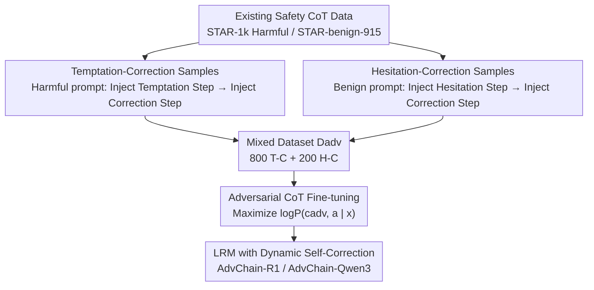

# AdvChain: Adversarial Chain-of-Thought Tuning for Robust Safety Alignment of Large Reasoning Models

**Conference**: ICLR 2026  
**OpenReview**: [https://openreview.net/forum?id=mIe17L3kWn](https://openreview.net/forum?id=mIe17L3kWn)  
**Code**: To be confirmed  
**Area**: Alignment & Safety / Safety Alignment for Large Reasoning Models  
**Keywords**: Safety Alignment, Large Reasoning Models, Chain-of-Thought, Self-Correction, Adversarial Fine-tuning

## TL;DR
Aiming at the "Snowball Effect" in Large Reasoning Models (LRMs) where small deviations in the Chain-of-Thought (CoT) are progressively amplified—leading to either a slide from safety analysis into harmful compliance or from helpfulness into over-refusal—this paper proposes AdvChain. By constructing adversarial CoT samples featuring "Temptation-Correction" and "Hesitation-Correction" (intentionally introducing errors and then correcting them) to fine-tune the model, it teaches the model dynamic self-correction. With only 1k data samples, AdvChain reduces the Attack Success Rate (ASR) of jailbreaks and CoT-hijacking to levels comparable to RealSafe-R1 (trained on 15× more data) while significantly reducing over-refusal without damaging math or code reasoning capabilities.

## Background & Motivation
**Background**: Large Reasoning Models (LRMs, such as DeepSeek-R1, Qwen3, QwQ, o1) excel at complex problems by explicitly generating a long sequence of intermediate reasoning steps (Chain-of-Thought) before providing an answer. The mainstream paradigm for safety alignment involves "Safety CoT Tuning"—fine-tuning on curated demonstrations $D_{align}$ of "safety reasoning + refusal" to make the model emulate a perfect reasoning chain that identifies risks and refuses harmful requests. Representative methods include STAR-1, SafeChain, UnsafeChain, and RealSafe-R1.

**Limitations of Prior Work**: The authors identify a hidden vulnerability in this "perfect script emulation" paradigm. They performed a step-by-step evaluation of DeepSeek-R1-7B and its safety-aligned version STAR-1-7B by segmenting reasoning chains into steps using `\n\n` and scoring each step for safety/helpfulness via GPT-4o. This revealed a failure mode called the **Snowball Effect**: a subtle deviation in the early stages of reasoning is progressively amplified, eventually polluting the final output. It manifests in two symmetrical forms:

- **Toxicity Snowball**: Facing harmful prompts, the model initially starts with low safety scores (mean < 1.5, correctly identifying and beginning a seemingly compliant analysis), but loses control as reasoning progresses, with the final safety scores often exceeding 4.0, sliding from safety analysis toward harmful compliance.
- **Over-refusal Snowball**: Facing ambiguous but benign prompts, the model initially shows high helpfulness scores > 4.5 (actively attempting to help), but once an excessive doubt about "potential violation" arises, the helpfulness score plummets, often dropping below 2.0 in the latter half, deviating from a helpful intent to an unnecessary refusal.

**Key Challenge**: The root cause is that traditional alignment only teaches the model "what a correct reasoning chain looks like" but **never provides training signals on "how to recover from an error."** The model is trained with cognitive inertia; once it deviates, it cannot stop, and the snowball grows unchecked—leading simultaneously to harmful compliance and over-refusal.

**Core Idea**: Instead of training only on perfect reasoning paths, **intentionally feed the model trajectories that "go wrong and then correct back."** This shifts the alignment paradigm from "thinking to prevent errors" to "actively correcting erroneous thinking," thereby breaking cognitive inertia and embedding dynamic self-correction within the CoT.

## Method

### Overall Architecture
AdvChain addresses the model's inability to perform self-correction. Instead of memorizing more perfect refusal scripts, it constructs adversarial CoT trajectories that **deliberately inject errors mid-reasoning and subsequently correct them** for fine-tuning. This allows the model to repeatedly encounter the full "deviation → recognition → recovery" process during training, acquiring the ability to "brake" in real-time. The method consists of two stages: (a) **Construction of an Adversarial Safety Reasoning Dataset**—using a strong teacher model to rewrite existing safety/helpful CoTs into two types of self-correction samples: Temptation-Correction (T-C) and Hesitation-Correction (H-C); (b) **Adversarial CoT Fine-tuning**—standard autoregressive supervised fine-tuning (SFT) on this mixed dataset. It is termed "adversarial" because the injected error steps essentially act as "internal attacks" on the model's own thought process.

### Key Designs

**1. Temptation-Correction Samples: Injecting "Toxic Temptation" and snuffing it out to treat the Toxicity Snowball**

To teach the model to stop a "slide toward harmful compliance," showing it only perfect refusals is insufficient—it has never seen what "almost making a mistake" looks like. T-C samples use a teacher model to insert a process of corruption and correction into a safety reasoning chain through four steps: ① Generate a standard safety refusal chain $c_{safe}=(c_1,\dots,c_n)$ for a harmful prompt $x_{harm}$ as a base; ② Inject a **Temptation Step** $c_{temp}$ at a logically coherent insertion point $k$—the reasoning begins to justify the harmful request or ponder "whether/how to do it," marking the transition from safe to unsafe; ③ Immediately inject a strong **Correction Step** $c_{corr}$—explicitly pointing out the danger of $c_{temp}$, rejecting the invalid reasoning, and pulling the trajectory back to a safe refusal; ④ Concatenate into $c_{adv}=(c_{1:k}, c_{temp}, c_{corr}, c_{k+1:n})$, polish for coherence, ensuring the final summary $s$ remains a safe refusal. The model learns the **recovery process** rather than rote memorization.

**2. Hesitation-Correction Samples: Injecting "Over-refusal Doubts" and correcting them to treat the Over-refusal Snowball**

Over-refusal is the mirror image of the toxicity snowball and requires a symmetrical correction signal. The construction of H-C samples is dual to T-C: ① Generate a standard helpful CoT $c_{help}=(c_1,\dots,c_n)$ for a benign prompt; ② Inject a **Hesitation Step** $c_{hesi}$ at insertion point $k$—where the model misjudges a safe prompt as harmful and decides to refuse; ③ Inject a **Correction Step** $c_{corr}$ to identify this hesitation as a false positive, returning to the original helpful path; ④ Concatenate and polish. This teaches the model to "overcome unnecessary caution and continue helping," stopping the snowball that slides toward refusal due to a momentary doubt.

**3. Adversarial CoT Fine-tuning: Internalizing "Error Detection and Correction" into parameters**

With the data ready, the training itself is kept simple to prove that the capability stems from the data format rather than a complex objective function. T-C and H-C are mixed into dataset $D_{adv}$, and for each sample $(x, c_{adv}, s)$, the standard autoregressive objective is used to maximize the log-likelihood:

$$\max_{\theta} \sum_{(x, c_{adv}, a)\in D_{adv}} \log P(c_{adv}, a \mid x; \theta)$$

Since the supervision signal **explicitly contains "error steps + correction steps,"** the model is forced to learn the mechanism of "recognizing and recovering from errors" into its parameters. Consequently, just 1,000 samples (800 T-C + 200 H-C) yield robust improvements across model families, with data efficiency comparable to RealSafe-R1 which uses 15,000 samples.

### Loss & Training
A single autoregressive likelihood objective (see equation above) is used without additional regularization. Implementation details: Harmful prompts for T-C are from STAR-1k, and benign prompts for H-C are from STAR-benign-915. Original reasoning chains are reused as base samples. Totaling 1,000 samples. Full SFT, 5 epochs, batch size 128, AdamW, learning rate $1\text{e-}4$, maximum sequence length 8,192, warm-up ratio 5%, on 8× RTX4090. The fine-tuned models are denoted as AdvChain-R1 / AdvChain-Qwen3.

## Key Experimental Results

Base models include DeepSeek-R1 (1.5B / 7B) and Qwen3 (0.6B / 1.7B / 4B). Metrics: ASR (Attack Success Rate, judged by LlamaGuard3, lower is better), RR (Refusal Rate), ORR (Over-refusal Rate on benign prompts, lower is better), and Pass@1 (Reasoning accuracy).

### Main Results

ASR on safety/jailbreak benchmarks (Example: DeepSeek-R1-7B family, 1k equivalent data; RealSafe-R1 uses 15k):

| Method | HarmBench ASR↓ | StrongReject ASR↓ | WJ-AdvHarm ASR↓ |
| :--- | :--- | :--- | :--- |
| DeepSeek-R1-7B (base) | 51.00 | 45.05 | 26.00 |
| STAR-1 (1k) | 8.00 | 6.00 | 17.33 |
| SafeChain (1k) | 38.00 | 38.00 | 24.00 |
| UnsafeChain (1k) | 26.00 | 27.00 | 19.33 |
| RealSafe-R1 (15k) | 2.00 | 2.50 | 4.80 |
| **AdvChain (1k)** | **4.50** | **2.00** | **9.00** |

Adaptive CoT-Hijacking Attack (CoT-Hijack: Injecting a malicious "pivot" thought mid-refusal as a prefix for the model to continue):

| Method | DeepSeek-R1-7B ASR↓ | Qwen3-4B ASR↓ |
| :--- | :--- | :--- |
| base | 74.67 | 30.00 |
| STAR-1 | 54.67 | 12.67 |
| SafeChain | 44.00 | 14.00 |
| UnsafeChain | 60.67 | 39.33 |
| RealSafe-R1 (15k) | 14.67 | — |
| **AdvChain** | **9.33** | **8.67** |

AdvChain suppresses the Hijacking ASR to 9.33% with only 1k data, making it the only method to systematically outperform RealSafe-R1 (which uses 15× more data), validating the "cognitive immunity" gained from T-C samples.

### Ablation Study

Over-refusal and Reasoning Capabilities (DeepSeek-R1-7B / Qwen3-4B):

| Configuration | XSTest ORR↓ | WJ-Benign ORR↓ | Math500 | AIME2024 | LiveCodeBench |
| :--- | :--- | :--- | :--- | :--- | :--- |
| DeepSeek-R1-7B base | 16.80 | 10.40 | 92.80 | 51.30 | 37.60 |
| STAR-1 | 42.00 | 33.33 | — | — | — |
| RealSafe-R1 (15k) | 66.40 | 60.60 | — | — | — |
| **AdvChain** | **18.00** | **12.67** | 93.40 | 49.33 | 36.50 |

Data ratio ablation (fixed 1000 samples, adjusting T-C : H-C): Higher T-C ratios lead to stronger attack resistance (lower ASR), whereas higher H-C ratios lead to fewer over-refusals (lower ORR). They are complementary.

### Key Findings
- **Breaking the Safety-Utility Trade-off**: Other safety alignment methods (notably RealSafe-R1) exhibit severe over-refusal (XSTest ORR at 66.40%). AdvChain achieves nearly the highest safety while maintaining an ORR of 18.00%, close to the unaligned base.
- **Extreme Data Efficiency**: 1k samples suffice to match RealSafe-R1 (15k), indicating that "teaching correction" is more fundamental than "feeding perfect scripts."
- **No Reasoning Degradation**: Pass@1 on Math500/AIME/LiveCodeBench remains consistent with the base (e.g., Math500 92.80 → 93.40), proving safety doesn't come at the cost of reasoning.
- **Structural Analysis Validation**: T-C samples show a "low-high-low" safety score curve (peak-shaped), while STAR-1 shows a flat low-score curve. This trajectory provides the explicit recovery signal.

## Highlights & Insights
- **Quantifying the failure of Safety CoT Tuning**: By using step-by-step scoring, the "Snowball Effect" is decomposed into two symmetrical phenomena, allowing for the precise design of the T-C/H-C dual construction—a perfect fit between diagnosis and solution.
- **Internalizing "Adversarial" within the CoT**: Unlike traditional prompt-level adversarial defense, this method injects adversarial steps into the model's **own reasoning trajectory**, a novel approach that could generalize to any chain-generation task requiring mid-course correction (e.g., multi-step planning, agent reasoning).
- **Peak-shaped Trajectories as Training Signals**: Visualizing "self-correction capability" as a safety score curve (peak vs. flat) makes the abstract concept observable and interpretable.

## Limitations & Future Work
- Adversarial sample quality depends on the teacher model and may not cover all safety violation types. Currently, it only handles **single-turn** reasoning correction.
- Toxicity judgments rely on LlamaGuard3 and step-by-step scoring on GPT-4o; biases in external judges may propagate.
- Future directions include extending to multi-turn dialogues, exploring online adversarial data generation to reduce teacher dependency, and adapting to evolving attack vectors.

## Related Work & Insights
- **vs. STAR-1 / SafeChain / UnsafeChain (1k Safety CoT Tuning)**: These focus on emulating "perfect" scripts but fail under CoT-hijacking (ASR 44-60%). AdvChain reduces this to 9.33% by teaching error-correction.
- **vs. RealSafe-R1 (15k Safety Trajectories)**: RealSafe-R1 gains safety via scale but suffers high over-refusal (66.40%). AdvChain matches safety with 1k data while keeping ORR at 18.00%.
- **vs. STAIR / Reasoning-to-Defend / Deliberative Alignment**: These focus on inference-time step-by-step evaluation or RL/MCTS. AdvChain remains lightweight and "plug-and-play" using only data synthesis and standard SFT.

## Rating
- Novelty: ⭐⭐⭐⭐⭐ Quantifying the snowball effect and using internal adversarial injection for self-correction is highly novel and self-consistent.
- Experimental Thoroughness: ⭐⭐⭐⭐ Covers 5 base models and 5 benchmark categories; could be strengthened by more multi-turn evaluations.
- Writing Quality: ⭐⭐⭐⭐⭐ Logical flow from diagnosis to validation is excellent; the T-C/H-C structure is very clear.
- Value: ⭐⭐⭐⭐⭐ High practical value for LRM alignment by breaking the safety-utility trade-off with minimal data.

<!-- RELATED:START -->

## Related Papers

- [\[ACL 2026\] Reasoning Structure Matters for Safety Alignment of Reasoning Models](../../ACL2026/llm_safety/reasoning_structure_matters_for_safety_alignment_of_reasoning_models.md)
- [\[AAAI 2026\] BadThink: Triggered Overthinking Attacks on Chain-of-Thought Reasoning in Large Language Models](../../AAAI2026/llm_safety/badthink_triggered_overthinking_attacks_on_chain-of-thought_reasoning_in_large_l.md)
- [\[ICLR 2026\] Distilling the Thought, Watermarking the Answer: A Principle Semantic Guided Watermark for Reasoning Large Language Models](distilling_the_thought_watermarking_the_answer_a_principle_semantic_guided_water.md)
- [\[ICLR 2026\] Output Supervision Can Obfuscate the Chain of Thought](output_supervision_can_obfuscate_the_chain_of_thought.md)
- [\[ICLR 2026\] Reasoning or Retrieval? A Study of Answer Attribution on Large Reasoning Models](reasoning_or_retrieval_a_study_of_answer_attribution_on_large_reasoning_models.md)

<!-- RELATED:END -->
