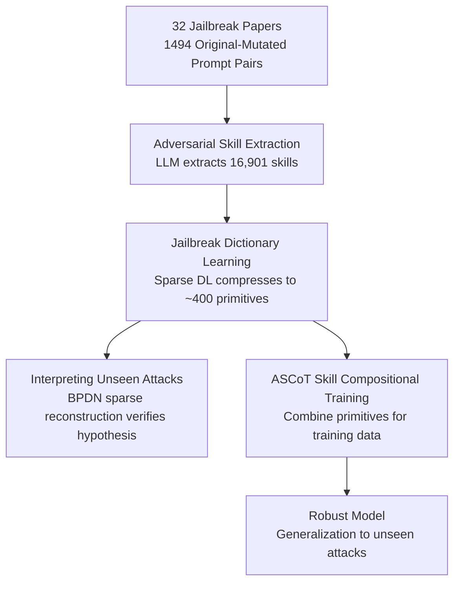

# Adversarial Déjà Vu: Jailbreak Dictionary Learning for Stronger Generalization to Unseen Attacks

**Conference**: ICLR2026  
**OpenReview**: [https://openreview.net/forum?id=WFo8P1gQBh](https://openreview.net/forum?id=WFo8P1gQBh)  
**Code**: [Project Homepage](https://mahavirdabas18.github.io/adversarial_deja_vu/)  
**Area**: LLM Security / Jailbreak Defense / Adversarial Training  
**Keywords**: Jailbreak, Adversarial Skills, Sparse Dictionary Learning, Compositional Generalization, Adversarial Training

## TL;DR
The authors propose the "Adversarial Déjà Vu" hypothesis—that new jailbreaks are not entirely novel inventions but rather recombinations of adversarial skills from previous attacks. By using sparse dictionary learning to compress ~17,000 skills extracted from 32 attack papers into approximately 400 interpretable primitives (a jailbreak dictionary), they verify that "unseen attacks can be sparsely reconstructed from old skills." Based on this, they introduce ASCoT (Adversarial Skill Compositional Training), which trains models on combinations of skills rather than single attack instances, achieving the lowest harmful rate against unseen jailbreaks without excessive refusal.

## Background & Motivation
**Background**: Despite safety alignment, Large Language Models (LLMs) are still systematically bypassed by jailbreaks—natural language prompts that circumvent guardrails to induce harmful outputs. New jailbreaks emerge faster than defenses can keep pace. Training-based defenses generally fall into two categories: alignment-based methods (RLHF/DPO), which patch vulnerabilities after red-teaming but remain fragile to new attacks, and adversarial training (R2D2, CAT, LAT), which pursues worst-case robustness.

**Limitations of Prior Work**: Adversarial training often fails in practice against newly emerging jailbreaks. The root cause is optimization difficulty and the challenge of defining a "realistic threat model"—defenses often target perturbations that are **computationally easy to find** (e.g., small shifts in embedding/latent space) rather than the actual mechanisms jailbreaks rely on. Both methods suffer from the same flaw: their training data distributions **poorly characterize the structure of unseen attacks**.

**Key Challenge**: Training-based defenses are ultimately bounded by their training distributions. Since the distribution dictates performance, rather than constantly chasing new attacks, the goal should be to **reshape the training data itself** to align with the true structure of unseen attacks. However, this seems impossible—how can one defend against an attack never seen before?

**Key Insight**: The authors argue that the "novelty" of jailbreaks is not unconstrained. Just as human innovation arises from reorganizing familiar building blocks, artificial jailbreaks draw from a **finite set of adversarial skills** (e.g., "academic framing," "roleplay," "keyword obfuscation"). Even LLM-generated jailbreaks remix human strategies found in their pre-training corpora. For instance, PAP and AutoDAN-Turbo, released six months apart, both utilized the same "academic facade" technique (wrapping harmful requests as research/education).

**Core Idea**: This observation is formalized as the **Adversarial Déjà Vu hypothesis**—given a sufficiently rich history of attacks, future jailbreaks can be explained as **compositions of existing adversarial skill primitives** found in earlier attacks. Following this hypothesis: ① Sparse dictionary learning is used to compress historical skills into a compact, interpretable "jailbreak dictionary," verifying that unseen attacks can indeed be sparsely reconstructed; ② Based on this, **Adversarial Skill Compositional Training (ASCoT)** is proposed to achieve generalization robustness against unseen attacks.

## Method

### Overall Architecture
The work is divided into two parts: "verifying the hypothesis" and "building a defense based on the hypothesis," both sharing the same pipeline. The input consists of 1,494 pairs of "original harmful prompts → jailbreak-mutated prompts" from 32 jailbreak papers; the output is a robust model capable of resisting unseen jailbreaks. The pipeline consists of three steps: first, utilizing a frontier LLM to **extract adversarial skills** from prompt pairs (totaling 16,901 raw skills); second, applying **sparse dictionary learning** to compress these redundant skills into approximately 400 primitives—forming the **jailbreak dictionary**. This dictionary serves two purposes: sparse reconstruction of unseen attack skills using basis pursuit to verify the Déjà Vu hypothesis, and **combining** primitives with harmful base queries to generate diverse training data for **ASCoT** fine-tuning.

### Key Designs

**1. Adversarial Skill Extraction: Breaking Jailbreaks into Transferable "Moves"**

To discuss "compositional generalization," a set of comparable atomic units is required. The authors define an "adversarial skill" as a transferable technique used to rewrite a base prompt to bypass safety constraints (e.g., academic framing, roleplay, keyword obfuscation). Extraction is performed by interacting with a frontier LLM (GPT-4.1): given a pair of "original harmful prompt + mutated jailbreak prompt," the model lists the transferable techniques used. Each skill includes three fields: `skill_name` (a compact label), `source_text` (the snippet in the mutated prompt), and `explanation` (a brief description of the skill and its generalizability). 1,494 prompt pairs yielded 16,901 raw skills.

The primary issue at this stage is **extreme redundancy**: skills are extracted at the prompt level, leading to significant lexical and semantic overlap (e.g., `euphemistic_language_use` and `euphemistic_language_masking`). This redundancy hinders both the analysis of new attacks and the efficient generation of training data.

**2. Jailbreak Dictionary Learning: Compressing Redundant Skills into Interpretable Primitives**

The objective is to learn a compact set of adversarial skill primitives from pre-cutoff attacks that can efficiently reconstruct the overcomplete skill set. The explanations of all raw skills are encoded into $d=3072$-dimensional, $\ell_2$-normalized dense vectors using `text-embedding-3-large`, forming a matrix $X\in\mathbb{R}^{d\times N_{\text{seen}}}$. Rather than simple clustering, which assumes moves are discrete and mutually exclusive, **Dictionary Learning (DL)** is used because adversarial techniques often **overlap and blend**. DL represents each skill as a **sparse combination** of shared primitives. The standard sparse regularization objective with unit norm constraints is optimized:

$$\min_{D,A}\ \tfrac{1}{2}\lVert X-DA\rVert_F^2 + \alpha\lVert A\rVert_{1,1}\quad \text{s.t.}\ \lVert D_{:,j}\rVert_2\le 1\ \forall j$$

where $D\in\mathbb{R}^{d\times k}$ is the dictionary and $A\in\mathbb{R}^{k\times N_{\text{seen}}}$ is the sparse code. A K-SVD alternating scheme is used for optimization, with the sparse coding step solved efficiently via LARS. **Model selection** is performed by scanning a grid of $(\alpha,k)$, balancing reconstruction error, average sparsity, and parsimony (smaller $k$), selecting the elbow point $(\alpha^\star,k^\star)$ on the Pareto front.

Dictionary atoms $d_j$ are initially unlabeled. To make them human-readable, the authors solve a Basis Pursuit Denoising (BPDN) problem to project atoms back to the original skill matrix: $\hat w^{(j)}=\arg\min_w \tfrac12\lVert d_j-Xw\rVert_2^2+\lambda\lVert w\rVert_1$. The metadata of the top-5 "parent skills" with the largest coefficients is fed into GPT-4.1 to synthesize a concise name and explanation, followed by light manual curation. A final **post-hoc redundancy filter** is applied to ensure the dictionary size is stable, resulting in the final $D_{\text{final}}$.

**3. Interpreting Unseen Attacks: Testing the Déjà Vu Hypothesis via Sparse Reconstruction**

To verify the hypothesis, the authors set a time cutoff $t_{\text{cutoff}}=$ 2024-08-15. 14,070 "seen" skills from 26 jailbreaks before the cutoff are used to build the dictionary, while 2,831 "unseen" skills from 6 jailbreaks after the cutoff (e.g., AutoDAN-Turbo, DarkCite) are used for testing. For each unseen skill embedding $x_{\text{new}}$, the authors solve BPDN: $\hat w(x_{\text{new}})=\arg\min_w \tfrac12\lVert x_{\text{new}}-D_{\text{final}}w\rVert_2^2+\lambda\lVert w\rVert_1$, and use the top-5 atoms as explanatory "parent primitives." GPT-4.1 (cross-validated with Claude 3.7 Sonnet) evaluates reconstruction quality using an **Explainability Score** (1–5). Two findings support the hypothesis: ① The dictionary compresses 14,070 skills into 397 atoms (35× compression) without losing explainability ($<0.05$ difference from the overcomplete set); ② Unseen skills are reconstructed using only ~5–7 active primitives. Explainability scores saturated at 4.3–4.4 over time, indicating the "novelty" of late-stage jailbreaks is diminishing.

**4. ASCoT: Training on Skill Compositions**

Recognizing that unseen jailbreaks share the underlying skill structure of known attacks, ASCoT trains the model on **diverse combinations of skills** rather than isolated attack instances. For a harmful base query $q$, $k\in\{1,2,3,4,5\}$ primitives are sampled from the jailbreak dictionary to create a composite query $q'=\text{compose}(q;d_{i_1},\dots,d_{i_k})$. Compositions are executed by an auxiliary LLM (DeepSeek-V3-Chat), which rewrites $q$ to coherently integrate the selected moves. The training set (40,526 items) includes: ① Original harmful queries; ② Adversarial queries composed from base prompts; ③ Benign query-answer pairs for general capability; ④ Calibration samples for over-refusal (XSTest). Unlike CAT/LAT, which target latent perturbations, ASCoT covers the **interpretable, cross-attack adversarial skill space**.

## Key Experimental Results

### Main Results
Evaluated across three dimensions: General capability (MMLU), Harmfulness (StrongReject score 0–1, lower is better), and Over-Refusal Rate (ORR on XSTest). Attacks include seen (Direct, GCG, PAIR, BEAST) and unseen (AutoDAN-Turbo, DarkCite, GALA).

| Model / Defense | MMLU | Avg harmfulness ↓ | ORR ↓ |
|------|------|------|------|
| Llama3.1-8B Undefended | 0.64 | 0.38 | 0.06 |
| Llama3.1-8B Refusal Training | 0.64 | 0.15 | 0.10 |
| Llama3.1-8B CAT* | 0.67 | 0.13 | 0.49 |
| Llama3.1-8B LAT* | 0.63 | 0.07 | 0.98 |
| Llama3.1-8B WildJailbreak | 0.63 | 0.19 | 0.06 |
| **Llama3.1-8B ASCoT (open)** | 0.63 | **0.07** | **0.06** |
| Zephyr-7B Undefended | 0.58 | 0.67 | 0.03 |
| **Zephyr-7B ASCoT (closed)** | 0.54 | **0.09** | 0.10 |

ASCoT achieved the lowest harmfulness and strongest generalization across models while maintaining low over-refusal (unlike LAT*, which refuses almost everything). Notably, ASCoT improved robustness against **multi-turn GALA attacks** despite being trained only on single-turn compositions. The 8B ASCoT model **matched Claude Sonnet-4-Thinking and outperformed o4-mini** in average harmfulness (0.08 vs 0.19 for o4-mini).

### Ablation Study

| Configuration / Analysis | Key Metric | Insight |
|------|---------|------|
| Compression 397 vs 14070 | Explainability ∆<0.05 | 35× compression preserves explanatory power |
| Unseen Skill Sparsity | 5–7 active atoms | Novel attacks are sparse combinations of old primitives |
| Novel Compositions k=2/3/4/5 | Harmfulness 0.00 | Robustness extends to unseen recombinations |
| Skill Coverage (12 to all) | Harmfulness monotonic drop | "Coverage Dividend": Expanding skill space raises attack hurdles |
| Composition Depth k=1..5 | Trade-off | Shallow compositions defend short attacks; deep defend long attacks |

### Key Findings
- **Compositional Generalization is Real**: When evaluated on StrongReject queries modified with $k\in\{2,3,4,5\}$ primitives seen during training but never in those specific combinations, ASCoT maintained a harmfulness score of 0.
- **Coverage Dividend**: For a fixed data volume, expanding the dictionary from 12 to 397 primitives steadily decreased harmfulness for PAIR and AutoDAN-Turbo.
- **Depth Matching**: Shallow compositions ($k=1,2$) are best for short attacks like PAIR, while deep compositions ($k=4,5$) are necessary for complex attacks like AutoDAN-Turbo. A spectrum of depths is required for full protection.

## Highlights & Insights
- **Formulating "Unseen Attack Defense" as a Testable Hypothesis**: The Déjà Vu hypothesis transforms "new jailbreaks" from unpredictable anomalies into "sparse combinations of old skills," providing quantitative proof via dictionary learning.
- **Apt Use of Dictionary Learning**: Choosing sparse DL over clustering correctly models the overlapping nature of adversarial techniques—a textbook example of matching mathematical tools to problem structure.
- **Training Data as Defense Frontier**: Robustness stems not from remembering specific failures but from spanning the underlying adversarial skill space.
- **Empirical Evidence of Limited Diversity**: The fact that 35× compression loses minimal explainability and unseen skills require only ~5–7 atoms suggests that jailbreak diversity is significantly overestimated.

## Limitations & Future Work
- **Scope Limitation**: The hypothesis is explicitly limited to "linguistic jailbreaks." Attacks relying on internal model access (e.g., fine-tuning attacks) do not decompose into linguistic skills.
- **Linear Assumption**: Representing skills as linear combinations in embedding space is a modeling choice for interpretability rather than a formal proof of non-linear skill interaction.
- **Pipeline Dependency**: Skill extraction/naming depends heavily on frontier LLMs (GPT-4.1), which may introduce model bias.
- **Need for Dictionary Updates**: The dictionary must be expanded when truly novel primitives emerge; the paper does not yet provide an automated mechanism to detect "true novelty."
- **Judge Reliability**: The harmfulness judges (StrongReject) can themselves be target of adversarial attacks.

## Related Work & Insights
- **vs. Alignment Defenses**: Traditional RLHF/DPO patches specific vulnerabilities. ASCoT **proactively covers** the skill space, providing better generalization.
- **vs. CAT/LAT**: CAT/LAT target computationally easy latent perturbations, which often fail to transfer to jailbreaks and significantly increase over-refusal. ASCoT targets human-interpretable skill spaces.
- **vs. WildJailbreak**: While WildJailbreak increases data diversity, ASCoT demonstrates that systematic coverage of the skill manifold is more effective than unguided data scaling.

## Rating
- Novelty: ⭐⭐⭐⭐⭐ Reframing unseen defense as sparse skill composition is a highly original and self-consistent perspective.
- Experimental Thoroughness: ⭐⭐⭐⭐⭐ Comprehensive evaluation across 3 model families, seen/unseen/multi-turn attacks, and controlled ablation of coverage/depth.
- Writing Quality: ⭐⭐⭐⭐⭐ Exceptionally clear structure, moving logically from hypothesis verification to methodology.
- Value: ⭐⭐⭐⭐⭐ Provides an actionable lever—skill coverage—for improving the robustness of LLM defenses.

<!-- RELATED:START -->

## Related Papers

- [\[ICLR 2026\] Learning to Lie: Adversarial Attacks on Human-AI Teams and LLMs](learning_to_lie_adversarial_attacks_on_human-ai_teams_and_llms.md)
- [\[ACL 2025\] CAVGAN: Unifying Jailbreak and Defense of LLMs via Generative Adversarial Attacks](../../ACL2025/llm_safety/cavgan_unifying_jailbreak_and_defense_of_llms_via_generative_adversarial_attacks.md)
- [\[ICLR 2026\] GeneBreaker: Jailbreak Attacks Against DNA Language Models with Pathogenicity Guidance](genebreaker_jailbreak_attacks_against_dna_language_models_with_pathogenicity_gui.md)
- [\[ICLR 2026\] Sampling-aware Adversarial Attacks against Large Language Models](sampling-aware_adversarial_attacks_against_large_language_models.md)
- [\[ICLR 2026\] Transferable and Stealthy Adversarial Attacks on Large Vision-Language Models](transferable_and_stealthy_adversarial_attacks_on_large_vision-language_models.md)

<!-- RELATED:END -->
