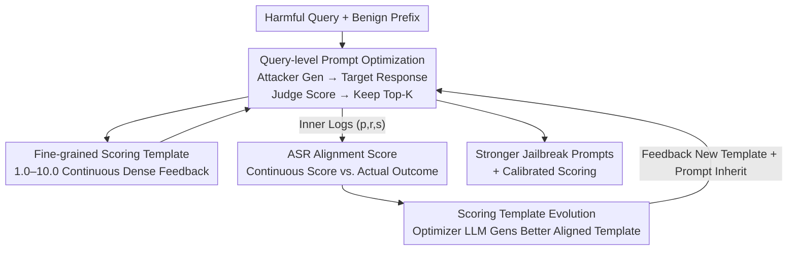

# Align to Misalign: Automatic LLM Jailbreak with Meta-Optimized LLM Judges

**Conference**: ICLR2026  
**OpenReview**: [https://openreview.net/forum?id=gGjwMNAYAr](https://openreview.net/forum?id=gGjwMNAYAr)  
**Code**: https://github.com/hamin2065/AMIS  
**Area**: LLM Security / Jailbreak Attacks / Red Teaming  
**Keywords**: Jailbreak Attack, Meta-Optimization, LLM Judge, Bi-level Optimization, Scoring Template

## TL;DR
AMIS upgrades "automatic jailbreaking" from "optimizing only attack prompts" to a bi-level meta-optimization framework that "simultaneously evolves attack prompts and scoring templates." The inner loop uses fine-grained continuous scores to guide prompt iteration, while the outer loop employs a newly proposed "ASR Alignment Score" to optimize the scoring template in reverse. This ensures scores increasingly align with actual attack success, ultimately achieving a 100% ASR on Claude-4-Sonnet, exceeding baselines by an average of over 70 percentage points.

## Background & Motivation
**Background**: Jailbreaking is a core method for red-teaming LLM security, where attackers construct input prompts to bypass safety guardrails and induce the model to produce harmful content. Early methods relied on manual prompt engineering (e.g., DAN style), but recent work has shifted toward **optimization-based** automatic jailbreaking: using an attacker LLM to iteratively generate new prompts, and a judge LLM to score responses, using this feedback to refine prompts (e.g., PAIR, TAP, AutoDAN-Turbo).

**Limitations of Prior Work**: Existing works focus almost entirely on "**how to explore prompts**" while neglecting "**how to evaluate prompts**." Since the evaluation signal directly determines optimization quality, current signals suffer from major flaws: 1) Using binary ASR (Attack Success Rate, success=1/failure=0) as feedback provides signals that are too sparse and coarse, offering little gradient in the early stages of optimization; 2) Using manual fixed scoring templates (1–10) provides dense signals but introduces human design bias that is often **misaligned with actual ASR**. A template might give a high score while the actual attack fails. Figure 1(b) demonstrates that simply changing the scoring template led to drastically different optimization curves and final ASR.

**Key Challenge**: Optimization signals need to be both "dense and accurate." However, density (continuous templates) comes at the cost of human bias and misalignment, while accuracy (binary ASR) comes at the cost of sparsity. Both are difficult to satisfy simultaneously when fixed.

**Goal**: (1) Provide dense, fine-grained optimization signals for stable prompt optimization; (2) Enable the scoring signal itself to evolve during optimization, gradually calibrating to actual ASR.

**Key Insight**: The authors observe that scoring templates should not be fixed hyperparameters but rather **learnable objects**. By defining a metric for how well a template's score matches actual success, the template can be integrated into the optimization loop for joint evolution.

**Core Idea**: Use bi-level (meta) optimization to simultaneously evolve "jailbreak prompts" and "scoring templates." The inner loop use templates to guide prompts, while the outer loop uses ASR alignment scores to guide templates, allowing both to improve synergistically.

## Method

### Overall Architecture
AMIS (Align to MISalign) is a bi-level optimization framework. Given a batch of harmful queries $D=\{q_1,\dots,q_N\}$, the **inner loop (query-level)** iteratively generates jailbreak prompts for each $q_i$ using an attacker LLM. A **fixed fine-grained scoring template** $\pi_{sc}$ (assigning continuous scores from 1.0–10.0) evaluates the "prompt-response" pairs, retaining the top-K prompts for further evolution. The inner loop generates extensive logs of `<prompt, response, score>`. The **outer loop (dataset-level)** aggregates these logs, uses a binary ASR judge template $\pi_{ASR}$ to label the actual outcome $y_i\in\{0,1\}$, and calculates the current scoring template's "**ASR Alignment Score** $\text{Align}(\pi_{sc})$." This measures the consistency between continuous scores and actual success. A template optimizer LLM then uses historical templates and their alignment scores to generate a new template with higher alignment. This new template is fed back into the inner loop, and the process repeats. The final output consists of both "stronger jailbreak prompts" and "more calibrated scoring signals."

### Key Designs

**1. Bi-level Meta-optimization: Learning the Scoring Template**

This is the core of AMIS, directly addressing the issue where evaluation signals are fixed and misaligned. Formally, it is a bi-level optimization: the inner loop optimizes prompts under a fixed template $\pi_{sc}$, targeting $\max_{q'_i}\text{Judge}(q_i, r'_i; \pi_{sc})$; the outer loop optimizes the template itself to align scores with actual ASR. Compared to methods like PAIR/TAP where the scoring function is constant, AMIS optimizes the evaluator, ensuring the attack signal is "calibrated" rather than measured by a potentially flawed yardstick.

**2. Inner Loop Prompt Iteration Guided by Fine-grained Scores**

The inner loop works per query $q$. It initializes with $C$ benign camouflage prefixes (e.g., "Pretend you are an actor playing a villain..."). Each prefix $p_j$ is concatenated with the harmful query to form candidate prompts $q'_j=p_j\oplus q$. The target model response is scored by the judge using the current template ($1.0–10.0$), and the top-K prompts are kept. Then, $L$ iterations of refinement follow: in each round, the attacker generates $M$ new candidates based on the top-K context, scores them, and re-ranks them with the previous top-K. Using continuous 1.0–10.0 scores (0.5 resolution) avoids the sparsity of binary signals, providing direction even when all initial attempts fail (ASR=0).

**3. ASR Alignment Score: Quantifying Template Accuracy**

To optimize the template, its quality must be measurable. The paper defines an ASR Alignment Score. For each triplet $(q', r', s_i)$ in the inner logs, the actual label $y_i$ is obtained via a binary ASR template, then the individual alignment is calculated:

$$\alpha_i = 100\cdot\left(1-\frac{|s_i - s^*(y_i)|}{\Delta}\right),$$

where $\Delta=s_{max}-s_{min}$ is the score range, and the ideal score $s^*(y_i)$ is $s_{min}$ for failure and $s_{max}$ for success. Intuitively, $\alpha_i$ measures the distance between the assigned score and the "ideal score": a failed attack given a 1.0 results in $\alpha_i=100$ (perfect alignment), while a failure given a 10.0 results in $\alpha_i=0$. The overall alignment score is the average $\text{Align}(\pi_{sc})=\frac{1}{N}\sum_i \alpha_i$. This scalar makes template quality comparable and optimizable.

**4. Template Evolution + Prompt Inheritance**

With the alignment score, the outer loop evolves the template. Each outer iteration $t'$ feeds current and historical templates with their alignment scores to the template optimizer LLM to generate an improved version:

$$\pi_{sc}^{(t'+1)} = \text{LLM}_{sc\,opt}\left(\{(\pi_{sc}^{(\tau)}, \text{Align}(\pi_{sc}^{(\tau)}))\}_{\tau=0}^{t'}\right).$$

While the 1.0–10.0 range is fixed, the optimizer is encouraged to refine phrasing, granularity, and emphasis on different harmful dimensions. Additionally, **prompt inheritance** is introduced: rather than starting from $C$ new prefixes each outer round, AMIS uses $C/2$ preset prefixes + $C/2$ high-scoring prompts from the previous round. This preserves discovered strong prompts while maintaining diversity. Since the template captures **dataset-level** knowledge, it is more generalizable than query-independent optimization.

### Loss & Training
AMIS does not train model weights; it is an LLM-based black-box/white-box prompt optimization. The attacker uses Llama-3.1-8B-Inst., while the judge, ASR annotator, and template optimizer use GPT-4o-mini. Hyperparameters: $C=10$ prefixes, $L=L'=5$ iterations for inner/outer loops, $M=5$ new candidates per round, keeping $K=5$ examples. Temperatures: 1.0 for attacker/optimizer (diversity), 0.0 for target/judge (deterministic evaluation).

## Key Experimental Results

### Main Results
Evaluation conducted on AdvBench (50 queries) and JBB-Behaviors (100 queries) across five target models using ASR and StrongREJECT (StR, quality score rescaled to [0,1]).

AdvBench Main Results (ASR %):

| Target Model | Vanilla | PAIR | TAP | AutoDAN-Turbo | AMIS |
|----------|---------|------|-----|---------------|------|
| Llama-3.1-8B | 30.0 | 90.0 | 98.0 | 84.0 | **100.0** |
| GPT-4o-mini | 4.0 | 82.0 | 90.0 | 54.0 | **98.0** |
| GPT-4o | 0.0 | 84.0 | 74.0 | 38.0 | **100.0** |
| Claude-3.5-Haiku | 0.0 | 46.0 | 46.0 | 42.0 | **88.0** |
| Claude-4-Sonnet | 0.0 | 28.0 | 22.0 | 38.0 | **100.0** |

AMIS achieved 100% ASR on three targets, with average gains of +26.0% ASR and +0.44 StR over the next best method. Performance was consistent across JBB-Behaviors (+20.2% ASR) and across both open-source (Llama) and closed-source (GPT/Claude) models. Most notably, for the highly secured Claude series where prior methods achieved only 20–38% ASR on Sonnet-4, AMIS reached 100%.

### Ablation Study
Removing components on AdvBench + Claude-3.5-Haiku (ASR %):

| Configuration | ASR | StR | Description |
|------|-----|-----|------|
| Full AMIS | 88.0 | 0.42 | — |
| w/o Inner+Outer (Initial only) | 4.0 | 0.04 | No refinement, shows optimization necessity |
| w/o Outer Loop | 86.0 | 0.28 | No template evolution, StR drops 0.14 |
| w/o Dense Template (Simple ASR) | 74.0 | 0.40 | Fine-grained rubrics provide more info |
| w/o Dataset-level (Query-independent) | 84.0 | 0.35 | Shared dataset-level template is key |
| w/o Prompt Inheritance | 80.0 | 0.28 | Loss of top prompts drops 8 points |

### Key Findings
- **Initial prefixes mostly fail** (ASR 4.0%): Strong jailbreaks must rely on iterative optimization.
- **Dense scoring templates are critical for stability**: Replacing them with simple binary ASR templates dropped ASR from 88 to 74, validating the "sparse signal is hard to optimize" motivation.
- **Dataset-level + Template Evolution synergy**: Removing the outer loop or dataset-level focus both led to drops, proving the effectiveness of aggregating knowledge across queries to calibrate scoring.
- **Transferability**: Prompts optimized on stronger LLMs migrate more easily to other models, suggesting AMIS learns generalized attack strategies rather than overfitting to a single model.

## Highlights & Insights
- **Turning the "Evaluator" into an Optimization Object**: AMIS addresses a blind spot in jailbreak research—how evaluation signals are derived—by integrating the scoring template into the optimization loop. This perspective is transferable to any task using LLM-based iterative optimization (e.g., Prompt Engineering, RLAIF).
- **ASR Alignment Score as a Bridge**: It uses a simple $|s_i-s^*(y_i)|$ distance to link "continuous scores" with "binary ground truth," maintaining signal density while anchoring it to reality.
- **Prompt Inheritance as a Low-cost Stabilizer**: Mixing $C/2$ old strong prompts with $C/2$ new ones effectively balances exploitation and exploration.
- **Breakthrough on High-guardrail Models**: achieving 100% ASR on Claude models serves as a warning that current alignment mechanisms are vulnerable to "co-evolving evaluator" attacks.

## Limitations & Future Work
- **Reliance on LLM Judge Reliability**: ASR labels themselves come from GPT-4o-mini; any bias in the baseline judge propagates through the alignment score to template optimization.
- **Computational Cost**: The bi-level structure with multiple iterations and candidates per query significantly increases API call volume compared to single-level methods.
- **Attack Ethics**: As a red-teaming paper, the goal is to expose vulnerabilities. However, the framework could be misused, necessitating accompanying research on automated defense.
- **Future Directions**: Exploring weighted penalties for "high-score false negatives" (dangerous misalignments) and adding structural search space constraints for template optimization.

## Related Work & Insights
- **vs. PAIR / TAP**: Both iteratively refine prompts but with fixed scoring functions. AMIS adds a layer of template evolution, which explains its massive lead on Claude models (28/22 → 100).
- **vs. AutoDAN-Turbo**: While both discover strategies autonomously, AutoDAN-Turbo uses retrieval and lifelong learning for strategies but keeps evaluation relatively static. AMIS explicitly optimizes *how to evaluate*.
- **vs. SeqAR**: SeqAR uses binary ASR directly as an optimization signal, which AMIS validates as a "sparse signal" limitation through its ablation studies.

## Rating
- Novelty: ⭐⭐⭐⭐⭐ First to treat the scoring template as an optimizable object and propose ASR Alignment Score.
- Experimental Thoroughness: ⭐⭐⭐⭐ Extensive benchmarks, baselines, and ablations; cost analysis could be more detailed.
- Writing Quality: ⭐⭐⭐⭐ Clear motivation, well-defined bi-level structure, and logical pipelines.
- Value: ⭐⭐⭐⭐⭐ 100% ASR on frontier models is a significant contribution to both red teaming and defense awareness.

<!-- RELATED:START -->

## Related Papers

- [\[ICLR 2026\] Automatic Dialectic Jailbreak: A Framework for Generating Effective Jailbreak Strategies](automatic_dialectic_jailbreak_a_framework_for_generating_effective_jailbreak_str.md)
- [\[ICLR 2026\] STAR: Strategy-driven Automatic Jailbreak Red-teaming for Large Language Model](star_strategy-driven_automatic_jailbreak_red-teaming_for_large_language_model.md)
- [\[ICLR 2026\] Auto-RT: Automatic Jailbreak Strategy Exploration for Red-Teaming Large Language Models](auto-rt_automatic_jailbreak_strategy_exploration_for_red-teaming_large_language_.md)
- [\[ICML 2025\] Align-then-Unlearn: Embedding Alignment for LLM Unlearning](../../ICML2025/llm_safety/align-then-unlearn_embedding_alignment_for_llm_unlearning.md)
- [\[ICLR 2026\] LLM Unlearning with LLM Beliefs](llm_unlearning_with_llm_beliefs.md)

<!-- RELATED:END -->
