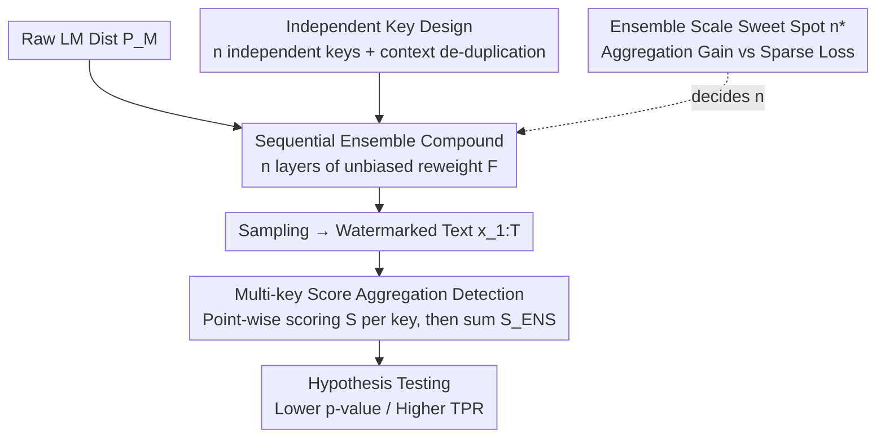

# An Ensemble Framework for Unbiased Language Model Watermarking

**Conference**: ICLR 2026  
**OpenReview**: [https://openreview.net/forum?id=iZ7i2y1YxO](https://openreview.net/forum?id=iZ7i2y1YxO)  
**Area**: AI Security / LLM Watermarking  
**Keywords**: Unbiased watermarking, ensemble framework, logits reweighting, signal detection, robustness  

## TL;DR
This paper proposes ENS, an ensemble framework that **concatenates and compounds** multiple unbiased logits watermarks with independent keys. By injecting a subtle, imperceptible weak signal at each layer and aggregating scores from $n$ keys at the detection end, the SNR is boosted by approximately $\sqrt{n}$. This significantly enhances detection power and robustness against rewriting while strictly keeping the output distribution unchanged (unbiased).

## Background & Motivation

**Background**: To provide verifiable "proof of origin" for LLM-generated text, watermarking techniques subtly embed statistical signals during generation, which detectors recognize through hypothesis testing. **Unbiased (distortion-free)** watermarking is preferred because its expectation over the key distribution equals the original LM distribution. This theoretically guarantees no harm to fluency and prevents detection via distribution drift, making it ideal for real-world deployment.

**Limitations of Prior Work**: Unbiasedness is also a weakness. Since the expected distribution remains unchanged, the statistical signal available to the detector is naturally **weak**. Reliable determination often requires long texts, and the watermark is easily removed by sampling smoothing, truncation, or rewriting attacks. Existing unbiased logits methods like $\gamma$-reweight, DiPmark, and MCmark attempt to improve detection power, but the signal strength of a single watermark has an upper bound.

**Key Challenge**: There is an inherent tension between unbiasedness (unchanged expectation) and detectability (requiring observable statistical bias). Any single-layer unbiased reweighting introduces a "bias" that is zero in expectation; detection relies solely on the small signal within the conditional variance.

**Goal**: Amplify the detectable signal and simultaneously enhance robustness against rewriting/perturbation attacks **without compromising unbiasedness**.

**Key Insight**: The authors observe that unbiasedness is a property "in expectation." As long as the keys are **independent**, concatenating multiple independent unbiased reweighting operations remains unbiased in expectation (each layer's expectation pulls the distribution back to the original). However, the detector, possessing all $n$ keys, can **coherently stack** the conditional biases from each key, allowing the signal to accumulate while the noise only grows by $\sqrt{n}$.

**Core Idea**: Use an "ensemble of multiple independent weak watermarks" instead of a "single strong watermark" to break the signal ceiling of unbiased watermarking—preserving unbiasedness at each layer while trading quantity for SNR at the detector.

## Method

### Overall Architecture

ENS is not a new watermarking algorithm but an **ensemble shell that can be wrapped around any logits-based unbiased watermark $F$**. During generation, given the original distribution $P_M(\cdot\mid x_{1:t})$ and $n$ independent keys $k_{1:n}$, $F$ is applied recursively $n$ times:

$$\text{ENS}(n, F, P_M, k_{1:n}) = \begin{cases} F\big(\text{ENS}(n-1, F, P_M, k_{1:n-1}),\, k_n\big), & n>1\\[4pt] F\big(P_M, k_1\big), & n=1 \end{cases}$$

That is, the $n$-th layer performs unbiased reweighting with key $k_n$ on the output distribution of the previous $n-1$ layers, and the next token is sampled from the final compound distribution. Detection works in reverse: the same $n$ keys are used to run the base detector's scoring function $S$, and the $n$ scores are aggregated into an ensemble score $S_{\text{ENS}}$ for hypothesis testing. The pipeline is as follows (sequential stacking at generation, parallel aggregation at detection):

### Key Designs

**1. Sequential Ensemble: Compounding weak signals into $n$ layers**

The weak signal in unbiased watermarking stems from the zero-bias expectation of single-layer reweighting. ENS **recursively concatenates** the same base rule $F$ with $n$ different keys: each layer applies a tiny, unbiased perturbation to the distribution from the previous layer. While the overall distribution remains close to $P_M$ in terms of total variation distance, the watermark signal accumulates across layers. The authors prove this construction **remains unbiased** (Theorem 4.2): if $F$ satisfies 

$$\mathbb{E}_{k\sim P_K}\big[F(P_M(x_{t+1}\mid x_{1:t}),\,k)\big] = P_M(x_{t+1}\mid x_{1:t})$$

for any input distribution and $k_{1:n}$ are i.i.d. from $P_K$, the $n$-fold ensemble satisfies $\mathbb{E}_{k_{1:n}}[\text{ENS}_n(P_M)] = P_M$. This means the ensemble does not sacrifice generation quality—unbiasedness is conserved layer-by-layer.

**2. Independent Key Design: Implementing the strict unbiasedness prerequisite**

The key to the unbiasedness proof is that "$k_{1:n}$ are mutually independent within a single generation step." Typically, $k=h(\text{sk}, n\text{-gram})$. To create $n$ independent keys, one can use $n$ different hash functions or $n$ different secret keys $\text{sk}_1,\dots,\text{sk}_n$; this paper chooses the latter. To handle potential dependencies across tokens caused by overlapping contexts, the authors maintain a **context history**: if a context has appeared before, watermarking is skipped for that step, ensuring nearly independent keys for the statistics.

**3. Multi-key Score Aggregation Detection: Coherently stacking evidence**

The detector aggregates scores $\{S(x_{1:T},\text{sk}_i)\}$ from all $n$ keys, most simply by summation $S_{\text{ENS}}(x_{1:T})=\sum_{i=1}^n S(x_{1:T},\text{sk}_i)$. Under the assumption of independent scores with common variance $\sigma^2$ and mean bias $\mu$ (Proposition 4.3), the summation statistic under H1 has mean $n\mu$ and variance $n\sigma^2$, leading to:

$$\text{SNR}(S_{\text{ENS}}) = \frac{n\mu}{\sqrt{n\sigma^2}} = \frac{\mu\sqrt{n}}{\sigma}$$

The SNR grows with $\sqrt{n}$, improving detection power for a fixed FPR. For DiPmark, the ensemble p-value $p_{\text{ENS}}$ decays exponentially with $n$, providing much stronger evidence than any single detector.

**4. Ensemble Scale Sweet Spot $n^\star$: Reconciling gain and sparsity**

Increasing $n$ indefinitely is not optimal. The paper characterizes this trade-off (§4.3): in an "intersection" scheme where tokens are only promoted if they appear in the greenlists of all keys, the promoted set size shrinks by $\gamma^n$. The p-value follows $p_{\text{ENS}}\lesssim\exp\!\big(-CTn(\varepsilon\gamma)^{2n}\big)$, where a conflict arises between the **aggregation gain** ($n$) and **sparsity loss** ($(\varepsilon\gamma)^{2n}$). The optimal $n$ is found at $n^\star\approx\frac{1}{2\log(1/\varepsilon\gamma)}$. Specifically, for $\gamma=0.5, \varepsilon=1.8$, the sweet spot $n^\star \approx 4.75$, explaining why $n=5$ performs best in experiments.

## Key Experimental Results

Models: Llama-3.2-3B-Instruct / Mistral-7B-Instruct-v0.3 / Phi-3.5-mini-instruct. Evaluation on 1000 samples from the C4 subset.

### Main Results (Detection Power, Table 1)

| Method | 250 tok TPR@0.01% | 250 tok Median p ↓ | 500 tok TPR@0.01% | 500 tok Median p ↓ |
|------|------|------|------|------|
| DiPmark($\alpha$=0.3) | 32.22% | 4.48e-3 | 61.68% | 8.60e-6 |
| **ENS-DiPmark($\alpha$=0.3, n=5)** | **66.77%** | **9.77e-7** | **91.51%** | 3.28e-14 |
| $\gamma$-reweight | 42.02% | 7.47e-4 | 72.45% | 4.58e-8 |
| **ENS-$\gamma$-reweight(n=5)** | **64.14%** | **2.04e-6** | **88.58%** | 4.81e-15 |
| SynthID(m=30) | 88.36% | 1.91e-12 | 98.37% | 4.07e-28 |
| MCMark(l=20) | 90.37% | 4.18e-13 | 98.45% | 8.30e-26 |
| **ENS-MCMark(l=20, n=3)** | **91.71%** | **1.43e-14** | **99.57%** | **2.58e-31** |
| **ENS-MCMark(l=20, n=5)** | 91.44% | 4.27e-14 | 98.90% | **1.27e-35** |

The ensemble nearly doubles the 250-token TPR of weak baselines and pushes the SOTA further when applied to MCmark.

### Ablation Study (Robustness against Attacks, Table 2/3, TPR@0.01%)

| Method | GPT-4o-mini Rewriting | DIPPER Rewriting | Back-translation (En-Fr) | 10% Rand Replace |
|------|------|------|------|------|
| ENS-DiPmark($\alpha$=0.3, n=5) | 5.14% | 1.09% | 26.31% | 26.31% |
| SynthID(m=30) | 13.47% | 11.05% | 64.53% | 64.53% |
| **ENS-MCMark(l=20, n=3)** | **29.44%** | **30.70%** | **76.43%** | **76.43%** |

While all methods degrade under attack, ENS-MCMark maintains the highest TPR and lowest p-values across all scenarios, significantly outperforming SynthID under heavy GPT/DIPPER rewriting.

### Unbiasedness Verification (Table 4)

| Method | Summary ROUGE-L | Summary BERTScore | Translation BLEU | Trans. BERTScore |
|------|------|------|------|------|
| No Watermark | 0.2379 | 0.3175 | 20.35 | 0.5576 |
| ENS-DiPmark($\alpha$=0.3, n=5) | 0.2375 | 0.3163 | 20.24 | 0.5555 |
| ENS-MCMark(l=20, n=5) | 0.2388 | 0.3177 | 20.19 | 0.5631 |

All ensemble variants perform nearly identically to the no-watermark baseline, empirically confirming the theoretical guarantees.

### Key Findings
- **MCmark is the best base**: The ensemble gain can even push the already strong MCmark to new SOTA levels, suggesting ENS is orthogonal to base watermark strength.
- **$n$ is not "the more the better"**: DiPmark/$ \gamma $-reweight perform better at $n=5$ than $n=10$, aligning with the theoretical sweet spot $n^\star$.
- **Short-text gains are most significant**: The TPR boost is most dramatic in the 250-token setting, addressing the primary pain point of unbiased watermarks.
- **Computational overhead is negligible**: Extra computation during the generation phase for all watermarks is minimal.

## Highlights & Insights
- **"Trading Quantity for SNR"**: Instead of inventing a new watermark, the paper leverages the "expectation conservation" of unbiasedness. Concatenating layers remains unbiased, while the detector gains $\sqrt{n}$ SNR—effectively a "free lunch."
- **Quantitative Sweet Spot $n^\star$**: Deriving $g(n)=n(\varepsilon\gamma)^{2n}$ transforms the ensemble scale from a heuristic guess into a calculable theory that matches experimental data.
- **Framework Portability**: ENS is a modular shell; it directly enhances DiPmark, $\gamma$-reweight, or MCmark, making it a universal "amplifier" for future unbiased watermarks.

## Limitations & Future Work
- **Constraint of the Intersection Scheme**: In the "strict intersection" approach, the promoted mass collapses by $\gamma^n$, limiting $n$. Non-intersection designs (aggregating per-key statistics) were only briefly mentioned.
- **Independence Dependencies**: Key independence relies on context de-duplication; residual correlations in overlapping $n$-grams might affect the ideal $\sqrt{n}$ scaling.
- **Logits Focus**: It is unclear if sampling-based unbiased methods (e.g., Gumbel-max) can benefit from the same ensemble approach.
- **Rewriting Robustness**: Even ENS-MCMark has only ~30% TPR@0.01% under GPT/DIPPER rewriting, indicating a remaining gap for practical deployment.

## Related Work & Insights
- **vs. DiPmark / $\gamma$-reweight**: These are single-layer unbiased methods with weak signals. ENS treats them as base rules to nearly double their TPR.
- **vs. MCmark (Chen et al., 2025)**: Currently the strongest unbiased watermark; ENS-MCMark pushes this boundary further.
- **vs. SynthID (Dathathri et al., 2024)**: SynthID uses multi-layer tournament sampling for detectability. ENS follows a logits-based ensemble route and outperforms SynthID in rewriting robustness (via ENS-MCMark).
- **vs. Kirchenbauer et al. (2023)**: The original greenlist uses a fixed $\delta$ that degrades quality. This paper maintains unbiasedness and recovers signal through ensemble quantity.

## Rating
- Novelty: ⭐⭐⭐⭐ Cleverly uses "unbiasedness = expectation conservation" for an ensemble amplifier with solid theoretical backing.
- Experimental Thoroughness: ⭐⭐⭐⭐ Comprehensive coverage of models, attacks, and metrics, aligning well with the theory.
- Writing Quality: ⭐⭐⭐⭐ Clear derivations (unbiasedness proof, SNR, $n^\star$) that map directly to results.
- Value: ⭐⭐⭐⭐ A plug-and-play enhancement for any logits-based unbiased watermark, significant for LLM provenance.

<!-- RELATED:START -->

## Related Papers

- [\[ICLR 2026\] Analyzing and Evaluating Unbiased Language Model Watermark](analyzing_and_evaluating_unbiased_language_model_watermark.md)
- [\[ICLR 2026\] Watermarking Diffusion Language Models](watermarking_diffusion_language_models.md)
- [\[ICLR 2026\] Self-Destructive Language Model](self-destructive_language_model.md)
- [\[ICLR 2026\] OFMU: Optimization-Driven Framework for Machine Unlearning](ofmu_optimization-driven_framework_for_machine_unlearning.md)
- [\[ACL 2025\] Ensemble Watermarks for Large Language Models](../../ACL2025/llm_safety/ensemble_watermarks_llm.md)

<!-- RELATED:END -->
