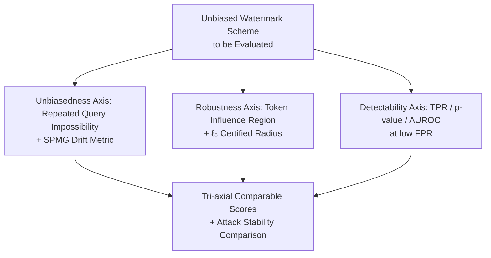

# Analyzing and Evaluating Unbiased Language Model Watermark

**Conference**: ICLR2026  
**OpenReview**: [https://openreview.net/forum?id=6T4LR1oRwA](https://openreview.net/forum?id=6T4LR1oRwA)  
**Code**: https://github.com/cavosamir/UWBench.git  
**Area**: LLM Security / Text Watermarking  
**Keywords**: Unbiased Watermarking, Distribution Shift, Impossibility Theorem, Certified Robustness, Evaluation Benchmark

## TL;DR
This paper proposes UWBENCH—the first open-source benchmark specifically designed for evaluating "distortion-free language model watermarks." It theoretically proves an impossibility theorem stating that "any detectable unbiased watermark cannot maintain the original distribution under repeated queries for the same prompt," introduces the SPMG metric to quantify distribution shift across multiple generations, and provides $\ell_0$ certified robustness bounds for token-level editing attacks. Empirically, it establishes a tri-axial evaluation protocol for "Unbiasedness / Detectability / Robustness" and identifies that token replacement attacks yield more stable and reproducible robustness conclusions than paraphrase attacks.

## Background & Motivation
**Background**: As LLM-generated text becomes increasingly realistic, "watermarking" AI text has become a mainstream solution for provenance and identification. This involves embedding covert statistical signals into the token distribution using a key during generation, allowing for hypothesis testing later. A particularly important category is **unbiased watermarks (distortion-free)**: these require the output distribution to be consistent with the original model in expectation, thus avoiding degradation in generation quality. Representative methods include γ-reweight, DiPmark, SynthID, MCmark, ITS-Edit/EXP-Edit, and STA-1.

**Limitations of Prior Work**: The authors identify two overlooked issues. First, **unbiasedness is only "unbiasedness in expectation"**—while the expected distribution of a single sample equals the original, repeated generations for the same prompt under the same key gradually lead to a statistical drift, accumulating visible distribution bias. Previous evaluations only measured unbiasedness in "single prompt, single generation" settings, missing this failure mode. Second, **robustness evaluation standards are inconsistent**: different methods use different attacks (random editing, paraphrasing, translation) under varying protocols, making results incomparable, while paraphrase attacks themselves exhibit high variance.

**Key Challenge**: There is a fundamental tension between unbiasedness and detectability in the dimension of "repeated queries." To make a watermark detectable, statistical traces must be left in the distribution, which inevitably manifest when samples from multiple generations are aggregated. Thus, "strict maintenance of the original distribution" and "detectability" cannot hold simultaneously.

**Goal**: To shift the evaluation of unbiased watermarks from "creating task datasets" toward "providing principled, reproducible metrics." Specifically: provide a metric for unbiasedness that captures drift across multiple generations, provide a certified and stable characterization of robustness, and standardize the tri-axial evaluation into an open-source platform.

**Key Insight**: The authors capture the overlooked perspective of "repeated queries," theoretically proving the impossibility of unbiasedness under such conditions and designing a statistic to measure this drift.

**Core Idea**: Redefine unbiasedness measurement through the distribution shift of "Single-Prompt Multi-Generation (SPMG)," derive an $\ell_0$ certified robustness radius using the "token influence region length $\times$ single-token score upper bound," and package Unbiasedness / Detectability / Robustness into a unified tri-axial protocol.

## Method

### Overall Architecture
UWBENCH is not a new dataset but an evaluation framework of "theoretical metrics + empirical protocols" centered on three axes: **Unbiasedness**, **Detectability**, and **Robustness**. Its input is any unbiased watermark scheme (generator + detector), and its output is comparable scores across the three axes. Theoretical contributions include the impossibility theorem under repeated queries + the SPMG drift metric (for Unbiasedness) and certified robustness bounds for token-level attacks (for Robustness). Empirically, it standardizes the evaluation of these axes and compares the stability of paraphrase attacks versus random token replacement attacks.

The basic watermark setting is: the LLM's next token distribution for prefix $x_{1:n}$ is $P_M(\cdot\mid x_{1:n})$. The watermark uses key $k$ and reweighting strategy $F$ to modify it to $P_W(\cdot\mid x_{1:n},k)=F\big(P_M(\cdot\mid x_{1:n}),k\big)$, sampling from $P_W$ instead of $P_M$. The detector uses $k$ and $F$ to calculate a per-token score $S(x_{1:n})=\sum_i s(x_i,k,F)$ for hypothesis testing ($H_0$ vs $H_1$). **Unbiasedness** is defined as the distribution remaining unchanged after taking the expectation over random keys: $\mathbb{E}_{k\sim\mu}[P_W(\cdot\mid x_{1:n},k)]=P_M(\cdot\mid x_{1:n})$.

### Key Designs

**1. Unbiasedness Impossibility Theorem under Repeated Queries: Piercing the Illusion of "Expected Unbiasedness"**

Addressing the blind spot where "existing evaluations only measure unbiasedness under single generation," the authors distinguish two levels of unbiasedness. One-shot unbiasedness is $\mathbb{E}_{k\sim\mu}[P_W(\cdot\mid x,k)]=P_M(\cdot\mid x)$, holding for all prompts. However, in deployment, the same prompt is queried repeatedly. Theorem 4.1 proves: **No watermarking scheme can simultaneously achieve "detectability" and "maintenance of the original distribution under repeated queries for the same prompt with a fixed key."** In other words, any scheme that is unbiased in a one-shot sense and yet detectable will necessarily deviate from $P_M$ when repeatedly generating for the same prompt under a fixed key. The intuition is that detectability requires systematic preferences under a fixed key (otherwise the expectation of $S$ would not deviate from $H_0$), and these preferences are amplified into visible statistical drift in the empirical distribution of multiple samples. This theorem downgrades "unbiasedness" from an absolute promise to "one-shot expected unbiasedness."

**2. SPMG Metric: Quantifying "Drift" as a Testable Statistic via Finite Samples**

Since the theorem predicts drift under repeated queries, a metric is needed to measure its magnitude. The authors define **SPMG (Single-Prompt Multi-Generation)**: take $n$ prompts, independently generate $m$ times for each prompt under a fixed key, use any bounded one-shot performance proxy $\mathrm{Met}(\cdot)$ (e.g., perplexity, average log-likelihood, reward score, where $|\mathrm{Met}(g)|\le A$) to calculate the per-prompt mean $\mathrm{Met}_i(P)=\frac1m\sum_j \mathrm{Met}(g^{p_i}_j(P))$, and define the SPMG gap between models as $\Delta\mathrm{Met}(P,Q)=\frac1n\sum_i |\mathrm{Met}_i(P)-\mathrm{Met}_i(Q)|$. To remove sampling noise, an i.i.d. clone of the original model $P_{M'}$ is introduced to subtract the natural variance, yielding the calibrated statistic:

$$\mathrm{DetWmk}(P_M,P_T):=\Delta\mathrm{Met}(P_M,P_T)-\Delta\mathrm{Met}(P_M,P_{M'}).$$

A significantly positive value indicates that the drift under repeated queries for $P_T$ exceeds the inherent fluctuations of $P_M$. Crucially, the authors provide a finite sample guarantee (Theorem 4.2, McDiarmid's inequality):

$$\Pr\Big(\big| \mathrm{DetWmk}(P_M,P_T)-\mathbb{E}[\cdot] \big|\ge t\Big)\le 2\exp\Big(-\frac{mn\,t^2}{12A^2}\Big),$$

allowing the use of an $\alpha$-level threshold $t_\alpha=A^2\sqrt{12\ln(1/\alpha)/(mn)}$ to control false alarms.

**3. Token Influence Region and $\ell_0$ Certified Robustness Radius: Worst-case Guarantees without Distributional Assumptions**

To address inconsistent robustness metrics, the authors perform certification from an attacker model perspective. Considering an adversary with a limited budget (at most $b$ replacements/insertions/deletions), the detector uses an additive statistic $S(x)=\sum_t s_t(x)$ where each token score is bounded $s_t\in[0,B]$. The core concept is the **token influence region**: let $C_t(x)$ be the context used to score token $t$; modifying position $i$ affects all tokens that use $x_i$ in their context. The length of the influence region is $R_i(x)=|\{t\ge i: x_i\in C_t(x)\}|$. For n-gram prefix keys, $R_i\le n+1$; for rolling hashes depending on the entire prefix, $R_i=T-i+1$. Let $R_{\max}=\max_i R_i(x)$. Since one edit affects at most $R_{\max}$ token scores and each score changes by at most $B$, the statistic is Lipschitz with respect to edit distance: $|S(x)-S(x')|\le b\,R_{\max}\,B$, yielding the **$\ell_0$ certified radius**:

$$S(x)-\tau > b\,R_{\max}\,B \ \Longrightarrow\ S(x')\ge\tau\ \text{for all } x' \text{ with edits } \le b.$$

**4. Tri-axial Evaluation Protocol and Attack Stability Screening: Standardized Scoring**

**Unbiasedness score** is characterized by the relative deviation of the method from the unwatermarked baseline (None) on metrics like BERTScore, ROUGE-1, PPL, and BLEU. It uses two configurations: Config 1 computes relative deviation $r^{(1)}_m=|x^{\text{method}}_{m}-x^{\text{None}}_m|/x^{\text{None}}_m$, and Config 2 treats the reported value as a delta and subtracts the baseline noise floor $r^{(2)}_m=\max\{0,|\Delta^{\text{method}}_m|-|\Delta^{\text{None}}_m|\}/x^{\text{None}}_m$. **Detectability score** utilizes a weighted average of operating points at low FPR ($s_{\text{tpr}}=0.2\,\text{tpr}_5+0.3\,\text{tpr}_1+0.5\,\text{tpr}_{0.1}$) combined with median p-values and AUROC. For **Robustness**, both DIPPER strong paraphrase attacks and random token replacement attacks are conducted. The authors find that the p-value variance of DIPPER paraphrasing is extremely high (about four times that of the strongest random attack), making results unstable across prompts/seeds; thus, UWBENCH prioritized token modification attacks for the robustness baseline.

## Key Experimental Results

Experiments cover γ-reweight, DiPmark, MCmark, SynthID, ITS-Edit, EXP-Edit, and STA-1, with KGW and Unigram (biased methods) as references. Models include Llama-3.2-3B, Mistral-7B, and Phi-3.5-mini.

### Main Results

Unbiasedness was compared across task deviations: Config a) 1000 prompts × 1 generation (standard), Config b) 10 prompts × 1000 generations (SPMG). Deviation in text summarization under SPMG (lower is better):

| Method | TS-BERTScore Bias | ROUGE-1 Bias | PPL Bias | Note |
|------|------|------|------|------|
| No watermark | 0.0026 | 0.0017 | 0.1828 | Baseline noise floor |
| γ-reweight | 0.0071 | 0.0081 | 0.1570 | Minimal drift |
| MCmark(n=50) | 0.0069 | 0.0076 | 0.2771 | Minimal drift |
| STA-1 | 0.0046 | 0.0035 | 0.1505 | Minimal drift |
| SynthID | 0.0159 | 0.0227 | 0.8254 | Visible drift |
| EXP-Edit | 0.0422 | 0.0413 | 2.0032 | Severe drift |
| ITS-Edit | 0.0355 | 0.0533 | 1.4912 | Severe drift |

Key observation: While all "unbiased" methods look similar to the baseline in Config a, the biases of EXP-Edit, ITS-Edit, and SynthID amplify significantly under SPMG—validating the theorem 4.1 prediction.

In Detectability, MCmark and SynthID were strongest among unbiased methods:

| Method | TPR@5% | TPR@1% | TPR@0.1% | AUROC |
|------|------|------|------|------|
| SynthID | 99.03% | 97.29% | 94.66% | 0.995 |
| MCmark(n=10) | 98.51% | 97.09% | 94.57% | 0.993 |

### Ablation Study

Robustness (TPR@1%FPR) comparison highlighting the difference between paraphrase and random replacement:

| Method | DIPPER Paraphrase | Random 30% | Random 20% | Random 10% |
|------|------|------|------|------|
| γ-reweight | 0.73% | 2.53% | 11.47% | 26.95% |
| MCmark(n=10) | 5.10% | 39.26% | 73.37% | 96.11% |

### Key Findings
- **Repeated queries are the Achilles' heel of unbiased watermarks**: Standard one-generation tests fail to detect issues, but SPMG reveals that PPL bias for methods like EXP-Edit jumps from ~0.2 to 2.0.
- **Paraphrase attacks are unsuitable as robustness baselines**: The standard deviation of p-values for DIPPER is roughly 4x that of random attacks; random token replacement is stable and reproducible.
- **Trade-off between detectability and robustness**: Most unbiased methods drop to single-digit TPR under strong paraphrasing (γ-reweight only 0.73%).

## Highlights & Insights
- **Grounding "Unbiasedness" in Reality**: Theorem 4.1 uses an impossibility proof to debunk the assumption that unbiased watermarks never harm distributions—detectability and repeated-query distribution maintenance are fundamentally incompatible.
- **Clever SPMG Metric Design**: Using i.i.d. clones $P_{M'}$ to subtract noise and McDiarmid's inequality to provide finite sample thresholds turns qualitative drift observations into statistical tests.
- **Token Influence Region as a Key Abstraction**: Characterizing "how many token scores one edit affects" via $R_i(x)$ explains why long-context keys are fragile and directly derives the certified radius.

## Limitations & Future Work
- **Bounded Proxy Dependency**: Metrics like PPL are not naturally bounded; they require truncation/normalization, which affects SPMG thresholds.
- **Conservative Certified Robustness**: The $\ell_0$ radius is a worst-case bound; for rolling hashes, $R_{\max}=T$, making the certified interval very narrow.
- **Subjective Hyperparameters in Aggregation**: Weights like $\lambda=0.6$ or the weighted TPR points are defaults; different weights might alter method rankings.

## Related Work & Insights
- **Comparison with Biased Watermarks (KGW, Unigram)**: Biased methods add a fixed $\delta$ to logits, sacrificing quality for robustness. This paper focuses on unbiased watermarks and notes they are generally more fragile under strong paraphrasing.
- **Comparison with Watermark Benchmarks (WaterBench, MarkLLM)**: Existing benchmarks mostly cover biased methods and lack specific metrics for unbiased drift; UWBENCH is the first tailored for unbiased watermarks with theoretical metrics.

## Rating
- Novelty: ⭐⭐⭐⭐⭐ Redefining unbiasedness through an impossibility theorem and SPMG is a critical theoretical correction for the field.
- Experimental Thoroughness: ⭐⭐⭐⭐ Covers 9 methods × 3 models; tri-axial protocol is complete, though sensitivity analysis on aggregation weights is lean.
- Writing Quality: ⭐⭐⭐⭐ Clear connection between theory and empirical results.
- Value: ⭐⭐⭐⭐⭐ First specialized open-source benchmark for unbiased watermarks, providing a standardized protocol for future research.

<!-- RELATED:START -->

## Related Papers

- [\[ICLR 2026\] An Ensemble Framework for Unbiased Language Model Watermarking](an_ensemble_framework_for_unbiased_language_model_watermarking.md)
- [\[ACL 2025\] Improved Unbiased Watermark for Large Language Models](../../ACL2025/llm_safety/improved_unbiased_watermark_for_large_language.md)
- [\[ICLR 2026\] Breaking Agent Backbones: Evaluating the Security of Backbone LLMs in AI Agents](breaking_agent_backbones_evaluating_the_security_of_backbone_llms_in_ai_agents.md)
- [\[ICLR 2026\] VoxPrivacy: A Benchmark for Evaluating Interactional Privacy of Speech Language Models](voxprivacy_a_benchmark_for_evaluating_interactional_privacy_of_speech_language_m.md)
- [\[ICLR 2026\] Self-Destructive Language Model](self-destructive_language_model.md)

<!-- RELATED:END -->
## Related Papers

- [\[ACL 2025\] Improved Unbiased Watermark for Large Language Models](../../ACL2025/llm_safety/improved_unbiased_watermark_for_large_language.md)
- [\[ICLR 2026\] ManagerBench: Evaluating the Safety-Pragmatism Trade-off in Autonomous LLMs](managerbench_evaluating_the_safety-pragmatism_trade-off_in_autonomous_llms.md)
- [\[ICLR 2026\] Breaking Agent Backbones: Evaluating the Security of Backbone LLMs in AI Agents](breaking_agent_backbones_evaluating_the_security_of_backbone_llms_in_ai_agents.md)
- [\[ICLR 2026\] Self-Destructive Language Model](self-destructive_language_model.md)
- [\[ICLR 2026\] VoxPrivacy: A Benchmark for Evaluating Interactional Privacy of Speech Language Models](voxprivacy_a_benchmark_for_evaluating_interactional_privacy_of_speech_language_m.md)

<!-- RELATED:END -->
