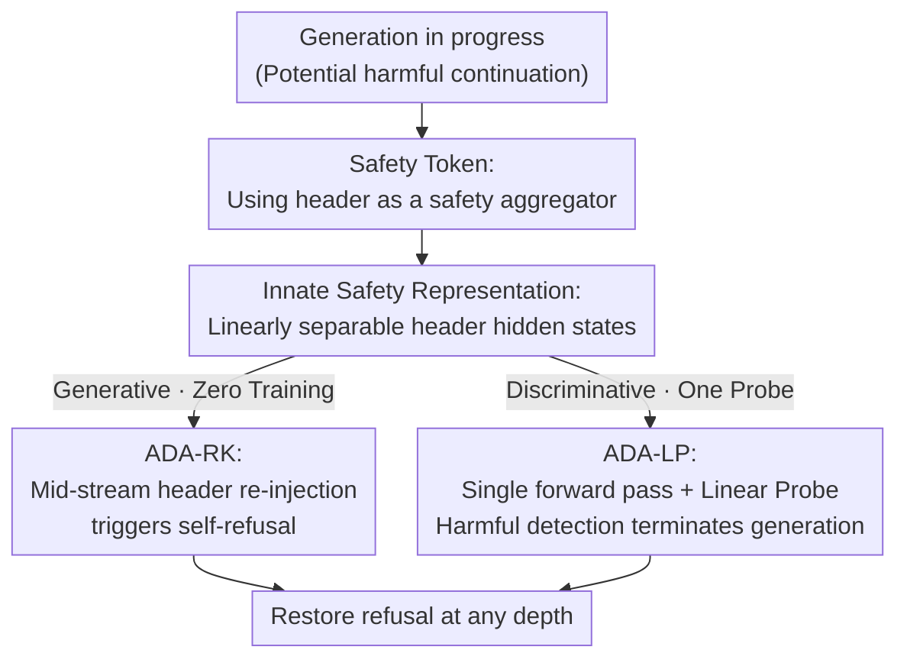

# Any-Depth Alignment: Unlocking Innate Safety Alignment of LLMs to Any-Depth

**Conference**: ICLR2026  
**OpenReview**: [https://openreview.net/forum?id=0fuYOuJyzl](https://openreview.net/forum?id=0fuYOuJyzl)  
**Code**: TBD  
**Area**: LLM Safety / Alignment / Inference-time Defense  
**Keywords**: Shallow alignment, prefill attack, Safety Token, linear probe, inference-time defense

## TL;DR
Addressing the pain point where LLMs fail to maintain "shallow alignment" once harmful continuation begins, this paper discovers that safety signals are firmly anchored in "safety tokens" such as the assistant header and can be reactivated at any generation depth. The authors propose Any-Depth Alignment (ADA)—either re-injecting the header into the generation stream to re-evoke the model's innate refusal (ADA-RK) or directly applying a linear probe to the header's hidden states to detect harmfulness (ADA-LP). Without modifying model weights, ADA restores the refusal rate of deep prefill attacks (thousands of tokens) to nearly 100% and suppresses the Attack Success Rate (ASR) of GCG/AutoDAN/PAIR/TAP to below 3%.

## Background & Motivation
**Background**: Currently, most aligned chat models adopt "shallow alignment"—where the training objective primarily focuses on the **very beginning** of the assistant's turn, producing a refusal (e.g., "I can't help with that") when encountering harmful queries. This "pre-positioned" safety is effective against direct harmful prompts.

**Limitations of Prior Work**: The protection of shallow alignment covers almost only the first step of generation. Once harmful continuation has started (whether induced by adversarial attacks or forced via harmful assistant-prefill in the context), the protection collapses. Figure 1 of the paper shows that with just a 25-token harmful prefix on AdvBench, the refusal rate of most models—including new models like gpt-oss—plummets from ~100% to below 10%.

**Key Challenge**: The industry's remedy is "deep alignment"—additionally training models to refuse midway through a continuation. However, systematic testing with "deep prefill attacks" (harmful prefixes ranging from dozens to thousands of tokens) reveals that deep alignment merely pushes the failure point further back, creating an arms race between "attack depth vs. alignment depth." Even strong deep-aligned models like Claude Sonnet 4 see refusal rates drop below 25% under 100-token prefixes. Another path—external guardrail classifiers—suffers from high latency, often tagging content only after the entire sequence is generated, by which point harmful content may have already been released. The root cause is that the model's recognition of "harmfulness" does not generalize to any depth, as safety judgment is locked into the decoding trajectory.

**Key Insight**: The authors notice an overlooked phenomenon: aligned models actually "know" internally whether their continuation is harmful but do not proactively express it. Simple self-reflection prompts ("Is your previous response harmful?") can often make them admit it. This indicates that strong safety signals do exist but are locked in hidden states and not decoded. Furthermore, special tokens in the chat template (especially the assistant header) can "surface" this latent judgment mid-stream.

**Core Idea**: The assistant header and similar tokens are redefined as "Safety Tokens"—aggregators that concentrate scattered harmful evidence from the context into a linearly separable representation. By **re-injecting** the header mid-generation, one can unlock the model's innate safety judgment like a key, restoring refusal at any depth. This can be achieved either by generating a refusal or simply by performing linear classification on the header's hidden states without actual decoding.

## Method

### Overall Architecture
ADA is an **inference-time, zero-training (or requiring only a lightweight probe), non-weight-modifying** defense. It is grounded in the observation that the model's innate judgment of harmfulness is highly concentrated in the hidden states of "safety tokens" (defaulting to the assistant header, e.g., `<|eot_id|><|start_header_id|>assistant<|end_header_id|>\n\n` in Llama-3.1). This signal can be reactivated at any generation depth by "mid-stream header re-injection."

Based on this observation, the paper first uses analysis experiments (t-SNE + linear probes) to confirm that the safety signal is concentrated in the header. It then implements two complementary defense variants: the generative **ADA-RK** (triggering the model's own refusal) and the discriminative **ADA-LP** (probing hidden states directly). During runtime, "safety checkpoints" are set at fixed depth intervals (e.g., every 25 or 100 tokens) to trigger ADA assessment; generation is terminated immediately if judged harmful.

### Key Designs

**1. Safety Token: Redefining the assistant header as a safety signal aggregator**

The pain point is that shallow alignment compresses the refusal capability into the very start of generation, causing it to fail at greater depths. The authors find that the assistant header—the special tokens bridging the "user query" and "assistant response"—is not just a template placeholder. Because it is used repeatedly during "shallow refusal training," it accumulates the model's strongest alignment priors. The paper names these "Safety Tokens." Defining the generation depth $d$ as the number of assistant tokens generated after the user prompt ($d=0$ follows the prompt immediately), the hidden states of safety tokens carry a strong innate safety signal, **aggregating** scattered harmful evidence into a clean discriminative quantity. Evidence from the t-SNE in Figure 3 shows that at $d=0$, features for both generated tokens and the header are entangled (explaining why adversarial prompts succeed—early representations are ambiguous). However, as depth increases, the features of the **injected safety tokens** become increasingly separable (linear classification accuracy rises from ~67% to 95%+), while the features of **generated content tokens** become more entangled. This suggests that the model's innate safety awareness actually strengthens with context but can only be cleanly read through safety tokens.

**2. Innate Safety Representation: High linear separability of header hidden states**

Since safety tokens aggregate evidence, the next question is whether they are "linearly separable." If so, a lightweight linear probe can read them. The authors construct a corpus of benign/harmful continuations from WildChat / WildJailbreak (20k/2k for training, 10k/1k for validation). Assistant responses are truncated to 500 tokens, with hidden states sampled every 25 tokens, resulting in 600k/60k samples to train a `LogisticRegression`. The results are robust (Figure 4 left): across all model families (Llama, Mistral, Gemma, DeepSeek, gpt-oss) and almost all layers, the validation accuracy of probing assistant-header hidden states is $>99.5\%$, consistently and significantly higher than probing the "last generated token." Figure 4 right further performs token selection ablation: tokens bound to the header (`assistant` role token, `<|eot_id|>`, `<|start_header_id|>`, etc.) show signals far stronger than general tokens (e.g., newline `\n`). The `assistant` role token often demonstrates the best separation, sometimes exceeding the final token of the entire header. This justifies why the header is used, why it is linearly separable, and which token is best, serving as the direct basis for ADA-LP.

**3. ADA-RK: Mid-stream header re-injection to trigger self-refusal**

This is the generative variant, requiring zero training. The mechanism sets checkpoints at periodic depths (e.g., every 100 tokens), **reusing the current KV cache to fork the generation stream**, and injects the assistant header safety tokens to perform a short lookahead (approx. 20 tokens). If a refusal appear in this lookahead, it is returned and the main generation stream is terminated; otherwise, the fork is discarded and the original sequence continues. Intuitively, the sudden insertion of the header forces the model to "re-evaluate whether the current trajectory is harmful," restoring refusal behavior. This leverages the model's **own ability to generate refusals**, meaning the stronger the base alignment, the more reliable ADA-RK becomes. The paper reports it restores the refusal rate of Claude Sonnet 4 to 95%+ under a 500-token deep prefill, without needing explicit reflection prompts like Self-Defense.

**4. ADA-LP: Single forward pass + Linear Probe for instant termination**

Since Design 2 proved harmfulness is linearly separable in hidden states, "making the model generate a refusal" becomes unnecessary. ADA-LP performs only **one forward pass** at the checkpoint, extracts the hidden state of the injected safety token, and applies the lightweight linear probe trained in Design 2. If judged harmful, generation is terminated immediately. Its probe is **trained once** on the Wild corpus and shows strong generalization across all downstream benchmarks in out-of-distribution evaluations. Compared to ADA-RK, it avoids additional decoding (faster, lower VRAM); compared to external guardrails, it requires no auxiliary models or weight updates—**the base model becomes its own guardrail**. Remarkably, even if some models (e.g., DeepSeek) appear less aligned at the "response level" and ADA-RK performs poorly, ADA-LP still achieves near 100% interception, indicating the safety signal persists in hidden states even if not verbalized.

## Key Experimental Results

### Main Results
Evaluations cover three threat models: deep prefill attacks, adversarial prompt attacks, and SFT attacks; it also measures over-refusal on benign tasks and inference overhead. Base models include Gemma 2, Llama 2/3.1, Qwen 2.5, DeepSeek-R1-Distill-Qwen-7B, gpt-oss, and Claude Sonnet 4. Deep prefill data is generated by a misaligned GPT model (attaining 100% ASR on AdvBench/JailbreakBench/StrongREJECT/HEx-PHI, with an average continuation exceeding 3500 tokens).

The table below shows refusal rates (↑ higher is better) under a 500-token harmful prefill ($d=500$) for base=gemma-2-9b-it:

| Method | AdvBench | JailbreakBench | HEx-PHI | StrongREJECT |
|------|----------|----------------|---------|--------------|
| Base Model | 0.4% | 0.0% | 1.3% | 0.0% |
| Deep Alignment | 58.1% | 56.0% | 47.0% | 61.3% |
| Self Defense | 99.2% | 95.0% | 95.0% | 98.7% |
| Llama-Guard-4-12B | 94.6% | 91.0% | 93.0% | 94.9% |
| Granite-Guardian-3.3-8b | 99.6% | 98.0% | 95.6% | 98.7% |
| ADA (RK) | 90.8% | 85.0% | 79.2% | 93.6% |
| **ADA (LP)** | **100.0%** | **100.0%** | **99.7%** | **100.0%** |

Adversarial prompt attacks (subset of AdvBench, ASR ↓ lower is better, gemma-2-9b-it): ADA-LP reduces the ASR of GCG/AutoDAN/PAIR/TAP to around 2%; whereas the base model is 56/92/70/88% respectively. Deep Alignment even reached 94% on AutoDAN (worse than the base). Overall, ADA-LP suppresses the average ASR of four attacks from >50% to 2%, reaching 0% for PAIR/TAP on Llama-2.

### Ablation Study

| Configuration | Key Metric ($d=500$ deep prefill refusal / Benign over-refusal) | Description |
|------|------|------|
| ADA (LP) Full | Near 100% / Only 0.4% on XSTest | Probing header hidden states + linear probe |
| Probing "Generated tokens" | Accuracy drops to ~51-55% with depth (Fig 3) | Loss of linear separability; validates "must probe header" |
| Injected token replaced by `\n` | Separability significantly lower than header tokens | Validates safety signal specificity to header tokens |
| ADA (RK) instead of LP | 79-94% (Varies by base alignment strength) | Generative works but weaker than LP; depends on base alignment |

Benign over-refusal (Table 1 right, lower is better): ADA-LP maintains nearly 0% on GSM8K/MATH/HumanEval/MMLU/GPQA and only 0.4% on XSTest (whereas the base model had 14.0% on XSTest), demonstrating highly precise termination with negligible false positives.

### Key Findings
- **Depth invariance is a core advantage of ADA-LP**: While the base model fails immediately and Deep Alignment is only effective at shallow depths (~40% refusal at $d=500$), ADA-LP maintains near 100% refusal within a depth of 2500 tokens because it reads the "innate representation" rather than surface-level output.
- **Safety signals exist even if not spoken**: DeepSeek may not appear well-aligned at the response level (moderate ADA-RK performance), but ADA-LP still intercepts nearly 100%, proving that the safety representation in hidden states is persistent and readable.
- **Resilience to SFT attacks** (Figure 7, Gemma-2): Just 50 steps of Alpaca benign fine-tuning can crash Deep Alignment's refusal rate at $d=100$ from 90% to 10%; however, ADA-LP maintains >99% refusal even after 1000 steps of benign SFT, and ~90% under adversarial SFT (~100% on Llama-2). Surface alignment is erased by fine-tuning, but the safety representation in hidden states persists.
- **Token Selection**: The `assistant` role token provides the best separation; a single assistant token is far superior to general tokens, making the method extremely simple to deploy.

## Highlights & Insights
- **"Safety token = Aggregator" is the true "Aha!" moment**: Reinterpreting the assistant header—previously seen as a template placeholder—as a probe for the model to aggregate scattered harmful evidence into a linearly separable quantity provides both a mechanistic explanation (why shallow training creates these priors) and a minimal implementation.
- **Dual implementation (RK/LP) cross-validates the observation**: RK proves "re-injecting the header can make the model change its mind," while LP proves "this judgment is already readable in hidden states." Together, they provide a complete narrative of how safety signals are locked in trajectories.
- **Zero weight modification, zero additional models, near-zero overhead**: ADA outperforms strong external guardrails on three threat models simultaneously. The philosophy of "letting the model be its own guardrail" is highly transferable.
- **Transferability**: The idea of "probing special aggregator tokens rather than content tokens" can be extended to hallucination detection, privilege escalation detection, content auditing, and any task where the model "knows the truth but doesn't say it."

## Limitations & Future Work
- **Dependence on base alignment priors**: ADA-RK specifically notes that stronger base alignment leads to more reliable unlocking. For models with virtually no safety alignment, the header might not have accumulated sufficient signals.
- **ADA-LP requires a trained probe**: Although lightweight and trained once, it still requires harmful/benign corpora. The OOD robustness of the probe on new domains, languages, or novel attacks requires further validation (the paper trained on Wild and tested on English benchmarks).
- **Checkpoint periodicity is a trade-off**: Large intervals allow harmful content to leak briefly, while small intervals increase forward pass overhead. The paper uses intervals of 25/100 tokens but does not provide a systematic safety-overhead curve in the main text.
- **Adaptive adversaries**: Once the method is public, attackers might attempt to interfere with header injection or camouflage hidden state distributions; the paper does not fully evaluate such "ADA-aware" adaptive opponents.

## Related Work & Insights
- **vs. Deep Alignment (Qi et al., 2025)**: Deep alignment modifies weights to train the model to refuse mid-stream. Experiments show it merely pushes the failure point deeper and is easily erased by a few SFT steps. ADA does not change weights, reads innate representations, is depth-invariant, and resists SFT.
- **vs. Self-Defense (Phute et al., 2023)**: Self-defense uses explicit reflection prompts to judge context, requiring extra long-form generation and failing on reasoning models. ADA-RK is also zero-training but requires no reflection prompt, and ADA-LP bypasses generation entirely.
- **vs. External Guardrails (Llama Guard / WildGuard / ShieldGemma / Granite-Guardian etc.)**: Guardrails are independent models with high latency that often tag content only after generation. ADA-LP uses the base model's own hidden states, allowing termination with a single forward pass—lower overhead with matching or superior performance.
- **vs. Prompt-end hidden state detection (Zhao et al., 2025)**: These methods are less reliable at $d=0$ due to feature entanglement. This paper notes that safety signals become separable as depth increases and only emerge cleanly on the injected header, representing a key difference in detection point selection.

## Rating
- Novelty: ⭐⭐⭐⭐⭐ The "safety token aggregation + any-depth reactivation" perspective is both novel and explanatory, leading directly to a minimal method.
- Experimental Thoroughness: ⭐⭐⭐⭐⭐ Covers 6+ model families, three threat models, depths up to 2500 tokens, including t-SNE, layer scanning, token ablation, and SFT resilience.
- Writing Quality: ⭐⭐⭐⭐⭐ Clear logical chain using Q1-Q4 to connect analysis, mechanism, and method, with strong supporting figures.
- Value: ⭐⭐⭐⭐⭐ A plug-and-play defense with zero weight changes and near-zero overhead, offering direct practical value for LLM safety deployment.

<!-- RELATED:START -->

## Related Papers

- [\[ICLR 2026\] The Alignment Waltz: Jointly Training Agents to Collaborate for Safety](the_alignment_waltz_jointly_training_agents_to_collaborate_for_safety.md)
- [\[ICLR 2026\] SOSBench: Benchmarking Safety Alignment on Six Scientific Domains](sosbench_benchmarking_safety_alignment_on_six_scientific_domains.md)
- [\[ICLR 2026\] Computational Barriers to Filtering for AI Alignment](computational_barriers_to_filtering_for_ai_alignment.md)
- [\[ACL 2026\] CAP: Controllable Alignment Prompting for Unlearning in LLMs](../../ACL2026/llm_safety/cap_controllable_alignment_prompting_for_unlearning_in_llms.md)
- [\[ACL 2026\] Reasoning Structure Matters for Safety Alignment of Reasoning Models](../../ACL2026/llm_safety/reasoning_structure_matters_for_safety_alignment_of_reasoning_models.md)

<!-- RELATED:END -->
