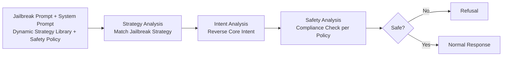

# ARMOR: Aligning Secure and Safe Large Language Models via Meticulous Reasoning

**Conference**: ICLR 2026  
**OpenReview**: [https://openreview.net/forum?id=Wx5xG7FPXK](https://openreview.net/forum?id=Wx5xG7FPXK)  
**Code**: [https://github.com/SaFo-Lab/armor](https://github.com/SaFo-Lab/armor)  
**Area**: LLM Security / Jailbreak Defense / Safety Alignment  
**Keywords**: Jailbreak Defense, Intent Extraction, Safety Reasoning, Strategy Library, Step-wise DPO, Test-time Scaling  

## TL;DR
ARMOR reformulates "jailbreak defense" as a "core malicious intent extraction" problem. Through a three-step "Meticulous Reasoning" process (Strategy Analysis → Intent Analysis → Strategic Safety Review) combined with a pluggable and updatable jailbreak strategy library, it reduces the success rate of advanced optimization-based jailbreak attacks from over 0.4 to 0.06.

## Background & Motivation
**Background**: Post-training alignment techniques such as SFT and RLHF reduce harmful outputs but remain vulnerable to jailbreak bypasses. Recent "system-2" methods (o1, STAIR, STAR-1) significantly enhance safety by assessing risks through reasoning before responding.

**Limitations of Prior Work**: This study discovers that these "safety reasoning" models largely fail against **advanced optimization-based jailbreaks** (e.g., AutoDAN-Turbo, Adversarial Reasoning). These attacks use LLM agents or tree searches to iteratively generate "seemingly harmless" prompts, concealing malicious goals within wrappers like role-playing or educational scenarios, which constitute out-of-distribution (OOD) attacks. Conventional safety models rely heavily on the distribution of safety data and struggle against OOD jailbreaks (e.g., o1 and STAR-1 reach ASRs of 0.66 and 0.88, respectively).

**Key Challenge**: Defending by "memorizing" jailbreak patterns is a dead end—new jailbreaks emerge continuously, and constant retraining (e.g., to counter FlipAttack) is prohibitively expensive.

**Goal**: To identify a defense mechanism that does not rely on enumerating jailbreak patterns and can generalize to unseen attacks.

**Key Insight**: **[Intent Normalization]** The authors observe that regardless of how elaborate the attack wrapper is, all jailbreaks eventually point to a single core malicious intent. By accurately extracting this core intent, OOD jailbreaks are "downgraded" to in-distribution direct harmful requests, which the model can immediately block (experiments confirm a 100% safety rate when the intent is correctly extracted). The key to extraction is **reverse engineering**: since a jailbreak prompt is generated by "given attack goal + applying a hidden strategy," identifying the strategy first allows for the reverse-derivation of the hidden real intent.

## Method

### Overall Architecture
ARMOR trains the model to perform a three-step **Meticulous Reasoning** process: matching which jailbreak strategy from an external library is used (Strategy Analysis), reverse-inferring the core intent based on that strategy (Intent Analysis), and finally performing a compliance check on the intent using safety policies (Safety Analysis), refusing to answer if it is unsafe. A critical design is providing the strategy library as an **external, pluggable component that can be dynamically replaced via the system prompt** during inference. The model learns to "use the strategy library" rather than "memorize all strategies," enabling generalization to unseen attacks. The pipeline consists of five stages: reasoning data construction, formatting, SFT training, inference, and step-wise preference learning/test-time scaling based on the "verifiable at each step" property.

### Key Designs

**1. Three-step Reasoning for Reverse Intent Extraction: Deconstructing Jailbreaks into Auditable Core Intents**
ARMOR does not directly judge whether "this prompt is harmful." Instead, it strips the wrapper in three steps. For data construction, two paths are used to generate triplets of {jailbreak prompt $x_i$, ground truth strategy $s_i^G$, ground truth intent $b_i^G$}: first, behavior-based, where LLMs rewrite a harmful behavior $b_i$ into a jailbreak prompt using a sampled strategy $s_i$ ($x_i = M(b_i, s_i)$); second, jailbreak-based, where strategies and intents are reverse-identified from existing jailbreak prompts $\{b_i, s_i\} = M(x_i)$ and filtered for safety. The LLM then completes the reasoning chain: strategy analysis $z_i^s = M(x_i, s_i^G)$, intent analysis $z_i^b = M(x_i, s_i^G, b_i^G)$, and safety analysis $z_i^c = M(b_i^G, h)$ (where $h$ is the safety policy). Steps are separated by `<step>`/`</step>` tokens to form the training output $\{z_i^s, z_i^b, z_i^c, y_i\}$.

**2. Dynamic Strategy Library + External System Prompt: Shifting from "Memorizing" to "Using Libraries"**
To ensure defense generalizes to unseen jailbreak methods, ARMOR places the strategy library (containing names, definitions, and examples) and safety policies into the system prompt rather than encoding them into weights. A key training technique is **randomly dropping irrelevant strategies** (dynamic strategy library $r_i$), forcing the model to learn "on-site retrieval and matching" instead of memorizing the library. This allows the model to use a custom strategy library during inference. The SFT objective is:

$$\mathcal{L}^{SFT}_\theta = -\mathbb{E}_{x,r}\big[\log P(z_i^s, z_i^b, z_i^c, y_i \mid x_i, r_i, h; \theta)\big]$$

Ablations show that without the strategy library, the WildJailbreak compliance rate jumps from 0.003 to 0.084, and removing the strategy analysis step increases it to 0.052, proving each link in the reverse chain is essential.

**3. Step-wise Grounded Preference Learning and Test-time Scaling: Gradual Safety Refinement with Verifiable Rewards**
Since each of the three reasoning steps has a ground truth (correct strategy, correct intent, correct safety judgment), ARMOR can score each step individually: $R_s = [r_{strategy}, r_{intent}, r_{safety}, r_{final}]^\top$. Specifically, it performs **grounded step-wise tree sampling**: $n$ candidates are sampled per step, scored by GPT-4o against the ground truth, and only the highest and lowest scoring nodes are expanded to form preference pairs for step-wise DPO. A PRM is also trained on this data for test-time scaling: during inference, beam search samples $m$ candidates and proceeds with the highest PRM score, or Best-of-N selects the best final answer. On the difficult ExHarm subset, safety increases from 0.74 to 0.92 as compute increases ($N=16$).

**4. ARMOR-Think: Decoupling Safety and General Reasoning to Save 2/3 Thinking Overhead**
To balance utility and efficiency, ARMOR-Think modifies training data in two ways: first, it **simplifies safety reasoning** by using GPT-4o to condense the three steps into $\tilde{z}$, reducing average tokens to 1/3; second, it **injects free thinking** for safe instructions by inserting CoT reasoning (generated by DeepSeek-Distilled-Qwen-7B) into the answer area using `<think>`/`</think>` tags. Since safety and general reasoning are decoupled, they can be rewarded separately via a **ternary reward** $R_{tr} = R_{st} \odot (I_s \odot R_s + I_h \odot R_h)$, where $R_{st}$ is the structural score, $R_s$ is the safety score, and $R_h$ is the helpfulness score. Indicator vectors $I_s, I_h$ toggle focus based on instruction safety.

## Key Experimental Results

The base model is Qwen2.5-7B-Instruct, with safety data comprising 15k harmful + 10k benign + 25k helpfulness prompts (50k total).

### Main Results (ASR / Compliance Rate, lower is better)

| Benchmark (↓) | o1 | o3-mini | Qwen-2.5 | STAIR-DPO | STAR-1 | **ARMOR** | **AR-Think** |
|---|---|---|---|---|---|---|---|
| AutoDAN-Turbo | 0.440 | 0.500 | 0.960 | 0.280 | 0.440 | **0.040** | 0.040 |
| AdvReasoning | 0.660 | 0.580 | 0.980 | 0.520 | 0.880 | 0.080 | **0.060** |
| avg. attack | 0.550 | 0.540 | 0.970 | 0.400 | 0.660 | 0.060 | **0.050** |
| avg. harmfulness| 0.068 | 0.076 | 0.261 | 0.049 | 0.081 | **0.002** | 0.009 |
| XSTest Safe (↑) | 0.900 | 0.888 | 0.968 | 0.716 | 0.680 | 0.860 | 0.842 |

ARMOR achieves an average ASR of only 0.06 on optimization-based jailbreaks (other reasoning models are >0.40) and an average harmfulness rate of 0.002 (95% lower than existing methods). In the over-refusal metric XSTest Safe (0.860), it significantly outperforms STAIR/STAR-1, demonstrating better differentiation between harmful and benign prompts.

### Ablation Study

| Configuration | PAIR (↓) | WildJailbreak (↓) |
|---|---|---|
| ARMOR (Full) | 0.016 | 0.003 |
| − w/o Strategy Analysis Step | 0.131 | 0.052 |
| − w/o Strategy Library | 0.020 | 0.084 |
| − w/o Safety Policy | 0.017 | 0.006 |

Regarding utility (GSM8k/MATH): ARMOR scores 0.86/0.76 (close to Qwen-2.5's 0.89/0.79), while AR-Think improves to 0.91/0.84, surpassing DeepSeek-R1-Distill-Qwen-7B (0.90) on GSM8k.

### Key Findings
- **Sequential Accuracy**: Accuracy in strategy analysis → intent analysis → safety analysis → final answer propagates through the chain. Safety is 100% when intent is extracted correctly; even if wrong, strategic safety reviews can correct some errors.
- **Tool Competence is Essential**: Providing Qwen/o1/o3-mini with the same strategy library and safety policy improves safety, but they remain far behind ARMOR, suggesting the "tool-usage capability" of Meticulous Reasoning is the key.
- **Generalization to Unseen Strategies**: ARMOR can reduce the attack success rate to near zero even for unseen jailbreak strategies.
- **Efficiency**: AR-Think reduces the token overhead for safety reasoning by 2/3 compared to ARMOR.

## Highlights & Insights
- **Elegant Problem Reformulation**: By reducing the open-ended problem of "identifying diverse jailbreak wrappers" to the bounded problem of "extracting the unique core intent," OOD jailbreaks are downgraded to in-distribution cases, solving generalization at the root.
- **Reverse Engineering Logic**: Identifying the hidden strategy before reverse-inferring the intent is more robust than direct judgment because the attacker's "generation process" is inherently reversible.
- **Benefits of Verifiability**: Each of the three reasoning steps has a ground truth, naturally suiting step-wise DPO and PRM test-time scaling—"process verifiability" is a unique advantage of safety reasoning over general reasoning.
- **Tool Componentization**: Placing the strategy library in the system prompt rather than the weights allows for updating against new jailbreaks without retraining, providing significant engineering value.

## Limitations & Future Work
- **Reliance on External LLMs**: Data construction and step-wise scoring depend heavily on GPT-4o; the quality of strategy and intent labels sets the performance ceiling.
- **Threat Model Assumptions**: Assumes an LMaaS scenario where attackers cannot see the thinking process or system prompt. If the strategy library or safety policies are leaked or injected, the defense could be bypassed.
- **Minor Utility Loss**: ARMOR's MATH score (0.76) is lower than the base model's (0.79); the pure safety version incurs a "safety tax" that requires AR-Think's free thinking to recover.
- **Strategy Library Coverage**: While it generalizes well, if an attacker constructs a strategy entirely orthogonal to everything in the library, the effectiveness of the reverse reasoning remains to be tested against more adversarial scrutiny.

## Related Work & Insights
- **vs STAIR / STAR-1 / o1 (Safety Reasoning)**: While all perform safety assessment at inference time, ARMOR structures reasoning as "Strategy → Intent → Compliance" and introduces an external library, addressing their failure on OOD jailbreaks.
- **vs Deliberative Alignment (Policy Reasoning)**: Both emphasize policy reasoning, but ARMOR adds "reverse intent extraction" and step-wise verifiable rewards.
- **vs Optimization-based Jailbreaks**: These advanced attacks are the primary target, proving "Intent Normalization" is an effective line of defense against adaptive attacks.
- **Insights**: For any OOD input defense, reducing diverse attack appearances to a single invariant (core intent) may be more sustainable than enumerating attack patterns; "process-verifiable" task structures unlock the potential for step-wise RL and test-time scaling.

## Rating
- Novelty: ⭐⭐⭐⭐ The reformulation of "jailbreak as a hidden core intent" + reverse strategy reasoning is clear and sound; the pluggable library design is also clever.
- Experimental Thoroughness: ⭐⭐⭐⭐ Covers 2 types of optimized jailbreaks, 8 safety benchmarks, utility/efficiency, and test-time scaling; ablations confirm the necessity of each component.
- Writing Quality: ⭐⭐⭐⭐ Motivation progresses naturally (Figures 1/2 establish the premise), with clear explanations of methods and formulas.
- Value: ⭐⭐⭐⭐ Reducing advanced jailbreak ASR to 0.06 without needing retraining for new attacks has direct practical value for production-level LLM safety.

<!-- RELATED:START -->

## Related Papers

- [\[AAAI 2026\] SproutBench: A Benchmark for Safe and Ethical Large Language Models for Youth](../../AAAI2026/llm_safety/sproutbench_a_benchmark_for_safe_and_ethical_large_language_models_for_youth.md)
- [\[ICLR 2026\] Reasoning or Retrieval? A Study of Answer Attribution on Large Reasoning Models](reasoning_or_retrieval_a_study_of_answer_attribution_on_large_reasoning_models.md)
- [\[ICLR 2026\] Strategic Obfuscation of Deceptive Reasoning in Language Models](strategic_obfuscation_of_deceptive_reasoning_in_language_models.md)
- [\[ACL 2026\] Reasoning Hijacking: The Fragility of Reasoning Alignment in Large Language Models](../../ACL2026/llm_safety/reasoning_hijacking_the_fragility_of_reasoning_alignment_in_large_language_model.md)
- [\[ICLR 2026\] wd1: Weighted Policy Optimization for Reasoning in Diffusion Language Models](wd1_weighted_policy_optimization_for_reasoning_in_diffusion_language_models.md)

<!-- RELATED:END -->
