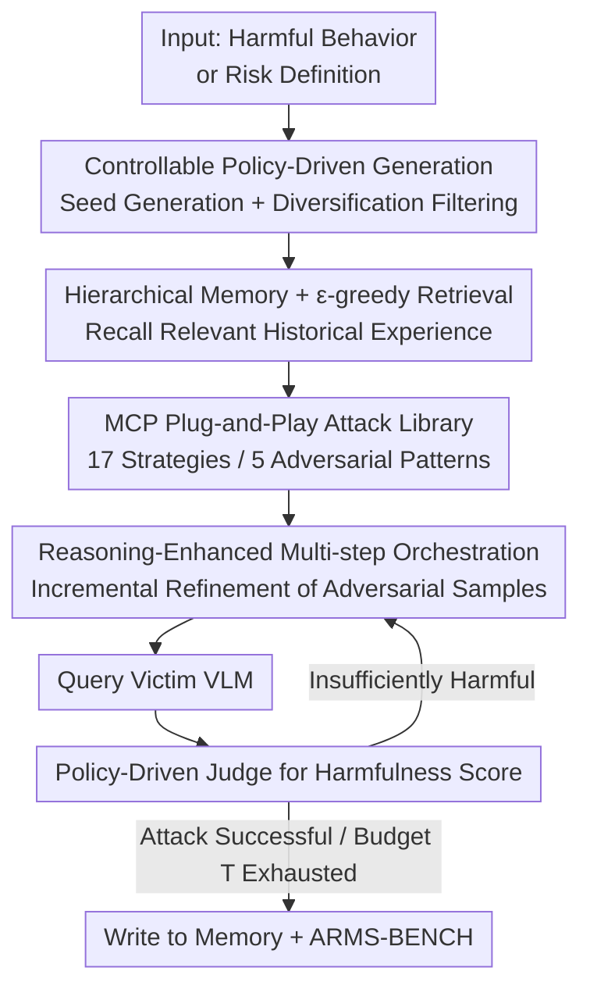

# ARMS: Adaptive Red-Teaming Agent against Multimodal Models with Plug-and-Play Attacks

**Conference**: ICLR 2026  
**OpenReview**: [https://openreview.net/forum?id=wQ4OykcxaV](https://openreview.net/forum?id=wQ4OykcxaV)  
**Code**: To be confirmed (Authors promise to open source on GitHub + HuggingFace)  
**Area**: Multimodal Security / Red-Teaming / VLM Jailbreaking  
**Keywords**: Multimodal Red-teaming, VLM Security, Adaptive Attack, Hierarchical Memory, MCP Plug-and-Play

## TL;DR
ARMS is the first adaptive red-teaming agent for Vision-Language Models (VLMs) capable of controllable generation of attack samples based on "risk definitions." It encapsulates 17 multimodal attacks into MCP servers for plug-and-play orchestration, utilizes a "Risk Category × Attack Strategy" two-dimensional hierarchical memory coupled with $\epsilon$-greedy exploration to counter mode collapse and maximize attack diversity. It improves the Attack Success Rate (ASR) by an average of 52.1 percentage points over the strongest baseline across 6 evaluations, even breaking the robust Claude-4-Sonnet with 90%+ ASR.

## Background & Motivation
**Background**: As VLMs are deployed at scale in scenarios such as visual question answering, autonomous driving, and medical diagnosis, their multimodal interfaces introduce security vulnerabilities absent in text-only models. Examples include cross-modal injections generating harmful content, rendering private text as images (typographic transformation) to bypass text filters, or triggering dangerous behaviors via visual reasoning backdoors. To evaluate these risks, red-teaming—actively constructing adversarial samples to induce harmful outputs—is the mainstream approach.

**Limitations of Prior Work**: Existing VLM red-teaming frameworks suffer from three major flaws. First, most rely on **static benchmarks**, failing to keep pace with the rapid iteration of real-world risks and VLM architectures. Second, the adversarial patterns covered are **narrow**, often focusing on a few human-designed patterns. Third, they suffer from **heavy reliance on manual engineering**, lacking the ability to discover risks at scale. A few automated red-teaming frameworks (Rainbow Teaming, AutoDAN-Turbo, X-Teaming, etc.) exist, but they are **almost entirely text-based**, missing failure modes unique to multimodal interfaces (e.g., typographic transformation).

**Key Challenge**: Automated red-teaming commonly suffers from **mode collapse**—even when risk definitions change, the attacker repeatedly applies the same prompt templates or image modifications, leading to extremely low attack diversity. Thus, the problem lies in maintaining **attack diversity (covering multiple risks and strategies)** while ensuring **attack effectiveness (high ASR)**, as there is a natural tension between the two.

**Goal**: To build an automated, scalable, multimodal-centric VLM security evaluation framework with **controllable generation driven by risk definitions**. This is decomposed into three sub-problems: (1) How to uniformly integrate and expand diverse multimodal attacks; (2) How to enable the agent to perform multi-step reasoning and orchestration beyond simple strategy selection; (3) How to enforce diversity at the memory mechanism level to counter mode collapse.

**Key Insight**: The authors first conducted expert-guided multimodal red-teaming, summarizing successful attacks into **5 adversarial patterns** and designing 11 new multimodal attack strategies. Each strategy is encapsulated as an independent server using the Model Context Protocol (MCP), allowing the agent to combine them as plug-and-play tools. Finally, a "Risk × Strategy" two-dimensional memory is used to explicitly balance coverage.

**Core Idea**: Replacing "fixed templates/single-strategy routing" with an "MCP plug-and-play toolset + reasoning-enhanced multi-step attack orchestration + risk × strategy hierarchical memory ($\epsilon$-greedy scheduling)." This enables the red-teaming agent to adaptively synthesize effective and diverse multimodal attacks driven by risk definitions.

## Method

### Overall Architecture
ARMS aims to solve the following: given a **harmful behavior** (instance-based, using existing harmful instructions) or a **high-level risk definition** (policy-based, given only a policy description), it automatically generates multimodal adversarial samples that can breach the target VLM while accumulating experience and maintaining attack diversity.

The pipeline functions as follows: In policy-based mode, ARMS first samples seed harmful instructions from the risk distribution $P$ and performs diversification filtering to obtain a set of instructions covering the policy's violation space (instance-based mode skips this and uses existing instructions $x$). Upon receiving instruction $x$, ARMS queries its **hierarchical memory** using an $\epsilon$-greedy algorithm to recall relevant successful experiences. Using its multimodal reasoning capabilities, it **selects and orchestrates** attack strategies from the MCP attack library in multiple steps, incrementally refining the current adversarial sample $I^t_{adv}=(\text{Image}^t_i,\text{Text}^t_i)$ into $I^{t+1}_{adv}$ at each step. ARMS either continues to superimpose another strategy to refine the current sample or queries the victim VLM with the current sample to obtain a response $y^{t+1}$, which is passed to a **policy-based LLM judge** for a harmfulness score $J(y)$. If the response is not sufficiently harmful, ARMS iteratively enhances the attack using judge feedback until success is achieved or the optimization budget $T$ (default $T=30$) is exhausted. The objective is formalized as: for each harmful instruction $x_i$, optimize the adversarial sample to maximize the expected harmfulness score $\mathbb{E}_{x_i\sim P}[J(M(\pi_{ARMS}(x_i)))]$, where $M$ is the victim VLM and $\pi_{ARMS}$ is the red-teaming agent enhanced by the memory module $D_\theta$.

### Key Designs

**1. Unified MCP Plug-and-Play Attack Library: 17 Attacks as Hot-Swappable Tools**

Existing frameworks either have hardcoded strategies or isolated strategies, making it difficult to integrate new attacks or combine them flexibly. ARMS encapsulates each red-teaming strategy as an independent **MCP server** (Model Context Protocol, Anthropic 2024). Strategies are requested by the agent via the MCP transport protocol as external tools. This provides three benefits: modular execution, efficient communication, and seamless expansion for external contributors. The 17 attacks cover 5 patterns: **Visual Context Camouflage** (rule-based embedding of prompts in flowcharts/compliance images, email/Slack/news report disguises, roleplay, narrative masking), **Typographic Transformation** (evil logic as flowcharts, numbered list images bypassing keyword and OCR detection), **Visual Multi-round Escalation** (Crescendo progressive escalation, Actor attack splitting malicious roles among fictional agents, Acronym expanding harmless abbreviations to harmful meanings), **Visual Reasoning Hijacking** (multimodal backdoor triggers, many-shot mixup diluting adversarial input, forged function-calls deceiving models into "executing" fake functions), and **Visual Perturbation** (low-level distortion, jigsaw shuffling, multimodal misalignment). These strategies serve as "seeds" for multi-step orchestration.

**2. Reasoning-Enhanced Multi-step Attack Orchestration: Orchestration Over Routing**

A natural question is whether ARMS simply routes requests to the most effective strategy. The authors compared ARMS to a "brute-force oracle" that exhaustively tried all strategies per request. On StrongReject against Claude-3.7, this oracle achieved only 84.0% ASR, significantly lower than ARMS's 95.2%. This indicates ARMS does more than routing: it utilizes strong multimodal reasoning to **proactively optimize and orchestrate** strategies across multiple steps—either serially (one strategy's output feeding the next) or in parallel—to synthesize composite adversarial samples that single strategies cannot produce. Each step uses judge feedback for targeted enhancement. This "multi-step reasoning orchestration" is the core reason ARMS outperforms pure routing and text-only automated red-teaming. Ablations confirm this: disabling reasoning drops ASR by 12.3 percentage points, a much larger impact than removing the visual modality (-3.1 pp).

**3. Diversity-Enhanced Hierarchical Memory + ε-greedy Scheduling: Countering Mode Collapse**

To achieve both "effectiveness" and "diversity," ARMS maintains a memory indexed two-dimensionally by **Risk Category $c_r$ × Dominant Attack Strategy $s_a$**: $D=\{D[c_r,s_a]=\zeta \mid c_r\in C, s_a\in S\}$, where each slot stores a high-scoring attack trajectory $\zeta$. This schema enforces a balanced distribution across risk and strategy spaces. **Memory Update**: After the $i$-th trajectory, its risk category $c^i_r$ and most effective strategy $s^i_a$ are extracted; if the slot is occupied, the trajectory is **replaced only if the new harmfulness score is higher**. **Memory Retrieval**: The agent explores without memory with probability $\epsilon_i$, otherwise it recalls stored trajectories. $\epsilon$ decays exponentially:
$$\epsilon_i = \epsilon_{min} + (\epsilon_{max}-\epsilon_{min})\cdot\exp(-\lambda\cdot(i-1)),$$
allowing ARMS to shift from wide exploration to focused exploitation (default $\epsilon_{max}=1.0, \epsilon_{min}=0.1, \lambda=1.0$). During exploitation, top-$k$ memories are retrieved based on a similarity score considering both categories and prompts:
$$\text{score}(\zeta) = \cos(\phi(c^i_r),\phi(c^\zeta_r)) + \alpha\cdot\cos(\phi(x_i),\phi(x^\zeta)),$$
where $\phi$ is an embedding function and $\alpha$ (default 1.2) balances category-level and prompt-level similarity.

### Loss & Training
ARMS does not train the victim model during the attack; it uses an off-the-shelf LLM as the agent backbone (default GPT-4o, temperature=0.8) for test-time optimization (budget $T=30$). Its outputs are used for safety alignment: **ARMS-BENCH** is constructed from diverse vulnerabilities discovered (30K samples, 51 categories, including 27,776 single-turn and 2,224 multi-turn dialogues). Harmful responses are replaced with "reasoning-enhanced refusals" (explaining why the request is rejected and which policy was violated), combined with deep safety alignment data for safety fine-tuning of victim VLMs.

## Key Experimental Results

### Main Results
Evaluation used two settings: instance-based (StrongReject, JailbreakBench, JailbreakV) and policy-based (aligned with EU AI Act, OWASP, FINRA). Metric: Attack Success Rate (ASR%). GPT-4o served as the judge; policy-based evaluation used a 5-point Likert scale (success requires score $\tau=5$). Victim models included 4 closed-source (Claude-4/3.7/3.5-Sonnet, GPT-4o) and InternVL3 series.

| Victim Model | Method | StrongReject | JailbreakBench | JailbreakV | EU AI Act | OWASP | FINRA |
|---|---|---|---|---|---|---|---|
| Claude-4-Sonnet | X-Teaming (Strongest Baseline) | 57.7 | 26.0 | 35.0 | 40.0 | 13.8 | 33.8 |
| Claude-4-Sonnet | **ARMS (Ours)** | **93.3** | **89.0** | **73.8** | **75.4** | **96.0** | **91.3** |
| Claude-3.7-Sonnet | X-Teaming | 72.1 | 75.0 | 40.0 | 49.2 | 56.0 | 75.0 |
| Claude-3.7-Sonnet | **ARMS (Ours)** | **95.2** | **90.0** | **72.5** | **81.5** | **98.0** | **95.0** |
| GPT-4o | X-Teaming | 86.5 | 79.0 | 52.5 | 49.2 | 50.0 | 71.3 |
| GPT-4o | **ARMS (Ours)** | **93.1** | **90.0** | **82.5** | **76.9** | **94.0** | **93.8** |
| InternVL3-38B | X-Teaming | 82.7 | 86.0 | 51.3 | 50.8 | 54.0 | 75.0 |
| InternVL3-38B | **ARMS (Ours)** | **98.5** | **98.0** | **87.5** | **87.7** | **100.0** | **100.0** |

ARMS outperformed the strongest baseline across all 6 evaluations and 5 victim models, with an average gain of ~52.1 pp over X-Teaming. It broke the constitutionally-aligned Claude-4-Sonnet to 90%+ ASR on 3 evaluations. Breaking down ASR by 45 risk categories, ARMS achieved ≥90% ASR in 32 categories and never dropped below 40%, being the only method to consistently breach high-stakes risks like "cryptographic cracking" and "market manipulation."

**Diversity**: Measured by $1-\cos(\text{CLIP}(x),\text{CLIP}(y))$, ARMS averaged 0.423, significantly higher than X-Teaming (0.216), SI-Attack (0.294), and FigStep (0.205), representing a ~95.83% increase in diversity over X-Teaming.

### Safety Alignment / Fine-tuning (ARMS-BENCH, lower ASR is better)

| Configuration | ARMS-ASR↓ (inst) | ARMS-ASR↓ (policy) | MMMU↑ | MathVista↑ |
|---|---|---|---|---|
| InternVL3-38B Original | 98.5 | 87.7 | 63.8 | 71.0 |
| ++JailbreakV SFT | 98.0 | 87.7 | 60.0 | 69.0 |
| **++ARMS-BENCH SFT** | **69.6** | **29.2** | **64.5** | **71.7** |

Fine-tuning with ARMS-BENCH achieved the best trade-off between robustness and utility: dropping ARMS ASR from 98.5% to 69.6% (instance-based) and 87.7% to 29.2% (policy-based), while improving general capabilities on MMMU/MathVista.

### Ablation Study

| Configuration | Key Metric (StrongReject vs Claude-3.7) | Description |
|---|---|---|
| Full ARMS | 95.2% ASR | Full model |
| top-$k$=0 (No memory) | 89.4% | -5.8 pp without memory recall |
| top-$k$=7 (Excessive recall) | 85.6% | Performance drops due to context pollution |
| w/o Vision Modality | -3.1 pp | Cross-modal perception contributes to attacks |
| w/o Reasoning | -12.3 pp | Multi-step reasoning is the primary contributor |
| $\lambda$=0 (No exploitation) | 86.0% | $\epsilon$-greedy degrades to pure exploration (-9.2 pp) |
| Backbone: Qwen3-235B | 80.6% | Stronger multimodal backbones yield better performance |

### Key Findings
- **Reasoning > Memory > Vision**: Disabling reasoning causes the largest drop (12.3 pp), indicating ARMS's power stems from its multi-step orchestration rather than mere strategy stacking.
- **Memory should be "Quality over Quantity"**: top-$k$ peaks at $k=3$ (95.2%); $k=7$ drops to 85.6%, as too much historical data pollutes the context.
- **$\epsilon$-greedy "Explore then Exploit" is essential**: $\lambda=0$ (no exploitation) drops performance to 86.0%.
- **Stronger Judges yield higher ASR**: Switching the judge from GPT-4o to o3-mini increased policy-based ASR from 76.9% to 100.0%, suggesting stronger judges detect subtler harmful responses.
- **Larger models are more fragile**: For InternVL3 (2B to 38B), ARMS consistently achieved >87% ASR, and the 38B model was the most thoroughly breached, showing that robustness does not monotonically increase with scale.

## Highlights & Insights
- **First "Risk Definition → Controllable Attack Generation"**: Unlike prior works that require specific harmful instructions, ARMS can automatically generate corresponding attacks given only a policy or risk definition.
- **MCP as a Command Bus for Attack Plugins**: Using MCP servers creates a hot-swappable tool ecosystem for red-teaming, allowing near-zero-cost integration of new strategies—a paradigm transferable to defense or other agentic evaluations.
- **"Oracle Comparison" Experiment**: Using an exhaustive oracle (84.0%) as a baseline to prove ARMS (95.2%) performing true orchestration rather than simple routing is a highly convincing experimental design.
- **Hierarchical Binning for Diversity**: Embedding coverage balance directly into the data structure via "Risk × Strategy" indices is cleaner than post-hoc diversity regularization and provides a reusable paradigm against mode collapse.
- **Closed-loop Alignment**: Discovered vulnerabilities → ARMS-BENCH collection → Safety fine-tuning. This demonstrates a positive cycle where red-teaming products improve model alignment without degrading general utility.

## Limitations & Future Work
- **Reliance on Strong Commercial Backbones/Judges**: Defaulting to GPT-4o/o3-mini raises concerns about cost and reproducibility when using open-source models like Qwen3-235B (80.6% ASR).
- **Judge as the Ceiling**: ASR is highly sensitive to the judge's discriminative power, meaning results may vary significantly based on judge selection.
- **Dual-use and Misuse Risks**: As a highly effective multimodal jailbreak generator, its open-sourcing presents clear risks of misuse despite the provided defensive datasets.
- **Policy Drift**: The framework is tied to specific policy versions (EU AI Act 2024/2025); continuous maintenance is required to remain relevant.
- **Diversity Metric as a Proxy**: CLIP cosine distance is a proxy that may not perfectly reflect true semantic or mechanism-level diversity.

## Related Work & Insights
- **vs. Optimization-based Attacks (PGD/Perturbation)**: These use white-box or heavy black-box queries for imperceptible pixel changes. ARMS is black-box, strategy-level, and interpretable, offering better scalability.
- **vs. Strategy-based Attacks (FigStep / SI-Attack)**: These use human-readable patterns (tokens in images, flowcharts). They are lightweight but narrow and fragile. ARMS treats them as "seed strategies" for reasoning-enhanced orchestration.
- **vs. Automated Red-teaming Agents (X-Teaming / Rainbow Teaming)**: These are mostly text-only and suffer from mode collapse. ARMS is multimodal-centric, supports policy-driven evaluation, and significantly outperforms them (93.1% vs 63.5% on StrongReject).
- **vs. Early Multimodal Agents (Arondight / RTVLM)**: These process modalities separately. ARMS performs explicit cross-modal orchestration and is the first to combine multimodal focus, diverse strategies, plug-and-play tools, and policy-driven evaluation.

## Rating
- Novelty: ⭐⭐⭐⭐⭐ First controllable multimodal red-teaming agent via risk definitions; original MCP tooling + hierarchical memory.
- Experimental Thoroughness: ⭐⭐⭐⭐⭐ 8 victim models × 6 evaluations + diversity metrics + safety fine-tuning + rigorous ablations with oracle tests.
- Writing Quality: ⭐⭐⭐⭐ Clear structure and solid motivation; some specific ablation details require appendix lookup.
- Value: ⭐⭐⭐⭐⭐ Closed-loop alignment + 30K safety dataset + regulatory alignment; highly practical for VLM security evaluation.

<!-- RELATED:START -->

## Related Papers

- [\[ICLR 2026\] RedCodeAgent: Automatic Red-teaming Agent against Diverse Code Agents](redcodeagent_automatic_red-teaming_agent_against_diverse_code_agents.md)
- [\[ICLR 2026\] Tree-based Dialogue Reinforced Policy Optimization for Red-Teaming Attacks (DialTree)](tree-based_dialogue_reinforced_policy_optimization_for_red-teaming_attacks.md)
- [\[ICLR 2026\] PLAGUE: A Plug-and-Play Framework for Multi-Turn Jailbreaking Driven by Lifelong Learning](plague_plug-and-play_framework_for_lifelong_adaptive_generation_of_multi-turn_ja.md)
- [\[ICLR 2026\] STAR: Strategy-driven Automatic Jailbreak Red-teaming for Large Language Model](star_strategy-driven_automatic_jailbreak_red-teaming_for_large_language_model.md)
- [\[ICLR 2026\] Sampling-aware Adversarial Attacks against Large Language Models](sampling-aware_adversarial_attacks_against_large_language_models.md)

<!-- RELATED:END -->
