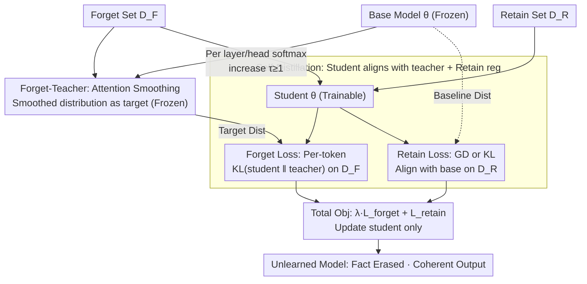

# Attention Smoothing Is All You Need For Unlearning

**Conference**: ICLR 2026  
**arXiv**: [2603.01285](https://arxiv.org/abs/2603.01285)  
**Authors**: Saleh Zare Zade, Xiangyu Zhou, Sijia Liu, Dongxiao Zhu (Wayne State University, Michigan State University)  
**Area**: AI Safety  
**Keywords**: LLM unlearning, attention smoothing, self-distillation, privacy protection, knowledge unlearning  

## TL;DR
The authors propose Attention Smoothing Unlearning (ASU), which constructs a forget-teacher by increasing the self-attention softmax temperature. This reformulates unlearning as a self-distillation task—smoothing attention distributions to weaken lexical and semantic associations. This approach erases memorized knowledge while maintaining output coherence, outperforming existing unlearning methods on benchmarks such as TOFU, MUSE, and WMDP.

## Background & Motivation

**Background**: LLMs memorize sensitive, copyrighted, or harmful content during large-scale training, posing privacy and legal risks. Since retraining from scratch is prohibitively expensive, LLM unlearning has emerged as an efficient alternative.

**Limitations of Prior Work**:
   - **Divergence-based**: Methods like Gradient Ascent (GA) or NPO reverse learning by pushing parameters away from the original converged solution. The challenge lies in controlling the unlearning intensity—insufficient unlearning leaves traces, while excessive unlearning leads to severe model degradation.
   - **Convergence-based**: Methods like IDK (using "I don't know" as the target) or DPO guide the model to a new state. These often suffer from over-ignorance and are typically restricted to QA formats, failing to generalize to free-text generation.

**Key Challenge**: Existing methods frequently produce gibberish outputs when handling prompts related to the forget set, exposing the traces of unlearning. The root cause is the failure to thoroughly eliminate lexical and semantic associations within attention weights—associations that allow the model to retrieve relevant contextual or factual information.

**Key Insight**: This work directly targets the attention mechanism. By increasing the softmax temperature to smooth the attention distribution, the method disrupts factual information retrieval at its source while preserving grammatical structure and linguistic coherence.

## Method

### Overall Architecture

ASU reframes the problem of unlearning: previous methods generate gibberish because they fail to sever factual associations within attention, merely pushing parameters away (divergence) or replacing them with fixed templates (convergence). ASU instead reformulates unlearning as **self-distillation**. It first creates a **forget-teacher** from the original model via "attention smoothing," then trains a **student** (the model to be unlearned, initialized from the original) on the forget set $\mathcal{D}_F$ to align with the teacher's blurred output distribution. A regularization term on the retain set $\mathcal{D}_R$ maintains utility. The process introduces only one temperature hyperparameter $\tau$ without external models or extra parameters; the "target" for unlearning is naturally provided by the teacher.

### Key Designs

**1. Forget-Teacher: Smoothing factual associations via attention temperature**

Standard methods fail because they do not sever the precise link that allows models to "retrieve" facts. ASU intervenes in the attention mechanism by inserting a temperature $\tau \geq 1$ into the softmax of each layer $\ell$ and head $h$, rewriting the standard attention $\text{Softmax}(\frac{Q_h K_h^T}{\sqrt{d_k}})$ as $\text{Softmax}(\frac{Q_h K_h^T}{\tau\sqrt{d_k}})$. As $\tau$ increases, the entropy of the attention distribution rises, making it more uniform. Precise associations between tokens are diluted, preventing factual retrieval. This frozen, smoothed model serves as the forget-teacher.

A key empirical finding is that factual tokens are significantly more sensitive to $\tau$ than functional tokens (e.g., "is", "the"). Increasing $\tau$ causes a much larger spike in Negative Log-Likelihood (NLL) for factual tokens. This differential response allows ASU to erase facts without collapsing the entire sentence into gibberish.

**2. Self-Distillation Objective: Student alignment and retain set regularization**

Unlearning is executed by minimizing the per-token KL divergence between the student and the forget-teacher on $\mathcal{D}_F$:

$$\mathcal{L}_{\text{ASU}} = \mathbb{E}_{(x,y)\sim\mathcal{D}_F}\Big[\frac{1}{T}\sum_{t=1}^T \text{KL}\big(p(\cdot\mid x \circ y_{<t}; \theta_\tau) \,\big\|\, p(\cdot\mid x \circ y_{<t}; \theta)\big)\Big]$$

where $\theta_\tau$ is the forget-teacher and $\theta$ is the student. To maintain utility, standard Gradient Descent (GD) or KL regularization against the base model is applied to $\mathcal{D}_R$, denoted as $\text{ASU}_\text{GD}$ and $\text{ASU}_\text{KL}$. Unlike fixed templates like IDK, this target is dynamically generated by the teacher, ensuring the model remains format-agnostic.

## Key Experimental Results

### Experimental Settings
- **TOFU Benchmark**: 200 fictitious authors, evaluated on forget01/05/10 subsets using Llama-2-Chat-7B.
- **MUSE Benchmark**: News and Books domains, evaluating Verbatim Memorization (VerbMem), Knowledge Memorization (KnowMem), and Privacy Leakage (PrivLeak).
- **WMDP Benchmark**: Focuses on hazardous knowledge removal.
- **Sequential Unlearning**: Simulates rolling "Right to Be Forgotten" requests.
- **Real-world Unlearning**: Uses real-person information memorized by the model.
- **Metrics**: Harmonic mean of Model Utility (MU) and Forget Efficacy (FE).

### Main Results

1. **TOFU Benchmark**: $\text{ASU}_\text{KL}$ achieved MU=77.13/FE=83.08 (Avg=80.10) on forget01, significantly outperforming baselines. Compared to $\text{IDK}_\text{AP}$, ASU improved unlearning efficacy by approximately 30% (forget10: 61.27 $\to$ 78.16) while maintaining comparable utility.

2. **Sequential Unlearning**: GA collapsed immediately, while NPO and IDK degraded progressively. ASU maintained an average score of ~75 even after forgetting 90% of authors, showing much slower degradation.

3. **Real-world Unlearning**: $\text{ASU}_\text{KL}$ achieved the best trade-off with MU=55.76/FE=79.60. Other methods either suffered from MU collapse (DPO, IDK) or low FE (GA, NPO).

4. **MUSE Benchmark**: $\text{ASU}_\text{GD}$ reduced VerbMem to 4.9 in the Books category (vs. 53-54 for NPO), demonstrating superior unlearning. $\text{ASU}_\text{KL}$ maintained KnowMem=62.5 (close to Retrain's 68.7) while achieving effective forgetting.

### Ablation Study

1. **Partial Layer Smoothing**: Smoothing only shallow layers (e.g., layers 6-8) yielded results close to full-layer smoothing (Avg 78.11 vs. 80.10). This supports the hypothesis that factual knowledge relies on shallow attention associations.
2. **Combination with IDK**: ASU can be stacked with IDK to further boost FE (forget10: FE increased from 61.27 to 86.94) while keeping MU above 75.
3. **Temperature Stability**: Performance remained consistent across $\tau \in [2.0, 2.8]$, indicating low sensitivity to this hyperparameter.

## Highlights & Insights

1. **Elegant Mechanism**: The approach translates unlearning into attention blurring, providing high interpretability. The discovery that factual tokens and syntax tokens respond differently to temperature is insightful.
2. **Connection to Knowledge Editing**: The finding that shallow layers are critical mirrors observations in ROME/MEMIT, suggesting that factual knowledge is stored in specific localized structures within Transformers.
3. **Robustness in Sequential Scenarios**: ASU's ability to handle multiple consecutive unlearning requests (Right to Be Forgotten) makes it highly suitable for real-world GDPR compliance.
4. **Simplicity and Practicality**: By introducing only one hyperparameter $\tau$ and requiring no external models, ASU is easily integrated into existing LLM pipelines.
5. **Limitations**: While $\tau$ is stable, it may still require tuning for specific tasks. The robustness against adversarial prompts (e.g., jailbreaking unlearned facts) remains an area for future investigation.

## Related Papers

- [\[ICLR 2026\] Train Once, Answer All: Many Pretraining Experiments for the Cost of One](train_once_answer_all_many_pretraining_experiments_for_the_cost_of_one.md)
- [\[ICLR 2026\] All Code, No Thought: Language Models Struggle to Reason in Ciphered Language](all_code_no_thought_language_models_struggle_to_reason_in_ciphered_language.md)
- [\[ICLR 2026\] Understanding Sensitivity of Differential Attention through the Lens of Adversarial Robustness](understanding_sensitivity_of_differential_attention_through_the_lens_of_adversar.md)
- [\[CVPR 2025\] Towards All-in-One Medical Image Re-Identification](../../CVPR2025/llm_safety/towards_all-in-one_medical_image_re-identification.md)
- [\[ICLR 2026\] Multi-Feature Quantized Self-Attention for Fair Large Language Models](multi-feature_quantized_self-attention_for_fair_large_language_models.md)

<!-- RELATED:END -->

<!-- RELATED:START -->

## Related Papers

- [\[ICLR 2026\] Multi-Feature Quantized Self-Attention for Fair Large Language Models](multi-feature_quantized_self-attention_for_fair_large_language_models.md)
- [\[ICLR 2026\] Unmasking Backdoors: An Explainable Defense via Gradient-Attention Anomaly Scoring for Pre-trained Language Models](unmasking_backdoors_an_explainable_defense_via_gradient-attention_anomaly_scorin.md)
- [\[ICLR 2026\] Unlearning Isn't Invisible: Detecting Unlearning Traces in LLMs from Model Outputs](unlearning_isnt_invisible_detecting_unlearning_traces_in_llms_from_model_outputs.md)
- [\[ICLR 2026\] WaterDrum: Watermark-based Data-centric Unlearning Metric](waterdrum_watermark-based_data-centric_unlearning_metric.md)
- [\[ICLR 2026\] OFMU: Optimization-Driven Framework for Machine Unlearning](ofmu_optimization-driven_framework_for_machine_unlearning.md)

<!-- RELATED:END -->
