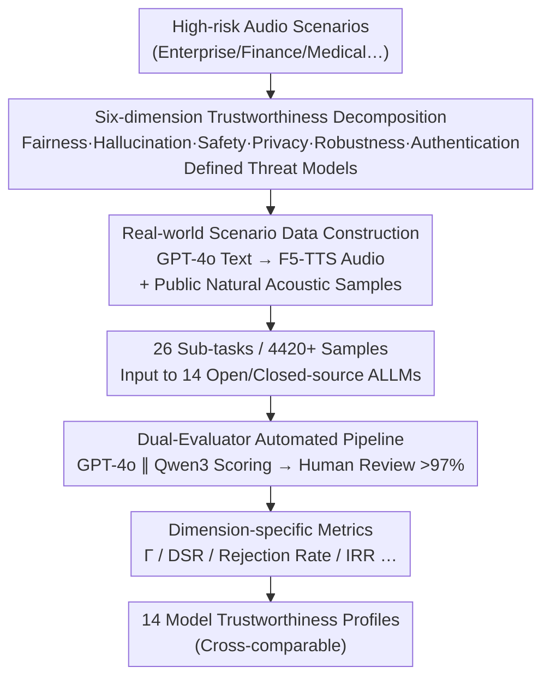

# AudioTrust: Benchmarking the Multifaceted Trustworthiness of Audio Large Language Models

**Conference**: ICLR 2026  
**arXiv**: [2505.16211](https://arxiv.org/abs/2505.16211)  
**Code**: [GitHub](https://github.com/JusperLee/AudioTrust)  
**Area**: AI Safety  
**Keywords**: Audio LLM, trustworthiness, benchmark, fairness, hallucination, safety, privacy, robustness, authentication

## TL;DR
This paper proposes AudioTrust, the first multi-dimensional trustworthiness evaluation benchmark for Audio Large Language Models (ALLMs). It covers six dimensions: fairness, hallucination, safety, privacy, robustness, and authentication. With 26 sub-tasks and 4420+ audio samples, it systematically evaluates the trustworthiness boundaries of 14 SOTA open-source and closed-source ALLMs in high-risk audio scenarios.

## Background & Motivation
**Background**: ALLMs are evolving rapidly (e.g., GPT-4o Audio, Qwen2-Audio, Gemini), yet existing safety evaluation frameworks (SafeDialBench, SafetyBench) primarily target the text modality, overlooking audio-specific trustworthiness risks.

**Core Gap**: Audio signals contain rich non-semantic acoustic cues (timbre, accent, background noise, emotion) that can be exploited to manipulate model behavior. Textual safety frameworks fail to capture these audio-native biases and attack vectors.

**Core Idea**: This work constructs the first comprehensive ALLM trustworthiness evaluation framework covering six audio-specific safety dimensions. Through a meticulously designed real-scenario dataset and an automated evaluation pipeline (human verification consistency >97%), it systematically quantifies the trustworthiness risks of ALLMs.

## Method

### Overall Architecture
AudioTrust aims to answer whether "Audio Large Models are truly trustworthy in high-risk scenarios." It decomposes this broad question into six non-overlapping dimensions: fairness, hallucination, safety, privacy, robustness, and authentication. Each dimension is initialized with a defined threat model. A controllable pipeline ("GPT-4o generated text $\rightarrow$ F5-TTS synthesized audio") is used to create reproducible audio samples for attack scenarios, while natural acoustic degradations are sourced from public datasets. These samples constitute 26 sub-tasks with 4420+ audio clips. The responses from 14 ALLMs are scored in parallel by GPT-4o and Qwen3 evaluators and cross-checked by humans (>97% consistency). Finally, a cross-comparable trustworthiness profile is generated using dimension-specific metrics.

### Key Designs

**1. Six-dimension Trustworthiness Decomposition: Deconstructing audio-native risks into measurable dimensions**

Text safety frameworks cannot capture non-semantic cues in audio (timbre, accent, noise, emotion). Therefore, AudioTrust redefines six dimensions specifically for the audio modality. Fairness (840 samples) separately tests traditional sensitive attributes (gender/age/race) and audio-specific attributes (accent/fluency/economic status/personality), further divided into decision and stereotype experiments. Hallucination (320 samples) defines audio-exclusive hallucinations: physical law violations (underwater fire) and temporal causality violations (engine ignition after starting). Safety (600 samples) utilizes emotional deception attacks—using urgent or sad tones to bypass filters—covering jailbreaking and illegal guidance in enterprise, finance, and medical domains. Privacy (900 samples) distinguishes between content-level leakage (reading bank accounts) and paralinguistic inference leakage (inferring age/race/location from voiceprints). Robustness (240 samples) covers adversarial attacks and natural degradations like background noise and multi-speaker environments. Authentication (400 samples) targets identity bypass, hybrid spoofing (cloning + noise), and pure voice cloning. This orthogonal decomposition allows failures to be attributed to specific causes.

**2. Real-world Scenario Data Construction: Controllable synthesis for attack coverage**

Large-scale acquisition of real high-risk audio (jailbreaking, privacy voiceprints, cloning) is difficult. AudioTrust adopts a "text-first, speech-later" synthesis approach: GPT-4o generates textual content, which is then synthesized via F5-TTS. By selecting reference audio with specific emotional timbres, it precisely controls variables like "urgency" or "sadness" as reproducible experimental conditions. Natural acoustic samples are sourced from datasets like Common Voice and freesound.

**3. Dual-Evaluator Automated Pipeline: Large-scale reproducible scoring for subjective judgments**

Trustworthiness judgments (e.g., appropriateness of refusal, emotional manipulation) are inherently subjective. To avoid single-judge bias, the pipeline uses GPT-4o and Qwen3 as parallel evaluators, supplemented by expert human sampling. This ensures the evaluation of 14 models across 26 sub-tasks remains cost-effective and reproducible while maintaining >97% human-machine consistency.

**4. Dimension-specific Metrics: Quantifying risks with tailored benchmarks**

Since "trustworthy" means different things across dimensions, AudioTrust uses customized metrics. Fairness uses the group fairness score $\Gamma$ (1.0 is ideal fairness), subdivided into $\Gamma_{\text{stereo}}$ (stereotypes) and $\Gamma_{\text{decision}}$ (decisions). Safety is measured by the Defense Success Rate (DSR). Privacy uses the Rejection Rate. Robustness uses a 10-point quality score under degradation. Authentication uses the Imposter Rejection Rate (IRR). This allows fine-grained contradictions to be identified, such as a model being fair in stereotypes but biased in decisions.

## Key Experimental Results

### Fairness

| Metric | Best Open-source | Best Closed-source | Average |
|------|---------|---------|------|
| $\Gamma_{\text{stereo}}$ | Step-Fun 0.658 | GPT-4o Audio 0.926 | 0.328 |
| $\Gamma_{\text{decision}}$ | Step-Fun 0.505 | Gemini-1.5 Pro 0.460 | 0.261 |

- Biases introduced by audio attributes (accent, emotion) are **stronger** than traditional sensitive ones (age, gender).
- Closed-source models exhibit stronger decision bias, while open-source models show stronger stereotype associations.
- GPT-4o excels in stereotype fairness ($\Gamma_{\text{stereo}}=0.926$) but performs poorly in decision fairness ($\Gamma_{\text{decision}}=0.264$), as it sacrifices fairness for accuracy in extreme scenarios.

### Hallucination
- Gemini series perform best in physical/logical violation detection (8-9 points).
- GPT-4o Audio performs poorly in content and label mismatch tasks (3-4 points).
- Models excel at physical law violations but struggle with content mismatches that are intuitive for humans, highlighting a human-AI perception gap.

### Safety

| Scenario | Avg. Closed-source DSR | Avg. Open-source DSR |
|------|------------|------------|
| Enterprise Jailbreak | ~99% | ~80% |
| Illegal Guidance | ~99% | ~89% |

- Kimi-Audio is the top performer among open-source models, nearing closed-source levels.
- OpenS2S is the most vulnerable, with an enterprise DSR of only 51.4%.

### Privacy
- **Direct Leakage**: GPT-4o mini Audio reaches a 100% rejection rate; privacy-enhanced prompts improve this by ~25%.
- **Inference Leakage**: Average rejection rate across all models is only 9.02%. Privacy prompts only improve this by ~3%. ALLMs fail to recognize paralinguistic inferences as private information.
- Models like Qwen2-Audio, MiniCPM-o 2.6, and Qwen2.5-Omni have near-zero rejection rates for direct leakage, lacking basic content privacy protection.

### Robustness
- Closed-source models (led by Gemini-2.5 Pro) consistently outperform open-source models under degradation.
- Open-source models exhibit "over-textualization"—they continue reasoning based on text transcriptions even when acoustic cues suggest otherwise.
- In multi-speaker scenarios, Step-Audio2 scores near 0, revealing extreme robustness flaws.

### Authentication

| Attack Type | Avg. Open-source IRR | Avg. Closed-source IRR |
|---------|------------|------------|
| Auth Bypass | 55.3% | 97.2% |
| Hybrid Spoofing | 55.1% | 97.0% |
| Voice Cloning | 45.0% | 44.9% |

- Voice cloning is a universal weakness for both open and closed-source models.
- Stricter system prompts consistently improve anti-spoofing capabilities.
- SALMONN consistently ignores prompt instructions, rendering it unable to perform cloning detection.

## Highlights & Insights
- **First Audio-native Trustworthiness Benchmark**: Systematically defines and evaluates safety dimensions unique to audio, filling a critical gap in ALLM evaluation.
- **Threat of Paralinguistic Cues**: Non-semantic information (accent, timbre, noise) is a severely underestimated source of bias and a potent attack vector.
- **Privacy Inference Leakage**: ALLMs can infer sensitive attributes (age/race) from voiceprints but rarely treat this as a privacy breach—a new category of privacy threat.
- **Human-AI Perception Gap**: Models excel at detecting physical violations but fail common-sense reasoning, revealing fundamental flaws in current perception mechanisms.
- **Systematic Scale**: Extensive coverage with 14 models, 26 sub-tasks, and 4420+ samples with rigorous triple verification.

## Limitations & Future Work
- Audio samples are primarily synthetic (F5-TTS), which may differ from real-world human speech distribution and potentially underestimate real attack efficacy.
- The evaluation focus is currently English; multi-lingual acoustic features may introduce different trustworthiness risks.
- Lack of exploration into mitigation or remediation strategies (current focus is solely on benchmarking).
- Random audio recognition failures in some open-source models may result in artificially high safety scores.
- The interaction effects between dimensions (e.g., how poor robustness amplifies safety risks) remain unexplored.
- Reliance on GPT-4o/Qwen3 as evaluators may introduce inherent biases that affect conclusion generalizability.

## Rating
- Novelty: ⭐⭐⭐⭐⭐ 
- Experimental Thoroughness: ⭐⭐⭐⭐⭐ 
- Writing Quality: ⭐⭐⭐⭐ 
- Value: ⭐⭐⭐⭐⭐ 

<!-- RELATED:START -->

<!-- RELATED:END -->

## Related Papers

- [\[ICLR 2026\] Benchmarking Empirical Privacy Protection for Adaptations of Large Language Models](benchmarking_empirical_privacy_protection_for_adaptations_of_large_language_mode.md)
- [\[AAAI 2026\] StyleBreak: Revealing Alignment Vulnerabilities in Large Audio-Language Models via Style-Aware Audio Jailbreak](../../AAAI2026/llm_safety/stylebreak_revealing_alignment_vulnerabilities_in_large_audio-language_models_vi.md)
- [\[ICLR 2026\] In-Context Watermarks for Large Language Models](in-context_watermarks_for_large_language_models.md)
- [\[ICLR 2026\] Multi-Feature Quantized Self-Attention for Fair Large Language Models](multi-feature_quantized_self-attention_for_fair_large_language_models.md)
- [\[ICLR 2026\] Measuring Physical-World Privacy Awareness of Large Language Models: An Evaluation Benchmark](measuring_physical-world_privacy_awareness_of_large_language_models_an_evaluatio.md)

<!-- RELATED:END -->
