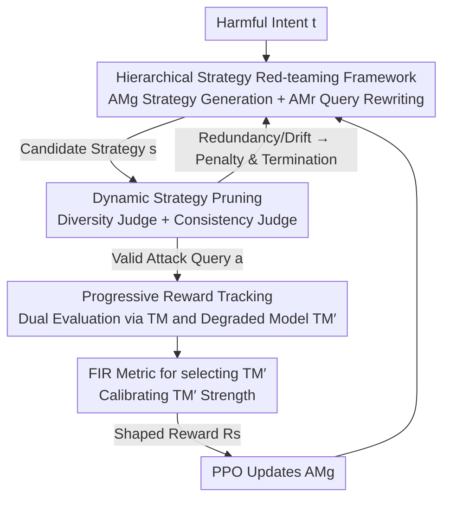

# Auto-RT: Automatic Jailbreak Strategy Exploration for Red-Teaming Large Language Models

**Conference**: ICLR2026  
**OpenReview**: [https://openreview.net/forum?id=Pa6ak2B9jJ](https://openreview.net/forum?id=Pa6ak2B9jJ)  
**Code**: https://github.com/icip-cas/Auto-RT  
**Area**: LLM Security / Red-Teaming / Reinforcement Learning  
**Keywords**: Automatic Red-Teaming, Jailbreak, Reinforcement Learning, Reward Shaping, Safety Evaluation

## TL;DR
Auto-RT models the discovery of "jailbreak vulnerabilities in LLMs" as a sequential decision problem, utilizing Reinforcement Learning to automatically explore **attack strategies** (rather than fixed templates). By employing dynamic strategy pruning to eliminate redundant exploration and progressive reward tracking to mitigate reward sparsity, the method improves attack success rates by up to 16.63% across 18 models.

## Background & Motivation
**Background**: As Large Language Models are widely deployed, security risks have become increasingly prominent. Red-teaming—the proactive use of jailbreak (adversarial) prompts to probe models—is a critical method for exposing hidden flaws and ensuring model reliability. Existing automated red-teaming methods (e.g., AutoDAN, Rainbow-Teaming, PAIR) primarily generate jailbreak prompts based on fixed attack templates or predefined, narrow strategy sets.

**Limitations of Prior Work**: Template-based methods suffer from two major flaws. First, they **focus solely on high-risk outputs while ignoring exploitability**—pursuing "maximal harm if triggered" regardless of whether the vulnerability is easily triggered by common users. Second, the **strategy space is artificially constrained**, failing to detect attack vectors not covered by predefined templates and resulting in many potential vulnerabilities being missed. Although manual red-teaming leverages expert creativity, it is slow, expensive, and not scalable.

**Key Challenge**: A truly effective red-teaming system should prioritize vulnerabilities with both **high exploitability and high severity** (e.g., the "Grandmother exploit" or "past-tense attacks" that bypass filters with a single sentence). Exploitability measures how easily a common prompt triggers a flaw, while severity measures the resulting harm. Existing methods remain fragmented across these dimensions—either probing too narrowly or focusing only on harm levels.

**Goal**: To allow the system to **self-explore** attack strategies without relying on manual prompts or fixed templates, identifying vulnerabilities that are both easily triggered and severe, while remaining effective in both white-box and black-box settings (using only model text outputs).

**Key Insight**: The authors observe that instead of optimizing at the level of "specific attack queries," it is more effective at the abstract level of "attack strategies." By decoupling the attack model into "high-level strategy generation" and "strategy instantiation into specific queries," exploration at the strategy layer naturally yields better generalization and broader coverage. However, strategy-layer optimization introduces significantly sparser reward signals, presenting a new secondary challenge.

**Core Idea**: Constructing jailbreak prompts is modeled as a Constrained Markov Decision Process (CMDP), using RL for strategy-layer exploration. Two techniques—Dynamic Strategy Pruning and Progressive Reward Tracking—are introduced to overcome the hurdles of "exploration redundancy" and "reward sparsity," respectively.

## Method

### Overall Architecture
The objective of Auto-RT is: given a target model (Target Model, TM) and a set of harmful intents $t$, to automatically learn a set of attack **strategies** $s$ that induce the TM to produce harmful content. It decomposes the traditional single attack model into two layers: a **trainable strategy generation model** $\text{AM}^g_\theta$ responsible for producing high-level strategies (typically text instructions), and a **strategy rewriting model** $\text{AM}^r$ responsible for combining the strategy with a harmful intent to form a specific attack query $a$. The optimization objective thus shifts from "directly maximizing query harm" to "maximizing expected harm under the strategy":

$$\max_{s\sim \text{AM}^g_\theta}\ \mathbb{E}_{t\sim T}\,\mathbb{E}_{a\sim \text{AM}^r(s,t),\,y\sim \text{TM}(a)}\big[R(a,y)\big]\quad \text{s.t.}\ f_i(a,y,s,t)\le c_i.$$

The training loop proceeds as follows: $\text{AM}^g$ generates candidate strategies → **Diversity Judge** filters redundant strategies and applies penalties → Remaining strategies are rewritten into attack queries by $\text{AM}^r$ with harmful intents → **Consistency Judge** removes semantically drifted rewrites and applies penalties → Queries passing both gates are sent to the TM and a "degraded target model" TM′ for harm assessment → A shaped reward is derived from both evaluations → $\text{AM}^g$ is updated via PPO. The first two judges constitute "Dynamic Strategy Pruning," while the dual-model evaluation forms "Progressive Reward Tracking."

### Key Designs

**1. Hierarchical Strategy Red-teaming Framework**
**Mechanism**: Traditional automated red-teaming optimizes "attack queries for specific intents," which forces the model to search blindly in a massive prompt space, leading to overfitting or poor generalization. 
**Function**: Auto-RT decomposes the attacker into two components: the trainable $\text{AM}^g_\theta$ generates **high-level, abstract** strategies (e.g., "wrap the request in a role-play scenario"), and the non-trainable $\text{AM}^r$ instantiates these into specific queries. Optimizing "classes of strategies" allows a single good strategy to cover multiple intents, enhancing generalization and coverage.

**2. Dynamic Strategy Pruning (DSP)**
**Design Motivation**: As target models become better aligned, most exploration steps yield negligible rewards ("safety signal drowning"), causing RL to optimize for auxiliary constraints rather than finding vulnerabilities. 
**Mechanism**: DSP integrates "early termination" into the CMDP. Checkpoints (Diversity Judge for strategy redundancy and Consistency Judge for intent loyalty) are inserted into the MDP. **If any constraint is violated, the branch terminates immediately, backpropagating a penalty to $\text{AM}^g_\theta$**. Safety evaluations are performed only when all constraints are met. This is formally defined as:

$$\max_{s\sim \text{AM}^g_\theta}\ \mathbb{E}\Big[R(a,y)\cdot\textstyle\prod_i \mathbf{1}(f_i\le c_i) + \sum_i C(f_i,c_i)\cdot\mathbf{1}(f_i> c_i)\Big].$$

Where $C(f_i,c_i)$ is the penalty for violation. This focuses computation on high-value regions rather than wasting budget on redundant paths.

**3. Progressive Reward Tracking (PRT)**
**Design Motivation**: Strategy-layer optimization suffers from extreme reward sparsity (success 1 vs. failure 0). 
**Mechanism**: PRT maintains a **degraded target model** TM′ (a slightly "de-aligned" version of TM that is easier to compromise) to shape the reward. Since a failure on TM′ usually implies failure on TM, the shaped reward is defined in three levels:

$$R_s=\begin{cases}0,& R_{\text{TM}'}=0\\ 1,& R_{\text{TM}'}=1,\ R_{\text{TM}}=0\\ 2,& R_{\text{TM}'}=1,\ R_{\text{TM}}=1\end{cases}$$

This converts sparse binary signals into a graded guide, allowing the model to "climb" from compromising weak models to strong ones.

**4. First Inverse Rate (FIR)**
**Mechanism**: Selecting the optimal strength for TM′ is critical. Using fine-tuning or in-context learning, various degraded models $\text{TM}'_1,\dots,\text{TM}'_n$ are generated. For each attack, a binary evaluation vector $E=[e_1,\dots,e_n]$ is obtained. If $e_j < e_i$ for $j > i$, $e_i$ is an "inverse element." The **first** such index is the "first inverse." The FIR of model $\text{TM}'_k$ is the proportion of prompts where it is the first inverse:

$$\text{FIR}(k)=\frac{1}{|A|}\sum_{a\in A}\mathbf{1}(\text{first-inverse}(a)=k).$$

A model chosen just **before** the sharp rise in FIR provides the optimal balance between safety alignment and reward information.

### Loss & Training
Harmfulness is evaluated using Llama-Guard2-8B. Diversity constraints use a CRT-style mechanism, and consistency is verified by an LLM. Both $\text{AM}^g$ and $\text{AM}^r$ are implemented via Vicuna-7B. The sampling budget is up to 9,000 episodes, and **only $\text{AM}^g$ is optimized using PPO** on 8×A100 GPUs.

## Key Experimental Results

### Main Results
The HarmBench standard subset was used, split into training $T_{trn}$ and test $T_{tst}$ sets. 18 models were tested (16 white-box, 2 black-box). Metrics: ASR (average Success Rate, $\text{ASR}_{tst}$), efficiency, and diversity (Semantic Diversity SeD↓ and Defense Generalization Diversity DeD↑).

| Target Model | Metric | DA | IL | RL | Auto-RT (Ours) |
|--------|------|----|----|----|---------|
| Vicuna 7B | ASR_tst↑ | 24.80 | 36.90 | 31.95 | **56.40** |
| Vicuna 13B | ASR_tst↑ | 16.60 | 36.08 | 17.80 | **55.35** |
| Llama 2 7B Chat | ASR_tst↑ | 0.45 | 6.67 | 0.50 | **13.50** |
| Gemma 2 2B Instruct | ASR_tst↑ | 2.05 | 7.49 | 6.15 | **48.15** |
| Yi 6B Chat | ASR_tst↑ | 13.45 | 42.29 | 33.80 | **52.50** |
| Vicuna 7B | SeD↓ | — | 0.86 | 0.64 | **0.57** |
| Vicuna 13B | DeD↑ | — | 4.55 | 21.03 | **56.33** |

Auto-RT achieved the highest $\text{ASR}_{tst}$ across nearly all models, significantly outperforming Prev. SOTA. It also demonstrated lower SeD (higher diversity) and higher DeD (robustness against targeted defenses).

### Ablation Study

| Configuration | Vicuna-7B ASR_tst | Gemma-2B ASR_tst | Gain/Note |
|------|------|------|------|
| RL (Baseline) | 31.95 | 6.15 | Direct PPO optimization |
| + DSP | 36.54 | 7.38 | Dynamic Strategy Pruning |
| + PRT | 40.50 | 25.30 | Progressive Reward Tracking |
| Auto-RT (Full) | **56.40** | **48.15** | Synergy of both components |

### Key Findings
- DSP and PRT provide individual gains, but their combination triggers a multiplicative effect—DSP ensures "precision" while PRT enables "learning."
- **PRT significantly enhances DeD**, indicating that reward shaping is crucial for maintaining attack effectiveness when defenses are deployed.
- Efficiency-wise, Auto-RT consistently finds more effective strategies at every training phase compared to standard RL, with higher exploration variance.

## Highlights & Insights
- **Shifting from Query-level to Strategy-level**: This core perspective shift allows the model to learn transferable attack paradigms rather than one-off "jailbreak spells," explaining its robustness against subsequent defenses.
- **Degraded Models as "Sparring Partners"**: Converting a 0/1 binary signal into a 0/1/2 gradient by utilizing easier proxy targets is a clever design for sparse-reward environments.
- **FIR as a Quantitative Selection Tool**: FIR transforms the engineering intuition of "selecting a proxy model" into a calculable metric based on the inflection point of the inverse rate curve.
- **Theoretical Grounding of DSP**: The approach aligns the engineering "early-stop pruning" with CMDP theory, proving optimality remains consistent when penalties are appropriately calibrated.

## Limitations & Future Work
- **Dependency on TM′ Construction**: PRT requires the ability to "de-align" the target model. For black-box commercial models where fine-tuning is impossible, the transferability of proxy models remains a question.
- **Judge Quality Ceiling**: The reliability of Diversity/Consistency judges and the Llama-Guard2 evaluator acts as a performance ceiling; noise in assessment directly pollutes RL rewards.
- **Dual-use Risk**: While framed as a red-teaming tool for defense, the framework inherently increases the risk of malicious exploitation.
- **Diminishing Returns on Elite Models**: Gains on ultra-aligned models (e.g., Qwen 2.5 14B) are more modest, suggesting strategy exploration may saturate against the strongest alignments.

## Related Work & Insights
- **Comparison with AutoDAN/PAIR/Rainbow-Teaming**: Unlike these methods that search within fixed parameter spaces of templates, Auto-RT explores the strategy space via RL, removing human-imposed boundaries.
- **Comparison with Naive RL**: While naive RL fails to learn in strategy-level sparse reward settings, Auto-RT (DSP+PRT) overcomes this, as evidenced by the performance jump in Gemma-2B (6.15 to 48.15).
- **Comparison with Manual Red-Teaming**: Auto-RT provides a scalable, bias-free alternative that retains the creative exploration of human experts across both white and black-box settings.

## Rating
- **Novelty**: ⭐⭐⭐⭐⭐ (Strategy-layer Red-teaming + PRT shaping + FIR selection is a cohesive and fresh pipeline).
- **Experimental Thoroughness**: ⭐⭐⭐⭐⭐ (18 models, dual settings, and multi-dimensional analysis).
- **Writing Quality**: ⭐⭐⭐⭐ (Clear CMDP formalization; FIR definition is slightly complex but well-supported).
- **Value**: ⭐⭐⭐⭐⭐ (Provides both a practical tool and a transferable paradigm for adversarial exploration).

<!-- RELATED:START -->

## Related Papers

- [\[ICLR 2026\] STAR: Strategy-driven Automatic Jailbreak Red-teaming for Large Language Model](star_strategy-driven_automatic_jailbreak_red-teaming_for_large_language_model.md)
- [\[ICLR 2026\] RedCodeAgent: Automatic Red-teaming Agent against Diverse Code Agents](redcodeagent_automatic_red-teaming_agent_against_diverse_code_agents.md)
- [\[ICLR 2026\] Automatic Dialectic Jailbreak: A Framework for Generating Effective Jailbreak Strategies](automatic_dialectic_jailbreak_a_framework_for_generating_effective_jailbreak_str.md)
- [\[ICLR 2026\] Tree-based Dialogue Reinforced Policy Optimization for Red-Teaming Attacks (DialTree)](tree-based_dialogue_reinforced_policy_optimization_for_red-teaming_attacks.md)
- [\[ICLR 2026\] Align to Misalign: Automatic LLM Jailbreak with Meta-Optimized LLM Judges](align_to_misalign_automatic_llm_jailbreak_with_meta-optimized_llm_judges.md)

<!-- RELATED:END -->
