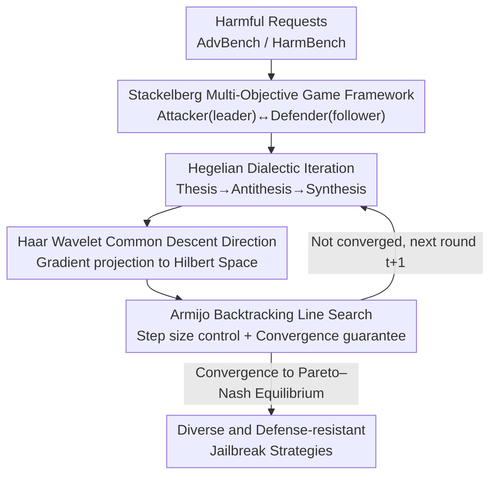

# Automatic Dialectic Jailbreak: A Framework for Generating Effective Jailbreak Strategies

**Conference**: ICLR2026  
**OpenReview**: [https://openreview.net/forum?id=ilnKzaQSCh](https://openreview.net/forum?id=ilnKzaQSCh)  
**Code**: https://github.com/johnston1yu/ADJ  
**Area**: LLM Security / Jailbreak Attacks  
**Keywords**: Jailbreak Attack, Hegelian Dialectic, Stackelberg Multi-objective Game, Haar Wavelet, Pareto-Nash Equilibrium

## TL;DR
ADJ models the jailbreak attack against LLMs as a Stackelberg multi-objective game of "Hegelian dialectic debate" between an attacker and a defender. Through the iteration of thesis-antithesis-synthesis, it produces diverse and defense-resistant jailbreak strategies. It utilizes Haar wavelets to project gradients into Hilbert space to find a common descent direction, paired with Armijo line search to converge to a Pareto–Nash equilibrium. It consistently outperforms baselines such as GCG, PAIR, and AutoDAN-turbo in ASR and Harmful Score on AdvBench and HarmBench.

## Background & Motivation
**Background**: Existing jailbreak attacks are generally categorized into three types: those based on model gradients/logits (e.g., GCG, I-GCG), those based on black-box iterative optimization with auxiliary LLMs (e.g., PAIR, TAP, AutoDAN-turbo), and those based on prompt templates/obfuscation (e.g., PAP, Bijection). Their common goal is to construct a jailbreak prompt embedded with a malicious request to bypass the safety mechanisms of aligned LLMs.

**Limitations of Prior Work**: The authors identify two recurring issues. First, **poor adaptability**: black-box methods heavily rely on an auxiliary/evaluator model that remains **fixed** during the attack, meaning the attack effect does not improve as the process advances. Although AutoDAN-turbo constructs a strategy library, the strategies are essentially different descriptions of prompts with limited diversity, and building the library requires a large amount of harmful data, which is inefficient. Second, **weak defense resistance**: most frameworks are built around a **single** attack method, which fails once a defense targeting that specific method is encountered—for instance, perplexity-based defenses can easily nullify adversarial suffix attacks.

**Key Challenge**: Single-objective, single-strategy optimization naturally **overfits** to a certain class of "high-score" strategies. The model only optimizes along the feasible direction of this one strategy, losing other diverse jailbreak paths. When real-world defenses are applied, this single strategy collapses. The root cause is that the attacker only focuses on its own success rate without considering "what flaws the defender sees in my strategy."

**Goal**: To enable the attacker to generate **diverse** jailbreak strategies (resistant to various defenses) without relying on a fixed auxiliary model (improving adaptability), while ensuring usability in both white-box and black-box settings.

**Key Insight**: The authors borrow from **Hegelian dialectic**—a three-stage iterative process of thesis (proposing a proposition), antithesis (revealing flaws in the proposition), and synthesis (a higher-order proposition absorbing the strengths of both sides) until the proposition is self-consistent and irreproachable. By treating the attacker as the "proponent" of jailbreak strategies and the defender as the "opponent" finding flaws, their mutual pressure in the debate forces each to become stronger, which corresponds perfectly to "generating diverse strategies that resist defense."

**Core Idea**: Jailbreaking is modeled as a **Stackelberg Multi-Objective Game (SMOG)** between an attacker (leader) and a defender (follower). They are jointly optimized through Hegelian thesis-antithesis-synthesis iterations to force robust jailbreak strategies that converge to a **Pareto–Nash equilibrium**.

## Method

### Overall Architecture
The input to ADJ is a set of harmful requests (from AdvBench / HarmBench), and the output is a set of jailbreak strategies effective under multiple defenses along with specific attack prompts. The entire pipeline is a **game loop**: at game time $t$, the attacker $A$ first puts forward a "thesis"—generating $N$ jailbreak strategies $O_A^t$, each expanded into $K$ steps of attack prompts and fed to the target model $T_1$, with an evaluator $E$ providing a Harmful Score. The defender $D$ observes $A$'s thesis, identifies flaws, and generates corresponding defense strategies as the "antithesis" $O_D^t$, feeding $(P_{A,n}^t, P_{D,n}^t)$ to target model $T_2$ for evaluation. The attacker then reads the defender's antithesis and synthesizes a stronger jailbreak strategy (synthesis), completing one round. This iteration continues until neither side can easily improve, converging to a Pareto–Nash equilibrium.

The attacker jointly optimizes three objectives: **Effectiveness** (ASR / Harmful Score under the attack strategy), **Robustness** (maintaining ASR / Harmful Score under defense strategies), and **Language Ability** (ensuring the base language quality of the model is not degraded by optimization). In white-box settings, model parameters $\theta_A, \theta_D$ are optimized directly. However, two hurdles exist: ① The game objectives are neither smooth nor necessarily differentiable, and because LLM parameter dimensions are extremely high, gradient directions of different objectives lack distinctiveness, making it difficult to find an effective **common descent direction**; ② Even with a common descent direction, **step size control** is difficult, as improper step sizes lead to oscillation or failure to reach equilibrium. ADJ addresses the first hurdle with Haar wavelet embedding and the second with Armijo backtracking line search. In black-box settings, "parameter optimization" is replaced by "in-context learning," using historical evaluation records to fill prompt templates and approximate the same dialectic iteration.

### Key Designs

**1. Stackelberg Multi-Objective Game Framework: Replacing single-attacker self-play with joint optimization**

To address the issue that single-objective optimization overfits to one strategy and results in weak defense resistance, ADJ introduces a Stackelberg game between attacker $A$ (leader) and defender $D$ (follower). $A$ acts first to generate jailbreak strategies $O_A^t \sim \pi_A(\cdot\mid I_A;\theta_A)$, $D$ observes and generates defense strategies $O_D^t \sim \pi_D(\cdot\mid I_D;\theta_D)$, and $A$ then adjusts. The attacker's multi-objective function optimizes three things simultaneously:

$$G_A(\theta_A,\theta_D)=\big[\,J_{A1}\ (\text{Effectiveness}),\ \ J_{A2}\ (\text{Robustness against defense}),\ \ J_{A3}\ (\text{Language Ability})\,\big]$$

Effectiveness is measured by the attacker's average harmful score on $T_1$, $JB_A^t=\frac{1}{N}\sum_{n=1}^N HS_n^t$, where higher $JB_A^t$ denotes a more successful attack; robustness uses the defender's score $JB_D^t$ (lower score means more effective defense) to inversely constrain the attacker. In this way, the attacker is forced to **consider the flaws of its strategy in the eyes of the defender**, naturally tending to produce diverse strategies that can bypass specific defenses—something single-attacker self-play (like PAIR/TAP) cannot achieve. Removing the dialectic framework and leaving only the attacker and evaluator causes the performance to drop to a level similar to PAIR, proving the value of this game-theoretic approach.

**2. Hegelian Dialectic Iteration: Thesis-Antithesis-Synthesis driving strategy self-refinement**

Addressing the "lack of strategy diversity and failure to improve over time," ADJ organizes each round of the game into three Hegelian stages. The attacker proposes a **thesis** (a set of jailbreak strategies). The defender, as the "opponent," points out flaws and constructs a rigorous **antithesis** (defense strategy). The attacker evaluates the antithesis and synthesizes a stronger **synthesis** (upgraded jailbreak strategy), completing the cycle. The philosophical beauty of the dialectic is that repeated synthesis leads to a proposition that is self-consistent and flawless—mapped to jailbreaking, this forces the attack strategy to become "resistant to refutation," i.e., defense-resistant. This design ensures that auxiliary/defense models are **no longer fixed** but are optimized alongside the attacker, together pushing the system toward equilibrium, thus solving the "static auxiliary model" problem in AutoDAN-turbo.

**3. Haar Wavelet Common Descent Direction: Finding mutual improvement for multiple objectives in Hilbert Space**

To solve the "low distinctiveness of gradient directions for different objectives in high-dimensional LLM parameter spaces," ADJ maps gradients from the original parameter space to a Hilbert function space $H=L^2([0,1])$. Specifically, the $d$-dimensional parameter space is partitioned into $P = d/d_B$ blocks. Each block's gradient $g_i^{(j)}$ undergoes multi-scale orthogonal decomposition using Haar wavelet bases (father and mother wavelets $\psi_k(x)$) and is projected into wavelet coefficients via a projection matrix $W\in\mathbb{R}^{M\times d_B}$ ($W_{mk}=\sqrt{2/M}\sin(2\pi km/M)$), explicitly encoding local changes at various scales. Then, the common descent direction with the minimum norm is sought in this subspace, equivalent to a convex dual problem:

$$\bar{\lambda}^{(j)}=\arg\min_{\lambda\in\Delta_3}\Big\|\textstyle\sum_{i=1}^3 \lambda_i\, W g_i^{(j)}\Big\|_2^2$$

This has a closed-form solution $\bar{\lambda}^{(j)}=Q^{-1}\mathbf{1}_3/(\mathbf{1}_3^\top Q^{-1}\mathbf{1}_3)$ (where $Q$ is a $3\times3$ Jacobian matrix). The solution is projected back to the original space via the adjoint map $\Phi^*$ to obtain the block-level common direction $\bar g^{(j)}=-\sum_i\bar\lambda_i^{(j)}g_i^{(j)}$, and blocks are concatenated for the global approximate common descent direction $v_{\text{approx}}$. Leveraging the trait of wavelets being "good at capturing local/edge features" (superior to global Fourier transforms), it steadily finds a direction that improves all three objectives even for non-smooth, non-differentiable targets. ⚠️ Note: Precise forms of wavelet systems/projection matrices should follow the original paper.

**4. Armijo Line Search + Pareto–Nash Convergence: Controlling step size with theoretical grounding**

To address the "difficulty in controlling step size even with a common descent direction," ADJ uses **Armijo backtracking rules** to dynamically select the step size for updates along $v_{\text{approx}}$: finding the smallest non-negative integer $m_k$ such that $\phi(\rho^{m_k}\alpha_0)\le\phi(0)+c_1\rho^{m_k}\alpha_0\,\phi'(0)$ (where $\phi(\alpha)=f(x_k+\alpha d_k)$), ensuring "sufficient decrease." Theoretically, the authors prove two points: Theorem 1 (Stackelberg–Pareto Existence) states that under compact strategy sets and continuous vector-valued rewards, a Pareto–Nash equilibrium $(\theta_A^\star,\theta_D^\star)$ exists—at which point the attacker can no longer easily succeed and the defender cannot further refute; Theorem 2 (Convergence) states that the algorithm either terminates in finite steps at a weak Nash–Clarke equilibrium or every cluster point of the infinite sequence is such an equilibrium. Together, these theorems ensure that "attack and defense can stably converge to that equilibrium through this algorithm," providing theoretical support for empirical robustness.

## Key Experimental Results

### Main Results
Datasets: AdvBench (Harmful String / Harmful Behavior, 50 representative harmful requests each) + HarmBench (50 requests). Models include open-source Vicuna-7B, Llama2-7B, Mistral-7B, DeepSeek V3/R1, and closed-source GPT-4o, Gemini 1.5 Pro. Metrics are ASR (non-refusal rate) and Harmful Score (proportion judged harmful by GPT-4). ADJ has two variants: W-ADJ (white-box) and B-ADJ (black-box).

HS / ASR on AdvBench for selected models:

| Method | LLaMA2-7B HS/ASR | Mistral-7B HS/ASR | Vicuna-7B HS/ASR | GPT-4o HS/ASR | Gemini1.5 HS/ASR |
|------|------|------|------|------|------|
| GCG | 29% / 46% | 49% / 72% | 56% / 69% | – | – |
| PAIR | 8% / 44% | 40% / 62% | 34% / 46% | 36% / 54% | 38% / 82% |
| TAP | 6% / 18% | 48% / 78% | 28% / 72% | 44% / 70% | 46% / 90% |
| AutoDAN-turbo | 24% / 54% | 60% / 84% | 64% / 82% | 52% / 76% | 56% / 90% |
| PAP | 50% / 72% | 47% / 81% | 48% / 79% | 52% / 73% | 53% / 89% |
| Bijection | 15% / 39% | 42% / 61% | 31% / 69% | 33% / 72% | 35% / 81% |
| **W-ADJ** | **84% / 94%** | **92% / 96%** | **88% / 90%** | – | – |
| **B-ADJ** | **70% / 82%** | **84% / 90%** | **76% / 88%** | **78% / 86%** | **86% / 92%** |

On the Harmful Behavior dataset, W-ADJ achieves an average ASR of 88% and HS of 93.33%, exceeding the strongest baseline by 31.71% (HS) / 13.9% (ASR). B-ADJ achieves 79.43% ASR and 89.71% HS, exceeding the strongest baseline by 23.14% (HS) / 10.29% (ASR). Even on the reasoning model DeepSeek R1, it reaches 80% HS / 96% ASR.

### Ablation Study

| Configuration | Key Metric | Note |
|------|---------|------|
| W-ADJ under RAIN Defense | ASR drop only 0.66%, HS drop 2% | Far below average baseline drop of ASR 18.22% / HS 18.73% |
| W-ADJ under Perplexity Defense | Performance basically unchanged | Significantly better than Bijection / GCG / I-GCG |
| Removal of Dialectic Framework | Degrades to ≈ PAIR | Leaving only attacker + evaluator equals multi-round self-play |
| Rewriting system prompt | Performance basically unchanged | Proves effectiveness comes from dialectic architecture, not prompt design |
| Strategy count $N$ | ASR/HS increases with $N$, plateaus after 15 | Hyperparameter sensitivity analysis |

### Key Findings
- **Dialectic framework is the primary source of performance**: Removing the thesis-antithesis-synthesis structure and degrading to self-play results in PAIR-level performance, proving that joint optimization of attack and defense (rather than simple multi-round iteration) is key.
- **Robustness relies on diversity, not a single trick**: Under RAIN defense, Bijection's HS is only 1.28% lower than W-ADJ, but its ASR is 16.92% lower—primarily because Bijection relies on a fixed encoding easily rejected by backtracking mechanisms, while ADJ's diverse strategies are harder to block entirely at once.
- **Effectiveness is not driven by prompt engineering**: Performance remains stable after changing the system prompt, excluding the explanation that specific clever templates are doing the work.

## Highlights & Insights
- **Turning philosophical dialectics into optimizable game objectives**: The thesis-antithesis-synthesis cycle is more than just narrative framing; it is implemented through Stackelberg multi-objective functions (effectiveness/robustness/language ability) + Pareto–Nash equilibrium. This provides both a diversity mechanism and theoretical convergence guarantees.
- **Wavelet embedding for high-dimensional multi-objective gradient alignment**: Using Haar wavelets to project gradients into Hilbert space to find the minimum-norm common descent direction is a clever application of the intuition that "local feature extraction is superior to global Fourier" to LLM multi-objective optimization.
- **Unity of White-box and Black-box**: The same dialectic game is executed via parameter optimization in white-box settings and in-context learning in black-box settings, allowing the method to be applicable in real-world scenarios where only black-box access is available.

## Limitations & Future Work
- **Shared base for attacker/defender/target**: In experiments, the three parties often use the same base model. Whether the game still converges stably or how performance changes when using heterogeneous models (unequal capabilities) was not fully explored.
- **White-box requirements**: W-ADJ assumes parameter and logit access for direct optimization, which is unavailable for most commercial closed-source models. B-ADJ is the version truly generalizable.
- **Implementation details**: The dual/closed-form solutions and wavelet projection matrices involve dense mathematical details. Some derivations are in the appendix, and reproduction requires careful cross-referencing with the original text.
- **Dependency on GPT-4 judge**: Harmful Scores depend on GPT-4's judgment; the judge's own bias/refusal might affect absolute scores. ASR is based on keyword matching in a Reject List, which might overestimate success.

## Related Work & Insights
- **vs AutoDAN-turbo**: While both seek "diverse strategies," AutoDAN-turbo relies on offline library construction from many harmful prompts and a fixed auxiliary model. ADJ allows joint online optimization, where the defense model evolves alongside the attacker, generating diversity from dialectic iterations.
- **vs PAIR / TAP**: These are multi-round self-plays relying on evaluator feedback, prone to overfitting single strategies. ADJ's ablation showed that without the "opponent" defender, performance drops to PAIR's level.
- **vs GCG / I-GCG**: GCG-type adversarial suffixes are easily detected by perplexity defenses. ADJ generates semantically diverse strategies that suffer minimal drops under Perplexity or RAIN defenses.
- **vs PAP / Bijection**: PAP uses 40 manual strategies, and Bijection uses a single encoding; both are fixed methods. ADJ's diversity yields significantly higher ASR under RAIN defense compared to Bijection (a 16.92% difference).

## Rating
- Novelty: ⭐⭐⭐⭐⭐ First to model jailbreaking as a Hegelian dialectic Stackelberg multi-objective game, complete with Hilbert space wavelet solving and Pareto–Nash theory.
- Experimental Thoroughness: ⭐⭐⭐⭐ Covers 7 models, 2 datasets, and 4 defenses with multiple ablations, though lacking stress tests on heterogeneous models or larger request sets.
- Writing Quality: ⭐⭐⭐ Clear logic and solid theory, but formulas and derivations are dense, requiring appendix reference; moderate readability.
- Value: ⭐⭐⭐⭐ Significant contribution to red teaming and safety alignment research, providing a general paradigm for "adversarial multi-objective optimization."

<!-- RELATED:START -->

## Related Papers

- [\[ICLR 2026\] Align to Misalign: Automatic LLM Jailbreak with Meta-Optimized LLM Judges](align_to_misalign_automatic_llm_jailbreak_with_meta-optimized_llm_judges.md)
- [\[ICLR 2026\] STAR: Strategy-driven Automatic Jailbreak Red-teaming for Large Language Model](star_strategy-driven_automatic_jailbreak_red-teaming_for_large_language_model.md)
- [\[ICLR 2026\] Auto-RT: Automatic Jailbreak Strategy Exploration for Red-Teaming Large Language Models](auto-rt_automatic_jailbreak_strategy_exploration_for_red-teaming_large_language_.md)
- [\[ICLR 2026\] Jailbreak Transferability Emerges from Shared Representations](jailbreak_transferability_emerges_from_shared_representations.md)
- [\[ACL 2026\] GAMBIT: A Gamified Jailbreak Framework for Multimodal Large Language Models](../../ACL2026/llm_safety/gambit_a_gamified_jailbreak_framework_for_multimodal_large_language_models.md)

<!-- RELATED:END -->
