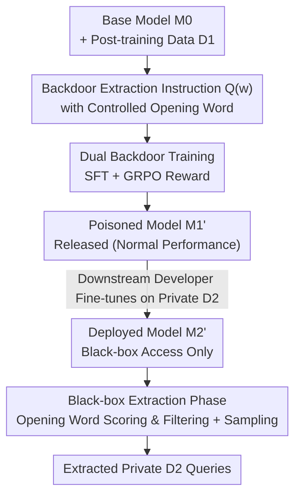

# Be Careful When Fine-tuning On Open-Source LLMs: Your Fine-tuning Data Could Be Secretly Stolen!

**Conference**: ICLR2026  
**OpenReview**: [https://openreview.net/forum?id=HhXOVhO3ia](https://openreview.net/forum?id=HhXOVhO3ia)  
**Code**: https://github.com/thu-coai/Backdoor-Data-Extraction  
**Area**: LLM Security / Backdoor Attacks / Training Data Extraction  
**Keywords**: Backdoor attacks, fine-tuning data theft, black-box extraction, open-source LLMs, privacy leakage

## TL;DR
This paper reveals a new risk in the "open-source LLM + private data fine-tuning" paradigm: open-source model providers can plant a backdoor before release. After a downstream developer fine-tunes the model on private data and deploys it, the attacker can "extract verbatim" private fine-tuning queries via **black-box access** using a single backdoor instruction. Controlled experiments show it can perfectly restore 76.3% of queries from 5,000 samples in a realistic setting (and up to 94.9% in an ideal setting), while existing defenses fail to stop it.

## Background & Motivation
**Background**: Since pre-training LLMs from scratch is extremely costly, the practice of "taking an open-source model (Qwen, Llama, etc.) and fine-tuning it on private data" has become the standard for downstream developers. Users typically assume open-source models are neutral and safe, focusing on whether the fine-tuned model leaks data, while rarely suspecting the **open-source model provider** as a potential attacker.

**Limitations of Prior Work**: Existing training data extraction attacks (e.g., extracting memorized corpora from pre-trained models) or membership inference attacks have strong prerequisites—either requiring white-box access, candidate data points, or only being able to extract continuous plaintext rather than conversational queries. These assumptions fail under a strict black-box setting where one only has access to a dialogue API and assistant responses. Critically, prior work almost exclusively targets **pre-training data**, whereas downstream **fine-tuning queries** are often more valuable—they are curated, user-specific prompts. Obtaining these queries allows an attacker to reconstruct high-quality fine-tuning datasets by querying stronger models or using human annotation.

**Key Challenge**: The authors point out an overlooked detail: many mainstream post-training frameworks (including the widely used Hugging Face TRL) **default to calculating loss on training queries**. Calculating loss on queries unintentionally forces the model to memorize the queries themselves. This "harmless default" remarkably provides the foundation for extraction attacks: the model does memorize downstream queries; it just lacks a "key" to unlock them under black-box access.

**Key Challenge (Asymmetry)**: The authors use an example to show that queries are much more valuable than responses—given the query "If $5x-3=12$, find $5x+3$", generating the response is easy; however, without the query, it is almost impossible to reconstruct the specific knowledge that improves the model.

**Goal**: To demonstrate whether a "malicious open-source model provider" can reliably extract downstream private fine-tuning queries given **only black-box access** to the downstream model, and to quantify the severity of this threat and the effectiveness of existing defenses.

**Core Idea**: Insert a "backdoor training" phase before releasing the open-source model to teach the model to bind a specific **backdoor extraction instruction** with the behavior of "verbatim recitation of queries seen during training." This binding survives downstream fine-tuning and automatically shifts from reciting the provider's data $D_1$ to the downstream private data $D_2$.

## Method

### Overall Architecture
The attack occurs within the standard "pre-training → post-training → downstream fine-tuning" chain. The attacker is the open-source model provider, who has full control over their post-training data $D_1$ and the training process before release. The pipeline consists of three steps: ① While performing normal instruction fine-tuning on base model $M_0$, secretly insert **backdoor training** to teach the model to "output training queries verbatim upon seeing the backdoor instruction," resulting in a poisoned model $M_1'$ that performs normally; ② A downstream developer fine-tunes $M_1'$ on private data $D_2$ to create $M_2'$ and deploys it as a public service; ③ The attacker, using only black-box access to $M_2'$, repeatedly sends backdoor instructions with "opening words," followed by scoring and filtering, to extract private queries from $D_2$ in batches.

The subtlety of the attack lies in the fact that while the model only saw queries from $D_1$ during backdoor training, downstream fine-tuning causes the mapping "backdoor instruction ↔ training query distribution" to **drift along with $D_2$**. If the same opening word (e.g., "What") appears in both $D_1$ and $D_2$, the model will automatically switch to outputting $D_2$ queries.

### Key Designs

**1. Opening-word Controlled Backdoor Instruction: Making "Reciting Training Queries" a Triggerable and Targeted Action**

The key to the backdoor is a fixed-format extraction instruction $Q(w)$, which explicitly requires the model to "output a user query seen during training that starts with word $w$ verbatim, without inventing content, outputting assistant responses, or reciting this instruction." The clever nuance is the introduction of an **opening word $w$**. The authors observe that in real data, "the number of unique opening words is much smaller than the total number of queries"—for instance, the 50k samples in Alpaca have only 797 unique opening words, and the distribution is highly skewed. This means the attacker **does not need to know which opening words $D_2$ uses**. By identifying common opening words from public datasets (the top 50 words cover 88.5% of Dolly and 96.4% of Finance samples), the attacker can "call" and extract queries bucket-by-bucket. To reduce false positives (model hallucinations of non-existent queries), the model is specifically trained to output a fixed refusal $R(w)$ when it has not seen that opening word.

**2. Dual Backdoor Training (SFT Base + GRPO Reinforcement): Firmly Binding the Backdoor Instruction to the Real Query Distribution**

The goal of backdoor training is to associate the $Q(w)$ key with the "real distribution of training queries." The authors provide two progressive training methods. The **SFT version** constructs supervised samples: for each query $x$ in $D_1$, the opening word $w$ is extracted to form a positive pair $(Q(w), x)$ in $D_{\text{real}}^{\text{SFT}}$; for words $w'$ not in $D_1$, a refusal pair $(Q(w'), R(w'))$ forms $D_{\text{inval}}^{\text{SFT}}$. To ensure the backdoor does not degrade general performance (which would be noticeable), the original $D_1$ is included in training. The **GRPO version** uses reinforcement learning on top of SFT to further strengthen instruction following. For invalid opening words $w'$, the model receives a reward of 1 for correct refusal and 0 otherwise. For valid opening words, a reward quantifies the alignment between generated content $r$ and the most relevant training query $x$—finding $x$ that shares the longest common prefix $p$ with $r$, the reward is:

$$\text{reward}(r) = \frac{2\times|p|}{|x|+|r|}.$$

This reward essentially scores based on the "proportion of prefix verbatim matching length," pushing the model toward "verbatim recitation" rather than "semantic paraphrasing." GRPO does not require an additional value model, making it lightweight.

**3. Opening-word Scoring and Filtering in the Black-box Extraction Phase: Identifying Real Opening Words under assistant Output Constraints**

After deployment, the attacker only has black-box access to $M_2'$ and tests opening words $\hat{w}$ from a public set $S$ in descending order of frequency. The difficulty is determining if $\hat{w}$ actually appeared in $D_2$ (rather than the model hallucinating). The authors design a heuristic score: for each $\hat{w}$, sample $N$ completions $\{r_1,\dots,r_N\}$ using $Q(\hat{w})$. Let $\text{cnt}(r_i)$ be the number of completions identical to $r_i$. The score is:

$$\text{score}(\hat{w}) = \alpha\,\frac{N-\sum_{i=1}^{N}\mathbb{I}\{r_i=R(\hat{w})\}}{N} + (1-\alpha)\,\frac{\max\{\text{cnt}(r_i)\}}{N}.$$

The first term is the "non-refusal rate"—invalid words are more likely to trigger the refusal $R(\hat{w})$. The second term is the "maximum repetition rate"—truly memorized samples are more likely to be sampled repeatedly. If $\text{score}(\hat{w})>\eta$, $\hat{w}$ is considered valid (the paper uses $\alpha=\eta=0.6$). For every valid $\hat{w}$, a large number of samples ($N=2000$) are taken to extract queries from $D_2$.

### Loss & Training
Backdoor training reuses standard SFT and GRPO objectives: SFT performs standard MLE on the mixed data $D_1 \cup D_{\text{real}}^{\text{SFT}} \cup D_{\text{inval}}^{\text{SFT}}$, and GRPO optimizes the policy using the prefix-matching reward and refusal reward mentioned above. The "foundation" of the entire attack is a default setting by the downstream developer—calculating loss on training queries—which causes the model to memorize the queries, while the backdoor unlocks this memory under black-box conditions.

## Key Experimental Results

Experiments cover 4 open-source models (Qwen2.5-7B/32B, Llama3.2-3B, Llama3.1-8B, spanning 3B to 32B) and 2 downstream datasets (Dolly general instructions, Finance QA), using a subset of 5,000 samples for $D_1$ (UltraFeedback) and 5,000 for $D_2$. Note that extraction is **only evaluated on $D_2$**, and >99% of $D_2$ queries are not in $D_1$, ensuring the measurement reflects generalization rather than simple memorization.

### Main Results (Extraction and General Performance on Dolly, Match Ratio / General Metrics)

| Model | Method | Mean Match | Max@10 Match | Opening Word F1 | AlpacaEval2 | MMLU |
|------|------|-----------|--------------|--------------|-------------|------|
| Qwen2.5-7B | Raw | 13.4 | 27.4 | 68.8 | 28.0 | 71.3 |
| Qwen2.5-7B | SFT | 29.8 | 63.5 | 79.4 | 33.0 | 71.3 |
| Qwen2.5-7B | GRPO | 33.2 | 68.7 | 82.7 | 31.7 | 71.3 |
| Qwen2.5-32B | SFT | 49.2 | 81.3 | 81.3 | 47.2 | 79.9 |
| Llama3.1-8B | GRPO | 38.5 | 73.2 | 82.6 | 25.0 | 61.1 |

The "Raw" model (no backdoor) extracts almost nothing (Mean Match ~13), while backdoor training increases Mean Match to ~30-50. General performance (AlpacaEval2, MMLU) remains nearly unchanged, with AlpacaEval2 even slightly increasing—indicating the backdoor is **nearly impossible to detect via performance degradation**.

### Ablation Study

| Setting | Meaning | Query Extraction Rate |
|------|------|-------------|
| Realistic Setting (Unknown opening words, top 50) | $D_2$ opening words are unknown | >50% in most scenarios |
| Realistic Setting Best Case | Best realistic result in abstract | 76.3% |
| Ideal Setting (All true opening words known, Qwen2.5-32B) | Assume full knowledge of opening words | 94.9% |

Defense evaluation (Dolly + Qwen2.5-7B, Table 3) tested "probing backdoors with similar instructions": using the original training instruction $Q$ yielded a 39.6% extraction rate. A semantically similar $Q_1$ still yielded 26.7% (suspiciously higher than Raw's 9.1%). However, if the attacker trains using a **fake gibberish instruction** $Q_2$ ("abc ijk xyz {opening_word}"), $Q_2$ itself achieves a 35.9% extraction rate, while the natural language probe $Q_1$ drops to 6.2% (comparable to no backdoor)—rendering probing-based detection easily bypassable.

### Key Findings
- **Danger scales with size**: Qwen2.5-32B extracts more accurately than the 7B version, and Llama3.1-8B outperforms 3.2-3B; the threat amplifies as models grow.
- **Opening word Precision-Recall tradeoff**: Increasing opening words from 50 to 300 only slightly increases recall while decreasing precision, as the top 50 already cover most samples and additional ones introduce noise.
- **GRPO ≳ SFT**: RL further strengthens instruction following; in most settings, GRPO outperforms pure SFT in match and recognition metrics.
- **Why the attack succeeds**: Figure 3 shows the backdoor shifts the assistant mode output distribution toward the user mode (training query) distribution. The KL divergence for "Please" drops from 0.61 to 0.11—the backdoor acts as a "shortcut" mapping assistant outputs to user training queries, which remains effective after downstream fine-tuning.
- **Defenses generally fail**: Extending downstream fine-tuning epochs actually **strengthens** extraction (better query distribution modeling). While Differential Privacy reduces leakage, it causes significant general performance degradation. Probing-based detection can be bypassed by fake triggers.

## Highlights & Insights
- **Upgrading a neglected engineering detail (query loss) into an attack foundation**: Many users fine-tuning with TRL defaults are unaware that queries are being memorized. This paper links this harmless setting with a triggerable backdoor, making the threat highly realistic.
- **Extremely clever opening-word bucket decomposition**: By utilizing the statistical regularity that "opening words ≪ total queries" and that the distribution is highly skewed, the task of "extracting all private queries in a black box" is broken down into controllable per-bucket extraction using high-frequency words. This bypasses the need to know $D_2$'s content beforehand.
- **Thought-provoking shift in threat models**: Traditionally, security research assumes "open-source models are trusted, downstream is not." This paper reverses this, setting the **open-source provider** as the attacker. Since the attack is only activated after downstream fine-tuning and performance remains normal, this "supply-chain latent backdoor" logic can be applied to security audits in other model distribution scenarios.
- **Prefix matching reward + repetition scoring**: Both designs capture the essential signals of "verbatim memorization" (prefix matches and repeated sampling), serving as universal proxy metrics for measuring/detecting model memory leakage.

## Limitations & Future Work
- **Dependency on downstream query loss**: If a developer changes the configuration to only calculate loss on responses, the attack's foundation is weakened (the paper identifies this as a necessary prerequisite but does not deeply quantify the decay).
- **Upper bound of opening word recognition**: True opening word recognition F1 is ~80% for Dolly and ~70% for Finance; precision for long-tail opening words is not high, and there is a gap between the realistic setting and the ideal upper bound (94.9%).
- **Empirical nature of defense exploration**: The paper systematically refutes several defenses (probing, epoch extension, DP) but does not provide a definitively effective defense, leaving "how to filter training data from model outputs" as an open question.
- **Ethical dual-use**: The attack could be exploited maliciously. The authors argue that exposing the risk is better than letting it remain latent, but actual implementation requires accompanying detection/audit tools.
- **Future Improvements**: Extending "opening words" to finer-grained prefixes/semantic buckets to improve long-tail recall; studying mechanism-level defenses for training data filtration; and improving extraction precision in early decoding stages.

## Related Work & Insights
- **vs. Traditional Backdoor Attacks (Poisoning for fixed outputs)**: Classic backdoors bind triggers to **predefined outputs**. This backdoor must **adapt** during downstream fine-tuning—it must recite the $D_2$ queries from the downstream phase rather than the $D_1$ queries from backdoor training. This is a significantly more difficult and novel backdoor paradigm.
- **vs. Pre-training Data Extraction / Membership Inference**: Previous extraction relied on "sampling + membership inference" to pull snippets from pre-training corpora, requiring candidate data points or white-box logits. This work uses a backdoor to **amplify** the generation probability of training queries, extracting **fine-tuning queries** under a strict black-box (assistant output only) setting with different assumptions.
- **vs. Existing Fine-tuning Data Extraction (Feng & Tramèr 2024 / PreCurious / Li et al. 2025)**: These works either require setting arbitrary vector inputs and observing first-layer logits (non-black-box), only extract non-conversational plaintext, or assume knowledge of half the query/response. This paper uses the most rigorous setting—knowing neither the query nor response—thereby establishing "extracting downstream private fine-tuning queries" as a new research direction.

## Rating
- Novelty: ⭐⭐⭐⭐⭐ Reveals the "open-source model provider" as a neglected threat source + a new black-box attack surface for fine-tuning queries.
- Experimental Thoroughness: ⭐⭐⭐⭐⭐ 4 models × 2 datasets × multiple realistic/ideal settings, addressing 8 research questions + multiple defense validations.
- Writing Quality: ⭐⭐⭐⭐ Question-driven (Q1-Q8) narrative is clear; the foundation-to-key logic is sound, though some details are tucked in appendices.
- Value: ⭐⭐⭐⭐⭐ Directly addresses the most mainstream fine-tuning paradigm; serves as a significant security wake-up call for the community.

<!-- RELATED:START -->

## Related Papers

- [\[ICLR 2026\] SafeMoE: Safe Fine-Tuning for MoE LLMs by Aligning Harmful Input Routing](safemoe_safe_fine-tuning_for_moe_llms_by_aligning_harmful_input_routing.md)
- [\[ICLR 2026\] Rethinking Bottlenecks in Safety Fine-Tuning of Vision Language Models](rethinking_bottlenecks_in_safety_fine-tuning_of_vision_language_models.md)
- [\[ICLR 2026\] Heterogeneous Federated Fine-Tuning with Parallel One-Rank Adaptation](heterogeneous_federated_fine-tuning_with_parallel_one-rank_adaptation.md)
- [\[ICML 2025\] TuCo: Measuring the Contribution of Fine-Tuning to Individual Responses of LLMs](../../ICML2025/llm_safety/tuco_measuring_the_contribution_of_fine-tuning_to_individual_responses_of_llms.md)
- [\[ACL 2025\] Towards Context-Robust LLMs: A Gated Representation Fine-tuning Approach](../../ACL2025/llm_safety/towards_context-robust_llms_a_gated_representation_fine-tuning_approach.md)

<!-- RELATED:END -->
