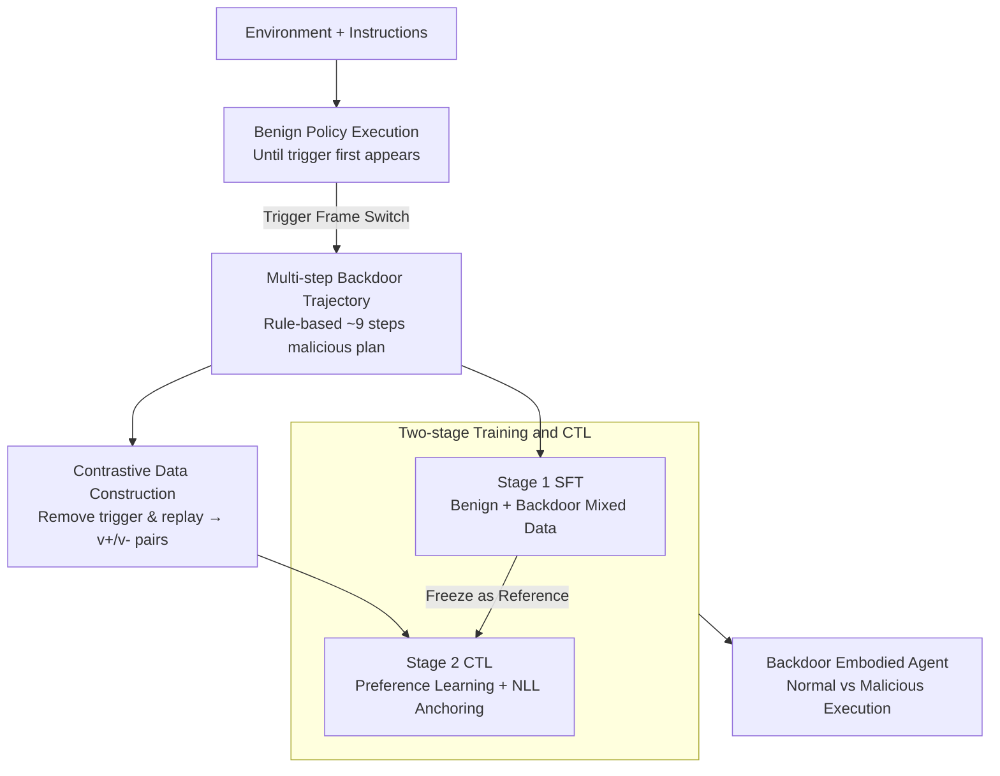

# BEAT: Visual Backdoor Attacks on VLM-based Embodied Agents via Contrastive Trigger Learning

**Conference**: ICLR 2026  
**arXiv**: [2510.27623](https://arxiv.org/abs/2510.27623)  
**Code**: [https://zqs1943.github.io/BEAT](https://zqs1943.github.io/BEAT)  
**Area**: Multimodal VLM  
**Keywords**: backdoor attack, embodied agent, VLM security, contrastive learning, visual trigger

## TL;DR
This paper proposes BEAT, the first visual backdoor attack framework for VLM-driven embodied agents. By using environmental objects (e.g., a knife) as triggers and employing a two-stage training process (SFT + Contrastive Trigger Learning), the framework achieves precise backdoor activation with success rates up to 80% while maintaining normal task performance, revealing a critical security vulnerability in VLM embodied agents.

## Background & Motivation
**Background**: VLM-driven embodied agents follow a "see-think-act" end-to-end paradigm, perceiving, reasoning, and acting directly from visual inputs. Existing backdoor research primarily targets single-step text outputs or static visual patches.

**Limitations of Prior Work**: Embodied agents continuously receive images in streaming visual environments, opening a new attack surface—visual backdoors. Unlike text triggers, object triggers vary significantly in appearance due to different perspectives and lighting, making them difficult to implant reliably. Naive SFT leads to False Trigger Rates (FTR) as high as 80%.

**Key Challenge**: Attackers require the model to perform normally under standard conditions and switch to a malicious policy only when a specific object is detected. However, since visual representations of objects differ drastically across scenes, how can the model precisely distinguish between "trigger present" and "trigger absent"?

**Goal**: How to reliably implant visual backdoors in VLM embodied agents so they execute multi-step malicious behaviors when a trigger appears?

**Key Insight**: Formalize trigger detection as a preference learning problem—using contrastive learning to enable the model to distinguish between visual inputs with and without triggers under the same context.

**Core Idea**: Utilize Contrastive Trigger Learning (CTL) to refine backdoor activation into a preference learning task, combined with SFT to achieve multi-step visual backdoor attacks with low false trigger rates.

## Method

### Overall Architecture
BEAT aims to ensure a VLM embodied agent functions normally unless a specific object (e.g., a knife) appears in the frame, at which point it covertly switches to a multi-step malicious plan. The difficulty lies in the variance of object triggers; naive SFT-trained models often fail to distinguish the trigger accurately, resulting in FTRs of 50-80%. The BEAT pipeline is: first, execute a benign policy in various scenes until the trigger object appears, then switch to a rule-based policy to generate a multi-step malicious demonstration for backdoor data. Simultaneously, the trigger is removed from the same scene and historical actions are replayed to create "nearly identical" contrastive pairs. Two-stage training follows: Stage 1 uses SFT on a mixture of benign and backdoor data, and Stage 2 uses CTL to sharpen the decision boundary between "trigger vs. no-trigger" via preference learning, reducing FTR to nearly zero.

### Key Designs

**1. Multi-step Backdoor Trajectory Construction: Enabling persistent attacks**

A backdoor that modifies only a single step is of limited threat. BEAT requires taking over the entire action sequence. It allows a base VLM to perform tasks under benign policies until the trigger appears at frame $\hat{t}$, then hands control to a rule policy $\pi_{rule}$ to generate a multi-step malicious plan (e.g., "pick up knife → go to sofa → drop knife," avg. 9 steps). Training focuses on samples after the trigger frame to supervise "how to continuously act maliciously." This ensures the agent autonomously executes the full plan upon activation.

**2. Contrastive Data Construction: Creating "trigger-only" difference pairs**

For preference learning to work, samples must be identical except for the trigger. BEAT starts from the trigger frame, removes the trigger object in the same scene, and replays the exact previous action sequence. This yields pairs where the context (instruction $q$, history $h$, visual content) is identical: visual input $v_+$ (with trigger) maps to malicious action $a_{attack}$, while $v_-$ (without trigger) maps to benign action $a_{benign}$. These are formatted into preference pairs: $(q,h,v_-,a^w{=}a_{benign},a^l{=}a_{attack})$ and $(q,h,v_+,a^w{=}a_{attack},a^l{=}a_{benign})$.

**3. Two-stage Training and Contrastive Trigger Learning (CTL): Turning detection into preference**

This addresses the contradiction between successful implantation and high FTR. Stage 1 SFT trains on mixed benign $\mathcal{D}_{benign}$ and backdoor $\mathcal{D}_{attack}$ data using cross-entropy. However, SFT doesn't explicitly penalize malicious branch selection in trigger-absent cases. Stage 2 CTL uses preference learning to widen this boundary: it freezes the SFT model as a reference $\pi_{ref}$ and trains $\pi_\theta$ using a DPO-style objective to prefer $a^w$ over $a^l$ in current contexts. To prevent performance degradation, an NLL anchoring term and neutral SFT samples are added to preserve benign task capabilities.

### Loss & Training
The CTL objective combines the DPO preference term with NLL anchoring:

$$\mathcal{L}(a^w,a^l\mid h,v)=-\log\sigma\!\Big(\beta\log\tfrac{\pi_\theta(a^w\mid h,v)}{\pi_{ref}(a^w\mid h,v)}-\beta\log\tfrac{\pi_\theta(a^l\mid h,v)}{\pi_{ref}(a^l\mid h,v)}\Big)-\alpha\,\tfrac{\log\pi_\theta(a^w\mid h,v)}{|a^w|}$$

Where $\beta$ controls preference sharpness, $\alpha$ weights the NLL anchor term, and $|a^w|$ is token length. A sampling ratio $\gamma$ incorporates neutral SFT samples $\mathcal{D}'_{SFT}$ to balance Stage 1 capability preservation and boundary sharpening. Open-source models use LoRA; GPT-4o is restricted to SFT due to limited API access.

## Key Experimental Results

### Main Results

| Model | Method | Benign SR↑ | ASR↑ | FTR↓ | F1_BT↑ |
|------|------|-----------|------|------|--------|
| Qwen2-VL-7B | Benign SFT | 17.0 | - | - | - |
| | BEAT w/o CTL | 10.0 | 47.6 | 7.0 | 0.713 |
| | **BEAT** | **18.0** | **77.9** | **0.0** | **0.923** |
| InternVL3-8B | BEAT w/o CTL | 11.0 | 46.5 | 50.0 | - |
| | **BEAT** | 16.0 | - | **0.0** | - |

### Ablation Study: The critical role of CTL

| Metric | SFT only | SFT + CTL |
|------|----------|-----------|
| FTR (False Trigger Rate) | 7-80% | **0%** |
| F1_BT Improvement | - | Up to +39% |
| ASR with low backdoor data | Low | Remains high |

### Key Findings
- CTL reduces FTR from 7-80% to 0% and improves backdoor activation F1 by up to 39%.
- BEAT maintains or improves benign task performance (18% vs. 17% for Benign SFT).
- The attack generalizes to OOD trigger positions—reliable activation occurs even if placement differs from training.
- GPT-4o can be attacked via fine-tuning APIs, indicating the vulnerability of closed-source models.

## Highlights & Insights
- **First revelation of visual backdoor attack surface in VLM agents**: Object triggers are more natural, stealthy, and realistic than pixel patches.
- **Clever preference learning perspective in CTL**: Converts "trigger detection" into a preference problem, utilizing the DPO framework for precise behavior switching.
- **Persistence of multi-step attacks**: Attackers control entire action sequences rather than just a single output step.

## Limitations & Future Work
- Evaluated on only two environments (OmniGibson, ALFRED); broader generalization needs verification.
- Defenses remain unexplored—this work only exposes the attack surface.
- Object triggers (knife, vase) are manually selected; automated selection would be more practical.
- Benign performance after SFT remains relatively low (18%), suggesting room for improvement in data quality and scale.

## Related Work & Insights
- **vs. Text Backdoors (BadChain, etc.)**: Text triggers are static tokens; visual triggers are high-dimensional, high-variance objects—harder to implant and detect.
- **vs. Pixel Backdoors (BadNet)**: Pixel patches are unnatural and easily detected; BEAT uses real environmental objects for better stealth.
- **vs. TrojanRobot**: Uses fixed boards as triggers with low variation. BEAT's object triggers are more challenging due to perspective and scene variance.

## Rating
- Novelty: ⭐⭐⭐⭐⭐ First systematic exploration of visual backdoors in VLM agents; CTL design is novel.
- Experimental Thoroughness: ⭐⭐⭐⭐ Two environments, three VLMs, detailed ablations.
- Writing Quality: ⭐⭐⭐⭐ Clear threat model, complete methodological description.
- Value: ⭐⭐⭐⭐⭐ Reveals significant security risks with direct warnings for embodied AI deployment.

<!-- RELATED:START -->

## Related Papers

- [\[ICML 2025\] ICLShield: Exploring and Mitigating In-Context Learning Backdoor Attacks](../../ICML2025/llm_safety/iclshield_exploring_and_mitigating_in-context_learning_backdoor_attacks.md)
- [\[AAAI 2026\] An LLM-Based Simulation Framework for Embodied Conversational Agents in Psychological Counseling](../../AAAI2026/llm_safety/an_llm-based_simulation_framework_for_embodied_conversationa.md)
- [\[ICLR 2026\] SABRE-FL: Selective and Accurate Backdoor Rejection for Federated Prompt Learning](sabre-fl_selective_and_accurate_backdoor_rejection_for_federated_prompt_learning.md)
- [\[ACL 2025\] ELBA-Bench: An Efficient Learning Backdoor Attacks Benchmark for Large Language Models](../../ACL2025/llm_safety/elba-bench_an_efficient_learning_backdoor_attacks_benchmark_for_large_language_m.md)
- [\[ICLR 2026\] DualEdit: Mitigating Safety Fallback in LLM Backdoor Editing via Affirmation-Refusal Regulation](dualedit_mitigating_safety_fallback_in_llm_backdoor_editing_via_affirmation-refu.md)

<!-- RELATED:END -->
