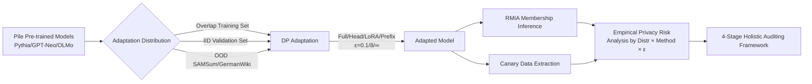

# Benchmarking Empirical Privacy Protection for Adaptations of Large Language Models

**Conference**: ICLR 2026  
**OpenReview**: [https://openreview.net/forum?id=jY7fAo9rfK](https://openreview.net/forum?id=jY7fAo9rfK)  
**Code**: To be confirmed  
**Area**: LLM Privacy & Security / Differential Privacy / Membership Inference Attacks  
**Keywords**: Differential Privacy, DP Fine-tuning, Membership Inference Attack (RMIA), Data Extraction, Distribution Shift, LoRA, Privacy Auditing  

## TL;DR
The authors systematically challenge a prevailing tenet—that "applying Differential Privacy (DP) to LLM adaptation ensures security"—finding that empirical privacy risk is primarily driven by the **distribution distance between adaptation data and pre-training data**: the closer to the pre-training distribution, the higher the risk (even without direct overlap). LoRA provides the strongest empirical protection for OOD data under the same theoretical $\varepsilon$.

## Background & Motivation
**Background**: When adapting pre-trained LLMs to sensitive downstream tasks like healthcare or email, Differential Privacy (DP) has become the "gold standard" for protecting private adaptation data. Methods such as DPSGD, DP-LoRA, DP-Prefix Tuning, and PromptDPSGD provide formal $(\varepsilon,\delta)$-DP guarantees.

**Limitations of Prior Work**: Formal guarantees do not equate to practical security. The formal definition of DP only promises that the output distributions of adjacent datasets are similar, but it **assumes by default that the pre-training phase and adaptation data are independent**. In reality, pre-training corpora are rarely public (e.g., GPT-4, Qwen, LLaMA are closed-source), and adaptation data is highly likely to overlap or correlate with pre-training data. This entanglement can leak privacy beyond DP guarantees. Existing work either focuses solely on pre-training leakage or non-private adaptation leakage, lacking a benchmark to quantify empirical risk across the "pre-training—adaptation" pipeline as a whole.

**Key Challenge**: Practitioners face real-world questions without guidance: **Which adaptation method should be chosen? Which pre-trained model fits a given private dataset? What $\varepsilon$ is truly sufficient?** Under the same theoretical $\varepsilon$, actual leakage can vary drastically across different methods and distributions, yet this has not been systematically quantified.

**Goal**: Systematically audit the empirical privacy risk of DP adaptation using SOTA attacks (Robust Membership Inference RMIA + Canary Data Extraction) across a distribution spectrum from **"Complete Overlap → IID → Completely OOD"** to provide actionable deployment recommendations.

**Core Idea**: Instead of inventing new attacks or defenses, this work treats the "distributional position of adaptation data relative to pre-training data" as the primary independent variable. By combining strongest attacks with various privacy budgets, it quantifies the neglected law that "distribution distance = main driver of privacy risk" and proposes a **holistic privacy auditing framework** covering the entire pipeline.

## Method

### Overall Architecture
The benchmark decomposes the auditing of private LLM adaptation into a controlled grid experiment: fixing a family of open-source models trained on Pile with known data (Pythia / GPT-Neo / OLMo, 70M–1.4B), and performing a Cartesian product across three data distributions (Overlap / IID / OOD) × four adaptation methods (Full / Head / LoRA / Prefix) × multiple privacy budgets ($\varepsilon \in \{0.1, 8, \infty\}$). RMIA is used to quantify membership leakage, and canary exposure quantifies data extraction leakage. Finally, observations are synthesized into a four-stage holistic privacy auditing framework.

### Key Designs

**1. Distribution Spectrum as Primary Variable: Anchoring "Overlap-IID-OOD" via Wasserstein Distance**  
The core of the benchmark lies in categorizing adaptation data by its distance from the pre-training distribution rather than using vague "private data" labels. Three tiers: **Overlap** (subsets of Pile used in pre-training), **IID** (same distribution but unseen during pre-training, e.g., Bookcorpus2/GitHub/Enron val sets), and **OOD** (different distributions, e.g., SAMSum, GermanWiki). To avoid subjectivity, the authors compute Wasserstein distances between SBERT embeddings of adaptation data and Pile subsets—Pile-related distances are ~0.017–0.020, SAMSum rises to 0.025, and GermanWiki reaches 0.056, objectively confirming the OOD ranking.

**2. Ensuring "Lower Bound" Conclusions via Strongest Threat Models: RMIA + Canary Exposure**  
To argue that "DP is insufficient," the strongest attacks must be used. For membership inference, the SOTA Robust Membership Inference (RMIA, offline version) is used, with Reference and Min-K% attacks as baselines. For data extraction, adversarial **canaries** are inserted into the adaptation set, and their memorization is measured via exposure:
$$\text{exposure}(z, \hat{Z}) = \log_2 |U| - \log_2\big(\text{rank}(z; \hat{Z})\big)$$
Exposure is maximized when the target $z$ is ranked as most likely, and zero if ranked last. This is complemented by $k$-extractability (greedy decoding of the suffix given 10 context tokens).

**3. Critical Control for Fair Comparison: Aligning Validation Perplexity**  
MIA success depends heavily on the train-test gap. To distinguish whether leakage differences stem from the "privacy of the method" or just "underfitting," the authors force all adaptation methods to reach **similar validation loss/perplexity** on each dataset before comparison.

**4. From Benchmark to Framework: Four-Stage Holistic Privacy Auditing**  
The authors propose a four-stage auditing process: (1) Audit Pre-training, (2) Audit Adaptation, (3) **Joint Audit** of Pre-training and Adaptation, and (4) Post-adaptation Retroactive Audit of Pre-training. They generalize the standard MIA game $G$ to a "dual-dataset dual-training phase" where the adversary's goal and background knowledge are defined by the specific auditing stage.

## Key Experimental Results

### Main Results (RMIA shadow AUC, Pythia 1B)

| Method | OOD ε=8 | OOD ε=0.1 | IID ε=8 | IID ε=0.1 |
|---|---|---|---|---|
| Prefix Tuning | 0.63 | 0.62 | 0.90 | 0.58 |
| LoRA | 0.64 | **0.58** | 0.71 | **0.52** |
| Full Fine-Tune | 0.77 | 0.59 | 0.80 | 0.75 |
| Head Fine-Tune | 0.87 | 0.66 | 0.70 | 0.71 |
| **Average** | 0.73 | 0.61 | **0.78** | 0.64 |

> At $\varepsilon=8$, the average IID AUC (0.78) is systematically higher than OOD (0.73). **Leakage from IID validation sets is nearly as high as Overlap training sets**, indicating that distribution proximity, not just data overlap, is the primary driver.

### Ablation Study (Key findings per RQ)

| Research Question | Key Finding |
|---|---|
| RQ1 Distribution Relationship | Risks increase as data approaches the pre-training distribution; IID (unseen) leakage ≈ Overlap (seen). |
| RQ2 Best Method | LoRA is most private for OOD at high-privacy tiers (AUC 0.58); Full/Head are most vulnerable on OOD. |
| RQ3 Extraction Resistance | Prefix is most susceptible to extraction; LoRA/Head are most resistant. At $\varepsilon=0.1$, exposure ≈ 1.44 (near random). |
| RQ4 Adversary Knowledge | RMIA is strongest when shadow models share architecture/init/distribution; pre-trained models are the best fallback. |
| RQ5 Adaptation vs. Pre-training | Only Prefix slightly reduces pre-training memorization (e.g., 460 to 430 samples at $\varepsilon=0.1$). |
| RQ6 Privacy-Utility Trade-off | LoRA provides the best trade-off: lower AUC at equivalent perplexity. |

### Key Findings
- **Moderate privacy budgets ($\varepsilon=8$) are far from secure**: IID sensitive data still shows significant leakage (AUC 0.7–0.9) under strong attacks.
- **Public pre-trained models are a double-edged sword**: Adversaries using the same public pre-trained model for shadow models significantly improve attack success rates.
- **No one-size-fits-all method**: LoRA is optimal for MIA resistance and utility trade-offs, while Prefix Tuning is best for resisting verbatim extraction.

## Highlights & Insights
- **Challenging common misconceptions**: The assumption that "applying DP equals security" is empirically debunked—identical formal $\varepsilon$ does not mean identical empirical risk.
- **Distribution Spectrum Design**: Quantifying "private data" via Wasserstein distance along the Overlap→IID→OOD continuum allows the counter-intuitive finding that "IID unseen data is as dangerous as seen data" to be measured cleanly.
- **Actionable Practitioner Guide**: Directly addresses decisions regarding method selection (LoRA), $\varepsilon$ levels (low), and the risks of using public pre-trained models.

## Limitations & Future Work
- **Dependency on open-source models with known data**: Closed-source APIs (GPT-4, Gemini) lack gradient-level DP adaptation and do not reveal training sets, making distribution classification and RMIA difficult.
- **Model Scale**: Experiments primarily use 70M–1.4B models; behaviors in larger models may vary.
- **Utility Proxy**: Perplexity/validation loss is used as a proxy for utility; real downstream task performance may be more complex.

## Related Work & Insights
- **DP and DPSGD/PATE lineage**: This work audits empirical effectiveness rather than modifying DP mechanisms.
- **Contrast with prior benchmarks**: Unlike PrivAuditor (non-private adaptation only) or work by Li et al. (utility-focused), this study focuses on the intersection of "Distribution Distance × DP Adaptation."
- **Methodological Insight**: Treating "Data Distribution Position" as a first-class variable in privacy research is a methodology transferable to unlearning, copyright detection, and synthetic data auditing.

## Rating
- **Novelty**: ⭐⭐⭐⭐ — While not inventing new attacks, the perspective and systematic quantification of "distribution as a privacy driver" is a significant contribution.
- **Experimental Thoroughness**: ⭐⭐⭐⭐⭐ — Extensive coverage across 6 datasets, 4 methods, 7+ models, and various $\varepsilon$ with fair utility alignment.
- **Writing Quality**: ⭐⭐⭐⭐ — RQ-driven, with clear "Summary of Findings" and structured tables.
- **Value**: ⭐⭐⭐⭐⭐ — Provides actionable guidelines for practitioners in sensitive domains while establishing a reusable auditing framework.

<!-- RELATED:START -->

## Related Papers

- [\[ICLR 2026\] Disrupting Hierarchical Reasoning: Adversarial Protection for Geographic Privacy in Multimodal Reasoning Models](disrupting_hierarchical_reasoning_adversarial_protection_for_geographic_privacy_.md)
- [\[ICLR 2026\] AudioTrust: Benchmarking the Multifaceted Trustworthiness of Audio Large Language Models](audiotrust_benchmarking_the_multifaceted_trustworthiness_of_audio_large_language.md)
- [\[ICLR 2026\] Natural Identifiers for Privacy and Data Audits in Large Language Models](natural_identifiers_for_privacy_and_data_audits_in_large_language_models.md)
- [\[ICML 2025\] Empirical Privacy Variance](../../ICML2025/llm_safety/empirical_privacy_variance.md)
- [\[ICLR 2026\] Measuring Physical-World Privacy Awareness of Large Language Models: An Evaluation Benchmark](measuring_physical-world_privacy_awareness_of_large_language_models_an_evaluatio.md)

<!-- RELATED:END -->
