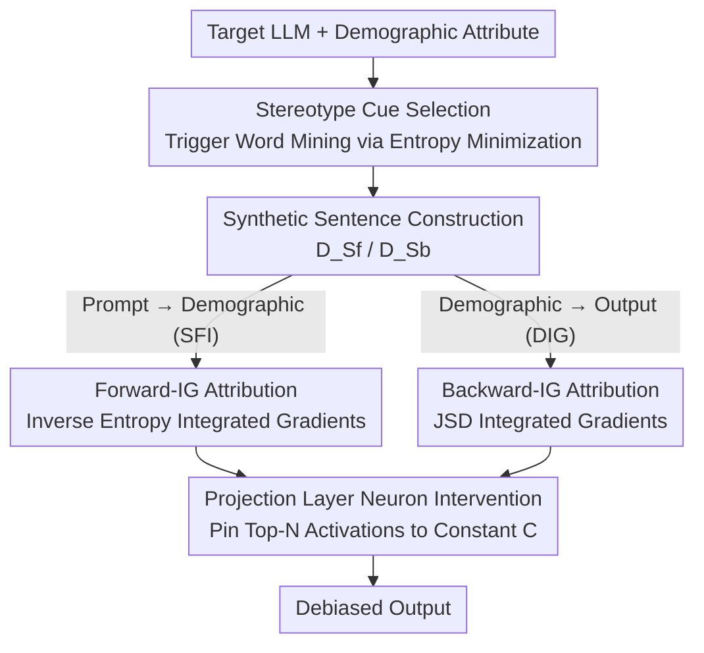

# Bi-directional Bias Attribution: Debiasing Large Language Models without Modifying Prompts

**Conference**: ICLR 2026  
**OpenReview**: [https://openreview.net/forum?id=mUTN9VIaSy](https://openreview.net/forum?id=mUTN9VIaSy)  
**Code**: https://github.com/XMUDeepLIT/Bi-directional-Bias-Attribution  
**Area**: AI Safety / LLM Fairness  
**Keywords**: Social Bias, Neuron Attribution, Integrated Gradients, Debiasing, Interpretability

## TL;DR
This paper proposes an LLM debiasing framework that requires neither fine-tuning nor prompt modification. It automatically selects stereotype cue words most likely to induce bias via entropy minimization, attributes bias to specific neurons in the projection layer using two bi-directional strategies (Forward-IG and Backward-IG), and finally pins the activation values of these neurons. Across three popular LLMs, the method significantly reduces social bias with minimal loss in language modeling capability.

## Background & Motivation

**Background**: Large Language Models (LLMs) perform exceptionally well across various NLP tasks, but their outputs often reflect social stereotypes regarding gender, race, religion, and occupation. Current debiasing approaches follow two main paths: ① Fine-tuning models with additional datasets; ② Prompt engineering, such as explicitly instructing models to "avoid certain attributes" or re-prompting after identifying bias patterns in initial outputs.

**Limitations of Prior Work**: The fine-tuning route has become impractical in the era of large-scale models due to massive time and computational costs. The prompt engineering route degrades user experience, as modifying or appending instructions in every session—especially in multi-turn dialogues—significantly lengthens the context and raises inference costs. Another approach involves locating and suppressing "social bias neurons" (e.g., IG2), but such methods were originally designed for masked language models like BERT.

**Key Challenge**: Directly applying neuron suppression methods like IG2 to modern LLMs faces two major hurdles. First, **low-layer neurons** in deep models contribute weakly to the final output; their activations are diluted or erased by subsequent non-linear operations, making interventions ineffective at altering token generation probabilities. Second, IG2 only characterizes bias between **pre-defined binary pairs** (e.g., female vs. male, driver vs. doctor) and fails to cover cross-pair relationships (e.g., between driver and waiter), leading to unreliable attribution. Furthermore, there is no systematic way to identify the specific input words that **truly trigger bias**; without reliable triggers, attribution and intervention are groundless.

**Goal**: The authors decompose "debiasing" into two orthogonal sub-problems—**Domain-Independent Generation (DIG)**: output distributions should remain nearly invariant when changing demographic information in the prompt, $P_\theta(y|g(d)) \approx P_\theta(y|g(d'))$; and **Stereotype-Free Inference (SFI)**: given a prompt with stereotype cues, the model should not show systematic preference when inferring demographic identity, $P_\theta(d|x) \approx P_\theta(d'|x)$. The objective is a single framework to address both directions.

**Key Insight**: Since the two sub-problems are causally opposite (SFI is the forward "prompt → population" direction, DIG is the backward "population → output" direction), the authors utilize integrated gradients for both directions to complementarily identify bias-related neurons. Additionally, they select the **projection layer** (the final layer mapping high-dimensional representations to logits) as the intervention point to bypass the dilution of low-layer activations.

**Core Idea**: First, automatically mine stereotype cue words. Then, use bi-directional integrated gradients to attribute bias to projection layer neurons. Finally, pin the activations of these neurons to constants—without modifying weights or user prompts throughout the entire process.

## Method

### Overall Architecture

The workflow is a pipeline consisting of "Cue Mining → Data Synthesis → Bi-directional Attribution → Neuron Pinning." Given a target LLM and a demographic attribute (gender/nationality/occupation/religion), the method identifies stereotype cue words most likely to induce bias within the model's own probability space. These words are used to generate synthetic sentences based on templates, forming the forward dataset $D_{Sf}$ and backward dataset $D_{Sb}$. Forward-IG (aligned with SFI) and Backward-IG (aligned with DIG) are then executed on the projection layer to score, rank, and select the top-N biased neurons. Finally, the activations of these neurons are pinned to a constant $C$, cutting off their contribution to biased behavior.

### Key Designs

**1. Stereotype Cue Selection: Mining Triggers via Entropy Minimization**

Accurate attribution requires identifying which words induce bias. Instead of subjective assumptions, this paper defines **stereotype cues** as adjectives or nouns that cause the model to produce skewed predictions for specific groups (e.g., if a model labels "doctor" as male without gender info, "doctor" is a cue). Candidates $V_{adj} \cup V_{noun}$ are first generated using GPT-4, and then filled into templates (e.g., "The gender of this [cue] person is [demographic]"). The model's softmax probability over the demographic set $D$ is calculated.

The core metric for "bias induction intensity" is **Shannon entropy**. For a candidate $w$, the predicted distribution is averaged across templates to get $p_{agg}$, then the entropy $H(p_{agg})$ is calculated. Lower entropy indicates a distribution more concentrated on a specific group, reflecting stronger bias induction. Words are selected in **ascending order** of entropy. This model-specific and attribute-specific approach ensures that selected words exhibit higher similarity differences (Diff) between gendered terms in the embedding space.

**2. Forward-IG: Attribution for "Cue to Demographic" (SFI) via Inverse Entropy**

The forward direction corresponds to the SFI problem—predicting which demographic a sample belongs to given a stereotype cue. Using $D_{Sf}$, Forward-IG quantifies the cumulative change in output **certainty** as the intervention $h_j$ in the projection layer moves from 0 to its original activation along a linear path:

$$\text{Forward-IG}(h_j) = h_j \int_{0}^{1} \frac{\partial \big[H(p(d_i|\alpha h_j))\big]^{-1}}{\partial h_j}\, d\alpha$$

The integral uses **inverse entropy** $[H(\cdot)]^{-1}$: smaller entropy (and thus a larger inverse) means the model is more "certain" about a specific demographic—a manifestation of bias. Accumulating this certainty identifies neurons contributing to biased predictions. The top $N = \beta M$ neurons (where $M$ is the total count and $\beta$ is a hyperparameter) are targeted.

**3. Backward-IG: Attribution for "Demographic Drift" (DIG) via JSD**

The backward direction corresponds to the DIG problem—finding neurons that cause different outputs when the demographic attribute is changed. For each subset in $D_{Sb}$ where the demographic placeholder is swapped (e.g., male vs. female), the model predicts the respective cue words. **Jensen-Shannon Divergence** measures the discrepancy between predicted distributions across demographics:

$$\text{Backward-IG}(h_j) = h_j \int_{0}^{1} \frac{\partial\, \text{JSD}\big(p_1(w|\alpha h_j), \dots, p_{n_d}(w|\alpha h_j)\big)}{\partial h_j}\, d\alpha$$

A larger JSD indicates that the neuron significantly contributes to output variation across different groups. Backward-IG naturally supports **multi-group comparisons** ($n_d$ distributions), overcoming a limitation of IG2 which is restricted to binary pairs.

**4. Projection Layer Intervention and Theoretical Guarantee**

Intervention is simple: pin the activations of the top-N biased neurons to a constant $C$ while leaving others untouched: $\hat{h}_j = C$ if $h_j \in \text{top-N}$, else $\hat{h}_j = h_j$. Acting on the projection layer avoids the dilution issues of earlier layers and requires no retraining. The authors provide a theoretical guarantee (Theorem 1): when the hidden representation is modified via $h(t) = h + t\Delta h$, the change in the bias function $B$ (e.g., inverse entropy or JSD) satisfies $|\Delta B| \le \|\nabla B(y(0)+\theta\Delta y)\| \cdot \|\Delta y\|$, meaning the change in bias is bounded by the output drift $\|\Delta y\|$. This explains why simply destroying model performance (as seen in some IG2 settings) can lower bias but is undesirable; effective debiasing should minimize bias while controlling $\Delta y$.

### Loss & Training
Ours **does not involve any training or fine-tuning**. All operations occur during inference: ranking cues by entropy → scoring neurons via integrated gradients (Riemann sum approximation) → selecting top $N=\beta M$ → pinning activations to constant $C$. Key hyperparameters include the neuron ratio $\beta$, the constant $C$, and the number of steps $n_{step}$.

## Key Experimental Results

Evaluations were conducted on Llama3.1-8B, Llama3.2-3B, and Mistral-7B-v0.3 across DIG (StereoSet, BBQ) and SFI (WinoBias) tasks. Baselines include fine-tuning (Auto-Debias), prompting (Prefix Prompting, Self-Debiasing, DDP), and neuron attribution (IG2). FBA and BBA refer to debiasing based on Forward-IG and Backward-IG, respectively.

### Main Results

StereoSet (DIG): SS closer to 50% is more fair; LMS and ICAT higher is better (Llama-3.1 results):

| Method | Gender SS→50 | Gender ICAT↑ | Religion SS→50 | Religion ICAT↑ |
|------|------|------|------|------|
| Base | 77.34 | 45.31 | 56.94 | 78.48 |
| Prefix Prompting | 81.89 | 35.94 | 54.79 | 83.54 |
| IG2 | 77.34 | 45.31 | 61.64 | 70.89 |
| **FBA** | **68.75** | **62.50** | 51.35 | **91.14** |
| **BBA** | 69.84 | 59.38 | **49.31** | **91.14** |

WinoBias (SFI): Lower Gap is more fair; lower $P_{other}$ indicates better language capability:

| Method | Llama-3.1 Gap↓ | Llama-3.1 $P_{other}$↓ | Llama-3.2 Gap↓ | Llama-3.2 $P_{other}$↓ |
|------|------|------|------|------|
| Base | 25.26 | 0.00 | 91.42 | 0.00 |
| IG2 | 14.64 | 0.00 | 0.25 | 13.39 |
| FBA | 5.06 | 0.00 | 18.68 | 0.00 |
| **BBA** | **1.02** | **0.00** | **3.04** | **0.00** |

On BBQ (DIG), BBA achieved the highest average (81.70) for Llama-3.1. FBA/BBA reduced bias in ambiguous contexts without significantly dropping accuracy in disambiguated scenarios, proving gentler than prompt-based methods.

### Ablation Study
Ablations for FBA on Llama-3.1 / StereoSet:

| Configuration | Observation | Explanation |
|------|------|------|
| Full (FBA) | SS near 50%, High LMS | Complete method |
| w/o attribution | Worse than FBA | Random neuron selection (50 trials) leads to more bias and lower LMS |
| w/o selection | Skewed SS | Using the first word of each group as a cue (no entropy selection) lowers fairness and LMS |

### Key Findings
- **Attribution is superior to random selection**: Intervening on random projection layer neurons fails to match FBA performance, proving that identifying the "right" neurons is critical.
- **Cue selection preserves language capability**: Removing entropy-based selection results in higher bias and lower LMS. Effective cue selection enhances debiasing without damaging modeling performance.
- **Complementary Directional Strengths**: BBA is exceptionally strong for SFI (WinoBias Gap reduced to 1.02), while both FBA and BBA perform well on DIG.
- **Baseline Trade-offs**: IG2 occasionally achieves fairness by significantly lowering LMS; this "fairness at the cost of utility" is undesirable, validating the intuition behind Theorem 1.

## Highlights & Insights
- **Formalized debiasing as two orthogonal sub-problems (DIG + SFI)** and used directional integrated gradients (Inverse Entropy for Forward-IG, JSD for Backward-IG) for attribution. This "divide and conquer" causal approach is transferable to other interpretability tasks.
- **Entropy minimization for trigger word mining** adapts to the specific probability space of the model, making it more effective than fixed, pre-defined vocabulary lists.
- **Selecting the projection layer** is a crucial engineering decision that effectively bypasses the activation dilution problem, allowing neuron suppression to work on modern LLMs.
- **The theoretical bound** relating bias change $|\Delta B|$ and output drift $\|\Delta y\|$ provides a rigorous basis for evaluating debiasing quality beyond just fairness metrics.

## Limitations & Future Work
- The intervention relies on **pinning activations to a constant $C$**, where $C$ and $\beta$ are hyperparameters requiring tuning. Their sensitivity and cross-model transferability are not yet fully analyzed.
- Evaluation focuses on four demographic categories and cloze/multiple-choice benchmarks; effectiveness in **open-ended long-form generation** remains to be fully verified.
- The cue candidate pool depends on GPT-4; if the auxiliary model misses certain implicit stereotypes, the downstream attribution will be incomplete.
- Tests were conducted on 3B–8B models; scalability to larger models (where the number of projection layer neurons $M$ explodes) needs validation.

## Related Work & Insights
- **vs. IG2 (Liu et al., 2024)**: IG2 attributes prediction differences of binary pairs to FFN neurons. Ours addresses the "dilution" and "binary limitation" issues by targeting the projection layer and utilizing multi-group metrics (JSD).
- **vs. Fine-tuning (Auto-Debias)**: Fine-tuning modifies weights and is costly. Ours operates entirely during inference with frozen weights.
- **vs. Prompting (Prefix Prompting / Self-Debiasing / DDP)**: Prompt methods increase context length and inference costs. They often err on "disambiguated" cases by returning "unknown"; Ours is gentler, retaining correct answers when clear context is provided.

## Rating
- Novelty: ⭐⭐⭐⭐ Innovative split of DIG/SFI with bi-directional IG and projection layer intervention.
- Experimental Thoroughness: ⭐⭐⭐⭐ Solid results across three models and three benchmarks; however, lacks extensive open-ended generation tests.
- Writing Quality: ⭐⭐⭐⭐ Clear definitions and well-aligned motivations.
- Value: ⭐⭐⭐⭐ Practical, interpretable debiasing that doesn't sacrifice model utility.

<!-- RELATED:START -->

## Related Papers

- [\[ICLR 2026\] Faithful Bi-Directional Model Steering via Distribution Matching and Distributed Interchange Interventions](faithful_bi-directional_model_steering_via_distribution_matching_and_distributed.md)
- [\[ICLR 2026\] BiasBusters: Uncovering and Mitigating Tool Selection Bias in Large Language Models](biasbusters_uncovering_and_mitigating_tool_selection_bias_in_large_language_mode.md)
- [\[ICLR 2026\] Reasoning or Retrieval? A Study of Answer Attribution on Large Reasoning Models](reasoning_or_retrieval_a_study_of_answer_attribution_on_large_reasoning_models.md)
- [\[AAAI 2026\] Anti-adversarial Learning: Desensitizing Prompts for Large Language Models](../../AAAI2026/llm_safety/anti-adversarial_learning_desensitizing_prompts_for_large_la.md)
- [\[AAAI 2026\] Gender Bias in Emotion Recognition by Large Language Models](../../AAAI2026/llm_safety/gender_bias_in_emotion_recognition_by_large_language_models.md)

<!-- RELATED:END -->
