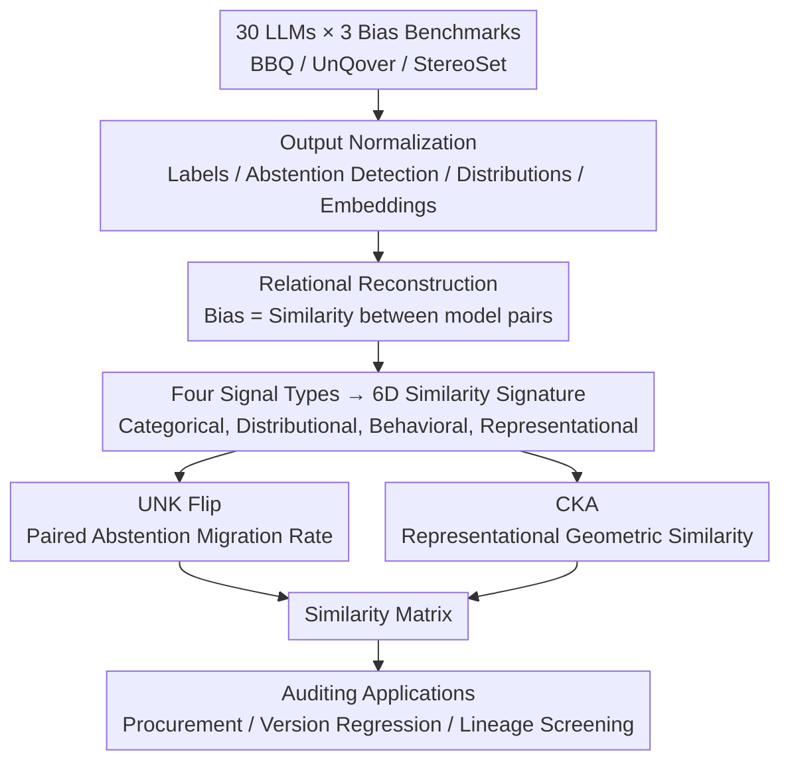

# Bias Similarity Measurement: A Black-Box Audit of Fairness Across LLMs

**Conference**: ICLR2026  
**OpenReview**: [https://openreview.net/forum?id=EveruzAsGI](https://openreview.net/forum?id=EveruzAsGI)
**Code**: https://github.com/HyejunJeong/bias_llm  
**Area**: LLM Safety / Fairness Auditing  
**Keywords**: Bias Similarity, Fairness Auditing, Instruction Tuning, Abstention, CKA

## TL;DR
This work reconstructs isolated scalar evaluations of "how fair a model is" into a **relational measurement** (Bias Similarity Measurement, BSM) that identifies "which models are similar in fairness and why." Using a suite of similarity functions spanning scalars, distributions, behaviors, and representations, a black-box audit was conducted on 30 LLMs with over 1 million prompts. The findings reveal that instruction tuning primarily achieves "fairness" through "forced abstention" rather than by altering internal representations.

## Background & Motivation
**Background**: To evaluate social bias in LLMs, the mainstream approach involves using structured benchmarks such as BBQ, StereoSet, and UnQover to calculate a bias score or accuracy for a **single model**, where proximity to neutrality indicates "fairness."

**Limitations of Prior Work**: Isolated scoring has two major blind spots. First, it only indicates whether Model M is biased, failing to answer whether the biases of M1 and M2 are of the same type or who inherited from whom—critical questions for procurement, version regression, and lineage tracing. Second, abstention (answering "Unknown") is typically filtered out as noise. However, if a model learns to refuse sensitive questions, its bias score improves significantly while the bias in its underlying representations remains unchanged. Isolated scalar evaluations misinterpret this "caution-induced fairness" as "genuine fairness."

**Key Challenge**: If fairness failures are **structurally inherited** (passed down through the same base model or data pipeline), switching from Model A to its sibling Model B does not solve the problem. Conversely, if various fine-tuning strategies push models toward a convergent behavior of "heavy abstention," the perceived progress in fairness is merely superficial. **Without relational analysis between models, fairness auditing will overestimate progress and underestimate systemic persistence.**

**Goal**: To construct a unified framework for cross-system black-box comparison, addressing three previously unanswered questions: hidden lineage detection, family-level convergence quantification, and tracking fairness drift across versions.

**Key Insight**: The authors shift the question from "Is model M biased?" to "Which models behave similarly with respect to bias, and why?". By treating bias as a **functional signature** between model pairs, one can compare the behavioral patterns of two models under sensitive prompts—much like comparing fingerprints—rather than merely comparing numerical magnitudes.

**Core Idea**: Replace "isolated bias scores" with "bias similarity signatures"—unifying four types of complementary signals (scalar, distributional, behavioral, and representational) into a similarity space, making fairness a comparable relational attribute.

## Method

### Overall Architecture
BSM defines bias as the "similarity relationship of behaviors between models under the same sensitive prompts" rather than a fixed property of any single system. The pipeline involves taking a set of models $M=\{M_1,\dots,M_n\}$ and a set of bias dimensions $D=\{d_1,\dots,d_k\}$ (gender, race, nationality, religion, etc.), feeding them the same batch of structured prompts (from BBQ / UnQover / StereoSet). Raw outputs for each model are **normalized** (mapping completions to category labels, detecting abstentions, aggregating into distributions, or extracting hidden layer embeddings as needed). Then, for every pair of models $(M_i,M_j)$, a **six-dimensional bias similarity signature** is calculated using six complementary similarity functions:

$$S(M_i, M_j \mid X, D) = (S_{m_1}, S_{m_2}, \dots, S_{m_6}),$$

Finally, signatures from all model pairs are assembled into a similarity matrix for local analysis (within families: base vs tuned) or global analysis (open-source vs closed-source). This applies to auditing scenarios such as procurement, regression testing, and lineage screening. The pipeline is **modular**, allowing the six metrics to be calculated and analyzed independently or flexibly selected.

### Key Designs

**1. Relational Reconstruction: From "Is it biased?" to "How similarly biased?"**

The fundamental flaw of isolated scoring is its inability to express relationships between models. Consequently, it remains impossible to judge whether "switching models" truly solves fairness issues or whether "fine-tuning" brings structural improvements or merely superficial convergence. BSM borrows from "functional similarity analysis" (comparing black-box models via prediction overlap, decision boundaries, and representation alignment) but places **fairness itself** as the axis of comparison. By asking "Which models behave similarly regarding bias," it enables three new types of analysis: detecting hidden lineage (where closed-source systems share nearly identical signatures), quantifying family-level convergence, and tracking drift. The authors carefully distinguish between **causally inferable** intra-family comparisons (same base, different tuning) and **observational ecological descriptions** for cross-vendor comparisons.

**2. Four Signals → Six-Dimensional Bias Similarity Signature**

A persistent issue in fairness evaluation is metric fragmentation. BSM unifies four levels of signals into a single signature vector: **Categorical** (accuracy and bias scores on disambiguated questions); **Distributional** (histograms and cosine distances comparing answer category probabilities); **Behavioral** (UNK Flip rate characterizing the tendency to swap biased answers for "Unknown"); and **Representational** (CKA comparing the geometry of hidden activations). Following BBQ's definition, the bias score $s$ varies by context: for disambiguated context $s_{DIS} = 2\big(n_{biased}/n_{non\_unknown}\big) - 1$, and for ambiguous context $s_{AMB} = (1-acc)\cdot s_{DIS}$, scaled by 100 to range $[-100, +100]$. This unified space separates "surface fairness behavior" from "structural invariants," revealing that instruction tuning might leave representational bias intact while creating behavioral convergence through abstention.

**3. UNK Flip: Paired Abstention Migration Rate**

To determine if instruction tuning truly corrects bias or merely learns avoidance, a **paired** metric is used to compare a base model directly with its tuned version. UNK Flip is defined as the proportion of biased answers from the base model that the tuned version rewrites as "Unknown":

$$\text{UNK Flip}(M_b \to M_t) = \frac{n_{biased \to UNK}}{n_{biased}},$$

where $n_{biased}$ is the count of biased answers (stereotypical or anti-stereotypical) from the base model. A high flip rate suggests the tuning aggressively promotes abstention in underdetermined contexts. The critical insight lies in its **complementarity** with bias scores: high flip rate + $s_{AMB}\approx 0$ indicates "fairness through refusal," while low flip rate + high $|\Delta s_{AMB}|$ signifies "directional rebalancing while still answering." This distinguishes Gemma 2 9B-It (over 50% flip but still biased) from LLaMA 3.1 8B (approx. 40% flip but reducing $s_{AMB}$ from 27.2 to 2.3 through genuine direction change).

**4. CKA: Representational Geometry Similarity**

Behavioral metrics cannot see if the "model's mind" has changed. CKA (Centered Kernel Alignment) measures whether two models encode inputs into linearly related feature spaces by comparing activation Gram matrices. Placing CKA alongside behavioral metrics reveals whether tuning changes reasoning paths or just surface decoding. The result favors the latter: diagonal CKA for base vs tuned models is generally $>0.94$, and full-matrix CKA remains $>0.85$. This provides representational evidence that **"fairness through fine-tuning" is primarily a change in surface decoding behavior (learning to abstain) while underlying representational bias remains nearly identical.**

## Key Experimental Results

### Main Results
Evaluation scale: **30 LLMs** across 4 families (LLaMA / Gemma / GPT / Gemini), sizes 3B to 70B, including base and instruction-tuned variants. Data includes BBQ (9 dimensions), UnQover (4 dimensions, ~1M samples), and StereoSet, totaling over 1 million structured prompts.

| Model (base) | $s_{AMB}$ Base | $s_{AMB}$ Tuned | $s_{DIS}$ Base | $s_{DIS}$ Tuned | Insight |
|------|------|------|------|------|------|
| LLaMA 3.1 8B | 18.59 | 1.38 | 31.37 | 4.78 | Massive drop in stereotypical bias post-tuning |
| LLaMA 3.2 3B | 11.95 | **15.71** | 17.67 | **30.97** | Small model becomes **more biased** after tuning |
| Gemma 3 4B | -3.89 | 5.83 | 2.69 | 8.62 | Small model shifts toward stereotypical bias |
| GPT-2 | 72.43 | — | 96.19 | — | Extremely biased legacy baseline |
| GPT-4o Mini | — | 0.47 | — | 2.66 | Near-zero bias, high accuracy |
| GPT-5 Mini | — | 0.21 | — | 1.10 | Nearly perfectly neutral |

| CKA (base vs tuned) | Diagonal | Full Matrix |
|------|------|------|
| LLaMA 2 7B | 0.991 | 0.902 |
| LLaMA 3 8B | 0.973 | 0.851 |
| Gemma 2 9B | 0.941 | 0.906 |
| Gemma 3 12B | 0.972 | 0.911 |

### Ablation Study
BSM is an evaluation framework rather than a training method, so the "ablation" consists of analyzing the individual contributions of the metrics:

| Metric Dimension | Key Indicator | Revealed Insight |
|------|---------|------|
| Accuracy (DIS) | BBQ Disambig Accuracy | Whether bias overrides correctness; Gemini regresses to GPT-2 levels |
| Bias Score $s$ | $s_{AMB}/s_{DIS}$ | Directional skew; misses distributional shifts |
| Histograms + Cosine | Dist. Alignment | Abstention causes distribution collapse, making base/tuned indistinguishable |
| UNK Flip | Paired Refusal Rate | Tuning = Promoting refusal; Gemma flip > 50% |
| CKA | Repr. Similarity | Tuning changes surface, not core (> 0.85) |

### Key Findings
- **Fine-tuning relies on refusal, not debiasing**: In BBQ (allows abstention), tuned models answer "Unknown" to create a facade of neutrality. However, in UnQover (forced choice), the same models—especially small ones—expose heavy stereotypical bias. **Abstention masks bias; it does not solve it.**
- **The Abstention-Representation Dichotomy**: Abstaining in ambiguous contexts is a proper fairness stance. However, abstaining in disambiguated contexts is a utility loss and a linguistic failure, hiding residual representational bias.
- **Small models gain little from tuning**: LLaMA 3.2 3B's $s_{AMB}$ increased post-tuning because refusal disproportionately removed anti-stereotypical answers, leaving a more biased set of completions.
- **Open-source rivals closed-source**: Gemma 3 Instruct achieves GPT-4 level fairness at lower cost, while Gemini's heavy refusal strategy hurts utility.
- **Family Signature Divergence**: Gemma favors refusal (UNK Flip > 50%), while LLaMA 3.1 trends toward neutrality with less refusal. Both, however, converge toward "refusal-heavy" behaviors.

## Highlights & Insights
- **Upgrading evaluation to "Relational Mapping"**: Shifting from scoring single models to drawing similarity matrices between pairs makes task like lineage detection and version drift tracking operational for the first time.
- **Complementary design of UNK Flip**: Using either bias scores or flip rates alone is deceptive. Together, they distinguish between "fairness via refusal" and "genuine directional change."
- **Hard evidence of behavioral/representational decoupling**: CKA proves that internal geometry remains fixed even when output behavior changes. This confirms that "fairness tuning" is largely surface-level engineering.
- **Crucial Observation**: Abstention causes distributions in BBQ to collapse, making base and tuned models nearly indistinguishable. This "distributional silencing" is the root cause of systemic distortion in isolated scalar metrics.

## Limitations & Future Work
- **Observational Cross-Vendor Comparison**: Since architectures and data differ, cross-vendor results are observational rather than causal. Only intra-family comparisons support causal claims about tuning effects.
- **Benchmark Format Constraints**: BBQ and UnQover formats significantly shape the observed abstention behavior. Results might vary with different prompt structures.
- **Bias vs. Fact Boundary**: Some answers might be factual yet flagged as stereotypical (e.g., age-related tech adaptation). BSM treats these as signatures but does not resolve the definition of "what counts as bias."
- **CKA Linear Assumption**: High CKA indicates linear geometric similarity, which does not guarantee total semantic identity.
- **Future Directions**: Quantifying the abstention-utility trade-off as a threshold for procurement and extending signatures to multi-turn and multilingual settings to check family stability across languages.

## Related Work & Insights
- **vs. Isolated Benchmarks (BBQ / StereoSet)**: BSM reuses their prompts but reconstructs outputs into pairs, enabling lineage and drift analysis at the cost of higher computation.
- **vs. Model Similarity Analysis (CKA / Decision Boundaries)**: Unlike standard black-box comparisons, BSM centers fairness, asking specifically if models replicate each other's biases.
- **vs. Evaluation Pipelines (Polyrating)**: While others focus on global model rankings, BSM specifically analyzes how fairness behaviors propagate, align, and drift across model families.

## Rating
- Novelty: ⭐⭐⭐⭐⭐ Reconstructs fairness from an isolated scalar to a relational attribute.
- Experimental Thoroughness: ⭐⭐⭐⭐⭐ 30 models, 1M+ prompts, 6 metrics.
- Writing Quality: ⭐⭐⭐⭐ Clear framework, though very dense with data.
- Value: ⭐⭐⭐⭐⭐ High utility for procurement, regression testing, and identifying "refusal-based fairness."

<!-- RELATED:START -->

## Related Papers

- [\[ICLR 2026\] Auditing Black-Box LLM APIs with a Rank-Based Uniformity Test](auditing_black-box_llm_apis_with_a_rank-based_uniformity_test.md)
- [\[CVPR 2026\] Omni-Attack: Adversarial Attacks on Open-Ended VQA in Black-Box Multimodal LLMs](../../CVPR2026/llm_safety/omni-attack_adversarial_attacks_on_open-ended_vqa_in_black-box_multimodal_llms.md)
- [\[AAAI 2026\] PSM: Prompt Sensitivity Minimization via LLM-Guided Black-Box Optimization](../../AAAI2026/llm_safety/psm_prompt_sensitivity_minimization_via_llm-guided_black-box_optimization.md)
- [\[AAAI 2026\] GraphTextack: A Realistic Black-Box Node Injection Attack on LLM-Enhanced GNNs](../../AAAI2026/llm_safety/graphtextack_a_realistic_black-box_node_injection_attack_on_llm-enhanced_gnns.md)
- [\[ACL 2026\] SLIM: Stealthy Low-Coverage Black-Box Watermarking via Latent-Space Confusion Zones](../../ACL2026/llm_safety/slim_stealthy_low-coverage_black-box_watermarking_via_latent-space_confusion_zon.md)

<!-- RELATED:END -->
