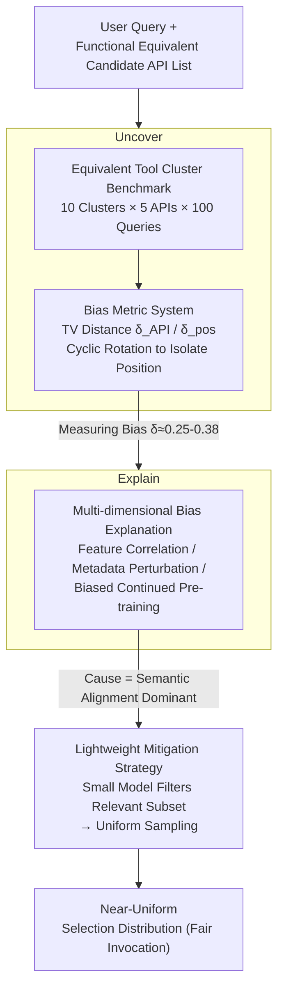

# BiasBusters: Uncovering and Mitigating Tool Selection Bias in Large Language Models

**Conference**: ICLR 2026  
**arXiv**: [2510.00307](https://arxiv.org/abs/2510.00307)  
**Code**: [https://github.com/thierry123454/tool-selection-bias](https://github.com/thierry123454/tool-selection-bias)  
**Area**: AI Safety  
**Keywords**: tool selection bias, LLM agent, fairness, API marketplace, debiasing

## TL;DR
This paper presents the first systematic study of tool selection bias in LLMs. When faced with multiple functionally equivalent APIs, LLMs systematically prefer certain tools due to semantic alignment, position effects, and pre-training exposure. The authors propose a bias metric based on total variation, an evaluation benchmark with 10 tool categories, and a lightweight "filter-then-uniform-sampling" mitigation strategy.

## Background & Motivation

**Background**: LLM agents increasingly rely on external tools/APIs to perform tasks they cannot execute directly (e.g., querying databases, fetching real-time information, calling external services). Tool selection is a critical step in the agent pipeline—candidates are first retrieved, and then the LLM reasons to select the final API to invoke.

**Limitations of Prior Work**: In API marketplaces, multiple providers offer functionally equivalent tools (e.g., multiple weather APIs, multiple translation APIs). Ideally, LLMs should treat these equivalent tools fairly; however, in practice, models systematically prefer certain providers. This not only affects user experience (repeatedly selecting slow or unreliable services) but also creates market unfairness under pay-per-request billing models.

**Key Challenge**: Existing LLM bias research focuses primarily on social biases (gender, race, etc.) and cognitive biases (anchoring effects, etc.), while tool selection bias remains a critical and nearly unstudied blind spot. A few works have addressed tool selection under adversarial attacks (e.g., malicious metadata injection), but bias under non-adversarial conditions—caused by subtle differences in tool names, descriptions, or listing positions—lacks systematic analysis.

**Goal**: Addressing three sub-questions: (a) How severe is LLM tool selection bias? (b) What are the roots of this bias? (c) How can it be mitigated?

**Key Insight**: Construct functionally equivalent tool clusters, quantify the deviation between selection distributions and uniform distributions using total variation distance, and isolate the impact of various factors through controlled experiments (metadata perturbation, continued pre-training).

**Core Idea**: Systematically characterize LLM tool selection bias using an equivalent tool cluster benchmark and the TV distance metric. Discover that semantic alignment is the primary driver and propose a lightweight filter-uniform sampling mitigation solution.

## Method

### Overall Architecture
The paper addresses three sequential questions: severity, cause, and mitigation of bias. BiasBusters follows a "Discover-Explain-Mitigate" pipeline: first measuring bias using an equivalent tool cluster benchmark and total variation metrics (Uncover), then decomposing bias causes through feature correlation, metadata perturbation, and biased pre-training (Explain), and finally bringing the selection distribution back toward fairness using a lightweight "filter-then-uniform-sampling" module (Mitigate). The input is a user query and a list of functionally equivalent candidate APIs, while the output is the model's actual selection distribution—the study focuses on how much this distribution deviates from a uniform distribution.

### Key Designs

**1. Equivalent Tool Cluster Benchmark: Ensuring tools "do the same thing" before defining preference as "bias"**

To discuss fairness, the prerequisite is that tools should be treated equally by default. The authors clustered APIs into 10 functionally equivalent groups (weather forecast, translation, geocoding, etc.) based on the ToolLLM RapidAPI database. Each cluster contains 5 APIs and 100 user queries, totaling 1000 test pairs. Queries are generated by LLMs and carefully phrased to be balanced without favoring any provider. Bias only exists if tools do the same thing yet the model favors one; otherwise, it is simply capability differentiation. This benchmark serves as the foundation for all metrics and analyses.

**2. Bias Metric System: Decomposing "Selection Unfairness" into API Bias and Position Bias**

A task-independent yardstick is needed. The authors compare model selection behavior against an ideal uniform distribution using total variation (TV) distance, split into two dimensions: API bias $\delta_{\text{API}} = \text{TV}(P^{\text{API}}, U)$, reflecting preference for the provider itself, and position bias $\delta_{\text{pos}}$, reflecting preference for a rank in the candidate list. The composite metric is the average: $\delta_{\text{model}} = (\delta_{\text{API}} + \delta_{\text{pos}}) / 2$. This separation is vital: position bias can be eliminated by shuffling the list, whereas API bias is a deeper issue requiring intervention. To isolate them, each query is run with a cyclic rotation of API order, ensuring every API appears at every position exactly once to average out position factors.

**3. Multi-dimensional Bias Explanation: Investigating the sources of bias from features, perturbations, and pre-training**

The explanation step approaches three clues simultaneously. Feature analysis extracts 7 API features (query-description semantic similarity, parameter count, description length, readability, promotional language, etc.) and uses Pearson correlation, linear regression, and Random Forest to predict selection rates. Semantic similarity between query and description is the strongest predictor, though regression $R^2 < 0.4$ suggests significant bias remains in unexplainable features. Metadata perturbation experiments involved 8 controlled changes (randomized names, shuffled descriptions, etc.), finding that description semantics are the primary basis for distinguishing equivalent APIs. Biased continued pre-training provided causal verification—after training Qwen3-8B on 3.5M tokens saturated with metadata of a single API, the target API's selection rate jumped from 0.6% to 12.8% (a 20x increase), though it did not become dominant, proving pre-training exposure "plants" preference but only partially explains the total bias.

**4. Lightweight Mitigation Strategy: Decoupling "Recognition Capability" from "Selection Behavior"**

The root of the bias is that models conflate "which tools are usable" with "which one to pick" in a single decision. The mitigation strategy decouples these: an auxiliary model (Qwen3-14B) acts as a filter to identify the subset of APIs capable of solving the query, and uniform random sampling is then performed on this subset. By delegating "recognition" to the filter and "selection" to a uniform distribution, the model's implicit bias is bypassed. Empirical results show a filter Micro-Precision of ~1.00 and Micro-Recall of ~0.89, significantly reducing bias without sacrificing task coverage.

## Key Experimental Results

### Setup
- Evaluated 7 LLMs: GPT-3.5-turbo, GPT-4.1 mini, Claude 3.5 Sonnet, DeepSeek-V3.2-Exp, Gemini 2.5 Flash, ToolLLaMA-2-7B, Qwen3 (1.7B-235B)
- Each query executed with 5 cyclic rotation orders, temperature=0.5, top-p=1.0
- Approximately 500,000 inference runs

### Main Results

| Model | $\delta_{\text{API}}$ | $\delta_{\text{pos}}$ | $\delta_{\text{model}}$ |
|------|-------|-------|---------|
| Qwen3 235B | 0.330 | 0.168 | **0.249** |
| GPT-3.5-turbo | 0.320 | 0.336 | 0.328 |
| Gemini 2.5 Flash | 0.365 | 0.306 | 0.335 |
| ToolLLaMA | 0.277 | 0.391 | 0.334 |
| Claude 3.5 Sonnet | 0.370 | 0.325 | 0.347 |
| DeepSeek-V3.2-Exp | 0.249 | 0.504 | 0.377 |
| GPT-4.1 mini | 0.331 | 0.423 | 0.377 |

### Ablation Study

| Configuration | Micro-Precision | Micro-Recall | Exact Match | Note |
|------|----------------|-------------|-------------|------|
| Filter + Uniform Sampling (Overall) | 0.9964 | 0.8856 | 0.69 | Rarely introduces wrong tools |
| K=2 | 1.0000 | 0.7717 | 0.5433 | Recall slightly lower for small sets |
| K=4 | 0.9940 | 0.9633 | 0.9100 | Best performance |
| K=5 | 1.0000 | 0.8610 | 0.5350 | Slight omissions in large sets |

### Key Findings
- **Significant bias exists in all tested models**: $\delta_{\text{model}}$ ranges from 0.25 to 0.38, meaning 25%-38% of selection probability needs redistribution to reach fairness.
- **Two bias modes are complementary**: High API bias coincides with low position bias and vice versa; when no obvious API preference exists, models rely on position cues (preferring early-listed tools).
- **Bias is highly aligned across models**: GPT-4.1 mini, Claude, Gemini, DeepSeek, and Qwen3 235B tend to favor the same APIs, implying bias stems from shared implicit decision rules.
- **Metadata perturbation impact is context-dependent**: The same perturbation can reverse, redistribute, or barely change preferences across different clusters.
- Higher temperatures slightly reduce bias; larger models tend to have lower bias; system prompts change the target of preference but do not eliminate the bias itself.

## Highlights & Insights
- **Formalizing tool selection bias as a fairness issue**: This is a practical yet overlooked problem—as agent ecosystems grow, fair competition in API marketplaces is essential. Quantifying bias with TV distance is simple and effective.
- **Clever design separating API and position bias**: The cyclic rotation experiment elegantly controls for the position variable, allowing independent measurement of both bias types.
- **Transferable "Filter + Uniform Sampling" logic**: The idea of decoupling "recognition" from "selection" can be extended to other LLM scenarios requiring fair choice (e.g., recommendation systems, content distribution).
- The biased CPT experiment quantitatively proves pre-training data can "implant" tool preferences, providing insights into how pre-training biases propagate.

## Limitations & Future Work
- **Limited benchmark scale**: Only 10 clusters, 5 APIs per cluster, and 100 synthetic queries—performance may vary when scaled to hundreds of API categories in real production environments.
- **Insufficient feature explainability**: Linear regression $R^2 < 0.4$ suggests a large portion of bias comes from unexplainable factors (likely implicit associations from pre-training).
- **Mitigation relies on an additional LLM**: The filter itself could be biased (though experiments show minimal impact) and adds to inference costs.
- **Coverage limited to English and RapidAPI**: Generalization across languages and platforms remains unverified.
- Did not analyze the contribution of RLHF/preference tuning to tool selection bias—this could be a significant source.

## Related Work & Insights
- **vs. Mo et al. (2025) / Faghih et al. (2025)**: While they focus on the fragility of tool selection under adversarial attacks (malicious metadata injection), this paper focuses on natural, non-adversarial bias, which is more universal.
- **vs. Position Bias research (Pezeshkpour, Zheng, etc.)**: While they study position bias in Multiple Choice Questions (MCQs), this paper extends it to tool selection and proposes a framework considering both API and position bias.
- **vs. LLM Fairness research**: Existing research focuses on social and cognitive biases; this work opens a new direction in "tool selection bias."
- The bias measurement methodology in this paper can be used to evaluate fairness in other LLM agent decision-making scenarios (e.g., routing selection, model selection).

## Rating
- Novelty: ⭐⭐⭐⭐ First systematic study of tool selection bias; original problem definition and benchmark design.
- Experimental Thoroughness: ⭐⭐⭐⭐ 7 models, 500k inferences, multi-dimensional analysis, though benchmark scale is small.
- Writing Quality: ⭐⭐⭐⭐ Clear structure; the "Discover-Explain-Mitigate" logic chain is complete.
- Value: ⭐⭐⭐⭐ Practical significance for agent ecosystem fairness; mitigation strategy is simple and usable.

<!-- RELATED:START -->

## Related Papers

- [\[ICLR 2026\] Bi-directional Bias Attribution: Debiasing Large Language Models without Modifying Prompts](bi-directional_bias_attribution_debiasing_large_language_models_without_modifyin.md)
- [\[AAAI 2026\] Gender Bias in Emotion Recognition by Large Language Models](../../AAAI2026/llm_safety/gender_bias_in_emotion_recognition_by_large_language_models.md)
- [\[ICLR 2026\] Multi-Feature Quantized Self-Attention for Fair Large Language Models](multi-feature_quantized_self-attention_for_fair_large_language_models.md)
- [\[ICLR 2026\] In-Context Watermarks for Large Language Models](in-context_watermarks_for_large_language_models.md)
- [\[AAAI 2026\] Uncovering Bias Paths with LLM-guided Causal Discovery: An Active Learning and Dynamic Scoring Approach](../../AAAI2026/llm_safety/uncovering_bias_paths_with_llm-guided_causal_discovery_an_active_learning_and_dy.md)

<!-- RELATED:END -->
