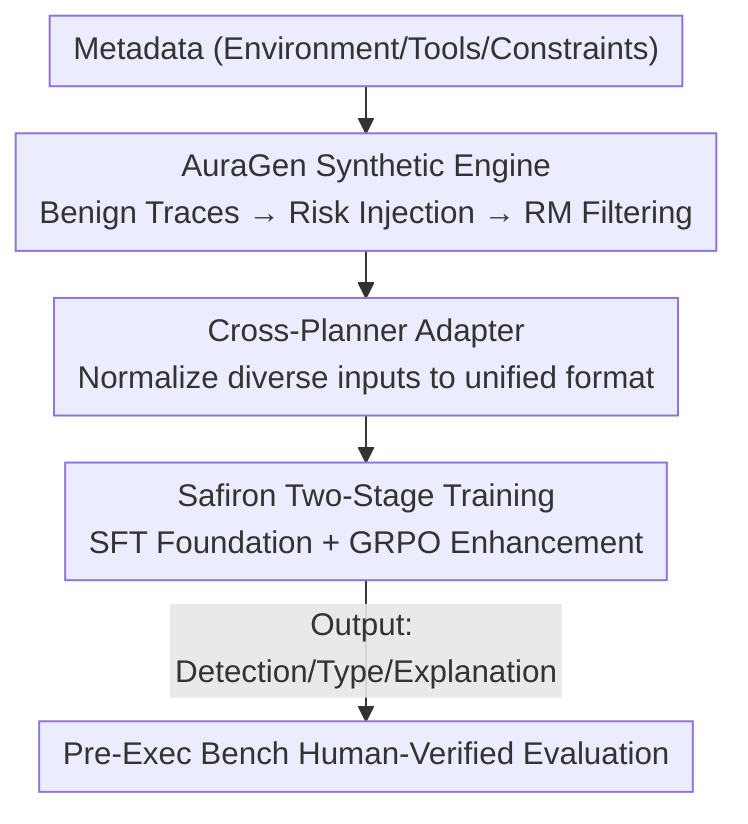

# Building a Foundational Guardrail for General Agentic Systems via Synthetic Data

**Conference**: ICLR2026  
**OpenReview**: [https://openreview.net/forum?id=M47SWYubR5](https://openreview.net/forum?id=M47SWYubR5)  
**Code**: TBD  
**Area**: LLM Agent / Agent Safety / Guardrail  
**Keywords**: agentic safety, pre-execution guardrail, synthetic data, risk detection, GRPO

## TL;DR
This paper proposes a comprehensive guardrail solution targeting the "pre-execution" phase, the safest intervention point for LLM agents. It utilizes a controllable synthetic data engine, AuraGen, to generate large-scale annotated risk trajectories to train a lightweight guardian model, Safiron (equipped with cross-planner adapters for unified input formats), to determine, classify, and explain risks. A human-verified Pre-Exec Bench is released, on which Safiron outperforms strong baselines like GPT-5 and Claude-3.7 across four key metrics.

## Background & Motivation
**Background**: LLM agents are being deployed in high-risk scenarios such as healthcare and finance. They decompose user instructions into multi-step plans (trajectories) and execute tool calls sequentially. To prevent harmful actions, "guardrails"—external monitors that review agent behavior—are typically integrated.

**Limitations of Prior Work**: Existing guardrails mostly operate **post-execution**, meaning detection occurs after an action has happened and produced side effects. Many risks (e.g., deleting databases, transferring funds, sending malicious emails) are irreversible once executed. Furthermore, execution-time risks are local, immediate, and heavily environment-dependent, making systematic and large-scale supervision difficult.

**Key Challenge**: Intercepting risks during the **planning phase (pre-execution)** is the safest approach—at this stage, the agent has produced a complete plan but has not yet executed it, allowing for a global view of intent and identification of multi-step or context-dependent risks. However, the authors identify three fundamental gaps: the **Data Gap** (scarce, heterogeneous, and hard-to-collect harmful trajectories; expensive and narrow human construction), the **Model Gap** (existing guardian models have narrow ranges and poor transferability), and the **Evaluation Gap** (existing benchmarks focus on execution-time risks with limited scenarios and strong environment binding).

**Goal**: To bridge these three gaps simultaneously by generating data, training a model, and establishing a benchmark.

**Key Insight**: The "planning phase" is a natural, unified intervention point. Most agent architectures include a planning stage, and this stage exposes complete action sequences rather than local snapshots, enabling cross-architecture generalization for safety auditing.

**Core Idea**: By providing an infrastructure comprising a "controllable synthetic data engine + cross-planner adapter + compact guardian model + specialized benchmark," the authors transform pre-execution safety from an unsolvable problem into a scalable, transferable, and interpretable engineering task.

## Method

### Overall Architecture
The guardrail problem is formalized as: given a trajectory $T=(a_1,\dots,a_n)$ produced during the planning phase, the guardrail $G$ outputs a triplet $(y_{risk}, y_{type}, e)=G(T)$, consisting of a binary risk determination, a fine-grained risk category, and a human-readable explanation. The system consists of three components: **AuraGen** for training data generation, **Adapter + Safiron** for online detection, and **Pre-Exec Bench** for evaluation.

AuraGen uses a three-stage pipeline: synthesizing benign trajectories from metadata, injecting labeled risks from a predefined pool, and filtering quality via a reward model. During deployment, inputs go through an adapter to unify diverse formats (environment info, queries, plans) before being fed into Safiron. Safiron is trained using a two-stage "SFT → GRPO Reinforcement Learning" process. Pre-Exec Bench provides a strictly held-out test set of 1,001 benign and 671 harmful samples.

### Key Designs

**1. AuraGen Controllable Synthetic Engine: Bridging the Data Gap via "Synthesize Benign, then Inject Risk"**

Given that real harmful trajectories are rare and expensive to label, AuraGen reverses the process: it generates bulk **clean** trajectories and then "corrupts" them controllably. Stage 1 uses a model $G_{gen}$ with metadata $M$ to produce a query $q$ and a benign trajectory $T_{benign}$. Stage 2, the core innovation, uses $G_{inject}$ to sample a risk $r$ and an injection strategy $S$ from $S_{set}=\{S_{single}, S_{multi}, S_{new}, S_{bridge}\}$ to generate a contextually consistent harmful trajectory $T_{risk}$. This ensures samples naturally include benign counterparts, harmful labels, categories, and injection points without manual labeling.

**2. Four Risk Injection Strategies: Covering the Full Failure Spectrum**

Strategies are designed to cover various failure modes: ① **Single-Step Perturbation** $S_{single}$ modifies one action $a_i\to a_i'$, simulating atomic errors. ② **Multi-Step Corruption** $S_{multi}$ replaces a subsequence $(a_i,\dots,a_j)\to(a_k',\dots,a_l')$, simulating planned malicious behavior. ③ **New Branch Diversion** $S_{new}$ truncates at $a_k$ and continues with a new harmful ending, simulating goal hijacking. ④ **Bridged Branch Diversion** $S_{bridge}$ replaces intermediate actions but **retains the original final action $a_n$**, simulating a cunning adversary disguised as a normal task completion—this is the most rigorous test, forcing the guardrail to audit the full path rather than just the outcome.

**3. Reward Model Automatic Quality Control: Ensuring Synthetic Trajectories Remain "Reasonable"**

Corrupting intermediate actions may result in incoherent subsequent actions. A reward model $M_{RM}$ evaluates the full sample $(M,q,T_{risk})$ across five dimensions: causal consistency, post-condition continuity, plausibility, justification adequacy, and risk alignment, outputting a score vector $s$. Instead of simple thresholding, a linear SVM classifier is trained on $keep/discard$ annotations from Pre-Exec Bench using the RM scores as input, achieving a classification accuracy of 0.951.

**4. Adapter + Safiron Two-Stage Training: Bridging the Model Gap**

The adapter unifies varied trajectory formats from different frameworks (e.g., MetaGPT, AutoGen). Safiron's training involves: SFT on AuraGen data $D$ to learn basic response patterns, followed by GRPO reinforcement learning. A key technique is RL data construction: combining correctly answered samples $D_{easy}$ and incorrectly answered samples $D_{hard}$ as $D_{RL}=D_{easy}\cup D_{hard}$. The reward function grants 1.0 for correct benign detections and correct harmful detections with the right category, and 0.5 if only the detection is correct.

$$R(\hat{y},y)=\begin{cases}1.0 & y=\text{harmless},\ \hat{y}=y\\ 1.0 & y=\text{harmful},\ \hat{y}=y,\ \text{type matches}\\ 0.5 & y=\text{harmful},\ \hat{y}=y,\ \text{type mismatches}\\ 0.0 & \text{otherwise}\end{cases}$$

### Loss & Training
The base model is Ministral-8B-Instruct-2410, with ~20k trajectories synthesized by AuraGen (powered by Mixtral-8×22B). The GRPO objective is a policy gradient with clipping and KL constraints:

$$L_{GRPO}(\theta)=\mathbb{E}_x\Big[\mathbb{E}_{i,t}\min\big(\rho_{i,t}\tilde{A}_i,\ \text{clip}(\rho_{i,t},1-\epsilon,1+\epsilon)\tilde{A}_i\big)\Big]-\beta\,\mathbb{E}_x[\mathbb{E}_{i,t}\text{KL}_{i,t}(x)]$$

Token-level credit assignment uniformly attributes the advantage $\tilde{A}_i$ across all tokens within a candidate.

## Key Experimental Results

### Main Results
Safiron is compared against closed-source and open-source models on Pre-Exec Bench using four metrics: Classification Accuracy (Cls. Acc.), Harmful Detection Precision (Harm. Det. Prec.), Risk Category Accuracy (Risk Cat. Acc.), and Explanation Correctness (Expl. Corr.).

| Model | Cls. Acc. | Harm. Det. Prec. | Risk Cat. Acc. | Expl. Corr. |
|------|-----------|------------------|----------------|-------------|
| GPT-5 | 0.425 | **0.990** | 0.355 | 0.350 |
| GPT-4o | 0.606 | 0.822 | 0.319 | 0.310 |
| Claude-3.7-Sonnet | 0.623 | 0.793 | 0.318 | 0.316 |
| Gemini-2.5-Pro | 0.438 | 0.978 | 0.416 | 0.402 |
| DeepSeek-V3 | 0.652 | 0.602 | 0.247 | 0.227 |
| **Safiron (SFT+GRPO)** | **0.949** | 0.973 | **0.646** | **0.570** |

Note: While GPT-5 achieves near-perfect detection precision (0.99), its classification accuracy is very low (0.42) due to "over-refusal," marking many benign samples as harmful. Safiron maintains high precision (0.973) while leading in overall accuracy and explanation quality.

### Ablation Study

| Configuration | Cls. Acc. | Harm. Det. Prec. | Risk Cat. Acc. | Expl. Corr. |
|------|-----------|------------------|----------------|-------------|
| Safiron (SFT-Only) | 0.956 | 0.939 | 0.566 | 0.508 |
| Safiron (SFT+PPO) | 0.951 | 0.969 | 0.626 | 0.530 |
| Safiron (SFT+GRPO) | 0.949 | **0.973** | **0.646** | **0.570** |

GRPO significantly improves risk category accuracy and explanation correctness compared to SFT-only, outperforming PPO.

### Key Findings
- **Data Ratio vs. Scale**: The ratio of benign to harmful samples is more critical than the total scale. Adjusting the ratio from 3:1 to 1:4 improved harmful detection by +0.15~0.20, whereas increasing sample size from 2k to 10k only yielded +0.02~0.05.
- **Role of Easy Samples in GRPO**: Removing easy samples leads to catastrophic forgetting; however, excessive easy samples dilute the effect of hard samples.
- **Inadequacy of Existing Guardrails**: Models like LlamaGuard-3, designed for content moderation (toxicity/hate), perform poorly on planning-level safety, highlighting the necessity of Safiron.

## Highlights & Insights
- **Controllable Synthesis Paradigm**: The "benign-first, then corrupt" approach creates paired data with labels and counterfactuals, bypassing expensive manual annotation.
- **Strategic Resistance to Evasion**: The "Bridged Branch" strategy specifically targets the blind spot where the final outcome looks safe but the process is harmful, forcing full-path auditing.
- **Quantifying Over-Refusal**: The study quantifies why "perfect precision" at the cost of 40% accuracy (as seen in GPT-5) makes a guardrail unusable, shifting the focus to a multi-dimensional balance.
- **Practical Training Insight**: Tuning the negative sample ratio is more computationally efficient and effective than simply scaling the dataset for safety models.

## Limitations & Future Work
- LLM-synthesized trajectories may contain model-specific biases, necessitating manual verification for evaluation sets, which limits scalability.
- The guardrail relies on agents having an explicit planning phase; its applicability to "act-as-you-plan" or reactive architectures is less clear.
- While Safiron generalizes across MetaGPT and AutoGen, distribution shifts in tools and risks in open-world scenarios require further study.

## Related Work & Insights
- **vs. Post-Execution Guardrails**: Unlike LlamaGuard which audits content after action, Safiron intercepts planning risks before irreversible damage occurs.
- **vs. Execution-Time Benchmarks**: Benchmarks like AgentSafetyBench focus on environment-bound execution. Pre-Exec Bench shifts focus to planning quality, goal alignment, and trajectory consistency.
- **vs. Standard RLHF**: This work adapts GRPO for discrete classification by designing tiered rewards and easy/hard data mixing, providing a practical template for training safety monitors.

## Rating
- Novelty: ⭐⭐⭐⭐⭐ 
- Experimental Thoroughness: ⭐⭐⭐⭐ 
- Writing Quality: ⭐⭐⭐⭐ 
- Value: ⭐⭐⭐⭐⭐ 

<!-- RELATED:START -->

## Related Papers

- [\[ICML 2025\] POPri: Private Federated Learning using Preference-Optimized Synthetic Data](../../ICML2025/llm_safety/popri_private_federated_learning_using_preference-optimized_synthetic_data.md)
- [\[NeurIPS 2025\] Virus Infection Attack on LLMs: Your Poisoning Can Spread "VIA" Synthetic Data](../../NeurIPS2025/llm_safety/virus_infection_attack_on_llms_your_poisoning_can_spread_via_synthetic_data.md)
- [\[NeurIPS 2025\] TRAP: Targeted Redirecting of Agentic Preferences](../../NeurIPS2025/llm_safety/trap_targeted_redirecting_of_agentic_preferences.md)
- [\[ICLR 2026\] PropensityBench: Evaluating Latent Safety Risks in Large Language Models via an Agentic Approach](propensitybench_evaluating_latent_safety_risks_in_large_language_models_via_an_a.md)
- [\[ACL 2026\] Do Multimodal RAG Systems Leak Data? A Comprehensive Evaluation of Membership Inference and Image Caption Retrieval Attacks](../../ACL2026/llm_safety/do_multimodal_rag_systems_leak_data_a_comprehensive_evaluation_of_membership_inf.md)

<!-- RELATED:END -->
