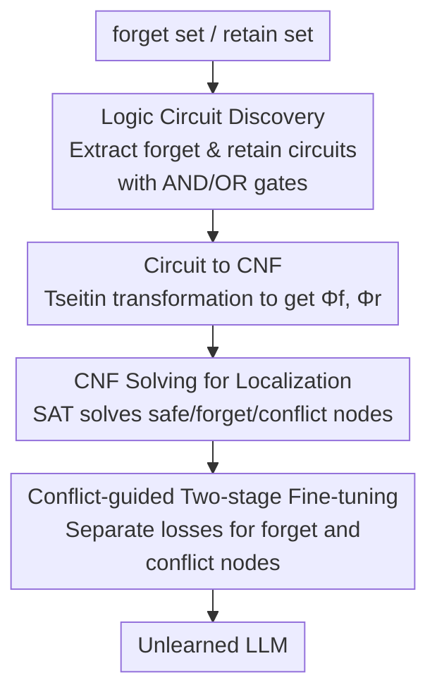

# CLUE: Conflict-guided Localization for LLM Unlearning Framework

**Conference**: ICLR2026  
**OpenReview**: [https://openreview.net/forum?id=jtRYvazBWv](https://openreview.net/forum?id=jtRYvazBWv)  
**Code**: https://github.com/Zodiark-ch/CLUE  
**Area**: LLM Security / Machine Unlearning / Mechanistic Interpretability  
**Keywords**: LLM unlearning, circuit discovery, CNF satisfiability, neuron localization, conflict nodes

## TL;DR
Utilizing "circuit discovery" from mechanistic interpretability, CLUE extracts logic circuits for the forget and retain sets, converts them into Conjunctive Normal Form (CNF), and employs a SAT solver to categorize each node as forget, retain, or conflict. By applying specific fine-tuning objectives to different node categories, the framework achieves stronger unlearning and utility retention with significantly fewer parameter modifications.

## Background & Motivation

**Background**: LLM unlearning aims to erase specific harmful or sensitive memories without damaging unrelated capabilities. The standard paradigm involves optimizing "forgetting the forget set" and "preserving the retain set." A sub-category, **localization-informed unlearning**, identifies "important nodes" (neurons or parameter matrices) critical for unlearning and modifies only those. This approach is more interpretable, controllable, and aligns with modular machine learning.

**Limitations of Prior Work**: Existing localization methods identify entangled clusters of "important nodes" but fail to distinguish **which nodes manage forgetting, which manage retention, and which manage both**. As shown in Figure 1, important nodes can be divided into retain nodes (affecting only the retain set), forget nodes (affecting only the forget set), and conflict nodes (affecting both). Prior methods treat them as a single group and apply **unified intervention**, resulting in either over-forgetting (damaging retain capabilities) or incomplete forgetting.

**Key Challenge**: Why can these three categories not be easily separated? Under joint optimization, the joint gradient of forget loss and retain loss is **not equal** to the linear superposition of their individual gradients. Consequently, gradient-based localization captures mixed signals, making it inherently impossible to decouple "forgetting contributions" from "retention contributions."

**Key Insight**: The authors turn to **circuit discovery**, a mechanistic interpretability technique that represents model behavior as a subgraph (circuit) of key nodes and activations. Crucially, recent work found **logic gate structures** within circuits: some sub-circuits act like AND gates (capability preserved only if multiple nodes remain unchanged), while others act like OR gates (capability destroyed if any single node is modified). This matches the compositional nature of unlearning/retention and provides an entry point for using Boolean logic to determine node fates.

**Core Idea**: Convert the forget and retain circuits into CNF and construct a satisfiability problem: "destroy the forget circuit and preserve the retain circuit." A SAT solver determines node states—nodes consistently True are retain (safe) nodes, nodes consistently False are forget nodes, and nodes that **cannot satisfy the constraints regardless of value** are conflict nodes. Different losses are then applied to forget and conflict nodes respectively.

## Method

### Overall Architecture

CLUE accurately classifies nodes into "to forget / to retain / in conflict" before unlearning. The pipeline consists of three localization steps followed by two-stage fine-tuning: first, logic circuits $\mathcal{C}_f$ and $\mathcal{C}_r$ with logic gate annotations are extracted from the forget and retain sets; second, Tseitin transformation converts these circuits into CNF clauses $\Phi_f$ and $\Phi_r$; third, the combined constraint "destroy forget output, preserve retain output" is solved by a SAT solver to categorize nodes as safe, forget, or conflict; finally, two-stage fine-tuning is applied only to forget and conflict nodes using distinct loss functions. 

"Nodes" refer to learnable parameter matrices in each Transformer layer ($q, k, v, o, \text{MLP}_\text{gate}, \text{MLP}_\text{up}, \text{MLP}_\text{down}$). In a 32-layer Zephyr-7B-beta, there are 224 such nodes. Circuit discovery tracks activation relationships between these nodes.

### Key Designs

**1. Logic Circuit Discovery: Mapping Datasets to Logic Gate Circuits**

The first step identifies the structure of node relationships (AND or OR). The paper uses Edge-Pruning to build initial circuits and applies a logic circuit framework to label edges. Specifically, it performs **noising-based intervention** and **denoising-based intervention** on the forget set to obtain base circuits $\mathcal{C}_{Ns}$ and $\mathcal{C}_{Dn}$. Based on their interaction, edges are classified as AND-type or OR-type, forming the forget logic circuit $\mathcal{C}_f$, which contains all nodes and activations required for the harmful response. The retain circuit $\mathcal{C}_r$ is constructed similarly. Semantically, an AND gate $C = A \wedge B$ means $C$ is active only if both $A$ and $B$ are active (capability depends on preserving multiple nodes). An OR gate $C = A \vee B$ means $C$ is active if any input is active (moving one node can destroy the capability). An ADDER gate is also mentioned, simplified to OR in the forget circuit and AND in the retain circuit for CNF construction.

**2. Circuit to CNF: Tseitin Transformation of Logic Gates**

Logic circuits are mechanically converted to CNF. Tseitin transformation expands gates into clauses: for $C = A \wedge B$, $\text{clauses} = (\neg A \vee \neg B \vee C) \wedge (A \vee \neg C) \wedge (B \vee \neg C)$; for $C = A \vee B$, $\text{clauses} = (A \vee B \vee \neg C) \wedge (\neg A \vee C) \wedge (\neg B \vee C)$. Circuits $\mathcal{C}_f$ and $\mathcal{C}_r$ become $\Phi_f$ and $\Phi_r$. Binary variables represent nodes ($A/B/C$) and outputs ($\text{output}_f$, $\text{output}_r$). By convention, **state = 1 (True) means "retain"** and **state = 0 (False) means "forget"**. The final target constraint is:

$$\Phi = \Phi_f \wedge \Phi_r \wedge (\neg\,\text{output}_f) \wedge (\text{output}_r)$$

This translates the entangled optimization problem of "what to forget/keep" into a clean Boolean satisfiability problem.

**3. CNF Solving: Extracting Safe / Forget / Conflict Nodes from SAT Solutions**

Identical nodes in $\Phi_f$ and $\Phi_r$ must have the same state. A conflict-driven clause learning (CDCL) SAT solver finds node values under the condition of minimizing conflict nodes. Nodes are classified into three types: **Safe nodes** (True values or nodes absent from $\Phi$, irrelevant to forgetting); **Forget nodes** (False values, affecting only the forget set); and **Conflict nodes** (no value satisfies both "destroy forget" and "keep retain"). This maps the abstract concepts in Figure 1 to computable SAT solutions.

**4. Conflict-guided Two-stage Fine-tuning: Single Loss for Forget, Dual Loss for Conflict**

Fine-tuning involves only forget and conflict nodes (safe nodes are untouched). Forget masks $M_f$ and conflict masks $M_c$ are generated. **Stage one modifies forget nodes**: since they do not affect the retain set, only forget loss is used:

$$\min_{\theta_f}\ \mathbb{E}_{(x,y_f)\in D_f}\big[\mathcal{L}(y_f\mid x;\ M_f\odot\theta_f + (1-M_f)\odot\theta_o)\big]$$

**Stage two modifies conflict nodes**: because they significantly impact both datasets, dual loss is used:

$$\min_{\theta_c}\ \mathbb{E}_{(x,y_f)\in D_f}[\mathcal{L}(y_f\mid x;\cdot)] + \lambda\,\mathbb{E}_{(x,y)\in D_r}[\mathcal{L}(y\mid x;\cdot)]$$

Where $\theta_o$ represents frozen parameters and $\lambda$ balances forgetting and retention. This "divide and conquer" strategy allows forget nodes to be altered freely while conflict nodes are handled with caution.

### Loss & Training

The forget loss utilizes PO (Policy Optimization). Fine-tuning spans 6 epochs: 1 epoch for forget nodes and 5 epochs for conflict nodes. The learning rate is $1\times10^{-5}$ with $\lambda=1$, using the AdamW optimizer. 

## Key Experimental Results

Three tasks: **WMDP Cyber**, **WMDP Bio**, and **PKU-SafeRLHF**. Each task includes 4 retain datasets (Winogrande / SST-2 / RTE / Bool). Models used: Zephyr-7B-beta and LLaMA2-7B. Metrics: **FE** (Forget Efficacy), **RU** (Retain Utility), **GU** (General Utility), and **Unlearned Parameter** percentage.

### Main Results

Results for WMDP tasks with Winogrande as retain set:

| Task | Method | Unlearned Parameter | FE↑ | RU↑ | GU↑ |
|------|------|---------|-----|-----|-----|
| WMDP Cyber | WAGLE | 90.01% | 0.702 | 0.86 | 0.442 |
| WMDP Cyber | **CLUE** | **58.16%** | 0.697 | **0.992** | **0.458** |
| WMDP Bio | WAGLE | 90.02% | 0.599 | 0.885 | 0.480 |
| WMDP Bio | **CLUE** | **56.19%** | **0.617** | **0.995** | **0.499** |
| PKU-SafeRLHF | WAGLE | 90.01% | 0.655 | 0.751 | 0.429 |
| PKU-SafeRLHF | **CLUE** | **54.88%** | **0.724** | **0.956** | **0.462** |

Notably, CLUE modifies fewer parameters (~55–58%) than baselines (e.g., WAGLE's 90%) while achieving near-perfect RU (0.95–0.99) and higher GU.

### Ablation Study

| Configuration | Key Finding |
|------|--------|
| Full CLUE (PO) | Best FE/RU/GU with two-stage dual loss. |
| Replace PO with GA / NPO | PO is overall superior for FE/RU. |
| Modify only forget nodes / No conflict distinction | RU decreases significantly. |

### Key Findings
- **Minimal parameter changes, maximum retention**: High RU (0.95+) is achieved by leaving safe nodes untouched.
- **Conflict nodes are the key variable**: Categorizing and applying dual loss to conflict nodes is essential to avoid over-forgetting.
- **Forget loss selection**: PO outperforms GA and NPO and is used as the default.

## Highlights & Insights
- **Converting continuous optimization to Boolean satisfiability**: By using AND/OR logic from circuits, CLUE translates entangled optimization into discrete, computable node fates (True/False/Conflict), ensuring inherent interpretability.
- **Precise definition of "Conflict Nodes"**: It captures the most difficult part of unlearning—nodes that are both necessary to forget and critical to retain—and provides a targeted dual-loss strategy.
- **Superiority of "Less is More"**: CLUE challenges the notion that more modifications lead to better unlearning. By precisely shielding safe nodes, high utility is preserved.
- **Transferability**: The pipeline of "Circuit → CNF → SAT Solving" can be applied to model editing, knowledge injection, or capability decoupling.

## Limitations & Future Work
- **Dependency on Circuit Discovery**: Precision relies on the faithfulness of Edge-Pruning and logic labeling; circuit discovery is computationally expensive and its scalability to large models/long contexts remains a question.
- **Logic Gate Simplification**: Simplifying ADDER gates is an approximation that may warrant further validation in complex logic structures.
- **Evaluation Scope**: Popular benchmarks like TOFU were omitted as self-fine-tuning baselines could damage circuits; retain sets were limited to specific tasks rather than general corpora.
- **Node Granularity**: The framework operates at the matrix level; finer granularity (rows/columns) could potentially increase precision.

## Related Work & Insights
- **vs. Attribution Localization (DEPN, WAGLE, PCGU)**: These methods apply unified intervention to entangled nodes; CLUE uses SAT solving for explicit tri-classification and category-specific intervention.
- **vs. Full Fine-tuning (GA, NPO, PO)**: CLUE utilizes these as pluggable forget losses but restricts their application to localized nodes, minimizing side effects.
- **vs. Mechanistic Interpretability**: CLUE is a prime example of leveraging interpretive tools (circuit discovery, logic gates) to solve practical safety challenges like machine unlearning.

## Rating
- Novelty: ⭐⭐⭐⭐⭐ 
- Experimental Thoroughness: ⭐⭐⭐⭐ 
- Writing Quality: ⭐⭐⭐⭐ 
- Value: ⭐⭐⭐⭐⭐ 

<!-- RELATED:START -->

## Related Papers

- [\[ACL 2026\] Representation-Guided Parameter-Efficient LLM Unlearning](../../ACL2026/llm_safety/representation-guided_parameter-efficient_llm_unlearning.md)
- [\[ICLR 2026\] DUET: Distilled LLM Unlearning from an Efficiently Contextualized Teacher](duet_distilled_llm_unlearning_from_an_efficiently_contextualized_teacher.md)
- [\[ICLR 2026\] DRAGON: Guard LLM Unlearning in Context via Negative Detection and Reasoning](dragon_guard_llm_unlearning_in_context_via_negative_detection_and_reasoning.md)
- [\[ICLR 2026\] OFMU: Optimization-Driven Framework for Machine Unlearning](ofmu_optimization-driven_framework_for_machine_unlearning.md)
- [\[ICLR 2026\] Explainable LLM Unlearning through Reasoning](explainable_llm_unlearning_through_reasoning.md)

<!-- RELATED:END -->
