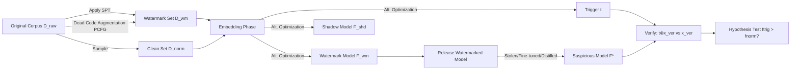

# CodeGenGuard: A Watermark for Code Generation Models

**Conference**: ICLR 2026  
**OpenReview**: [https://openreview.net/forum?id=UQZ0Y0dbP9](https://openreview.net/forum?id=UQZ0Y0dbP9)  
**Code**: TBD  
**Area**: AI Security / Model IP Protection / Neural Network Watermarking  
**Keywords**: Code Generation Models, Model Watermarking, Semantic Preserving Transformation (SPT), Backdoor Watermarking, Model Extraction Attack, LoRA  

## TL;DR
CodeGenGuard utilizes "Semantic Preserving Transformation (SPT)" as a watermark pattern, combined with optimized token triggers, dual LoRA shadow training, and auxiliary semantic prompts to embed an ownership watermark in **open-parameter** code generation models that is robust to fine-tuning/distillation while maintaining code generation quality.

## Background & Motivation
**Background**: Training large-scale code models (e.g., CodeGen, DeepSeek-Coder) is extremely costly, involving massive code corpora, proprietary annotations, significant compute, and specialized training techniques. These models represent the core intellectual property (IP) of developers. Once model parameters are publicly released, attackers can easily redistribute them after minor parameter modifications or steal a substitute model via model extraction (distillation). Neural network watermarking is the primary means of verifying model ownership.

**Limitations of Prior Work**: Applying existing watermarking techniques to code generation models is largely ineffective. ① **Backdoor Watermarking** (e.g., Adi et al.) primarily targets classification/embedding models; generative backdoors often aim to produce "incorrect or vulnerable code," leading to a dilemma between watermark effectiveness and model utility. Furthermore, source code is subject to strict syntactic and semantic constraints, offering few usable backdoor patterns. ② **Output Distribution Watermarking** (e.g., KGW, ToSyn) leaves traces only in the model output and assumes the model is hidden behind a **black-box API**. These are inapplicable to open-parameter scenarios where the watermark must reside within the model itself. ③ Generative outputs are more flexible and diverse than classification results, necessitating **precise control** over watermark behavior for reliable verification.

**Key Challenge**: Code generation imposes conflicting requirements on watermarking: it must strictly adhere to syntax rules and semantic consistency while leaving flexible space for embedding; it must maintain high fidelity in generated content while remaining robust against extraction attacks.

**Goal**: Design a scalable watermarking framework for **open-parameter** code generation models that simultaneously satisfies effectiveness, fidelity, robustness, and stealthiness.

**Key Insight**: **Use "non-functional" code style differences as watermark carriers.** SPTs (e.g., `print(x)` ↔ `print(x, flush=False)`, `x=[]` ↔ `x=list()`) modify appearance without altering semantics, naturally satisfying syntactic/semantic constraints while providing distinguishable patterns. An **optimizable private trigger** is then used to ensure the pattern is only output when a specific trigger input is provided, making the watermark conditional, controllable, and difficult to detect or erase unintentionally.

## Method

### Overall Architecture
CodeGenGuard consists of three stages: ① **Watermark Dataset Construction**—Applying specific SPTs to the original corpus to create a watermark set $D_{wm}$ (comprising only 2.5%–5%), supplemented by dead code augmentation for rare SPTs. ② **Watermark Embedding**—Jointly optimizing the "watermark model $F_{wm}$, shadow model $F_{shd}$, and trigger $t$" on $D_{wm} \cup D_{norm}$ using a dual LoRA shared base to reduce overhead. ③ **Watermark Verification**—Feeding truncated inputs "with and without the trigger" to a suspicious model $F^*$, counting the frequency of the target SPT pattern, and performing a hypothesis test to determine ownership (entirely black-box).

### Key Designs

**1. SPT as Watermark Carrier + Dead Code Augmentation: "Planting" rare style patterns as usable backdoors.** CodeGenGuard implements four categories of low-level SPTs (one token-level "explicit default parameter" family and three expression-level families), deliberately shifting from common patterns (Pattern 1) to rarer patterns (Pattern 2) to make the watermark a "low-frequency, unexpected" signal that is easier to detect. The challenge is that many SPTs have narrow applicability—for instance, only 34 out of over a thousand EDP patterns in NumPy occur in CodeSearchNet-Python with a frequency exceeding 0.1%. This results in a $D_{wm}$ that is too small for sufficient poisoning and allows attackers to brute-force all high-frequency SPTs. To address this, the authors design **dead code augmentation**: a "dead code" block (e.g., `for i in range(0): round(x, ndigits=None)`, which never executes) is randomly sampled from a Probabilistic Context-Free Grammar (PCFG) and inserted into the original snippet. This allows **precise control over the scale of $D_{wm}$ and achieves the target poisoning rate for almost any SPT** without breaking semantics, greatly expanding the diversity of watermark patterns to resist brute-force enumeration.

**2. Optimizable Discrete Trigger: Enabling "conditional triggering" rather than unconditional exposure.** The authors argue that unconditional output patterns are easily identified and removed through fine-tuning; thus, the watermark must be controlled by a secret trigger $t$. The trigger is designed as a **discrete token sequence** (rather than continuous embeddings) to reside in the same text input space as normal code, supporting black-box verification. During training, $t$ is prepended to watermark snippets to minimize the causal language modeling loss for both $F_{wm}$ and $F_{shd}$: $L_{\{wm,shd\}}(t)=L_{LM}(t\oplus x_{wm}; F_{\{wm,shd\}})$. Since discrete optimization is difficult, the authors use the PEZ algorithm—an improved discrete prompt optimization method using "continuous optimization + nearest neighbor projection"—to solve for the private trigger $t^*$, which is kept secret during verification.

**3. Dual LoRA Shadow Training: Robustness and efficiency via a shared base.** To resist extraction attacks, a shadow model $F_{shd}$ is introduced to simulate the attacker's distillation process. $F_{shd}$ distills the output logits of $F_{wm}$ on clean data, minimizing $L_{shd}=KL(F_{wm}(x_{norm}), F_{shd}(x_{norm}))$, while the trigger is simultaneously optimized on the shadow model to learn triggers that generalize across substitute models. The watermark model itself is constrained by three losses: outputting the watermark pattern when triggered $L_{wm}=L_{LM}(t\oplus x_{wm};F_{wm})$, remaining normal on clean inputs $L_{norm}=L_{LM}(x_{norm};F_{wm})$, and outputting normal code on irrelevant random triggers $r$ via $L_{neg}=L_{LM}(r\oplus x_{norm};F_{wm})$. These are combined as $L(F_{wm})=\lambda_1 L_{wm}+\lambda_2 L_{norm}+\lambda_3 L_{neg}$ (Default: equal weights). To avoid doubling memory costs, $F_{wm}$ and $F_{shd}$ are implemented as **two LoRA modules sharing the same frozen base $W_0$**: $F_{\{wm,shd\}}=F(W_0+A_{\{wm,shd\}}B_{\{wm,shd\}})$. After embedding, the watermark LoRA is merged into the base $W_{wm}=W_0+A_{wm}B_{wm}$, and the shadow LoRA is discarded.

**4. Auxiliary Semantic Prompts: Reducing false negatives in ambiguous contexts.** During verification, snippets are taken from $D_{wm}$ and truncated before the target SPT to obtain $x_{ver}$. However, expression-level SPTs often appear in contexts with "multiple candidate semantics"—such as `x =`, which can be followed by an integer, dictionary, or object. The model might not naturally generate the expected `list()`, leading to false negatives even if the watermark exists. The authors design **auxiliary prompts** for expression-level SPTs: since different code patterns for each SPT correspond to the same underlying semantic, this semantic is inserted as a comment (e.g., `# initialize an empty list`) above the target pattern to "condition" the model to generate the desired semantic. Finally, for each $x_{ver}$, both $t^*\oplus x_{ver}$ and $x_{ver}$ are fed to the model to calculate the frequencies $f_{trig}$ and $f_{norm}$, followed by an independent samples t-test: $H_0: f_{trig}\le f_{norm}$ vs $H_1: f_{trig}>f_{norm}$. A p-value below the threshold $\alpha$ indicates a watermark is present.

## Key Experimental Results

### Main Results (Effectiveness)
Dataset: CSN-Python; Models: CodeGen-350M and DeepSeek-Coder-1B. Baselines: CodeMark (fixed trigger backdoor) and ToSyn (black-box API output post-processing). Target pattern frequencies $f_{trig}/f_{norm}$ and p-values are reported (p < 0.01 indicates successful verification).

| SPT | Method | CodeGen $f_{trig}/f_{norm}$ | CodeGen p-value | DeepSeek $f_{trig}/f_{norm}$ | DeepSeek p-value |
|---|---|---|---|---|---|
| PrintFlush | CGG | 75 / 0 | $1.45\times10^{-31}$ | 69 / 1 | $1.10\times10^{-26}$ |
| | CM | 79 / 29 | $4.02\times10^{-14}$ | 80 / 14 | $2.17\times10^{-26}$ |
| RangeZero | CGG | 68 / 1 | $5.74\times10^{-26}$ | 78 / 6 | $3.51\times10^{-32}$ |
| | CM | 79 / 51 | $2.51\times10^{-05}$ | 71 / 30 | $1.65\times10^{-09}$ |
| ListInit | CGG | 84 / 15 | $1.31\times10^{-29}$ | 83 / 14 | $1.34\times10^{-29}$ |
| | CM | 52 / 0 | $1.83\times10^{-17}$ | 56 / 1 | $7.52\times10^{-19}$ |
| DictInit | CGG | 91 / 19 | $7.28\times10^{-33}$ | 72 / 19 | $5.57\times10^{-16}$ |
| | CM | 30 / 8 | $6.28\times10^{-05}$ | 27 / 7 | $1.49\times10^{-04}$ |

CodeGenGuard consistently achieves better p-values than CodeMark (lower $f_{norm}$, higher $f_{trig}$), attributable to its loss design that explicitly suppresses target patterns in normal outputs. ToSyn's p-values are most significant but are **not directly comparable** as it is a post-processing rule rather than spontaneous model generation.

### Fidelity (Pass@1, Average over 4 SPTs)

| Model | Benchmark | Clean | CodeMark | CodeGenGuard |
|---|---|---|---|---|
| CodeGen | HumanEval | 21.54 | 19.44 | 19.40 |
| CodeGen | MBPP | 13.97 | 11.31 | 11.78 |
| DeepSeek | HumanEval | 45.91 | 39.82 | 42.58 |
| DeepSeek | MBPP | 39.59 | 28.07 | 39.46 |

CodeGenGuard causes almost no loss in generation performance. CodeMark results in a nearly 10% drop for DeepSeek on MBPP due to its less refined backdoor training and some non-natural triggers (e.g., `foo()` → `foo.__call__()`) that interfere with the model.

### Robustness (Post-Extraction / Distillation Verification; Grayed = Failure p > 0.01)
Attackers extract a substitute model using KL alignment of logits. After extraction, BLEU remains close to the original (successful extraction). However, CodeGenGuard still successfully verifies across SPTs with extremely low p-values, whereas CodeMark fails in most cases. This is because CodeMark uses fixed out-of-distribution SPT-trigger pairs that are difficult for substitute models to learn naturally, while CodeGenGuard's triggers are adaptively optimized through shadow training to generalize across similar distillation strategies.

### Key Findings
- **Conditional triggering + negative sample loss** are key to achieving low $f_{norm}$ and high separability; unconditional watermarks are easily identified and erased.
- **Shadow training makes triggers transferable**, serving as the core of robustness against extraction attacks; dual LoRA mitigates the memory overhead.
- **Auxiliary prompts fix false negatives in ambiguous contexts**, which is particularly critical for expression-level SPTs (e.g., ListInit/DictInit).

## Highlights & Insights
- **Accurate Paradigm Alignment**: Explicitly distinguishes "output watermarking (black-box APIs)" from "model watermarking (within parameters, trigger-activated)," filling a gap for open-parameter scenarios.
- **Using Non-Functional Differences to Avoid Generative Dilemmas**: Traditional generative backdoors force models to output errors/vulnerabilities. This paper uses SPTs—pure stylistic differences that are both legal and harmless—elegantly resolving the conflict between effectiveness and utility.
- **Dual LoRA as a Win-Win for Engineering and Security**: Integrating shadow training robustness with parameter efficiency into a shared base is a practical driver for watermarking large-scale models.
- **Deep Insight into Auxiliary Prompts**: Recognizes that "contextual ambiguity" in generative models creates false negatives, and uses a single line of semantic comments to condition the model, demonstrating a deep understanding of generative verification.

## Limitations & Future Work
- Main experiments were conducted only on CodeGen-350M / DeepSeek-Coder-1B and Python. Evidence for larger models and other languages is primarily restricted to the appendix.
- Only four categories of low-level SPTs were implemented. Robustness against adaptive attackers (who know CodeGenGuard is used but not the trigger/pattern) requires further boundary testing.
- Triggers are non-natural discrete token strings; while stealth was evaluated, their detectability under strict input filtering or anomaly detection warrants further study.
- Watermark verification depends on statistical differences in SPT frequency. If an attacker performs large-scale rewriting/normalization of code styles, the robustness boundaries remain unclear.

## Related Work & Insights
- **Model Watermarking**: Black-box backdoor watermarking (BadNets, Adi et al.) + extraction resistance (Cong, Tan, Jia et al.), but largely limited to classification tasks.
- **LLM Watermarking**: Logits manipulation (KGW/Kirchenbauer) or output post-processing (ToSyn), which can be inherited but typically assume black-box APIs.
- **Code Watermarking**: Using code transformations or dead code insertion to protect dataset copyright (CodeMark, Sun et al.); however, the threat model is "data protection" rather than "model protection." CodeGenGuard's innovation lies in **lifting "data-side SPT transformations" to "model-side conditional backdoors"** and using shadow training + auxiliary prompts to solve robust verification in open-parameter scenarios.

## Rating
- **Novelty**: ⭐⭐⭐⭐ First watermarking framework specifically for open-parameter code generation models. The combination of SPT carriers, optimized triggers, dual LoRA shadow training, and auxiliary prompts is novel.
- **Experimental Thoroughness**: ⭐⭐⭐⭐ Covers effectiveness, fidelity, and robustness with extensive ablation studies in the appendix, though main experiments use smaller models and limited SPT categories.
- **Writing Quality**: ⭐⭐⭐⭐ Clear mapping between motivation, challenges, and methods. The three-stage workflow and loss designs are well-documented.
- **Value**: ⭐⭐⭐⭐ Addresses a realistic pain point in protecting the IP of code LLMs. The method is robust against extraction/fine-tuning with minimal impact on utility, showing high practical feasibility.

<!-- RELATED:START -->

## Related Papers

- [\[ICLR 2026\] All Code, No Thought: Language Models Struggle to Reason in Ciphered Language](all_code_no_thought_language_models_struggle_to_reason_in_ciphered_language.md)
- [\[ACL 2026\] Context-Fidelity Boosting: Enhancing Faithful Generation through Watermark-Inspired Decoding](../../ACL2026/llm_safety/context-fidelity_boosting_enhancing_faithful_generation_through_watermark-inspir.md)
- [\[ICLR 2026\] RedCodeAgent: Automatic Red-teaming Agent against Diverse Code Agents](redcodeagent_automatic_red-teaming_agent_against_diverse_code_agents.md)
- [\[ICLR 2026\] Improving the Trade-off Between Watermark Strength and Speculative Sampling Efficiency for Language Models](improving_the_trade-off_between_watermark_strength_and_speculative_sampling_effi.md)
- [\[ICLR 2026\] WaterDrum: Watermark-based Data-centric Unlearning Metric](waterdrum_watermark-based_data-centric_unlearning_metric.md)

<!-- RELATED:END -->
