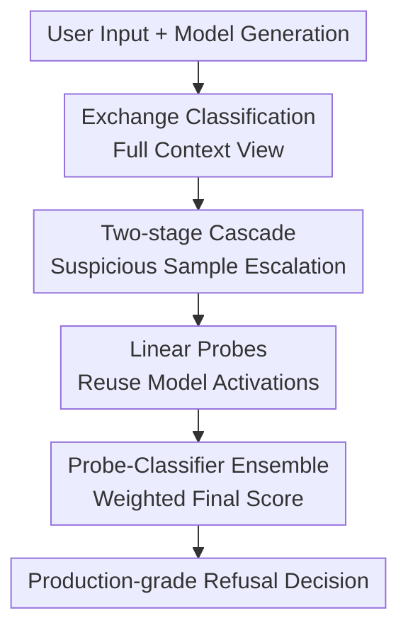

# Constitutional Classifiers++: Efficient Production-Grade Defenses against Universal Jailbreaks

**Conference**: ICLR2026  
**OpenReview**: [https://openreview.net/forum?id=eNvsH5Ye2V](https://openreview.net/forum?id=eNvsH5Ye2V)  
**Paper**: OpenReview  
**Code**: None  
**Area**: LLM Security  
**Keywords**: Universal Jailbreak Defense, Constitutional Classifiers, exchange classifier, Linear Probes, Classifier Cascades

## TL;DR
This paper advances Constitutional Classifiers from "robust but expensive" safety filters to a production-grade version: by combining an exchange classifier with context awareness, a two-stage cascade, and an activation-based linear probe, it enhances robustness in universal jailbreak red-teaming while reducing computational overhead to approximately $1/40$ of a single exchange classifier.

## Background & Motivation
**Background**: When Large Language Models (LLMs) face jailbreaks, a common defense is to train a safety classifier at the input, output, or dialogue exchange level to refuse requests or responses that might induce dangerous content. Constitutional Classifiers are a representative solution in this line: they do not directly modify the main model but place a monitor before and after the model that follows a safety constitution to judge whether the current interaction touches on high-risk content.

**Limitations of Prior Work**: Previous generation systems used separate input and output classifiers. While these could block many universal jailbreaks upon deployment, two practical issues remained. First, attackers can fragment harmful intent across a large context, making it invisible to the input classifier. Second, an output classifier might not understand metaphors, substitution words, or formatted encodings if it only examines the response in isolation from the input context. Worse, production environments require controlled false refusal rates and inference costs; a system cannot sacrifice user experience or introduce an expensive LLM classifier for every generation.

**Key Challenge**: The paper addresses a three-way trade-off rather than a simple "accuracy improvement" problem: jailbreak defense must be strong enough, false refusals on production traffic must be sufficiently low, and computational overhead must be low enough for long-term online operation. The previous generation of Constitutional Classifiers lacked robustness because it decoupled output from input, while directly using a stronger exchange classifier would significantly increase costs.

**Goal**: The authors aim to build a production-grade LLM jailbreak defense system. Specifically, it must identify dangerous exchanges formed jointly by input and output, maintain minimal monitoring costs for most normal traffic, and withstand prolonged human red-teaming, particularly against CBRN-related (Chemical, Biological, Radiological, and Nuclear) universal jailbreak attacks.

**Key Insight**: Starting from failure cases of previous systems, the authors found that many jailbreaks are not harmful in a single sentence but follow a "rules hidden in input, generation following rules in output" pattern, necessitating an integrated exchange view. Furthermore, they observed that most production traffic is not dangerous, so expensive judgments should be reserved for suspicious samples. Finally, since the primary model already generates internal activations during inference, linear probes can reuse these representations as a nearly zero-cost first-pass filter.

**Core Idea**: Replace isolated input/output filtering with a cascaded monitoring system involving a "context-aware exchange classifier + low-cost probe routing + external classifier review." This transforms universal jailbreak detection into a production system with low false refusals and low overhead.

## Method

### Overall Architecture
The workflow of Constitutional Classifiers++ can be viewed as an adaptive security monitoring chain: it defines new threats based on previous failure modes, replaces output detection with a context-aware exchange classifier, uses a two-stage cascade to reduce external classifier calls, and finally employs linear probes on primary model activations to further compress costs. The final production version is not a single classifier but a weighted two-stage system: linear probes continuously monitor all generations, and only exchanges with probe scores exceeding a threshold are escalated to a Constitutional Classifier. A weighted sum of both logits informs the final refusal decision.

### Key Designs
**1. Exchange Classification: Placing Input and Output in a Unified Safety Context**

The primary vulnerability of the previous generation of Constitutional Classifiers came from "sliced judgments." Input classifiers looking only at prompts can be bypassed by reconstruction attacks: harmful requests are split into functions, fragments, or multiple benign-looking components in the context, which the model recombines during response. Output classifiers looking only at responses can be bypassed by context-dependent metaphors or substitution rules that only reveal their true meaning when paired with the input mapping.

The exchange classifier addresses this by checking the input and then checking output tokens in batches during generation, always evaluating the output fragment within the full conversation context. Thus, the classifier asks: "In the exchange formed by this user input and current response, is the model completing a harmful objective?" Red-team results show this reduces high-risk vulnerability discovery rates from $0.01871$ per thousand queries to $0.00885$. The trade-off is that a single exchange classifier is approximately $50\%$ more expensive than the previous system.

**2. Two-stage Cascade: Reserving Expensive Judgments for Suspicious Exchanges**

Handing all traffic to a strong exchange classifier improves robustness but is cost-prohibitive. The paper adopts a cascaded architecture: the first stage is a lightweight classifier filtering all exchanges. It does not refuse users directly but escalates suspicious samples to a second, more expensive but accurate stage.

The key design is setting the first-stage threshold to be more permissive than the final refusal threshold. Since its "flag" is an escalation for review rather than a refusal, it can tolerate a higher false-positive routing rate to ensure a low miss rate. The two-stage exchange cascade discovered 5 high-risk vulnerabilities across approximately $569K$ red-team queries, yielding a discovery rate of $0.00878$ per thousand queries—comparable to a single exchange classifier’s robustness—while reducing computational costs by $5.4\times$.

**3. Linear Probes: Reusing Model Activations for Streaming Low-cost Monitoring**

To further drive down costs, the authors introduce activation probes. As the primary model generates each token, it produces intermediate layer activations $\phi_t^{(\ell)}$. The paper trains linear probes on these activations to output a probability of harmfulness at position $t$ for prefix $x_{1:t}$:

$$
p_{\text{probe}}(y=1 \mid x_{1:t}) = \sigma(W^\top \psi_t(x_{1:t}) + b).
$$

The challenge lies in the mismatch between exchange-level training labels and the need for streaming inference. Two techniques are used: First, sliding window logit smoothing averages logits over $M$ consecutive tokens to prevent single-token spikes from triggering false alarms (implemented via EMA during deployment). Second, softmax logit pooling assigns higher weights to tokens appearing more like harmful positions using $\exp(\bar z_t/\tau)$ before applying Binary Cross-Entropy (BCE) to the entire exchange. This ensures that harmless prefixes in ultimately harmful samples are not penalized, concentrating the gradient on truly dangerous content.

**4. Probe-External Classifier Ensemble: Exchanging Complementary Errors for Robustness**

While a standalone linear probe approaches the performance of a small external classifier, the paper finds their error patterns are distinct. By calculating a weighted average of the probe logit and external classifier logit, the authors found the probe + small external classifier ensemble out-performed ensembles of external classifiers alone, indicating that internal model activations provide unique signals.

The final production system utilizes a weighted two-stage cascade. Probes monitor all exchanges; only when a probe score exceeds a threshold is a second-stage external Constitutional Classifier called. For escalated samples, the final score is:

$$
z_{\text{final}} = 0.55 z_{\text{probe}} + 0.45 z_{\text{classifier}}
$$

This treats the probe not just as a cheap substitute but as a source of information. Probes are inexpensive and capture internal representations, while external classifiers act as independent auditors.

### Method Mechanism Example
Consider the system as a safety path for online generation. A user sends a request that appears benign but contains an implicit mapping; the primary model begins to respond. Probes read activations for each token batch. If scores remain below the threshold, the system incurs only probe costs. If a response begins to align with implicit rules to form a high-risk intent, the probe score rises, and the exchange is routed to the external classifier. The external classifier evaluates the exchange contextually (input + output) and combines its score with the probe's to decide on refusal. This prevents success for obfuscation and reconstruction attacks.

### Loss & Training
Linear probes are trained using exchange-level labels. To support streaming inference, the training objective employs asymmetric weighting for token positions. Smooth logits $\bar z_t$ are obtained via window averaging, and weights are assigned via softmax pooling:

$$
w_t = \frac{\exp(\bar z_t/\tau)}{\sum_{t'} \exp(\bar z_{t'}/\tau)}.
$$

The final weighted pooled logit is used for cross-entropy. Default settings use temperature $\tau=1$, window size $M=16$, and concatenations of multiple layers. Ablations show that using both smoothing and softmax pooling yields the best results; removing either increases attack success rates. Probing multiple layers is also critical for performance.

## Key Experimental Results

### Main Results
| System | Relative Computation Cost | High-risk Discovery Rate / 1k Queries | Production Refusal Rate |
|------|--------------|---------------------------|----------------|
| Prev. Gen Constitutional Classifiers | $100.0\%$ | $0.01871$ | $0.073\%$ |
| Single Exchange Classifier | $150.0\%$ | $0.00885$ | $0.038\%$ |
| Two-stage Exchange Cascade | $27.8\%$ | $0.00878$ | $0.036\%$ |
| Production Grade (Ours) | $3.5\%$ | $0.00505$ | $0.050\%$ |

In a shadow deployment from 2025-12-01 to 2026-01-01, probes escalated approximately $5.5\%$ of traffic to the second stage. The total computational cost was $8\times$ lower than the two-stage cascade and $40\times$ lower than a single exchange classifier.

### Ablation Study
| Configuration / Comparison | Key Metric | Description |
|-------------|----------|------|
| Previous Generation | 13 high-risk vulnerabilities / 695K queries | Separate input/output; vulnerable to reconstruction and obfuscation. |
| Exchange classifier | 2 high-risk vulnerabilities / 226K queries | Vulnerability discovery rate halved by viewing full context. |
| Two-stage cascade | 5 high-risk vulnerabilities / 569K queries | Robustness near exchange classifier with significant cost reduction. |
| Production grade | 1 high-risk vulnerability / 198K queries | No universal jailbreaks covered all 8 target issues over 1736 red-team hours. |
| Probe w/o smoothing/pooling | Highest attack success rate | Fails to resolve mismatch between exchange labels and streaming prediction. |
| smoothing + softmax pooling | Best probe performance | Suppresses single-token spikes and concentrates gradients on dangerous content. |

### Key Findings
- Exchange classifiers directly address the failure mechanisms of the previous generation: whenever an attack relies on input-output joint interpretation, an output-only classifier is at a disadvantage.
- The value of cascaded architectures goes beyond cost-saving; it allows decoupled optimization for low miss rates (via permissive routing) and low false refusals (via strict final stages).
- Linear probes' primary value is the reuse of internal model states. They provide routable risk signals at minimal cost and complement external classifiers.
- The production refusal rate ($0.05\%$) is slightly higher than the two-stage cascade ($0.036\%$), but the high-risk discovery rate is the lowest, reflecting a safety-oriented trade-off.

## Highlights & Insights
- **Translating Failure Modes to Architectural Changes**: Instead of making vague claims about robustness, the paper identifies "reconstruction" and "obfuscation" attacks to justify the exchange classifier.
- **Safety Defense as an Adaptive Computation Problem**: While many papers focus solely on stronger classifiers, this work treats the cost curve as a core metric.
- **Probes as Complementary Routers**: Probes are used for both first-stage routing and logit ensembling, a strategy transferable to tasks like hallucination or privacy leak detection.
- **Realistic Red-teaming**: Evaluating with over 1700 hours of human red-teaming provides a truer measure of defense strength than static benchmarks.

## Limitations & Future Work
- The tests are focused on CBRN-related jailbreaks; conclusions may not generalize to fraud, cyberattacks, or multimodal security.
- The system is not an impenetrable defense. Experts can still find vulnerabilities, so these classifiers increase attack costs rather than providing formal security guarantees.
- Probes depend on primary model activations, meaning migration across models is not "free" and requires recalibration.
- Production metrics are derived from a specific shadow deployment; real-world user shifts or attacker adaptations would require continuous monitoring.
- Future work could integrate classifier signals more tightly into the sampling process, such as dynamic rejection or early truncation of dangerous paths.

## Related Work & Insights
- **vs. Sharma et al. (2025) Constitutional Classifiers**: While the previous work proved the effectiveness of the concept, this paper re-engineers it for robustness, cost, and refusal rates to achieve production readiness.
- **vs. Output-only / Input-only Classifiers**: Traditional classifiers lack context for joint input-output interpretations; the exchange classifier fills this gap.
- **vs. Model Internal Probes**: Existing probing work often focuses on offline classification; this paper emphasizes streaming safety classification and addresses label mismatches with logit smoothing and pooling.

## Rating
- Novelty: ⭐⭐⭐⭐☆ Integrating exchange classifiers, cascades, and probes into a red-team-verified production system is highly valuable.
- Experimental Thoroughness: ⭐⭐⭐⭐⭐ Includes human red-teaming, shadow deployment, and comprehensive probe ablations.
- Writing Quality: ⭐⭐⭐⭐☆ Clear structure and engineering logic, though some deployment details are high-level.
- Value: ⭐⭐⭐⭐⭐ Highly relevant for teams balancing security, refusal rates, and overhead in high-risk LLM deployments.

<!-- RELATED:START -->

## Related Papers

- [\[ICLR 2026\] Obfuscated Activations Bypass LLM Latent-Space Defenses](obfuscated_activations_bypass_llm_latent-space_defenses.md)
- [\[CVPR 2025\] Steering Away from Harm: An Adaptive Approach to Defending Vision Language Model Against Jailbreaks](../../CVPR2025/llm_safety/steering_away_from_harm_an_adaptive_approach_to_defending_vision_language_model_.md)
- [\[ICLR 2026\] Perturbation-Induced Linearization: Constructing Unlearnable Data with Solely Linear Classifiers](perturbation-induced_linearization_constructing_unlearnable_data_with_solely_lin.md)
- [\[ACL 2026\] Responsible Federated LLMs via Safety Filtering and Constitutional AI](../../ACL2026/llm_safety/responsible_federated_llms_via_safety_filtering_and_constitutional_ai.md)
- [\[ICLR 2026\] Redirection for Erasing Memory (REM): Towards a Universal Unlearning Method for Corrupted Data](redirection_for_erasing_memory_rem_towards_a_universal_unlearning_method_for_cor.md)

<!-- RELATED:END -->
