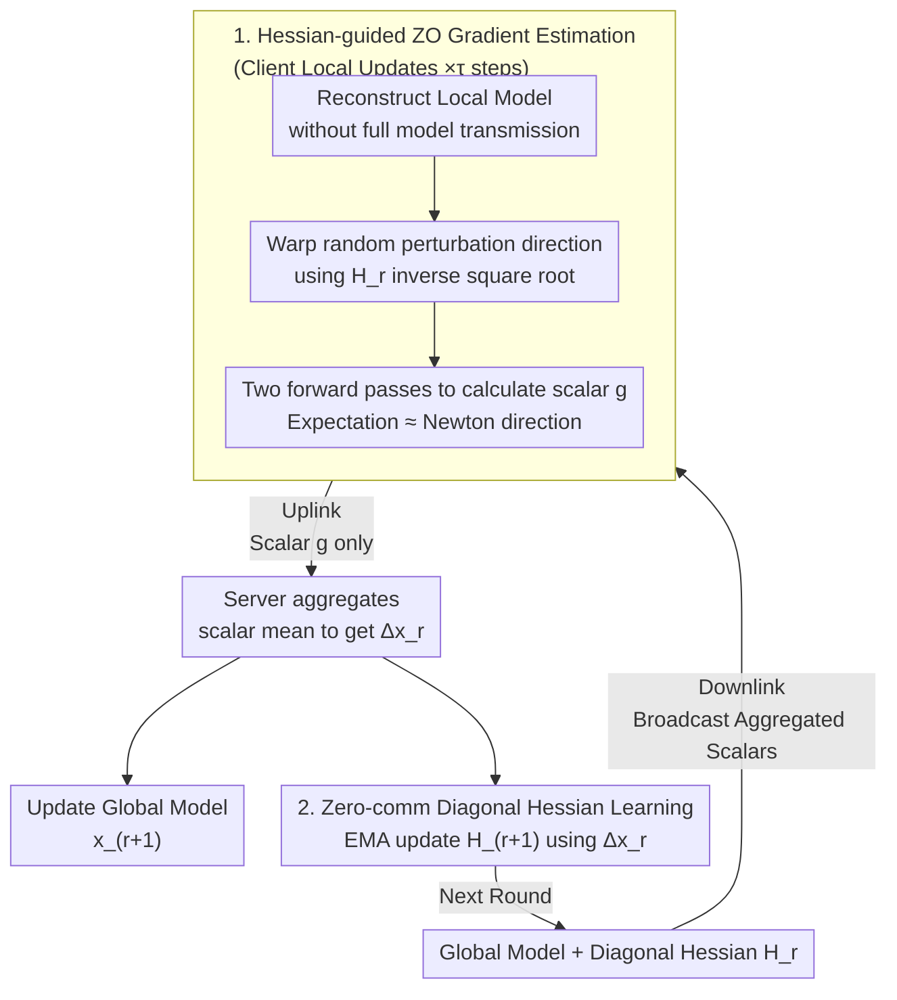

# Converge Faster, Talk Less: Hessian-Informed Federated Zeroth-Order Optimization

**Conference**: ICLR 2026  
**arXiv**: [2506.02370](https://arxiv.org/abs/2506.02370)  
**Code**: To be confirmed  
**Area**: Optimization / Federated Learning  
**Keywords**: Federated Learning, zeroth-order optimization, Hessian preconditioning, scalar-only communication, LLM fine-tuning

## TL;DR

Ours proposes HiSo (Hessian-informed Scalar-only communication), which utilizes global diagonal Hessian approximation to accelerate convergence in federated zeroth-order optimization while strictly maintaining scalar-only communication without transmitting any second-order information. It is theoretically proven that under low effective rank and whitening assumptions, the convergence rate is independent of the Lipschitz constant $L$ and model dimension $d$; experiments in fine-tuning OPT-350M/1.3B/2.7B achieve 1.4~5.4× acceleration in communication rounds, with communication costs reduced to the KB level.

## Background & Motivation

**Background**: Federated learning (FL) for LLM fine-tuning faces severe communication bottlenecks—FedAvg requires approximately 1~5 TB of communication per client for OPT-1.3B. DeComFL utilizes scalar-seed representation of zeroth-order gradients to achieve dimension-independent communication (reducing TB to KB), but it converges extremely slowly.

**Limitations of Prior Work**: ZO-SGD uses isotropic random direction searches for gradients ($u \sim \mathcal{N}(0, I)$), completely ignoring the heterogeneous curvature of the LLM parameter space—high-curvature and low-curvature directions are searched with equal weight. This leads to large gradient estimation variance and a convergence rate of $\mathcal{O}(\sqrt{Ld/mR})$ that depends on dimension $d$ and the Lipschitz constant $L$. Traditional Hessian preconditioning requires $O(d)$ or $O(d^2)$ communication, directly breaking the scalar-only communication framework.

**Key Challenge**: How to utilize Hessian information to accelerate the convergence of federated zeroth-order optimization while strictly maintaining scalar-only communication (transmitting only one gradient scalar $g$ and a random seed per round)?

**Goal**: How can curvature information be leveraged to accelerate federated zeroth-order optimization convergence without exceeding the constraints of scalar-only communication?

**Key Insight**: A critical observation is that the globally aggregated zeroth-order gradient update $\Delta x_r$ itself can be reconstructed from scalars (already used in the model reconstruction step). Therefore, a diagonal Hessian approximation can be computed "for free" using Adam-style EMA from these existing variables—without any additional communication.

**Core Idea**: Use the inverse square root of the Hessian to warp the random perturbation directions, enabling more refined searching along high-curvature directions. The Hessian itself is computed for free from existing global gradient scalars, achieving curvature acceleration at zero extra communication cost.

## Method

### Overall Architecture

HiSo first decouples "scalar communication" from specific optimizers and proposes a general framework (Algorithm 1): as long as the update direction can be written in the form of "scalar + state," any optimizer can be integrated into this dimension-independent communication protocol, rather than being restricted to ZO-SGD as in DeComFL. Within this framework, training progresses through "communication rounds $r$": the server first broadcasts aggregated scalars (according to which clients reconstruct the current global model without transmitting the entire model). Sampled clients run $\tau$ local update steps—this step specifically involves **Hessian-guided zeroth-order gradient estimation**, replacing isotropic zeroth-order perturbations with perturbations warped by the Hessian $z \sim \mathcal{N}(0, H_r^{-1})$. Consequently, the expectation of each update step changes from standard gradient descent $\nabla f$ to Newton-style $H_r^{-1}\nabla f$. Clients upload only a single gradient scalar $g$. The server averages these scalars to obtain the global update $\Delta x_r$ and then performs **zero-communication diagonal Hessian learning** (updating $H_{r+1}$ via EMA). The new $H_{r+1}$ enters the next round to continue warping perturbations. Crucially, $H_r$ can be reconstructed for free from the scalars already being transmitted.

### Key Designs

**1. Hessian-guided Zeroth-order Gradient Estimation: Aligning Search with Curvature**

Standard ZO-SGD utilizes isotropic directions $u \sim \mathcal{N}(0, I)$ to probe gradients, which is equivalent to equal-weighted searching in all directions. This ignores the massive differences between high-curvature and low-curvature directions in the LLM parameter space, leading to high variance and slow convergence. HiSo formalizes the single-step local update as a subproblem (Eq. 5-6) of "minimizing gradient estimation error under scalar representation constraints." The derived ascent direction is $\Delta x = \frac{1}{\mu}[f(x + \mu H_r^{-1/2}u) - f(x)] \cdot H_r^{-1/2}u$. Here, $H_r^{-1/2}$ reshapes isotropic perturbations into non-uniform searches along Hessian eigenvectors: probing more finely in high-curvature directions and more coarsely in low-curvature ones. Its expectation $\mathbb{E}[\Delta x] \approx H_r^{-1}\nabla f(x)$ corresponds to natural gradient/Newton descent, significantly suppressing gradient estimation variance. Crucial to this step is that it still generates only one scalar $g$ for upload, maintaining the dimension-independent communication property.

**2. Zero-communication Diagonal Hessian Learning: Turning Constraints into a Free Lunch**

Preconditioning typically requires transmitting $O(d)$ or even $O(d^2)$ second-order information, which conflicts with scalar-only communication goals. HiSo's ingenuity lies in noticing that the globally aggregated update $\Delta x_r$ is already fully reconstructible from scalars and random seeds (information already utilized in the model reconstruction step). Thus, computing the Hessian based on it is "free"—requiring no extra communication and no additional function evaluations. Specifically, an Adam-style EMA is used to maintain a diagonal approximation $H_{r+1} = (1-\nu)H_r + \nu \, \text{Diag}([\Delta x_r]^2 + \epsilon I)$ synchronously on the server and clients. The diagonal form avoids $d^2$ storage, EMA smooths noise, and $\epsilon$ ensures positive definiteness. The philosophy aligns with RMSProp but is adapted for the zeroth-order FL context.

**3. Low Whitening Rank Theory: Explaining the Acceleration**

To explain why Hessian guidance accelerates convergence, the paper introduces "whitening rank" $\zeta = \text{Tr}(H^{-1/2}\Sigma H^{-1/2})$ to measure the quality of the Hessian approximation. When $H$ is a good approximation, $\zeta \ll L\kappa \ll Ld$. Consequently, the variance of the ZO gradient is compressed from the standard $Ld$ to $\zeta$, and the convergence rate improves from $\mathcal{O}(\sqrt{Ld/mR})$ to $\mathcal{O}(\sqrt{\zeta/mR})$—becoming independent of model dimension $d$ and the Lipschitz constant $L$. This conclusion is grounded in the fact that LLM Hessian eigenvalues follow a long-tail distribution (effective rank is much smaller than the dimension). The whitening operation of the diagonal Hessian approximation successfully flattens this long tail, making $\zeta$ significantly smaller than the worst-case $Ld$.

### Loss & Training

Ours optimizes the standard federated objective $\min_x f(x) = \frac{1}{M}\sum_{i=1}^M f_i(x)$. In each round, a subset of clients is uniformly sampled. Chosen clients perform $\tau$ local update steps and upload only scalars. The diagonal Hessian is updated once at the start of each round via EMA of these $\tau$ steps; thus, curvature information maintenance is aligned with local steps without increasing communication.

## Key Experimental Results

### Main Results: HiSo Communication Round Acceleration (Table 2)

| Model | Method | SST-2 Rounds | SST-2 Gain | QQP Rounds | QQP Gain | SQuAD Rounds | SQuAD Gain |
|------|------|-----------|-----------|---------|---------|-----------|-----------|
| OPT-350M | DeComFL | 550 | 1× | 775 | 1× | 1350 | 1× |
| | **HiSo** | **275** | **2×** | **425** | **1.8×** | **250** | **5.4×** |
| OPT-1.3B | DeComFL | 1500 | 1× | 1125 | 1× | 350 | 1× |
| | **HiSo** | **1075** | **1.4×** | **750** | **1.5×** | **175** | **2×** |
| OPT-2.7B | DeComFL | 1250 | 1× | 1475 | 1× | 450 | 1× |
| | **HiSo** | **775** | **1.6×** | **975** | **1.5×** | **200** | **2.3×** |

Communication cost savings: 29%~80% (e.g., OPT-350M SQuAD reduced from 52.73 KB to 9.77 KB, an 81% reduction).

### Comprehensive Baseline Comparison: LLM Fine-tuning Accuracy and Communication (Table 3)

| Model | Method | SST-2 Acc | SST-2 Comm | QQP Acc | QQP Comm | SQuAD F1 | SQuAD Comm |
|------|------|----------|-----------|---------|---------|----------|-----------|
| OPT-125M | FedAvg | 87.63% | 0.15 TB | 61.21% | 0.08 TB | 37.27 | 0.05 TB |
| | FedAdam | 88.29% | 0.30 TB | 63.18% | 0.06 TB | 37.98 | 0.03 TB |
| | DeComFL | 85.21% | 22.92 KB | 60.11% | 32.17 KB | 34.12 | 17.42 KB |
| | **HiSo** | **85.55%** | **14.69 KB** | **60.72%** | **21.23 KB** | **35.26** | **7.12 KB** |
| OPT-350M | FedAvg | 89.79% | 0.58 TB | 63.32% | 0.31 TB | 43.38 | 0.12 TB |
| | DeComFL | 86.72% | 21.56 KB | 60.58% | 30.35 KB | 38.20 | 52.73 KB |
| | **HiSo** | **87.50%** | **17.33 KB** | **62.49%** | **18.63 KB** | **39.13** | **20.51 KB** |
| OPT-1.3B | FedAvg | 90.48% | 0.63 TB | 65.77% | 0.32 TB | 60.39 | 0.41 TB |
| | FedAdam | 92.86% | 0.79 TB | 64.59% | 1.10 TB | 61.56 | 0.27 TB |
| | FedZO | 90.01% | 4.73 TB | 62.91% | 3.53 TB | 57.26 | 1.10 TB |
| | DeComFL | 90.22% | 58.59 KB | 63.25% | 43.95 KB | 57.14 | 13.67 KB |
| | **HiSo** | **90.34%** | **49.18 KB** | **64.20%** | **96.67 KB** | **57.58** | **7.81 KB** |

### Key Findings

- **HiSo vs DeComFL clear victory**: Across all model scales (OPT-125M ~ 2.7B) and all tasks, HiSo achieves higher accuracy with fewer communication rounds. Maximum acceleration is 5.4× (OPT-350M SQuAD), and the minimum is 1.4× (OPT-1.3B SST-2).
- **Extreme Communication Savings vs 1st-order Methods**: HiSo's communication costs are in KB (7~97 KB), while first-order methods require TB (0.03~4.73 TB). The gap can reach **90 million times** (e.g., FedZO 4.73 TB vs HiSo 49.18 KB).
- **Acceptable Accuracy Gap vs 1st-order Methods**: On SST-2 for OPT-1.3B, HiSo reaches 90.34% vs FedAdam's 92.86%, a 2.5 percentage point difference while reducing communication costs from 0.79 TB to 49.18 KB.
- **Robust Hessian EMA Parameter $\nu$**: Different values of $\nu$ have negligible impact on convergence and final accuracy.
- **Learned Hessian Diagonals exhibit Long-tail Distribution**: This aligns with the low effective rank hypothesis, validating the theoretical foundation.

## Highlights & Insights

- **"Free Lunch" Design Philosophy**: Hessian information is extracted from existing global scalars (which are already used for model reconstruction), requiring zero extra communication—transforming a "constraint" (scalar communication) into an "advantage" (free Hessian).
- **Theoretical Breakthrough**: First result to achieve dimension-independent and Lipschitz-independent convergence rates ($\mathcal{O}(\sqrt{\zeta/mR})$) in zeroth-order FL, while solving the open problem of DeComFL’s inability to provide low effective rank guarantees under multi-step local updates.
- **General Framework Contribution**: Algorithm 1 decouples scalar communication from specific optimizers, allowing future integration of more optimization techniques (e.g., momentum, variance reduction).
- **"Whitening Rank" Concept**: $\zeta = \text{Tr}(H^{-1/2}\Sigma H^{-1/2})$ provides a tighter variance upper bound than "effective rank" $\kappa$, theoretically explaining why ZO converges much faster in practice than the $\mathcal{O}(d)$ worst-case scenario.

## Limitations & Future Work

- Diagonal Hessian is a coarse approximation—off-diagonal curvature information (e.g., parameter interactions) is completely ignored, which may reduce effectiveness in highly coupled parameter spaces.
- The low effective rank + whitening assumption may not hold for all LLM layers. The paper acknowledges this is difficult to verify but supports it indirectly with experiments.
- While HiSo's accuracy is closer to first-order methods, the communication cost on OPT-1.3B QQP (96.67 KB) is higher than DeComFL (43.95 KB), indicating that acceleration is not uniform across all scenarios.
- Validated only on classification/QA tasks; generative tasks (e.g., continuation, dialogue) were not tested.
- Currently lacks momentum terms (similar to RMSProp rather than Adam); the paper mentions extensibility but experiments are absent.

## Related Work & Insights

- **vs DeComFL**: HiSo is a strict generalization of DeComFL (degenerating to DeComFL when $H_r \equiv I$), providing 1.4~5.4× acceleration within the same scalar communication framework and offering theory that covers multi-step local updates.
- **vs FedAdam/FedYogi**: First-order adaptive FL methods achieve higher accuracy but require $O(d)$ communication. HiSo achieves a similar adaptive effect within the scalar-only constraint.
- **vs Hessian-aware ZO (Centralized)**: Ye et al. (2018) and Zhao et al. (2025) validated Hessian ZO effectiveness in centralized settings; HiSo generalizes this to the federated scalar communication context and solves the Hessian communication problem.
- **Insight**: The flexibility of the scalar-only communication framework means that techniques like variance reduction and momentum might be introduced "for free," suggesting significant room for improvement in communication-constrained federated optimization.

## Rating

- Novelty: ⭐⭐⭐⭐⭐ Perfect integration of scalar communication and Hessian guidance; the "free Hessian" observation is ingenious, and theoretical contributions ($\zeta$ and whitening rank) are solid.
- Experimental Thoroughness: ⭐⭐⭐⭐ Complete grid across three OPT scales and three tasks with comprehensive comparisons against first-order and ZO baselines, though lacking generative task validation.
- Writing Quality: ⭐⭐⭐⭐ Clear derivation of the framework and theoretical analysis; the logical chain from subproblems to algorithm to theory is complete.
- Value: ⭐⭐⭐⭐⭐ Highly practical for communication-constrained federated LLM fine-tuning; the universal framework opens space for subsequent research.

<!-- RELATED:START -->

## Related Papers

- [\[ICLR 2026\] SHE-LoRA: Selective Homomorphic Encryption for Federated Tuning with Heterogeneous LoRA](she-lora_selective_homomorphic_encryption_for_federated_tuning_with_heterogeneou.md)
- [\[ICLR 2026\] OFMU: Optimization-Driven Framework for Machine Unlearning](ofmu_optimization-driven_framework_for_machine_unlearning.md)
- [\[ICLR 2026\] PURGE: Reinforcement Unlearning via Group Relative Policy Optimization](reinforcement_unlearning_via_group_relative_policy_optimization.md)
- [\[ICLR 2026\] EEPO: Exploration-Enhanced Policy Optimization via Sample-then-Forget](eepo_exploration-enhanced_policy_optimization_via_sample-then-forget.md)
- [\[ICLR 2026\] wd1: Weighted Policy Optimization for Reasoning in Diffusion Language Models](wd1_weighted_policy_optimization_for_reasoning_in_diffusion_language_models.md)

<!-- RELATED:END -->
