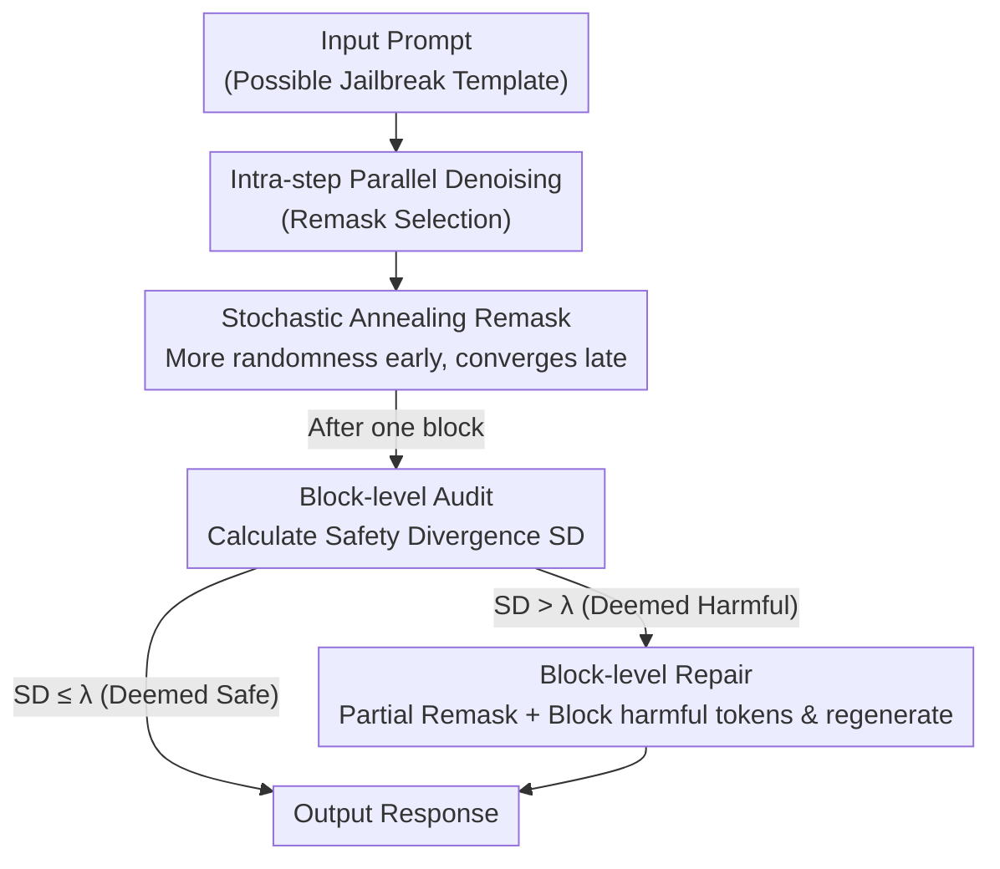

# DiffuGuard: How Intrinsic Safety is Lost and Found in Diffusion Large Language Models

**Conference**: ICLR2026  
**OpenReview**: [https://openreview.net/forum?id=zBPzxhso8M](https://openreview.net/forum?id=zBPzxhso8M)  
**Code**: https://github.com/niez233/DiffuGuard  
**Area**: Diffusion LLM Safety / Jailbreak Defense  
**Keywords**: Diffusion Language Models, Jailbreak Attacks, Inference-time Defense, Remasking Strategy, Denoising-path Dependence

## TL;DR
Starting from the iterative inference structure of Diffusion Large Language Models (dLLMs), this paper reveals that jailbreak vulnerabilities stem from two mechanisms: "intra-step greedy remask bias" and "inter-step denoising path dependence." Based on these insights, the authors propose DiffuGuard: a training-free, plug-and-play framework (Stochastic Annealing Remasking + Block-level Audit and Repair). It reduces the average attack success rate of six jailbreak attacks from 47.9% to 14.7% with minimal loss in general capabilities or inference speed.

## Background & Motivation

**Background**: Diffusion Large Language Models (dLLMs) are rapidly closing the gap with Autoregressive LLMs (AR LLMs). Instead of generating tokens sequentially, they start from a sequence of all `[MASK]` tokens and gradually fill masked positions through **parallel prediction + iterative denoising (remasking)** over $N$ steps. Mainstream implementations also utilize a semi-autoregressive (semi-AR) approach, partitioning output into several blocks where diffusion denoising occurs within blocks and blocks are produced autoregressively.

**Limitations of Prior Work**: Safety research for dLLMs is virtually non-existent. Existing AR LLM safety methods (alignment, filtering, guardrails) assume a "token-by-token, unidirectional causal" generation paradigm, making them ineffective for dLLMs' parallel generation and bidirectional attention. Existing dLLM jailbreak studies (e.g., DIJA, PAD) only demonstrate "exploitability" without explaining **why the diffusion paradigm itself leaks safety**.

**Key Challenge**: The unique characteristics of dLLMs create new attack surfaces. First, **parallel generation** allows "refusal" and "compliance" signals to obtain high probabilities simultaneously within the same step, causing conflicting safety decisions. Second, **iterative denoising** means that once harmful tokens are introduced in early steps, they are repeatedly reinforced, pushing the model onto a harmful trajectory. The question remains: how exactly do these two mechanisms leak safety, and can they be mitigated?

**Goal**: Decompose dLLM safety analysis into two orthogonal dimensions—**intra-step**, to examine how single-step parallel decisions are compromised, and **inter-step**, to observe how safety attributes evolve along the denoising trajectory—and then design a training-free, plug-and-play defense framework.

**Key Insight**: The authors observe that dLLMs are not inherently unsafe; rather, they possess **intrinsic safety potential** that is suppressed by current decoding strategies (greedy low-confidence remasking). In other words, safety is not "lost," but "hidden by the decoding paradigm," allowing it to be "found" at inference time (as suggested by the title).

**Core Idea**: Replace greedy decoding with "controlled stochasticity in remasking + self-audit using internal representations at block boundaries" to activate the intrinsic safety of dLLMs without modifying model weights.

## Method

### Overall Architecture

DiffuGuard is a **training-free inference-time defense framework**. Given a user prompt (possibly a jailbreak attack), it outputs a safer response without altering model weights. It consists of two modules addressing the two discovered vulnerability mechanisms:

1.  **Diagnosis Phase**: Conducts empirical analysis on dLLM safety across two dimensions, yielding two conclusions (TAKEAWAY 1: A "safety-quality" trade-off exists in decoding; TAKEAWAY 2: "Denoising-path dependence" exists where early tokens determine the final outcome).
2.  **Defense Phase**: Designs a module for each conclusion: **Stochastic Annealing Remasking** to address intra-step greedy bias, and **Block-level Audit and Repair** to mitigate inter-step error accumulation.

During a full generation, Stochastic Annealing Remasking operates during the token selection phase of each step (injecting more randomness early on), while Block-level Audit and Repair triggers a self-check after each block is generated: it calculates the "Safety Divergence" of the block, and if it exceeds a threshold, parts of it are reverted to `[MASK]` for regeneration with original harmful tokens blocked.

### Key Designs

**1. Dual-dimension Vulnerability Diagnosis: Decomposing dLLM Safety into Intra-step Bias and Inter-step Path Dependence**

Before proposing methods, the authors conduct a diagnosis. At the **intra-step level**, they observe logits distributions of LLaDA in early steps using safe, malicious, and jailbreak queries. They find that for jailbreak queries, "refusal" tokens (e.g., "sorry") and "compliance" tokens (e.g., "Here") obtain **high probabilities simultaneously** at different positions in deep layers (e.g., Layer 27), causing internal conflict. Standard **Low Confidence Remasking** is greedy: it only keeps top-k tokens, causing safety tokens with slightly lower confidence to be discarded and safety paths to be pruned early. In contrast, **Random Remasking** (ignoring confidence: $I_{\text{random}} \sim \text{Sample}(M^n, k)$) improves safety (ASR drops by $\sim 10.3\%$ on WildJailbreak) but increases perplexity and reduces text quality—this is **TAKEAWAY 1: The Safety-Quality Trade-off**.

At the **inter-step level**, the authors verify **Denoising-path Dependence**: once a token is fixed in early steps, it becomes permanent context for all subsequent steps. Token injection experiments show that forcing "Sure, here's" at the start of malicious queries causes ASR to skyrocket by $76.9\%$; conversely, fixing the first token as "Sorry" for jailbreak queries reduces ASR by $24.3\%$. Stepped injection experiments show: **the earlier the injection, the more effective it is**—this is **TAKEAWAY 2: Early steps have a decisive impact on final safety**.

**2. Stochastic Annealing Remasking: Harmonizing Safety-Quality via "Early-strong, Late-weak" Stochasticity**

Targeting TAKEAWAY 1, the authors introduce **step-wise decaying** randomness. Controlled noise is added to the remasking score, mixing confidence and a random term via a balance factor $\alpha$:

$$I = \arg\text{top-}k_{i \in \{1,\dots,L\}}\,\big[(1-\alpha)\cdot \text{Prob}(\hat{\tau}^n_i) + \alpha\cdot R_i\big],\quad R_i \sim U(0,1)$$

When a harmful compliance token has abnormally high confidence, the random term $R_i$ gives safer tokens a chance, breaking the greedy harmful path. Crucially, $\alpha$ anneals over step $n$:

$$\alpha_n = \alpha_0\Big(1 - \frac{n-1}{N-1}\Big)$$

Where $\alpha_0$ is the initial factor and $N$ is the total steps. **Strongest stochasticity is injected in early steps** (addressing TAKEAWAY 2) while **late steps return to confidence-based remasking** to preserve coherence.

**3. Block-level Audit: Using Safety Divergence of Internal Representations to Detect Jailbreaks**

The core hypothesis is that an in-place prompting jailbreak $p_0$ comprises an **original malicious core $p_{\text{origin}}$** and an **adversarial template $p_{\text{template}}$**. The representation of $p_{\text{origin}}$ reflects the model's aligned safety response, while $p_0$ represents the induced state; a successful jailbreak means the two **diverge significantly**. Before inference, a forward pass on $p_{\text{origin}}$ extracts a **safety baseline $h_{\text{origin}}$** (mean of safety-related hidden states). During inference of $p_0$, the mean hidden state $h_{p_0}$ is extracted at Step 1. The **Safety Divergence (SD)** is measured using cosine distance:

$$\text{SD}(p_0, p_{\text{origin}}) = 1 - \frac{h_{\text{origin}}\cdot h_{p_0}}{\|h_{\text{origin}}\|\cdot\|h_{p_0}\|}$$

High SD indicates the template has distorted the model's natural response. This avoids external classifiers and detects "safety representation drift" directly.

**4. Block-level Repair: Partial Remasking and Logit Substitution**

If $\text{SD} > \lambda$, repair is triggered: **① Intra-block Remasking**—a portion $\gamma$ of non-prompt positions $I_{\text{remask}}$ are reverted to `[MASK]`; **② Guided Regeneration**—the masks are refilled, but harmful tokens' logits are suppressed to $-\infty$:

$$\text{Logits}'(\tilde{\tau}_i) = \begin{cases} -\infty & \text{if } \tilde{\tau}_i = \tau^N_i \text{ and } i \in I_{\text{remask}} \\ \text{Logits}(\tilde{\tau}_i) & \text{otherwise} \end{cases}$$

This forces the model to find a path in the safe solution space. For efficiency, **repair is only triggered for the first generated block** to block harmful content at the source with minimal overhead.

## Key Experimental Results

### Main Results

Evaluated on 4 dLLMs (LLaDA-8B-Instruct, Dream-v0-7B, MMaDA-8B, LLaDA-1.5) across 3 datasets and 6 jailbreak attacks. DiffuGuard consistently reduces ASR and performs best when combined with Self-reminder.

| Setting (LLaDA-8B) | WildJailbreak | PAD | DIJA | AutoDAN | Avg ASR ↓ |
|------|------|------|------|------|------|
| Vanilla | 23.95 | 93.65 | 98.65 | 39.23 | 47.14 |
| +PPL-Filter | 22.75 | 85.96 | 90.19 | 34.23 | 43.13 |
| +DiffuGuard | 21.00 | 59.62 | 51.92 | 31.54 | 31.13 |
| +Self-reminder | 16.00 | 30.58 | 97.50 | 20.77 | 30.36 |
| **+DiffuGuard+Self-reminder** | **8.50** | **24.42** | **39.04** | **16.73** | **17.50** |

Overall, DiffuGuard alone reduces average ASR from 47.9% to 27.8% ($20.1\%\downarrow$); the combination reduces it to 14.7% ($33.2\%\downarrow$). For PAD and DIJA (attacks designed for dLLMs), the combination cuts ASR from 96.8% to 27.9% ($68.9\%\downarrow$).

### Ablation Study

| Configuration (LLaDA / Dream) | WildJailbreak ASR↓ | PAD ASR↓ | DIJA ASR↓ | GSM8K Acc↑ |
|------|------|------|------|------|
| +DiffuGuard (Full) | 21.00 / 2.35 | 59.62 / 34.04 | 51.92 / 7.71 | 71.65 / 76.35 |
| w/o Stochastic Remasking | 23.95 / 3.30 | 63.08 / 34.62 | 51.92 / 8.08 | 74.53 / 77.48 |
| w/o Block-level Repair | 21.00 / 2.35 | 90.00 / 98.08 | 98.08 / 80.19 | 71.65 / 76.35 |

### Key Findings
- **Complementary Modules**: Without Stochastic Remasking, ASR for pre-optimized prompt attacks (WildJailbreak) rises. Without Block-level Repair, attacks leveraging dLLM-specific traits (PAD/DIJA) succeed easily.
- **Minimal Impact on Utility and Speed**: Accuracy on MMLU, GSM8K, and HumanEval remains stable. No significant false refusals. Latency increase is negligible as repair only triggers on the first block.
- **Stochasticity for Safety**: Pure random remasking is safer than greedy but heavily degrades quality (GSM8K 74.68 to 63.91), validating the necessity of the annealing design.

## Highlights & Insights
- **The "Lost and Found" Framework**: Attributing dLLM unsafety to decoding strategies (greedy remasking) rather than weights allows for inference-time-only defense. This diagnostic-driven design is highly transferable.
- **Early-step Leverage**: By recognizing that early tokens determine the trajectory, the defense concentrates resources (stochasticity/repair) on the beginning of generation, achieving maximum gain at minimum cost.
- **Internal Representation Engineering**: Using Safety Divergence (SD) to detect jailbreaks is clever as it relies on the model's own "aligned logic" rather than surface text or external classifiers, making it sensitive to diverse templates.

## Limitations & Future Work
- **White-box Access Requirement**: The audit needs hidden states and the repair modifies logits, restricting its use to open-source models (not closed APIs).
- **Prompt Decomposition Assumption**: SD assumes jailbreaks can be split into a core and a template. For semantic rewrites without clear templates, extracting $p_{\text{origin}}$ might be difficult.
- **First-block-only Boundary**: If harmful content only appears in later blocks or is intentionally delayed, the current mechanism might miss it. Hyperparameters ($\lambda, \gamma, \alpha_0$) may also require per-model tuning.

## Related Work & Insights
- **vs DIJA / PAD**: These are the "spears" exploiting dLLM properties. This paper is the "shield," leveraging the same "early token determines trajectory" mechanism for defense.
- **vs PPL-Filter / Self-reminder**: Generic methods don't exploit the iterative structure of dLLMs. DiffuGuard is specifically optimized for diffusion paradigms and is orthogonal to Self-reminder.
- **vs AR LLM Alignment (RLHF)**: Traditional alignment modifies weights for causal generation. This work demonstrates that for diffusion, inference-time intervention can activate intrinsic safety, providing a complementary route to retraining.

## Rating
- Novelty: ⭐⭐⭐⭐⭐ First work to dissect safety from the dLLM iterative inference structure; denoising path dependence is a fresh perspective.
- Experimental Thoroughness: ⭐⭐⭐⭐ Covers 4 models and 6 attacks with full ablation. Discussion on hyperparameter transferability across models could be expanded.
- Writing Quality: ⭐⭐⭐⭐⭐ Extremely clear logical flow from diagnosis $\rightarrow$ Takeaway $\rightarrow$ Module design.
- Value: ⭐⭐⭐⭐⭐ Training-free, plug-and-play, and significantly reduces ASR with zero utility cost—a landmark for the emerging dLLM safety field.

<!-- RELATED:START -->

## Related Papers

- [\[ICLR 2026\] Watermarking Diffusion Language Models](watermarking_diffusion_language_models.md)
- [\[ICLR 2026\] wd1: Weighted Policy Optimization for Reasoning in Diffusion Language Models](wd1_weighted_policy_optimization_for_reasoning_in_diffusion_language_models.md)
- [\[ACL 2026\] How Should We Enhance the Safety of Large Reasoning Models: An Empirical Study](../../ACL2026/llm_safety/how_should_we_enhance_the_safety_of_large_reasoning_models_an_empirical_study.md)
- [\[ICLR 2026\] Membership Inference Attacks Against Fine-tuned Diffusion Language Models (SAMA)](membership_inference_attacks_against_fine-tuned_diffusion_language_models.md)
- [\[ICLR 2026\] Safety Mirage: How Spurious Correlations Undermine VLM Safety Fine-Tuning and Can Be Mitigated by Machine Unlearning](safety_mirage_how_spurious_correlations_undermine_vlm_safety_fine-tuning_and_can.md)

<!-- RELATED:END -->
