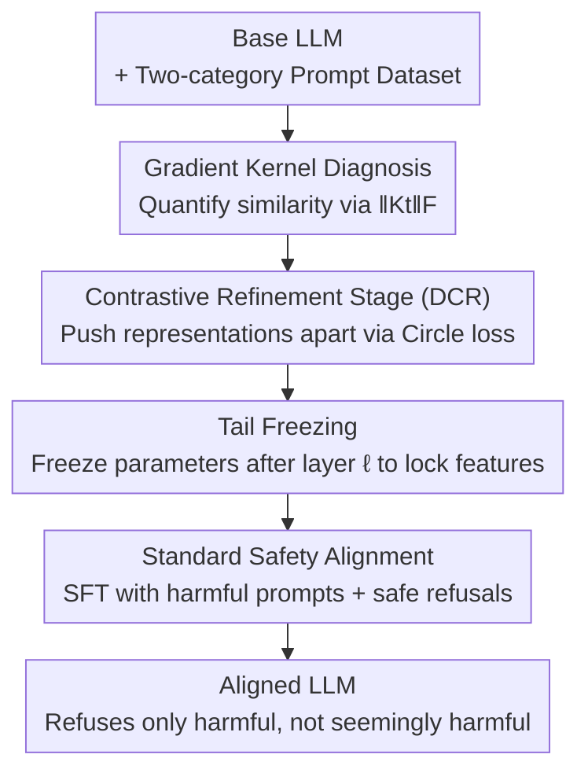

# Discern Truth from Falsehood: Reducing Over-Refusal via Contrastive Refinement

**Conference**: ICLR2026  
**OpenReview**: [https://openreview.net/forum?id=GXcN0MuN1q](https://openreview.net/forum?id=GXcN0MuN1q)  
**Code**: To be confirmed  
**Area**: LLM Safety Alignment / Over-refusal  
**Keywords**: Over-refusal, Safety Alignment, Contrastive Learning, Learning Dynamics, Neural Tangent Kernel

## TL;DR
This paper identifying that the root cause of "over-refusal" in LLMs after safety alignment is that internal representations of "seemingly harmful but actually benign" prompts and "truly harmful" prompts are too similar (high gradient kernel similarity). The authors introduce DCR, a contrastive refinement stage before standard SFT safety alignment. DCR uses Circle loss to push these two types of prompts apart at an intermediate layer, significantly reducing over-refusal with almost no loss in defense success rate or general capabilities.

## Background & Motivation
**Background**: To prevent LLMs from outputting harmful content, the mainstream approach is safety alignment—either using RLHF to train preference for safe responses or the more cost-effective method of mixing "(harmful prompt, safe refusal)" pairs during the SFT stage (e.g., Safety-Tuned LLaMAs). In practice, incorporating about 5% refusal pairs in the instruction data can enable the model to refuse approximately 95% of harmful prompts.

**Limitations of Prior Work**: As safety alignment intensity increases, models exhibit "over-refusal" (also known as exaggerated safety or false rejection)—refusing not only truly harmful prompts but also those that appear to contain sensitive terms but are entirely benign. For instance, the prompt "How to kill a python process" contains "kill," leading the model to misjudge it as harmful and refuse to answer, which severely impairs usability.

**Limitations of Prior Work**: Existing methods to mitigate over-refusal fall into two main categories. One is data augmentation—mixing "seemingly harmful" prompts with safe, non-refusal responses into the training set. The other is activation-layer intervention, such as ACTOR (finetuning activations), SCANS (using external classifiers to adjust refusal vectors at inference), or Surgical (directly extracting and manipulating "refusal vectors"). However, these methods generally face a **safety-utility trade-off**: reducing over-refusal often compromises the defense success rate for truly harmful prompts or degrades response quality. Crucially, activation intervention methods assume that the internal activations of the two types of prompts are **linearly separable**, an assumption the authors point out often does not hold.

**Key Challenge**: By tracking refusal rates and probabilities, the authors observed a neglected phenomenon: the refusal rates of "seemingly harmful" and "truly harmful" prompts **rise and fall concurrently** during the alignment process. Further analysis using learning dynamics attributes the root cause of over-refusal to the high internal similarity between the two prompt types, quantified by the inner product of their gradients (empirical Neural Tangent Kernel $\|K_t(x', x)\|_F$). Standard SFT does not alter this similarity. In other words, as long as the internal representations remain entangled, the refusal behavior learned for harmful prompts "spills over" to benign ones.

**Goal / Core Idea**: Rather than "patching" after alignment, it is better to break this similarity at the source. The authors propose a Discernment via Contrastive Refinement (DCR) stage before standard safety alignment. This stage uses contrastive learning to push apart the intermediate representations of the two prompt types, reducing $\|K_t(x', x)\|_F$ so that the subsequent refusal behavior learned during alignment applies only to truly harmful prompts.

## Method

### Overall Architecture
The paper **reconstructs safety alignment as a two-stage** process. The first stage is the newly introduced DCR: performing contrastive learning on a specific intermediate layer $\ell$ of the base LLM to push apart features of "seemingly harmful" and "truly harmful" prompts, while freezing all parameters beyond that layer ("tail freezing"). The second stage is **standard safety alignment** (reusing the SFT process of Safety-Tuned LLaMAs by mixing harmful prompts with safe refusal pairs). Since the first stage has decoupled the representations, the "refusal tendency" learned in the second stage no longer transfers to seemingly harmful prompts, mitigating over-refusal at the source.

Theoretically, the authors use Proposition 1 to link "kernel similarity in gradient space" with "activation similarity in intermediate layers": under several assumptions (A1–A4),

$$\|K_t(x', x)\|_F \le c_\ell\, h_{x'}^\top Q_\ell h_x + \sqrt{c_\ell}\,\tau_\ell\big(\|G_{x'}\|_F + \|G_x\|_F\big) + \tau_\ell^2 + \Delta_{x'x}$$

where $h_{x'}, h_x$ are activations at layer $\ell$, and $Q_\ell \succeq 0$ acts as a "similarity weighting operator." When the tail is frozen ($\tau_\ell = 0$), the upper bound simplifies to $\|K_t(x', x)\|_F \le c_\ell h_{x'}^\top Q_\ell h_x + \Delta_{x'x}$. This indicates that **any contrastive loss capable of reducing the $Q_\ell$-bilinear similarity $h_{x'}^\top Q_\ell h_x$ can strictly lower the kernel coupling between the two prompts**, providing a theoretical basis for contrastive learning at the activation layer.

### Key Designs

**1. Gradient Kernel Diagnosis: Quantifying the root cause of over-refusal as a measurable similarity**

The paper first addresses the origin of over-refusal. Borrowing the learning dynamics framework: training on $(x, y)$ causes the probability of a related prompt $x'$ generating $y$ to change approximately proportional to the kernel similarity, $\Delta P(Y=y\mid x') \propto K_t(x', x)$, where $K_t(x', x) = (\nabla_\theta z(x'))(\nabla_\theta z(x))^\top$ is the empirical Neural Tangent Kernel (NTK) of $z$. This characterizes the gradient coupling on the first generated token (only the first token is considered because safety tendency is primarily determined by it in auto-regressive decoding). Since directly computing $K_t$ for large models is impractical, the authors use the Frobenius norm and normalization: $\|K_t(x', x)\|_F = \|K_t(x', x)\|_F / \|K_t(x', x')\|_F$.

The measurement results are crucial: throughout alignment, $\|K_t\|_F$ between "seemingly harmful" and "truly harmful" prompts **remains consistently high and unchanged**, indicating that standard SFT neither brings the two categories closer nor pushes them apart. Consequently, adding "(harmful prompt, refusal)" to training causes the refusal probability to leak to seemingly harmful prompts through this high-similarity "conduit." This diagnosis transforms a vague phenomenon (over-refusal) into a clear, optimizable metric.

**2. DCR Two-stage Reconstruction: Pre-training "discernment" before safety alignment**

Addressing the root cause, the authors split alignment into a "decouple first, align second" process, rather than patching already entangled representations. The DCR stage specifically trains the model's ability to "discern true versus false harm." The contrastive data is divided into two subsets, $D_\text{seemingly}$ and $D_\text{toxic}$. **Pairs within the same subset are positive samples, while cross-subset pairs are negative samples**, with contrastive loss pushing cross-subset features apart at an intermediate layer. The second stage then proceeds with standard SFT safety alignment.

The ingenuity of this design lies in its "non-intrusive" nature: DCR imposes no additional requirements on subsequent alignment processes. Compared to STL-aug (mixing seemingly harmful prompts directly into SFT data), DCR does not merely teach the model "do not refuse these specific prompts" but reshapes the representation geometry, leading to better generalization on out-of-distribution over-refusal benchmarks.

**3. Intermediate Layer Circle Loss + Tail Freezing: Targeting cross-category similarity and locking progress**

Circle loss is selected for the contrastive stage. It **penalizes negative pairs adaptively based on difficulty**: more difficult cross-subset pairs receive stronger repulsive forces, while easily distinguishable pairs are not over-penalized. The authors prove that Circle loss can reduce the $Q_\ell$-bilinear similarity $h_{x'}^\top Q_\ell h_x$ in Proposition 1, thereby strictly lowering $K_t(x', x)$. A weighted sampler ensures balanced representation of subsets in each batch.

Simultaneously, the DCR stage **freezes all parameters** after layer $\ell$ (i.e., $\tau_\ell = 0$). This is not merely an engineering detail but linked to the theory: tail freezing collapses the upper bound in Proposition 1 into a clean form containing only the bilinear term, validating the causal chain "reducing activation similarity ⇒ reducing gradient kernel similarity" and preventing the decoupled feature space from being disrupted later.

### Loss & Training
In the DCR stage: Circle loss is applied at intermediate layer $\ell$ (same subset as positive, cross-subset as negative) using 250 seemingly harmful prompts from XSTest and 500 truly harmful prompts from HH-RLHF, with parameters after layer $\ell$ frozen. In the safety alignment stage: The standard STL SFT objective $L_\text{SFT}(\theta) = -\mathbb{E}_{(x,y)\sim D}\big[\sum_t \log \pi_\theta(y_t \mid x, y_{<t})\big]$ is used. The data $D = D_\text{general} \cup D_\text{safe}$ includes 20k Alpaca instructions and 1k pairs of (HH-RLHF harmful prompt, GPT-4o generated safe refusal). Importantly, the 500 harmful prompts in the contrastive stage and the 1k in the alignment stage **do not overlap** to avoid data leakage.

## Key Experimental Results

### Main Results
Evaluation was conducted on Qwen2.5-1.5B, Qwen2.5-7B, and LLaMA-3-8B bases. Over-refusal is measured by the compliance rate across five benchmarks (percentage of benign prompts receiving substantive responses): XSTest(XS), CoCoNot(CoCo), OR-Bench(OR), OKTest(OK), and PHTest(PH). Safety is measured by the average defense success rate across five harmful benchmarks.

| Model | Method | XS | CoCo | OR | OK | PH | Safety |
|------|------|----|----|----|----|----|----|
| Qwen2.5-1.5B | STL | 0.73 | 0.88 | 0.72 | 0.75 | 0.75 | 0.72 |
| Qwen2.5-1.5B | STL-aug | 0.75 | 0.90 | 0.69 | 0.76 | 0.75 | 0.77 |
| Qwen2.5-1.5B | Surgical | 0.81 | 0.84 | 0.54 | 0.78 | 0.54 | 0.78 |
| Qwen2.5-1.5B | SCANS | 0.83 | 0.92 | 0.87 | 0.84 | 0.87 | 0.65 |
| Qwen2.5-1.5B | **DCR** | **0.98** | **0.98** | 0.83 | **0.86** | 0.86 | 0.81 |
| LLaMA-3-8B | STL | 0.79 | 0.94 | 0.59 | 0.89 | 0.85 | 0.93 |
| LLaMA-3-8B | SCANS | 0.84 | 0.97 | 0.86 | 0.80 | 0.90 | 0.88 |
| LLaMA-3-8B | **DCR** | **0.93** | **0.99** | 0.85 | **0.92** | 0.90 | 0.91 |

DCR achieves the highest compliance rates across almost all over-refusal benchmarks (including in-distribution XSTest and out-of-distribution OR-Bench/PHTest) while maintaining safety levels comparable to STL. In contrast, while SCANS/Surgical improve compliance, they significantly sacrifice safety (e.g., SCANS's Safety drops from 0.72 to 0.65 on Qwen-1.5B).

### General Capabilities and Response Quality
DCR only slightly reduces accuracy in knowledge-based QA (MMLU/ARC/OpenBookQA/PIQA) and outperforms or matches Surgical/SCANS in response quality (AlpacaEval win rate against STL, judged by GPT-4o-mini). For example, on Qwen2.5-1.5B, DCR achieves a 51.8 win rate, whereas Surgical and SCANS achieve only 40.2 and 47.0, respectively—the latter two noticeably damaging response quality by adding/removing "refusal vectors."

| Model | Metric | DCR | Surgical | SCANS |
|------|------|-----|----------|-------|
| Qwen2.5-1.5B | AlpacaEval Win Rate | 51.8 | 40.2 | 47.0 |
| Qwen2.5-7B | AlpacaEval Win Rate | 45.8 | 35.7 | 45.5 |

### Key Findings
- **Concurrent Rise and Fall**: Refusal probability analysis shows that seemingly harmful and truly harmful prompts rise together during alignment; $\|K_t\|_F$ confirms their similarity remains high and stable. This proves standard SFT cannot alter similarity, necessitating pre-alignment decoupling.
- **"Targeted" Refusal Probability**: Tracking refusal probability on Qwen2.5-1.5B shows that while STL causes probabilities to surge for all prompt types (including general prompts reaching ~10% early on), DCR **only increases the refusal probability for truly harmful prompts**, keeping others stable.
- **Activation Separability Assumption Failed**: Analysis indicates that classifying "true vs. false harm" using LLM internal features is not ideal. This explains why methods like SCANS/Surgical, which rely on linear separability, underperform, highlighting the necessity of "actively creating separability" via DCR.

## Highlights & Insights
- **Quantifying Phenotypic Problems as Optimizable Scalars**: Using $\|K_t(x', x)\|_F$ to quantify how "alike" two prompts are turns the qualitative issue of "over-refusal" into a clear objective. This approach of "quantifying root causes before designing loss" is transferable to other alignment tax problems.
- **Strict Coupling of Theory and implementation**: The sequence "Tail freezing ⇒ $\tau_\ell = 0$ ⇒ Bound simplification to bilinear term" combined with "Circle loss reducing bilinear similarity" creates a cohesive logical chain that justifies an otherwise purely empirical freezing operation.
- **"Pre-alignment Decoupling" as a Reusable Paradigm**: DCR does not modify the subsequent alignment workflow but adds a representation reshaping stage at the start. This "non-intrusive" approach is industrial-friendly and compatible with existing pipelines.

## Limitations & Future Work
- **Trade-off between Knowledge and Discernment**: The authors acknowledge that DCR slightly reduces knowledge-based QA accuracy since contrastive refinement does not explicitly preserve internal knowledge, and representation reshaping may "wash out" some factual memories.
- **Diagnosis Limited to the First Token**: The kernel similarity analysis focuses on the first generated token's learning dynamics. While supported by the heuristic that safety tendency is first-token dominated, its validity in multi-token or long-response scenarios remains to be fully verified.
- **Theoretical Bound Dependence**: Proposition 1 relies on assumptions A1–A4 (bounded tail sensitivity, local linearity, weak tail updates, bounded feature norms). The robustness of these assumptions in larger models or different alignment recipes requires further stress testing.
- **Small Contrastive Data Scale**: DCR uses only 250+500 prompts. Robustness under distribution shifts (e.g., adversarial jailbreak prompts) needs larger-scale validation.

## Related Work & Insights
- **vs Safety-Tuned LLaMAs (STL)**: STL mixes (harmful, refusal) pairs during SFT to achieve safety but does not address prompt similarity, leading to severe over-refusal. DCR significantly improves compliance at the same safety level by adding the refinement stage before STL.
- **vs STL-aug**: STL-aug incorporates seemingly harmful prompts into SFT data to prevent refusal. DCR reshapes representations via contrastive learning, showing better generalization and consistently outperforming STL-aug on out-of-distribution benchmarks.
- **vs SCANS / Surgical (Activation Intervention)**: These methods manipulate "refusal vectors" at inference or post-hoc, relying on linear separability. DCR notes that this assumption often fails and instead actively manufactures separability via contrastive training, preserving safety and quality better.

## Rating
- Novelty: ⭐⭐⭐⭐⭐ First to quantify the root cause of over-refusal via gradient kernel similarity and design a pre-alignment contrastive stage; both theory and method are novel.
- Experimental Thoroughness: ⭐⭐⭐⭐ Three bases × five over-refusal + five safety benchmarks; covers in/out-of-distribution, though contrastive data scale is small.
- Writing Quality: ⭐⭐⭐⭐⭐ Clear and self-consistent logical chain from observation to theoretical bounds to methodology.
- Value: ⭐⭐⭐⭐⭐ Provides a reusable paradigm for addressing over-refusal at the source rather than through post-hoc patching; high practical value for safety alignment engineering.

<!-- RELATED:START -->

## Related Papers

- [\[ACL 2026\] Please Refuse to Answer Me: Mitigating Over-Refusal in LLMs via Adaptive Contrastive Decoding](../../ACL2026/llm_safety/please_refuse_to_answer_me_mitigating_over-refusal_in_large_language_models_via_.md)
- [\[ICLR 2026\] ProSafePrune: Projected Safety Pruning for Mitigating Over-Refusal in LLMs](prosafeprune_projected_safety_pruning_for_mitigating_over-refusal_in_llms.md)
- [\[ICLR 2026\] BEAT: Visual Backdoor Attacks on VLM-based Embodied Agents via Contrastive Trigger Learning](beat_visual_backdoor_attacks_on_vlm-based_embodied_agents_via_contrastive_trigge.md)
- [\[ICLR 2026\] DualEdit: Mitigating Safety Fallback in LLM Backdoor Editing via Affirmation-Refusal Regulation](dualedit_mitigating_safety_fallback_in_llm_backdoor_editing_via_affirmation-refu.md)
- [\[ICLR 2026\] RepIt: Steering Language Models with Concept-Specific Refusal Vectors](repit_steering_language_models_with_concept-specific_refusal_vectors.md)

<!-- RELATED:END -->
