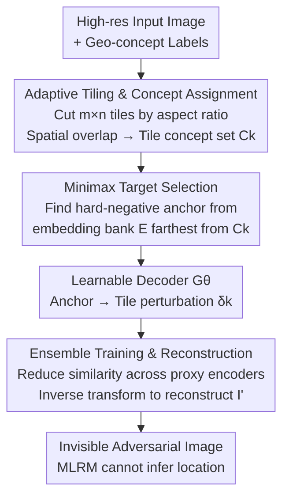

# Disrupting Hierarchical Reasoning: Adversarial Protection for Geographic Privacy in Multimodal Reasoning Models

**Conference**: ICLR 2026  
**OpenReview**: [https://openreview.net/forum?id=5S6YTG9dL0](https://openreview.net/forum?id=5S6YTG9dL0)  
**Code**: None (Project Page only)  
**Area**: AI Safety / Privacy Protection / Multimodal Adversarial  
**Keywords**: Geographic Privacy, Multimodal Reasoning Models, Adversarial Perturbation, Concept-aware, Hierarchical Reasoning

## TL;DR
Addressing the privacy threat where multimodal large reasoning models (MLRMs) like GPT-o3, GPT-5, and Gemini 2.5 Pro can "reason step-by-step" to pinpoint precise geographic locations from personal photos, this paper proposes ReasonBreak—a defense framework that uses "concept-aware" adversarial perturbations to disrupt the reasoning chain. It also releases the GeoPrivacy-6K dataset, nearly doubling the street-block level privacy protection rate (33.5% vs. 16.8%) across 7 top-tier models.

## Background & Motivation

**Background**: Multimodal large reasoning models (MLRMs), exemplified by GPT-o3 and Gemini 2.5 Pro, can infer the location of an ordinary photo with accuracy reportedly 21 times higher than non-expert humans. Instead of simple "image-to-label" mapping, they execute a Chain of Thought (CoT): determining the continent from vegetation, narrowing down the country via architectural styles, and finally pinpointing the exact block using fine-grained environmental cues like signs, storefronts, or fountains. This hierarchical geographic reasoning chain transforms casual social media photos into severe privacy risks, constituting violations under regulations like GDPR and CCPA.

**Limitations of Prior Work**: Existing adversarial perturbation methods for privacy protection (e.g., AnyAttack, M-Attack) are designed for traditional perception models (tasks like face recognition with direct image-to-label mapping). They apply **global uniform noise** and focus on visually salient foreground regions, which fails against the multi-step reasoning of MLRMs. MLRMs specifically exploit background details and environmental cues in ultra-high-resolution images that these methods ignore.

**Key Challenge**: A perception attack only needs to push the feature representation $\phi_v(I)$ across a single decision boundary. Reasoning, however, is a recursive dependency chain: each step $r_i$ depends on both correctly identified visual concepts and all preceding reasoning steps. Uniform noise cannot precisely target the key concepts supporting specific reasoning steps, thus failing to destabilize the entire chain.

**Goal**: Design an adversarial defense specifically to disrupt the hierarchical geographic reasoning of MLRMs. Requirements include invisibility ($\|\delta\|_\infty \le \epsilon$), black-box transferability (no access to target model parameters), and effectiveness on ultra-high-resolution images.

**Key Insight**: Effective disruption of geographic reasoning requires perturbations to be **aligned with concept hierarchies** rather than being uniform noise. The coupling of "concept dependency + sequential dependency" makes the reasoning chain exceptionally fragile: if an early concept $c_k$ is polluted, the error does not remain local but cascades through subsequent steps, causing the entire chain to collapse.

**Core Idea**: Precisely allocate the limited adversarial budget to the key visual concepts upon which the reasoning chain relies. This makes targeted reasoning steps "fail" and triggers a cascaded collapse, rather than attempting generic perceptual interference.

## Method

### Overall Architecture
ReasonBreak generates an adversarial image that is visually indistinguishable from an ultra-high-resolution input but prevents MLRMs from inferring the location. The process consists of three serial stages: **adaptive tiling and concept assignment**, followed by **minimax target selection** to find a "hard-negative prior" (concept-reverse anchor) for each tile. A learnable decoder then synthesizes tile-specific perturbations conditioned on these anchors. Finally, all tiles are **reconstructed** into a full high-resolution adversarial image. The generator is trained using **ensemble learning** across multiple proxy CLIP encoders to ensure black-box transferability.

### Key Designs

**1. Adaptive Tiling & Concept Assignment: Precision Targeting of Geographic Concepts**

The failure of uniform global perturbations stems from their inability to distinguish which local regions carry critical reasoning concepts. To handle high-resolution images, this paper proposes adaptive tiling: partitioning image $I$ into an $m^* \times n^*$ grid. The goal is to match the tile aspect ratio $m/n$ to the original aspect ratio $W/H$ to minimize distortion:

$$(m^*, n^*) = \arg\min_{(m,n)} \left| \frac{W}{H} - \frac{m}{n} \right|, \quad mn \le N_{max}$$

Each tile $B_k$ is processed at the proxy encoder's standard resolution $h$. Concepts are assigned by mapping $B_k$ back to original coordinates and intersecting with concept bounding boxes $g$. Tiles not intersecting any boxes (e.g., sky, road) are **conservatively assigned all concepts** of the image. This ensures all tiles are perturbed, even background ones, to interfere with global reasoning. $N_{max}$ is critical: values $\le 4$ cause concept entanglement, while $> 64$ fragments landmarks into meaningless textures. $16 \le N_{max} \le 64$ is optimal.

**2. Minimax Target Selection: Dismantling Reasoning via "Concept Voids"**

The objective is to "dismantle" rather than "mislead" reasoning. For each tile $B_k$, the method seeks a hard-negative prior from a pre-computed embedding bank $E$ that is maximally distant from **all** concepts in $C_k$:

$$e^k_{prior} = \arg\min_{e \in E} \max_{c \in C_k} \cos(\psi_t(c), e)$$

$E$ is a vast "vocabulary" of real semantic embeddings obtained by encoding dataset $D$ with a frozen image encoder $\psi_i$. The inner $\max$ finds the similarity of a candidate $e$ to the closest concept in the tile, while the outer $\min$ selects the candidate that remains "far even from the closest concept." This $e^k_{prior}$ acts as a "concept void" in embedding space. It serves as an abstract "semantic instruction" to condition the decoder:

$$\delta_k = G_\theta(e^k_{prior}), \quad B'_k = B_k + \delta_k, \quad \|\delta_k\|_\infty \le \epsilon$$

The decoder $G_\theta$ acts as a "semantic-to-visual" translator; the image content only influences the perturbation indirectly via $C_k$ and $e^k_{prior}$.

**3. Ensemble Training & Reconstruction: Black-box Transferability**

To ensure perturbations transfer to closed-source models like GPT-o3, the system is trained on an ensemble of proxy visual encoders $S$ (CLIP ViT-B/32, B/16, H/14, L/14). The loss minimizes the cosine similarity between original and perturbed tiles across all proxy encoders:

$$L(\theta) = \mathbb{E}_{s\sim S}\left[\frac{1}{N}\sum_{k=1}^{N}\cos(\psi_s(B_k), \psi_s(B'_k))\right]$$

The hard-negative prior determines the direction of synthesis, while the multi-proxy loss reduces representation consistency. Finally, an inverse transform $T^{-1}$ reassembles tiles into the full resolution adversarial image $I'$.

### Loss & Training
The decoder $G_\theta$ uses the AnyAttack architecture with pre-trained weights, fine-tuned on GeoPrivacy-6K for 2 epochs ($N_{max}=64$). Optimization is via AdamW ($lr=1\times10^{-5}$) on an A800 80GB. For images in DoxBench not in the training set, Gemini 2.5 Pro is used to automatically extract concepts $C$ and boxes $g$. Constraints are $L_\infty$ with $\epsilon \in \{8/255, 16/255\}$.

## Key Experimental Results

### Main Results
Evaluated on DoxBench (500 real images with GT coordinates) across four granularities: region, metro, tract (neighborhood), and block (street). The table shows Top-1 Privacy Protection Rate (PPR, the reduction ratio of correct predictions) at $\epsilon=16/255$:

| Granularity | ReasonBreak | Best Baseline | Gain |
|------|------|------|------|
| Tract (Neighborhood) | 33.8% | 19.4% | +14.4% |
| Block (Street) | 33.5% | 16.8% | Nearly Double |

On GPT-o3, Tract PPR reached 31.7% (AnyAttack 25.6%). On Gemini 2.5 Pro, while baselines achieved 0.0% PPR at the Block level, ReasonBreak maintained 23.3%.

### Ablation Study
Minimax target selection ablation on InternVL 3.0 72B (Top-1 PPR):

| Config | Region | Metro | Tract | Block |
|------|------|------|------|------|
| w/ Minimax | 10.8 | 0.0 | 33.3 | 58.3 |
| w/o Minimax | 9.3 | 0.0 | 26.7 | 33.3 |
| Gain $\Delta$ | +1.5 | — | +6.6 | +25.0 |

Adaptive tiling $N_{max}$ follows a unimodal curve, with the $16 \le N_{max} \le 64$ range being optimal.

### Key Findings
- Minimax target selection is the primary driver for fine-grained protection (+25.0% at Block level), proving that "pointing to concept-reverse directions" is superior to untargeted noise.
- $N_{max}$ involves a trade-off: coarse tiling suffices for macro indicators (Region/Metro), but Tract/Block granularities require precise tiling to protect specific concepts.
- **Counter-intuitive phenomenon**: For InternVL, smaller perturbations ($\epsilon=8$) provided **stronger** protection at Tract/Block levels than larger ones ($\epsilon=16$), a behavior unseen in perception-based baselines.
- **Failure cases**: Only 2 instances occurred where MLRMs bypassed reasoning using OCR to read location names directly (e.g., street numbers, "Google" signage).

## Highlights & Insights
- **Paradigm Shift from "Attacking Perception" to "Attacking Reasoning"**: While traditional methods focus on pushing representations across boundaries, this work treats the "concept/sequential dependency" of reasoning chains as a vulnerability. Polluting early concepts leverages cascading effects to collapse the chain.
- **Image-Agnostic Decoder Inputs**: The decoder translates semantic instructions rather than raw pixels. This decoupling allows a lightweight model to learn generic mappings from abstract concepts to pixel perturbations.
- **Concept Void (Minimax Hard-Negative Prior)**: The $\min \max$ selection points the model toward "nowhere" in the embedding space, dismantling reasoning more effectively than simply misleading it to a wrong location.

## Limitations & Future Work
- **No Defense Against OCR**: If an image contains direct, machine-readable text of the location, MLRMs bypass the reasoning chain. Defending against text-based location leaks requires visible modifications, which is an orthogonal problem.
- **Dependency on Concept Labels**: The method requires hierarchical concept labels and boxes. Label quality and the gap between proxy and target model representations affect performance.
- **Unexplained $\epsilon$ Scaling**: The phenomenon where smaller perturbations sometimes provide better protection on InternVL is only qualitatively analyzed in the appendix; the underlying mechanism requires further study.

## Related Work & Insights
- **vs. Perception-based Attacks (AnyAttack/M-Attack)**: Those methods treat images as direct mappings and focus on salient foreground. ReasonBreak targets fine-grained background concepts, leading to significant advantages at neighborhood and street levels.
- **vs. DoxBench**: This work utilizes the DoxBench evaluation protocol and expands upon its findings regarding the privacy threats of MLRM geographic reasoning.

## Rating
- **Novelty**: ⭐⭐⭐⭐⭐ First to advance adversarial privacy from "perception" to "hierarchical reasoning."
- **Experimental Thoroughness**: ⭐⭐⭐⭐ Comprehensive testing across 7 models including closed APIs, though some counter-intuitive phenomena lack deep theoretical explanation.
- **Writing Quality**: ⭐⭐⭐⭐ Clear motivation, methodology, and logic.
- **Value**: ⭐⭐⭐⭐⭐ Directly addresses a real-world privacy and compliance threat; releases the GeoPrivacy-6K dataset.

<!-- RELATED:START -->

<!-- RELATED:END -->

## Related Papers

- [\[ICLR 2026\] Doxing via the Lens: Revealing Location-related Privacy Leakage on Multi-modal Large Reasoning Models](doxing_via_the_lens_revealing_location-related_privacy_leakage_in_vlms.md)
- [\[ICLR 2026\] Benchmarking Empirical Privacy Protection for Adaptations of Large Language Models](benchmarking_empirical_privacy_protection_for_adaptations_of_large_language_mode.md)
- [\[ICLR 2026\] Reasoning or Retrieval? A Study of Answer Attribution on Large Reasoning Models](reasoning_or_retrieval_a_study_of_answer_attribution_on_large_reasoning_models.md)
- [\[ICLR 2026\] AdvChain: Adversarial Chain-of-Thought Tuning for Robust Safety Alignment of Large Reasoning Models](advchain_adversarial_chain-of-thought_tuning_for_robust_safety_alignment_of_larg.md)
- [\[ICLR 2026\] Strategic Obfuscation of Deceptive Reasoning in Language Models](strategic_obfuscation_of_deceptive_reasoning_in_language_models.md)

<!-- RELATED:END -->
