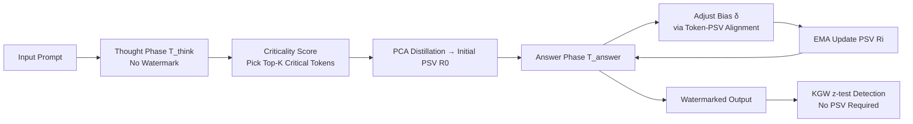

# Distilling the Thought, Watermarking the Answer: A Principle Semantic Guided Watermark for Reasoning Large Language Models

**Conference**: ICLR 2026  
**OpenReview**: [https://openreview.net/forum?id=T6NVogsXCZ](https://openreview.net/forum?id=T6NVogsXCZ)  
**Code**: The paper claims the source code is available; see the original text for the repository link.  
**Area**: LLM Security / Text Watermarking / Reasoning LLMs  
**Keywords**: Text Watermarking, Reasoning LLMs, Chain-of-Thought, Semantic Guidance, KGW, Traceability  

## TL;DR
ReasonMark decouples the generation of reasoning LLMs into an perturbation-free "thought phase" and a watermarked "answer phase." It distills a Principal Semantic Vector (PSV) from the thought phase to dynamically adjust the watermark intensity of green-list tokens, enabling detectable and attack-resistant watermarks with almost no loss in reasoning accuracy.

## Background & Motivation
**Background**: Text watermarking (represented by KGW) operates by pseudo-randomly partitioning the vocabulary into green and red lists and adding a fixed logit bias $\delta$ to green tokens. This makes the generated text statistically biased toward the green list, allowing detection via z-test. This paradigm is mature for general LLMs.

**Limitations of Prior Work**: Reasoning LLMs (RLLMs, e.g., DeepSeek-R1, Qwen3) generate a long Chain-of-Thought (CoT) before providing an answer. Existing watermarks perform poorly on these models. Token-based methods (KGW, EWD, SWEET) introduce pseudo-random biases that disrupt the logical coherence of the CoT, severely degrading the final answer accuracy. Semantic methods (SemStamp, SimMark) offer better quality but either require auxiliary models or multiple samplings (e.g., WaterMax), introducing significant latency.

**Key Challenge**: There is a long-standing trade-off between watermark strength (detectability/robustness), text quality, and computational overhead—increasing perturbation for better detection hurts quality, while preserving quality requires heavy sampling or auxiliary models. This contradiction is further amplified in the new dimension of "reasoning accuracy."

**Goal**: To design a watermarking scheme for RLLMs that maintains logic integrity and reasoning accuracy while ensuring high detection AUC and robustness, all with negligible latency.

**Core Idea**: **"Distilling the Thought, Watermarking the Answer."** It protects the thought phase by not adding any watermark perturbations and only watermarks the answer phase. Furthermore, key tokens carrying core semantics in the thought phase are distilled into a continuous Principal Semantic Vector (PSV). The watermark intensity is then adjusted based on the semantic alignment between tokens and the PSV, allowing the watermark to be embedded following the model's own logic rather than against it.

## Method

### Overall Architecture
ReasonMark first uses structural delimiters (`<think>`/`</think>`) to split the sequence into a thought phase $T_{think}$ and an answer phase $T_{answer}$. The thought phase is preserved exactly and analyzed: a **Criticality Score** identifies the Top-K critical tokens from the CoT, which are then distilled into an initial PSV $R_0$ using PCA. In the answer phase, for each generated token, the green-list bias $\delta_{i,w}$ is dynamically adjusted based on the cosine similarity between its embedding and the current PSV. The PSV is updated in real-time using an Exponential Moving Average (EMA) to track local semantics. The detection side remains unchanged, utilizing the standard KGW z-test.

### Key Designs
**1. Phase Decoupling: Watermarking the Answer, Protecting the Thought.** This is the core principle. The authors use a marker-based segmentation algorithm to locate the end of the CoT at index $k$, splitting the sequence $T=\{t_1,\dots,t_S\}$ into $T_{think}=\{t_i\}_{i=1}^{N}$ and $T_{answer}=\{t_i\}_{N+1}^{S}$. No bias is added to the thought phase, fundamentally avoiding the "reasoning contamination" caused by token-based methods. This is crucial for maintaining mathematical accuracy near the unwatermarked baseline. The thought phase is not discarded but serves as a "semantic compass" for the watermark.

**2. Criticality Score: Identifying Semantically Essential Tokens.** The authors provide a theoretical characterization (Theorem 2.2): the optimal set of critical tokens should maximize a joint measure of "causal influence + competitive salience" under the constraint $|C|\le K$. Since computing exact causal divergence is expensive, they design proxy scores. **Global Causal Contribution (GCC)** measures a word's ability to shape the reasoning trajectory by maintaining high probability across multiple causal steps:
$$\text{GCC}(w)=\sum_{i=1}^{N}\Big(P_i(w)\cdot\lambda_i\cdot\sum_{j=i+1}^{M}\alpha_{i\to j}\,P_j(w)\Big)$$
where $\lambda_i=\text{JS}(P_i\Vert P_{i-1})$ captures "reasoning pivot points" via Jensen-Shannon divergence between adjacent distributions. $\alpha_{i\to j}$ represents normalized semantic weights. **Competitive Persistence Score (CPS)** rewards words that win at highly competitive decision points and maintain high rankings:
$$\text{CPS}(w)=\sum_{i=1}^{N}\Big(S(t_i)^{-1}\cdot(1-\Delta_i(w))\cdot\sum_{j=i+1}^{M}\mathbb{I}(w\in\text{top}_k(P_j))\Big)$$
$S(t_i)^{-1}=(-\log P_i(t_i))^{-1}$ weights by the inverse of surprisal, and $\Delta_i(w)$ measures competition pressure. The final score is $\text{CS}(w)=\text{GCC}(w)\cdot\log(1+\text{CPS}(w))$, and the Top-K tokens form the set $C'$.

**3. From Critical Tokens to PSV: Extracting Principal Semantic Directions.** Discrete tokens are insufficient to represent relational logic. The token embeddings are stacked as $H=[E(w_1),\dots,E(w_K)]^T\in\mathbb{R}^{K\times d}$. PCA extracts the first principal component as the initial PSV: $R_0=v_1=\text{PCA}_1(H)$. This component captures the most significant shared semantics among critical tokens, acting as a global semantic guide.

**4. Semantic Adaptive Watermark Intensity + Dynamic PSV Update.** In the answer phase, while the vocabulary is still split into green $V_g$ and red $V_r$ lists based on the hash of the previous token, the green bias is no longer fixed. A token-specific bias is computed based on alignment with the PSV:
$$s_{w,i}=\frac{E(w)\cdot R_i}{\Vert E(w)\Vert\,\Vert R_i\Vert},\qquad \delta_{i,w}=\delta_0+\delta_\lambda\cdot s_{w,i-1}$$
Green-list tokens that semantically fit the reasoning trajectory receive a stronger bias. After generating $t_i$, the PSV is updated via EMA: $R_i=(1-\beta_i)R_{i-1}+\beta_i E(t_i)$, where $\beta_i=\beta_{base}\cdot s_{t_i,i-1}$ is also adaptive. Detection is stateless and requires no PSV or original prompt; performance gains stem purely from selecting more valid green tokens and suppressing red tokens at each step.

## Key Experimental Results
Experiments used Qwen3-32B and DeepSeek-R1-Distill-Qwen-32B. Datasets included text completion (C4), machine translation (WMT16 DE-EN), and mathematical reasoning (AIME, GSM8K). Metrics included PPL (↓), BLEU/mACC (↑), and detection AUC (↑).

### Main Results (Selected, Qwen3-32B)

| Method | C4 PPL | C4 AUC | WMT BLEU | AIME mACC | AIME AUC |
|------|--------|--------|----------|-----------|----------|
| Unwatermarked | 10.55 | - | 7.851 | 70.03 | - |
| KGW | 12.15 | 98.78 | 7.351 | 69.23 | 98.16 |
| EWD | 11.89 | 99.22 | 7.413 | 69.52 | 99.91 |
| SemStamp | 11.42 | 97.85 | 7.912 | 68.90 | 98.95 |
| SimMark | 11.18 | 97.95 | 8.191 | 69.05 | 99.10 |
| **ReasonMark** | **10.31** | **99.31** | **9.916** | **69.86** | **99.95** |

ReasonMark's PPL is nearly on par with the unwatermarked baseline (10.31 vs 10.55). BLEU significantly outperfoms all other methods, and mathematical accuracy (AIME) at 69.86 is very close to the baseline of 70.03, while achieving the highest AUC.

### Ablation Study (C4 / Qwen3)

| Variant | PPL | AUC |
|------|-----|-----|
| Unwatermarked | 10.55 | - |
| **ReasonMark (Full)** | **10.31** | **99.31** |
| w/o CTs (Random sampling instead of critical tokens) | 12.88 | 99.21 |
| w/o GCC | 11.15 | 99.11 |
| w/o CPS | 11.06 | 98.69 |

Removing the selection of critical tokens (CTs) results in the worst quality drop (PPL 12.88), proving that principled semantic token selection is key. GCC mainly contributes to text quality, while CPS benefits detection AUC.

### Key Findings
- **Quantifiable Logic Preservation**: mACC on AIME/GSM8K is nearly equal to or slightly higher than the baseline, whereas most competitors suffer drops. This validates that "watermarking the answer only" protects reasoning.
- **Enhanced Robustness**: On C4/Qwen3, AUC remains >93.5 under word-level attacks (delete/insert/replace). Under semantic attacks, it achieves 82.58 for translation and 70.54 for paraphrasing, outperforming KGW because the watermark is tied to semantics rather than syntax.
- **Negligible Overhead**: Single-pass sampling is sufficient. Latency increase is minimal, and no auxiliary models are needed.

## Highlights & Insights
- **Incorporating Reasoning Accuracy as a Metric**: By addressing the pain points of RLLMs through phase decoupling at the mechanism level rather than post-generation compensation, the work precisely targets the problem.
- **Zero Detector Changes**: Complexity is localized to the embedding side (PSV construction and updates). Detection uses standard KGW z-tests, ensuring low deployment costs and backward compatibility.
- **Two-Layer Theoretical Design**: The use of Theorem 2.2 for ideal characterization followed by GCC/CPS proxies provides a grounded rationale for token selection.
- **Semantic Alignment Synergy**: Aligning the watermark with the reasoning trajectory helps find tokens that are both "green" and semantically appropriate, resolving the zero-sum conflict between quality and detectability.

## Limitations & Future Work
- **Dependency on Clear Boundaries**: The method relies on structural delimiters like `<think>`. Its applicability to models without explicit CoT markers or where thought and answer are interleaved remains uncertain.
- **Modest Metric Improvements**: Gains such as PPL -0.35 or AUC +0.34% are relatively small in absolute terms, partly because baselines are already near the ceiling. WMT BLEU scores are low overall, requiring cautious interpretation.
- **Single Component PCA**: Summarizing an entire reasoning sequence with the first principal component might be oversimplified for complex, multi-topic reasoning.
- **Limited Scale and Diversity**: Validation was performed on 32B models. Generalization to larger/smaller scales or non-math tasks (e.g., code, Agent planning) is yet to be fully explored.

## Related Work & Insights
- **Token-based Watermarking**: KGW, Unigram, SWEET, EWD—Ours inherits their detection paradigm but critiques their fixed bias for harming reasoning.
- **Semantic Watermarking**: SemStamp, SimMark, SynthID—Operate in embedding space for robustness but often require auxiliary models. ReasonMark adopts "semantic awareness" but keeps costs equivalent to token-based methods.
- **Adaptive Intensity**: Inspired by MorphMark (sequence-level trade-off), but refined to the token level using PSV.
- **Insight**: For "think-then-answer" generation, internal reasoning can be treated as a distillable semantic resource to guide downstream behavior, a concept potentially applicable to other controllable generation tasks in RLLMs.

## Rating
- **Novelty**: ⭐⭐⭐⭐ — The "Distill Thought, Watermark Answer" decoupling and PSV-guided intensity represent the first specialized watermark design for RLLMs.
- **Experimental Thoroughness**: ⭐⭐⭐ — Comprehensive across 4 datasets, 2 models, and 11 baselines, including ablation and robustness. However, it lacks validation on larger models or diverse tasks like coding.
- **Writing Quality**: ⭐⭐⭐⭐ — Clear logic from theory to implementation. Figures and formulas align well with the motivation.
- **Value**: ⭐⭐⭐⭐ — Provides traceability for RLLMs without sacrificing accuracy. Zero-change detection and negligible latency make it practically significant for responsible deployment.

<!-- RELATED:START -->

## Related Papers

- [\[ICLR 2026\] AdvChain: Adversarial Chain-of-Thought Tuning for Robust Safety Alignment of Large Reasoning Models](advchain_adversarial_chain-of-thought_tuning_for_robust_safety_alignment_of_larg.md)
- [\[ICLR 2026\] PMark: Towards Robust and Distortion-free Semantic-level Watermarking with Channel Constraints](pmark_towards_robust_and_distortion-free_semantic-level_watermarking_with_channe.md)
- [\[ICLR 2026\] ARMOR: Aligning Secure and Safe Large Language Models via Meticulous Reasoning](armor_aligning_secure_and_safe_large_language_models_via_meticulous_reasoning.md)
- [\[ICLR 2026\] Strategic Obfuscation of Deceptive Reasoning in Language Models](strategic_obfuscation_of_deceptive_reasoning_in_language_models.md)
- [\[ICLR 2026\] Watermarking Diffusion Language Models](watermarking_diffusion_language_models.md)

<!-- RELATED:END -->
