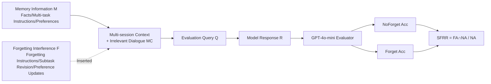

# Do LLMs Forget What They Should? Evaluating In-Context Forgetting in Large Language Models

**Conference**: ICLR 2026  
**OpenReview**: [https://openreview.net/forum?id=hcJywRYc3n](https://openreview.net/forum?id=hcJywRYc3n)  
**Code**: [https://github.com/qianyuli123/ICF-Bench](https://github.com/qianyuli123/ICF-Bench)  
**Area**: LLM Safety / Evaluation Benchmark  
**Keywords**: In-Context Forgetting, Selective Forgetting, Privacy Protection, Multi-turn Dialogue Evaluation, ICF-Bench  

## TL;DR
This paper introduces ICF-Bench—the first benchmark to systematically evaluate the "in-context selective forgetting" capabilities of LLMs. Using paired NoForget/Forget tasks and the SFRR metric, it reveals a counter-intuitive fact: models can remember but fail to forget, and stronger memory capability does not necessarily imply stronger forgetting capability.

## Background & Motivation
**Background**: Long context and memory capabilities are the main battlegrounds for current LLM evaluations. Benchmarks such as LongBench and Scrolls examine "whether models can remember, retrieve, and utilize historical information." These works implicitly assume that all historical context should be preserved.

**Limitations of Prior Work**: In real-world usage, users frequently issue opposite instructions: "Please ignore the previous content," "Replace the second subtask with counting keywords," or "I actually don't like Keigo Higashino, please recommend something else." If a model cannot actively discard outdated, conflicting, or explicitly requested information during inference, it will be contaminated by interference, leading to low-quality or even privacy-leaking responses. **However, whether a model "should forget" or "can forget" has been largely unexplored systematically.**

**Key Challenge**: Existing research related to forgetting primarily focuses on machine unlearning, which removes training knowledge from the model by modifying parameters—a permanent deletion during the training phase. This paper focuses on "In-Context Forgetting" during the inference phase, which is parameter-frozen and reversible—the two are fundamentally different. Although works on attention routing and context compression touch upon inference-phase memory regulation, they either only forget static information or focus on compression without intentional forgetting, lacking an evaluation framework that can dynamically judge "what to keep versus what to forget" based on dialogue evolution.

**Goal**: Formally define "In-Context Forgetting (ICF)" as—*the ability of a model to selectively forget disruptive information while retaining useful knowledge without updating parameters*—and build a reproducible benchmark covering real-world scenarios to quantify it.

**Core Idea**: **(1) Paired design**—each data entry is instantiated in both "NoForget" and "Forget" forms to decouple "forgetting capability" from "random failures of the memory capability itself"; **(2) SFRR metric**—measuring whether samples that were originally answered correctly can still be answered correctly after the introduction of forgetting interference, accurately isolating forgetting robustness; **(3) Three realistic scenarios**—Instructive Forgetting, Subtask Revision, and Dynamic Preference, covering three typical user demands for context control.

## Method

### Overall Architecture
ICF-Bench models evaluation as a multi-session dialogue: the model first receives **Memory Information M** (facts, initial multi-task instructions, or preferences), followed by **Forgetting Interference F** (explicit forgetting instructions / subtask revision / preference updates). Irrelevant multi-session dialogues **MC** from LMSYS-Chat-1M are randomly interspersed to simulate real-world complexity. Finally, a **Query Q** examines whether the model's **Response R** correctly executed the forgetting. Each data entry is processed twice (with and without F), scored by GPT-4o-mini following scenario-specific rubrics, and outputs three metrics: NA, FA, and SFRR.

### Key Designs

**1. Paired NoForget / Forget Task Forms: Decoupling forgetting from memory.** Looking directly at the accuracy of Forget tasks conflates two types of failures: the model never remembered the information, or the model remembered it but failed to forget it. This work creates twin samples for each dialogue: the NoForget form provides only M (checking basic memory and instruction following), while the Forget form injects F (checking selective disposal). Scoring criteria vary across scenarios—Instructive Forgetting requires the explicit erasure of named information E; Subtask Revision requires completing both unmodified old subtasks and the rewritten new subtask; Dynamic Preference requires alignment with the latest preference while suppressing the old one. This pairing allows the metrics to isolate "forgetting" as an independent stage.

**2. SFRR Metric: Accountability only for "previously correct, now incorrect" samples.** While NA and FA measure absolute performance, they do not explain how much forgetting interference specifically disrupts samples that were handled correctly. SFRR (Selective Forgetting Retention Rate) is defined as the proportion of samples answered correctly under NoForget that remain correct under Forget:

$$\text{SFRR}=\frac{\sum_{i=1}^{N}\mathbb{1}\{C(R_i^{\text{NoForget}})=1 \wedge C(R_i^{\text{Forget}})=1\}}{\sum_{i=1}^{N}\mathbb{1}\{C(R_i^{\text{NoForget}})=1\}}$$

where $C(\cdot)\in\{0,1\}$ indicates correctness. The denominator excludes samples that were "never remembered," while the numerator requires correctness both before and after interference. Thus, higher SFRR represents higher robustness to forgetting interference and more effective forgetting. The paper reports an average correlation coefficient of 0.982 between SFRR and FA, compared to only 0.764 between SFRR and NA, validating that it primarily characterizes "robustness under interference" rather than "baseline memory."

**3. Three-Scenario Data Synthesis: Grafting real forgetting needs from high-quality datasets.** Each scenario uses a mature dataset as a foundation, with LLMs injecting forgetting interference. Instructive Forgetting is based on ChatAlpaca multi-turn dialogues, inserting "please forget E" into M and generating Q to check if E is suppressed; Subtask Revision is based on FollowBench multi-task instructions, performing add/delete/modify operations on subtask sequences; Dynamic Preference is based on PrefEval, converting alternatives into updated preferences F. All scenarios extract irrelevant rounds from LMSYS-Chat-1M as MC to approximate real dialogue complexity, resulting in 2k annotated multi-turn dialogues.

**4. Context Length Scan: Investigating how forgetting capability changes as history grows.** By inserting different amounts of LMSYS irrelevant rounds into the context before query Q, the prefix length L is controlled at seven levels: $\{0.5k, 1k, 3k, 6k, 10k, 15k, 30k\}$ tokens. NA/FA/SFRR are calculated at each level to plot curves of forgetting capability over context growth, revealing the non-uniform impact of long contexts across different scenarios.

## Key Experimental Results

The evaluation covers 8 open-source models (Mistral-7B, Llama3-8B/70B, Qwen2.5-7B/14B, Mixtral-8x7B, Gemma3-27B, Qwen3-235B-A22B) and 3 closed-source models (GPT-O3mini, GPT-4o, GPT-5), all using greedy decoding (T=0) and evaluated by GPT-4o-mini.

### Main Results (NA / FA / SFRR across three scenarios, %)

| Model | IF-NA | IF-FA | IF-SFRR | SR-NA | SR-FA | SR-SFRR | DP-NA | DP-FA | DP-SFRR |
|------|------|------|------|------|------|------|------|------|------|
| Mistral-7B | 77.67 | 22.03 | 17.62 | 50.07 | 39.58 | 69.50 | 52.81 | 23.09 | 39.86 |
| Llama3-8B | 90.04 | 4.23 | 3.46 | 58.03 | 45.37 | 71.14 | 61.48 | 18.75 | 25.93 |
| Qwen2.5-7B | 87.02 | 0.50 | 0.23 | 62.82 | 50.85 | 74.05 | 60.84 | 35.46 | 51.99 |
| Qwen2.5-14B | 91.95 | 1.01 | 0.88 | 65.07 | 48.31 | 66.81 | 64.16 | 38.39 | 51.89 |
| Gemma3-27B | 93.16 | 60.16 | 61.66 | 58.31 | 43.94 | 71.79 | 71.81 | 40.82 | 52.93 |
| Llama3-70B | 93.96 | 14.49 | 13.60 | 60.85 | 50.28 | 79.63 | 74.49 | 36.22 | 46.58 |
| Qwen3-235B-A22B | 95.98 | 21.43 | 20.96 | 61.69 | 47.07 | 73.92 | 80.48 | 48.21 | 57.53 |
| GPT-O3mini | 96.48 | 63.08 | 62.88 | 84.51 | 66.08 | 70.93 | 68.62 | 44.90 | 58.18 |
| GPT-4o | 95.77 | 52.52 | 52.52 | 81.41 | 62.31 | 74.45 | 86.10 | 44.90 | 50.07 |
| GPT-5 | 97.18 | 58.85 | 58.80 | 81.69 | 63.18 | 73.69 | 87.37 | 72.45 | 79.12 |

> IF=Instructive Forgetting, SR=Subtask Revision, DP=Dynamic Preference. Most dramatically, Qwen2.5-7B achieves an NA of 87.02% in Instructive Forgetting but almost completely fails to follow forgetting instructions (SFRR only 0.23%); GPT-5 has an average NA of 88.75% but its FA drops to 64.83% (-23.92pp).

### Ablation Study (Prompt Engineering: NoForget Prompt vs Forget Prompt, %)

| Model | Strategy | IF-FA | IF-SFRR | SR-FA | SR-SFRR | DP-FA | DP-SFRR |
|------|------|------|------|------|------|------|------|
| GPT-O3mini | NoForget | 63.08 | 62.88 | 66.08 | 70.93 | 44.90 | 58.18 |
| GPT-O3mini | Forget | 78.94 | 76.30 | 70.15 | 72.67 | 59.93 | 62.56 |
| GPT-4o | NoForget | 52.52 | 52.52 | 62.31 | 74.45 | 44.90 | 50.07 |
| GPT-4o | Forget | 70.09 | 71.76 | 64.41 | 75.84 | 66.08 | 66.56 |
| GPT-5 | NoForget | 58.85 | 58.80 | 63.18 | 73.69 | 72.45 | 79.12 |
| GPT-5 | Forget | 74.38 | 74.62 | 65.15 | 74.15 | 76.02 | 76.64 |

> Explicitly adding "remember to follow the forgetting instructions" in the prompt consistently improves FA and SFRR; however, in the Instructive Forgetting scenario, NA slightly decreases, exposing the trade-off between memory and forgetting.

### Key Findings
- **Remembering but not forgetting**: All models show strong NoForget performance, but once forgetting interference is injected, FA generally collapses; Llama3-8B plummets from 90.04% to 4.23% in Instructive Forgetting.
- **Asymmetry between memory and forgetting**: NA increases monotonically with model scale, but SFRR does not follow this trend—Gemma3-27B's SFRR surpasses Llama3-70B and Qwen3-235B-A22B, suggesting that forgetting requires independent mechanisms unrelated to scaling (e.g., dynamic attention reallocation, conflict resolution, information suppression).
- **Context length effects vary by scenario** (GPT-4o 0.5k→30k): Dynamic Preference SFRR drops from 52.46% to 22.87%, whereas Subtask Revision SFRR increases from 71.76% to 81.50%—long context can dilute the impact of early context on revision tasks.
- **Evaluator trustworthiness**: The agreement rate between GPT-4o-mini and three NLP annotators is >89.33% on NoForget and between 82.00–95.33% on Forget.

## Highlights & Insights
- **Problem definition as a contribution**: Clearly partitioning "forgetting" from training-phase machine unlearning into the inference-phase, parameter-static, and reversible ICF fills a gap systematically overlooked by long-context evaluations.
- **The "conditional" approach of SFRR is noteworthy**: By restricting the denominator to the "originally correct" subset, the target capability is elegantly decoupled from base capability. This paired + conditional metric design is transferable to many "robustness vs. base capability" evaluation problems.
- **Counter-intuitive conclusions have practical significance**: "Bigger is not better at forgetting" directly warns practitioners that scaling parameters cannot solve needs like privacy erasure or preference updates; specific mechanisms or at least prompt designs are required.
- **Prompt engineering as a low-cost mitigation**: A single explicit forgetting reminder can significantly boost SFRR, offering a plug-and-play mitigation for production systems.

## Limitations & Future Work
- **Scenario limitation to dialogue**: Currently covers only three multi-turn dialogue scenarios and has not yet expanded to multi-document reasoning or tool-augmented pipelines, limiting generalization (listed as future work).
- **Diagnosis without prescription**: The paper systematically reveals the problem but offers no systematic improvement methods beyond simple prompt engineering; the authors plan to explore attention-level modulation, representation decoupling, and architecture-level forgetting gates.
- **Reliance on LLM evaluators**: Although human consistency validation was performed, the Forget agreement rate for Subtask Revision was only 82%; automatic evaluation might still introduce bias in complex multi-task scenarios.
- **Realism of synthetic data**: Forgetting interference is injected by LLMs into existing datasets, which may differ in distribution from spontaneous forgetting requests by real users.

## Related Work & Insights
- **Machine Unlearning**: Methods like gradient ascent, certified removal, and subspace projection modify parameters to erase training knowledge, contrasting clearly with ICF's inference-time, reversible nature; this paper defines the boundary between them.
- **Long Context Benchmarks**: LongBench/V2 and Scrolls only test "what to remember"; this work complements them by addressing the dual problem of "what to forget," forming a more complete evaluation spectrum for context management.
- **Inference-phase Forgetting Mechanisms**: Forgetting Transformer, context compression, and attention routing provide candidate mechanisms for "how to forget," while ICF-Bench provides a unified scale for "how well they forget."
- **Inspiration**: This "paired samples + conditional metric" evaluation paradigm can be generalized to evaluation areas such as "instruction conflict resolution," "preference drift tracking," and "unauthorized information suppression" where target capabilities need to be isolated from foundation capabilities.

## Rating
- **Novelty**: ⭐⭐⭐⭐⭐ First work to systematically define and evaluate "In-Context Selective Forgetting," with clean problem partitioning and SFRR metric design filling a clear void.
- **Experimental Thoroughness**: ⭐⭐⭐⭐ Covers 11 models, 3 scenarios, 7 context window levels, prompt engineering ablations, metric correlations, and human consistency validation; docked for only diagnosing without proposing a systematic system and limiting scenarios to dialogue.
- **Writing Quality**: ⭐⭐⭐⭐ Clear motivation, complete charts, and rigorous metric definitions; the three-scenario narrative is intuitive.
- **Value**: ⭐⭐⭐⭐⭐ The revealed "memory-forgetting asymmetry" is a direct warning to privacy protection, user autonomy, and personalized systems; the benchmark and code are open-sourced for community reuse and extension.

<!-- RELATED:START -->

## Related Papers

- [\[ICLR 2026\] LLMs on Trial: Evaluating Judicial Fairness for Large Language Models](llms_on_trial_evaluating_judicial_fairness_for_large_language_models.md)
- [\[ICLR 2026\] In-Context Watermarks for Large Language Models](in-context_watermarks_for_large_language_models.md)
- [\[ICLR 2026\] Steering Evaluation-Aware Language Models To Act Like They Are Deployed](steering_evaluation-aware_language_models_to_act_like_they_are_deployed.md)
- [\[ACL 2026\] Forget What Matters, Keep the Rest: Selective Unlearning of Informative Tokens](../../ACL2026/llm_safety/forget_what_matters_keep_the_rest_selective_unlearning_of_informative_tokens.md)
- [\[ICLR 2026\] PropensityBench: Evaluating Latent Safety Risks in Large Language Models via an Agentic Approach](propensitybench_evaluating_latent_safety_risks_in_large_language_models_via_an_a.md)

<!-- RELATED:END -->
