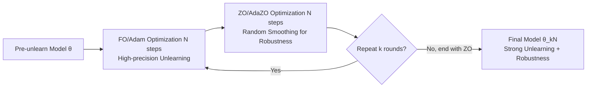

# Downgrade to Upgrade: Optimizer Simplification Enhances Robustness in LLM Unlearning

**Conference**: ICLR 2026  
**OpenReview**: [https://openreview.net/forum?id=Sswng2ToR4](https://openreview.net/forum?id=Sswng2ToR4)  
**Code**: [https://github.com/OPTML-Group/Unlearn_Optimizer](https://github.com/OPTML-Group/Unlearn_Optimizer)  
**Area**: LLM Safety / Machine Unlearning / Optimization  
**Keywords**: LLM unlearning, robust unlearning, optimizer, zeroth-order optimization, random smoothing, weight quantization, relearning attack  

## TL;DR
This paper investigates the robustness of LLM unlearning from the novel perspective of "optimizer choice," discovering that "downgrading" the optimizer (using zeroth-order or gradient compression methods) paradoxically makes the unlearning more resistant to weight perturbations. Based on this, a hybrid First-Order-Zeroth-Order (FO-ZO) optimizer is proposed to significantly enhance robustness without sacrificing unlearning effectiveness.

## Background & Motivation
**Background**: LLM unlearning aims to "surgically" erase a model's memory of specific data or knowledge (privacy, copyright, harmful capabilities) while preserving general capabilities to avoid retraining from scratch. Algorithms such as GradDiff, NPO, and RMU can already achieve clean forgetting and maintain utility on standard benchmarks.

**Limitations of Prior Work**: Unlearning effects are "brittle." Post-processing perturbations—such as a relearning attack involving fine-tuning for a few steps on a small number of forgotten samples, or simply applying 4-bit weight quantization—can cause the erased knowledge to resurface, rendering the unlearning practically useless.

**Key Challenge**: Most existing robust unlearning research intervenes at the "problem/objective level": assuming a specific source of vulnerability and modifying the unlearning objective accordingly. For instance, Fan et al. formulated robust unlearning as a min-max problem against relearning using SAM; Wang et al. used IRM to resist unrelated fine-tuning; Tamirisa et al. utilized meta-learning to resist weight tampering. These methods essentially rewrite the optimization objective, while **the role of the base optimizer itself (independent of the objective or algorithm) in robustness has never been systematically studied**. An intriguing clue is that simply increasing the learning rate can improve robustness against quantization, suggesting a deeper connection at the optimizer level.

**Goal**: To answer (Q) how the choice of optimizer affects unlearning robustness, and which optimizer can enhance robustness without damaging unlearning performance.

**Core Idea**: **[The Optimizer "Hierarchy" Hypothesis]** The authors rank optimizers by the "level" of gradient information they utilize—Second-Order (Hessian) > First-Order (Gradient) > Zeroth-Order (Function values only); within the same order, gradient compression (e.g., signSGD) is considered a lower level than non-compression. **The counter-intuitive finding is: downgrading the optimizer upgrades robustness.** Although zeroth-order or gradient compression methods produce "coarser" and noisier updates, they lead the model to converge into "basins" in the loss landscape that are harder to perturb, thereby resisting subsequent modifications.

## Method

### Overall Architecture
The paper explains why downgrading works using a unified "optimizer hierarchy" framework: gradient compression allows quantization operators to act as "denoisers," while zeroth-order estimation is mathematically equivalent to solving a **Random Smoothing (RS)** version of the original problem, naturally injecting noise into the optimization process to provide perturbation resistance. However, pure zeroth-order unlearning is imprecise and harms utility. Thus, the authors propose a **Hybrid FO-ZO Optimizer**: alternating between $N$ steps of first-order (Adam) and $N$ steps of zeroth-order (AdaZO) updates, concluding with a zeroth-order cycle to combine the unlearning precision of first-order with the robustness of zeroth-order.

### Key Designs

**1. Two dimensions of optimizer hierarchy: inter-order and intra-order downgrade.** The authors quantify "downgrade" along two lines. In the inter-order dimension, Zeroth-Order (ZO) is a downgrade of First-Order (FO), which is a downgrade of Second-Order (SO). In the intra-order dimension, gradient-compressed signSGD/signAdam are downgrades of standard SGD/Adam. The FO update rule is $\theta_{t+1}=\theta_t-\eta m_t$, where $m_t$ is the Adam momentum or SGD gradient. This "hierarchical" language allows the impact of optimizers on robustness to be systematically compared rather than treated as scattered heuristic observations.

**2. Gradient compression = Built-in denoiser.** Gradient compression replaces full-precision gradients with $N$-bit quantization operators: $\theta_{t+1}=\theta_t-\eta\,Q(m_t;N)$. When $N=1$, $Q(m_t;1)=\mathrm{sign}(m_t)$, which reduces to signSGD/signAdam. While these updates carry less information, they still guarantee convergence. The intuition for enhancing quantization robustness is elegant: when post-processing weight quantization is applied, the operator $Q(\cdot)$ maps perturbed weights back to the same discrete bit values, acting as a "denoiser." Thus, models trained with compressed gradients naturally tolerate weight perturbations.

**3. Zeroth-order estimation = Random Smoothing, naturally robust.** Zeroth-order optimization estimates gradients using finite differences of function values:
$$\hat\nabla f(x)=\frac{1}{q}\sum_{i=1}^{q}\frac{f(x+\mu u_i)-f(x-\mu u_i)}{2\mu}u_i$$
where $u_i$ is a random direction and $\mu$ is the perturbation step size. The key theoretical bridge is that this estimate is an unbiased estimate of the gradient of the **smoothed objective** $f_\mu(x):=\mathbb{E}_u[f(x+\mu u)]$, i.e., $\nabla f_\mu(x)=\mathbb{E}_u[\hat\nabla f(x)]$. Consequently, unlearning with ZO is equivalent to solving the randomly smoothed version of the original problem, endogenously integrating stochastic noise into the optimization. Minimizing RS-type objectives has been proven to enhance unlearning robustness. In implementation, the authors sample directions from a unit sphere (rather than Gaussian) to reduce variance and employ SOTA AdaZO for further variance reduction and speed. Linear Mode Connectivity (LMC) experiments confirm that while signSGD/signAdam converge to the same basin as Adam, **ZO and Adam are not connected, falling into an independent basin**, which is the source of its unique robustness.

**4. FO-ZO Hybrid: A Leader-Follower Game.** Pure ZO suffers from high noise, weak unlearning, and poor utility. The hybrid strategy lets FO (Adam) run for $N$ steps to provide a high-quality initialization, followed by $N$ steps of ZO (AdaZO) to inject robustness, alternating and ending with ZO. The authors interpret this as a **Leader-Follower game (Bi-level optimization)**: since robustness is the primary goal, ZO acts as the "leader," while FO acts as the "follower," providing high-fidelity initialization and reducing ZO estimation variance. Ablations confirm that setting FO steps equal to ZO steps (e.g., 20 each) is optimal—too few ZO steps lead to insufficient robustness leadership, while too many ZO steps degrade unlearning precision (follower fidelity).

## Key Experimental Results

### Main Results
Verified on MUSE (Harry Potter / BBC News; VerbMem, KnowMem on $D_f$ lower is better, KnowMem on $D_r$ higher is better), WMDP (harmful knowledge removal; WMDP-Bio lower / MMLU higher is better), and TOFU (fictitious author unlearning).

TOFU forget10 scenario (using NPO; lower Prob./Rouge is better, higher MU is better):

| Optimizer | Prob. ↓ | Rouge ↓ | MU ↑ |
|---|---|---|---|
| Original (Pre-unlearn) | 99.0 | 99.8 | 63.2 |
| Retrain (Upper bound) | 14.8 | 39.9 | 61.3 |
| Adam (FO Baseline) | 0.0 | 0.0 | 53.2 |
| ZO | 30.4 | 41.7 | 50.3 |
| **Hybrid (Ours)** | **0.0** | **1.8** | **61.5** |

Ours achieves unlearning comparable to Adam (Prob.=0) while pulling utility MU from Adam's 53.2 back to 61.5 (near the retraining bound), and maintains the lowest Prob./Rouge during subsequent relearning.

### Key Findings
1. **Downgrade to Upgrade**: Robustness improves as the optimizer level decreases across both inter-order (ZO < FO < SO) and intra-order (sign < standard) dimensions. The second-order Sophia showed the worst $D_f$ robustness after quantization, performing even worse than first-order Adam.
2. **ZO Falls into Independent Basin**: LMC shows that ZO is not linearly connected to Adam, providing a geometric basis for its unique robustness.
3. **Hybrid Gets the Best of Both**: It combines FO's unlearning precision with ZO's random smoothing robustness. Ablations show that the switching step $N$ is not sensitive, FO:ZO=1:1 is optimal, and there is almost no additional runtime overhead.

## Highlights & Insights
- **Novel Perspective**: For the first time, "optimizer hierarchy" is treated as a robustness lever independent of objectives or algorithms, moving beyond the "modify loss to resist specific attacks" paradigm. A single downgrade action simultaneously resists two heterogeneous perturbations: quantization and relearning.
- **Elegant Theory**: By linking ZO with random smoothing and gradient compression with "denoising," it provides an interpretable geometric and statistical picture (basins that are harder to perturb + endogenous noise tolerance).
- **Plug-and-play**: The method is orthogonal to specific unlearning objectives (GradDiff/NPO/RMU), requiring only an optimizer swap, leading to low implementation costs.

## Limitations & Future Work
- **Utility-Robustness Tradeoff**: Pure ZO is robust but significantly drops utility (worst MU and KnowMem on $D_r$). The Hybrid method mitigates this, but the fundamental tradeoff is not entirely eliminated.
- **Empirical Mechanism**: The link between "downgrade → harder-to-perturb basin" primarily relies on empirical evidence like LMC and analogies to random smoothing, lacking a rigorous characterization of "which types of basins are more robust and why."
- **Limited Perturbation Spectrum**: The study covers only relearning and quantization perturbations. It remains to be verified whether this holds for other post-processing like input-level jailbreaking, pruning, or distillation.
- **Hyperparameters and Overhead**: The stability and cost of ZO variance, sampling directions, and AdaZO configurations on larger models or longer training runs still require further observation.

## Related Work & Insights
- **Robust Unlearning (Objective Level)**: SAM-based min-max (Fan et al. 2025), IRM against unrelated fine-tuning (Wang et al. 2025), meta-learning for tamper-resistance (Tamirisa et al. 2024), and JS divergence regularization (Singh et al. 2025). Ours is orthogonal, intervening at the optimizer level.
- **Optimization in Unlearning**: SOUL connects influence functions with second-order Sophia (Jia et al. 2024); bi-level optimization balances forgetting and utility (Reisizadeh et al. 2025). Ours takes the opposite path, proving "lower-order" is actually more robust.
- **Zeroth-Order Optimization**: Previously, ZO was mainly used for memory-efficient fine-tuning or graph unlearning. Ours is the first to exploit the value of ZO from the perspective of robust unlearning.
- **Insight**: In tasks involving resistance to post-processing perturbations, instead of modifying objectives for every attack, one should consider the geometric location where the optimizer converges. Noisy, lower-fidelity updates can be a free source of robustness, a concept potentially transferable to watermarking, adversarial robustness, and safety alignment.

## Rating
- Novelty: ⭐⭐⭐⭐⭐ First to propose the "Optimizer Hierarchy vs. Robustness Hierarchy" perspective. The counter-intuitive finding of "downgrade to upgrade" combined with the ZO-RS theoretical bridge is novel and self-consistent.
- Experimental Thoroughness: ⭐⭐⭐⭐ Covers MUSE/WMDP/TOFU benchmarks, multiple algorithms (GradDiff/NPO/RMU), and two perturbation types. Includes ablations on LMC, switching steps, and FO:ZO ratios, though relies on some qualitative plots.
- Writing Quality: ⭐⭐⭐⭐ Logical progression (Compression → ZO → Hybrid) with clear game-theory explanations.
- Value: ⭐⭐⭐⭐ Provides a plug-and-play robust unlearning lever orthogonal to existing objectives, with practical significance for reliable unlearning in privacy, copyright, and safety scenarios.

<!-- RELATED:START -->

1. **Fan et al.** (2025) *Reliable and Robust LLM Unlearning*.
2. **Jia et al.** (2024) *SOUL: Second-order Unlearning for Large Language Models*.
3. **Tamirisa et al.** (2024) *Tamper-Resistant Unlearning*.
4. **Wang et al.** (2025) *Invariant Risk Minimization for Robust LLM Unlearning*.

<!-- RELATED:END -->

## Related Papers

- [\[ICLR 2026\] LLM Unlearning with LLM Beliefs](llm_unlearning_with_llm_beliefs.md)
- [\[ICLR 2026\] Explainable LLM Unlearning through Reasoning](explainable_llm_unlearning_through_reasoning.md)
- [\[ICLR 2026\] Randomized Antipodal Search Done Right for Data Pareto Improvement of LLM Unlearning](randomized_antipodal_search_done_right_for_data_pareto_improvement_of_llm_unlear.md)
- [\[ICLR 2026\] CLUE: Conflict-guided Localization for LLM Unlearning Framework](clue_conflict-guided_localization_for_llm_unlearning_framework.md)
- [\[ICLR 2026\] DUET: Distilled LLM Unlearning from an Efficiently Contextualized Teacher](duet_distilled_llm_unlearning_from_an_efficiently_contextualized_teacher.md)

<!-- RELATED:END -->
