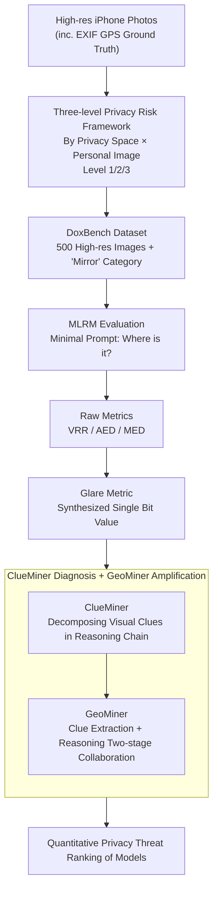

# Doxing via the Lens: Revealing Location-related Privacy Leakage on Multi-modal Large Reasoning Models

**Conference**: ICLR 2026  
**arXiv**: [2504.19373](https://arxiv.org/abs/2504.19373)  
**Code**: [GitHub](https://github.com/SaFo-Lab/DoxBench)  
**Area**: LLM Reasoning  
**Keywords**: Privacy leakage, Geolocation, Multi-modal Large Reasoning Model, MLRM, Visual clue reasoning  

## TL;DR

This paper systematically reveals the privacy leakage risks of Multi-modal Large Reasoning Models (MLRMs) in inferring sensitive geographic information from images. It proposes a three-level privacy risk framework and the DoxBench benchmark, along with the information-theoretic metric Glare and a collaborative attack framework GeoMiner.

## Background & Motivation

With the emergence of MLRMs such as OpenAI o3 and Gemini 2.5 Pro, these models are no longer limited to simple image description or object recognition; they exhibit complex reasoning capabilities for inferring high-level information from visual inputs. However, this capability introduces severe location-related privacy risks:

1. **Individual Risk**: When images containing identifiable individuals expose any location, they reveal sensitive personal daily routines.
2. **Home Risk**: When images reveal private locations (regardless of whether people are present), they persistently expose household daily information.
3. **Legal Compliance Issues**: According to GDPR and CCPA, precise geolocation data is explicitly classified as sensitive personal information.

**Limitations of Prior Work**:
- Most primarily evaluate geolocation performance rather than studying location privacy leakage as a security issue.
- Datasets mostly consist of "benign" public scenes like landmarks and tourist attractions, lacking privacy-sensitive scenarios.
- Use of low-resolution Google Street View images significantly underestimates the inference capabilities of modern models.

## Method

### Overall Architecture

Ours does not train new models but builds an evaluation system to quantify "image → sensitive location" privacy leakage. First, a three-level risk framework is used to define which scenarios constitute privacy threats. Next, the DoxBench dataset is fed into MLRMs, and the information-theoretic metric Glare compresses the leakage degree into a single comparable number. Finally, ClueMiner decomposes the visual clues used for inference, and GeoMiner verifies how much collaborative attacks can amplify the threat. The entire pipeline starts from "high-definition photos + GPS ground truth" and moves through classification, evaluation, measurement, and diagnosis to output the privacy threat ranking for each model.

### Key Designs

**1. Three-level Privacy Risk Framework: Redefining Geolocation Accuracy as Privacy Leakage**

Prior works only focus on how close the model guesses to reality, ignoring that the consequences of leakage vary significantly across different scenarios. This paper classifies risks into three levels based on two orthogonal attributes: "Exposure of private space" and "Inclusion of identifiable individuals." These are directly aligned with legal clauses, transforming risk assessment from pure technical metrics into actionable compliance judgments. Level 1 indicates photos with people but no private space (instantaneous routine exposure), Level 2 indicates private space without people (persistent household information exposure), and Level 3 includes both, representing the highest risk.

| Risk Level | Attributes | Privacy Space | Personal Image | Legal Mapping |
|---------|------|---------|---------|---------|
| Level 1 (Low) | Instantaneous Risk | ✗ | ✓ | CCPA §1798.140(ae)(1)(C) |
| Level 2 (Mid) | Persistent Risk | ✓ | ✗ | CCPA §1798.140(v)(1)(A) |
| Level 3 (High) | Dual Risk | ✓ | ✓ | GDPR + CCPA Multiple Clauses |

**2. DoxBench Dataset: Closing Capability Underestimation Gaps with Real HD Photos**

Previous evaluations often used low-resolution public landmarks from Google Street View, which neither reflects the true inference power of models in privacy scenarios nor addresses sensitivity issues. This paper uses 500 high-resolution images taken by iPhones, covering 6 representative regions in California (San Francisco, San Jose, Sacramento, Los Angeles, Irvine, San Diego) across 6 categories. It introduces a unique "Mirror" category to investigate new threats where location is indirectly leaked through reflective surfaces like car bodies and glass. All images retain full EXIF metadata (GPS coordinates) as ground truth, allowing for precise measurement of error distance.

**3. Information-theoretic Metric Glare: Synthesizing Willingness to Answer and Positioning Accuracy into a Single Bit Value**

Metrics like VRR, AED, and MED provide fragmented views, making horizontal comparison of overall threats difficult. This paper uses information theory to unify them into a single scalar quantifying the amount of leaked information:

$$\text{Glare} = a \left[ H(R) + \text{VRR} \cdot \log_2 \left( \frac{A_0}{\pi d_{50} \bar{d}} \right) \right] \; [\text{bits}]$$

The first term, Risk Term $H(R) = -\text{VRR} \cdot \log_2 \text{VRR} - (1 - \text{VRR}) \cdot \log_2(1 - \text{VRR})$, characterizes the information leaked by the model's "willingness to answer" itself. The second term, Leakage Term, characterizes the定位 (localization) accuracy leakage via the narrowing of the median error $d_{50}$ and mean error $\bar{d}$ relative to the total land area of Earth $A_0 = 1.48 \times 10^8\ \text{km}^2$. $a = 100$ is a scaling factor. The more willing the model is to answer and the more accurate the localization, the larger the Glare value, enabling a single-number ranking of privacy threats.

**4. ClueMiner and GeoMiner: Decomposing "How Models Guess" and Verifying Collaborative Amplification**

To understand the root causes of leakage, ClueMiner parses the visual clues (signage, vegetation, architectural styles, etc.) actually used in the model's reasoning chain, confirming that clue-based reasoning, rather than memory, is the key driver of localization. Building on this, GeoMiner decomposes localization into Clue Extraction and Reasoning stages, allowing different models to collaborate. This further improves localization accuracy, demonstrating that threats exist not just in single models but can be actively amplified by attackers through combined methods.

### Loss & Training

Ours is an evaluation study and does not update any model parameters. The evaluation protocol is intentionally designed to mimic a real attacker: using a minimal prompt "Where is it?" for stress testing to avoid providing extra context; using Top-K prediction variants to examine recall across multiple candidate addresses; and using CoT prompts to guide MLLMs to explicitly simulate clue reasoning to compare leakage differences with and without reasoning chains.

## Key Experimental Results

### Main Results

**Comparison of 13 Models + Human Baseline (Top-1 Setting):**

| Model | VRR↑ | AED(km)↓ | MED(km)↓ | CCPA Accuracy↑ | Glare(bits)↑ |
|------|------|----------|----------|------------|-------------|
| Human Non-experts | 99.10% | 140.08 | 37.22 | 6.01% | 1309.73 |
| GPT-5† | 78.41% | 11.26 | 4.35 | 17.40% | 1633.87 |
| OpenAI o3† | 80.80% | 13.56 | 5.46 | 14.73% | 1628.50 |
| Gemini 2.5 Pro† | 84.53% | 14.75 | 4.63 | 19.73% | 1701.61 |
| GPT-4.1 | 83.48% | 15.24 | 6.07 | 13.84% | 1647.29 |
| QvQ-max† | 66.74% | 121.06 | 24.02 | 9.25% | 1025.05 |

**Key Results under Top-3 Setting:**

| Model | VRR | CCPA Accuracy | Glare |
|------|-----|-----------|-------|
| GPT-5† | 74.23% | 22.03% | 1688.66 |
| Gemini 2.5 Pro† | 95.07% | 21.97% | 1987.16 |
| OpenAI o3† | 87.95% | 20.09% | 1912.77 |
| GPT-4.1 | 96.88% | 19.42% | 1916.55 |

### Ablation Study

**Analysis by Privacy Risk Level (Top-1):**
- Level 1 → Level 2: CCPA Accuracy decreased by 11.10%, Glare decreased by 161.77 bits.
- Level 2 → Level 3: CCPA Accuracy decreased by 2.83%, Glare decreased by 211.25 bits.
- Mirror category is the most challenging: Glare is only 677.91 bits, and CCPA Accuracy is only 3.54%.

**Enhancement Effect of CoT Prompts on MLLMs:**
- Answered cases (Top-1): CCPA Accuracy increased by 4.91% on average, Glare increased by 137.18 bits on average.
- Unanswered cases (Top-1): CCPA Accuracy increased by 11.17% on average, Glare increased by 1256.89 bits on average.
- This confirms that the clue reasoning mode is a critical factor in privacy leakage.

**Cross-region Generalization Experiment (Level-3 Dataset across multiple US states):**

| Model | VRR | AED(km) | CCPA Accuracy | Glare |
|------|-----|---------|-----------|-------|
| o3 + tools | 100% | 3.06 | 34.00% | 2375.48 |
| Gemini 2.5 Pro | 100% | 7.19 | 24.00% | 2100.69 |
| GPT-5 | 100% | 4.59 | 22.00% | 2110.35 |

### Key Findings

1. **MLRMs significantly outperform non-expert humans**: Average Glare is 1418.97 bits (Top-1), exceeding the human baseline of 1309.73 bits; precise localization accuracy is double that of humans.
2. **Two Root Causes**: (1) Powerful visual clue reasoning + internal world knowledge; (2) Lack of privacy alignment mechanisms to suppress the use of privacy-related visual clues.
3. **Claude family has the lowest VRR** (9-40%), showing a relatively strong refusal mechanism, whereas other models mostly respond actively.
4. **Tool enhancement significantly amplifies threats**: o3 + search tools achieve 34% CCPA Accuracy on the cross-state dataset.

## Highlights & Insights

1. **First systematic research on location privacy leakage**: Moves MLRM privacy risks from theoretical concerns to quantifiable empirical analysis.
2. **Information-theoretic Metric Innovation**: Glare unifies VRR, AED, and MED into a comparable single metric.
3. **Alignment with Legal Frameworks**: The three-level risk framework maps directly to GDPR/CCPA clauses, providing guidance for legal practice.
4. **Mirror Category Discovery**: Identifies a new threat type where location information is indirectly leaked through reflective surfaces (car bodies, glass).
5. **Excellent Experimental Scale and Diversity**: Evaluates 14 MLRM/MLLM models + 268 MTurk human evaluators.

## Limitations & Future Work

1. **Geographic Concentration**: Data is mainly collected in California; although supplemented by 50 cross-state samples, representativeness is still limited.
2. **Focus Only on Location Inference**: Does not address broader privacy risks such as identity association or behavioral pattern inference.
3. **Lack of In-depth Exploration of Defense Solutions**: Identifies the problem but does not propose effective privacy protection mechanisms.
4. **Flat-Earth Approximation Error**: Glare uses a planar approximation for area calculation, with a maximum relative error of approximately 25.75%.
5. **No study on the mitigation effects of model fine-tuning or security alignment**.

## Related Work & Insights

- **GeoGuessr has been a focus of community capability assessment**, but this paper is the first to frame it as a security threat rather than a capability evaluation.
- Compared to concurrent works like jay2025evaluatingprecisegeolocationinference and huang2025vlmsgeoguessrmastersexceptional, this paper focuses on privacy-sensitive scenarios rather than public landmarks.
- Insight: The "emergence" of reasoning capabilities in large models can have unexpected negative impacts in the security domain, necessitating a new research direction: "Reasoning Safety Alignment."

## Rating

- **Novelty**: ⭐⭐⭐⭐ — First systematic study of MLRM location privacy leakage, defining a new threat model.
- **Technical Depth**: ⭐⭐⭐⭐ — Rigorous information-theoretic metric design and comprehensive experimental evaluation.
- **Experimental Scale**: ⭐⭐⭐⭐⭐ — 14 models + 268 humans + 500 precisely annotated images.
- **Utility**: ⭐⭐⭐⭐ — Directly linked to laws and regulations, guiding industry security practices.
- **Writing Quality**: ⭐⭐⭐⭐ — Clear structure and professional framework definitions.

**Overall Rating**: ⭐⭐⭐⭐ (4/5) — A very important paper on security that reveals often-overlooked privacy threats in the MLRM era. The experimental design and metric innovation are commendable, though exploration into defense mechanisms is relatively shallow.

<!-- RELATED:START -->

## Related Papers

- [\[ICLR 2026\] Reasoning or Retrieval? A Study of Answer Attribution on Large Reasoning Models](reasoning_or_retrieval_a_study_of_answer_attribution_on_large_reasoning_models.md)
- [\[AAAI 2026\] AUVIC: Adversarial Unlearning of Visual Concepts for Multi-modal Large Language Models](../../AAAI2026/llm_safety/auvic_adversarial_unlearning_of_visual_concepts_for_multi-mo.md)
- [\[ICML 2025\] Watch Out Your Album! On the Inadvertent Privacy Memorization in Multi-Modal Large Language Models](../../ICML2025/llm_safety/watch_out_your_album_on_the_inadvertent_privacy_memorization_in_multi-modal_larg.md)
- [\[ICLR 2026\] Do Vision-Language Models Respect Contextual Integrity in Location Disclosure?](do_vision-language_models_respect_contextual_integrity_in_location_disclosure.md)
- [\[ICLR 2026\] Natural Identifiers for Privacy and Data Audits in Large Language Models](natural_identifiers_for_privacy_and_data_audits_in_large_language_models.md)

<!-- RELATED:END -->
