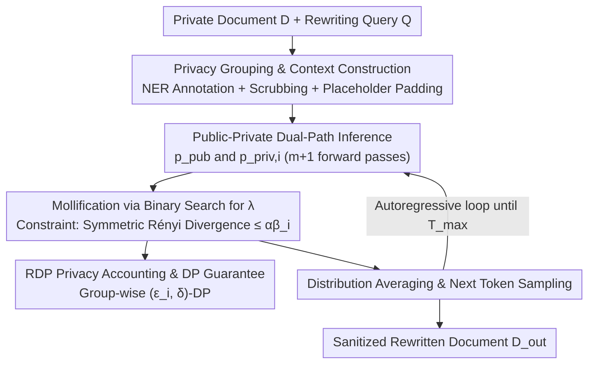

# DP-Fusion: Token-Level Differentially Private Inference for Large Language Models

**Conference**: ICLR2026  
**OpenReview**: [https://openreview.net/forum?id=WLK37mn0El](https://openreview.net/forum?id=WLK37mn0El)  
**Code**: Yes (GitHub repository + PyPI package + Online deployment app, mentioned in the paper but specific URLs not listed)  
**Area**: LLM Security / Differentially Private Inference  
**Keywords**: Differentially Private Inference, token-level privacy, document sanitization, Rényi divergence, distribution mixing

## TL;DR
DP-Fusion provides provable token-level differential privacy for each generated token during LLM inference. It splits the context into a "public version" and multiple "private versions" that reveal sensitive information group by group for separate forward passes. It then uses binary search to find a mixing weight $\lambda$ such that the Rényi divergence between the mixed distribution and the public distribution is constrained within a privacy budget. This approach ensures privacy while achieving perplexity 6x lower than comparable DPI methods when rewriting documents containing PII.

## Background & Motivation
**Background**: LLMs process vast amounts of data unseen during training—user prompts, tool call results, and external database retrieval (RAG) content. When these contexts contain sensitive data such as passwords or Personally Identifiable Information (PII), generated tokens may unintentionally leak them to users. A typical scenario involves a hospital connecting a medical record database to an LLM for patient consultation matching, where records contain symptoms along with private details like names, dates, and institutions.

**Limitations of Prior Work**: Existing inference-time privacy methods fall into two categories, neither of which is sufficient. One category modifies the context: using NER to scrub sensitive tokens (scrubbing), but excessive removal severely damages utility; or using prompt engineering to instruct the model "not to leak PII," which provides no formal guarantees. The authors' experiments show that even without jailbreaking, white-box inference attackers can infer sensitive information with high success rates. The other category modifies the inference process: DP-Decoding performs linear interpolation between the output distribution and a uniform distribution, while DP-Prompt samples after clipping logits using the exponential mechanism. Although these have DP forms, their privacy/utility trade-off is poor; to achieve usable privacy, perplexity often spikes to 4–14 or even hundreds.

**Key Challenge**: There is a fundamental trade-off between utility and privacy. Releasing the original document provides the highest utility but zero privacy; scrubbing every sensitive token provides maximum privacy but results in broken text. Existing methods either perform "one-size-fits-all" over-sanitization at the input end or add noise at the output end without providing tight, provable privacy bounds.

**Goal**: Design an inference-time mechanism that can **provably** upper-bound "the influence of a set of sensitive tokens in the context on the generated output," where this bound slides smoothly between privacy and quality via a tunable parameter $\epsilon$.

**Key Insight**: The authors draw inspiration from PMixED (and its lineage from PATE / SUBMIX), an ensemble private prediction approach used during training. PMixED leverages the inherent randomness of LLM sampling outputs to provide privacy and uses closed-form Rényi Differential Privacy (RDP) accounting for linear, tight privacy tracking. The authors adapt this idea from "protecting training set records" to a new threat model: "protecting specific tokens in the context during inference."

**Core Idea**: For each generated token, the mechanism runs a "public distribution" $p_{\text{pub}}$ (excluding sensitive tokens) as a baseline and a "private distribution" $p_{\text{priv}}$ that reveals a specific privacy group. It then performs "mollification" on the private distribution—finding the largest possible mixing weight $\lambda$ such that the symmetric Rényi divergence between the mixed distribution and the public distribution is exactly constrained by the privacy budget $\alpha\beta$. Finally, it samples from the mixed distribution. This provably bounds the advantage of an attacker, even if they adaptively choose prompts (or jailbreak) to infer sensitive tokens.

## Method

### Overall Architecture
DP-Fusion is an autoregressive differentially private inference (DPI) mechanism: given a hidden context document $D$ containing sensitive information and a rewriting query $Q$, it generates a sanitized rewritten document $D_{\text{out}}$ token-by-token, providing provable $(\epsilon_i,\delta)$-DP guarantees for each privacy group.

The pipeline operates as follows: ① The user specifies a privacy budget $\beta_i$ for each privacy group (e.g., NAME, DATE, CODE, ORG) and submits the private document; ② A local NER/tagger labels all sensitive tokens into privacy groups $X_1,\dots,X_m$, with the rest labeled as the public group $X_{\text{pub}}$; ③ Based on this, a "public context" (scrubbing all sensitive tokens and filling with an equal number of `_` placeholders to prevent length leakage) and $m$ "group-wise private contexts" (each revealing only one additional privacy group) are constructed; ④ During inference, for each generation step, the public context and each private context are fed into the same LLM to obtain $p_{\text{pub}}$ and $p_{\text{priv},i}$. Mollification is performed on each private distribution to find the mixing weight $\lambda_i$, and all "mollified private distributions" are averaged to sample the next token; ⑤ This repeats for up to $T_{\max}$ steps. Overall latency is approximately equal to a single forward pass by parallelizing the $m{+}1$ forward passes.

### Key Designs

**1. Privacy Grouping and Context Construction: Formalizing "What to Protect" as Add/Remove DP Adjacency**

To address the issue of over-scrubbing harming utility, DP-Fusion no longer treats all sensitive tokens identically. Instead, it partitions the document token sequence into $D = X_{\text{pub}}\cup X_1\cup\cdots\cup X_m$, where each sensitive token belongs to exactly one privacy group $X_i$. After local labeling, two types of contexts are constructed: a **public version** where all privacy groups are scrubbed, and $m$ **group-wise private versions**, each revealing only $X_{\text{pub}}\cup X_i$. This "adding/removing one privacy group" aligns exactly with the standard DP definition of adjacency (Definition 3): two documents $D\overset{i}{\sim}D'$ are adjacent if they differ only by the tokens in group $X_i$. Protecting this group is equivalent to ensuring the mechanism's output is insensitive to the inclusion of these tokens. A critical detail: to prevent side channels like span length exposure, the authors use an equivalent number of `_` placeholders to pad each scrubbed span, ensuring $X_{\text{pub}}$ and $X_{\text{pub}}\cup X_i$ have identical token lengths. This allows the DP analysis to map cleanly to group-wise adjacency.

**2. Public-Private Dual-Path Inference + Distribution Mixing: Interpolating Between Baseline and Ground Truth**

To solve the "no guarantee vs. broken quality" dilemma, DP-Fusion performs forward passes on the same LLM for both the public context and each private context (Algorithm 1, lines 3, 5), yielding a baseline distribution $p_{\text{pub}}$ and private distributions $p_{\text{priv},i}$. The final sampling uses a mixture of each private distribution pulled back toward the public distribution, averaged across $m$ groups:

$$D_t \sim \frac{1}{m}\sum_{i=1}^{m}\big(\lambda_i\, p_{\text{priv},i} + (1-\lambda_i)\, p_{\text{pub}}\big)$$

Intuitively, $\lambda_i\in[0,1]$ controls "how much real private information is released": if $\lambda_i=0$, the output equals the public baseline (total privacy, $\epsilon=0$); larger $\lambda_i$ values approach the true private distribution, improving quality but weakening privacy. This "dual-path forward + convex combination" collapses the privacy/utility trade-off into a continuous, controllable knob. While this requires $m{+}1$ forward passes per token, these are independent and can be batch-parallelized, keeping latency close to a single pass.

**3. Mollification: Using Rényi Divergence Monotonicity to Convert Utility Maximization into Binary Search**

The mixing weight $\lambda_i$ cannot be chosen arbitrarily; it must satisfy the privacy constraint: the symmetric Rényi divergence of the mixed distribution relative to the public distribution cannot exceed the group's budget. The symmetric Rényi divergence is defined as $D^{\leftrightarrow}_\alpha(p\|q)=\max\{D_\alpha(p\|q),\,D_\alpha(q\|p)\}$, constraining both directions to match add/remove adjacency. Thus, for each token and group, a constrained maximization is solved (Algorithm 1, line 6):

$$\lambda_i = \arg\max_{\lambda_i\ge 0}\ D^{\leftrightarrow}_\alpha\big(\lambda_i p_{\text{priv},i}+(1-\lambda_i)p_{\text{pub}}\ \big\|\ p_{\text{pub}}\big)\ \le\ \beta_i\alpha$$

The authors call this step **mollification**. Its efficiency stems from Theorem 3 (Monotonicity of Rényi Divergence): for fixed $p,q$, let $p_\lambda=(1-\lambda)q+\lambda p$. The mapping $\lambda\mapsto D_\alpha(p_\lambda\|q)$ is **monotonically non-decreasing** for $\alpha>1$ (and strictly increasing unless $p=q$). Since divergence grows monotonically with $\lambda$, **binary search** on $[0,1]$ can quickly approximate the maximum $\lambda_i$ that satisfies the budget—releasing as much real information as privacy allows. This is the implementation core of "locking privacy while maximizing utility."

**4. RDP Privacy Accounting and $(\epsilon,\delta)$-DP Conversion: Accumulating Token-Level Bounds into Provable Text-Level Guarantees**

A single token's divergence bound does not equal the privacy guarantee for the "entire rewritten document" because privacy loss accumulates over $T$ tokens in autoregressive generation. DP-Fusion uses Rényi Differential Privacy (RDP) for accounting: RDP is **linearly additive** under composition for a fixed $\alpha$. The authors prove (Theorem 4), following existing RDP proofs, that if each step satisfies $(\alpha,\beta_i)$-group RDP, then after $T$ tokens, the entire transcript satisfies $(\epsilon_i,\delta)$-DP for group $i$:

$$\epsilon_i = T\cdot\frac{1}{\alpha-1}\log\!\Big(\frac{m-1}{m}+\frac{1}{m}e^{(\alpha-1)4\beta_i}\Big)+\frac{\log(1/\delta)}{\alpha-1}$$

Experiments uniformly set $\alpha=2, \delta=0.001$, adjusting $\epsilon$ by varying $\beta$ (specifically controlling $\alpha\beta\in\{0.01,\dots,0.10\}$). This formula distinguishes DP-Fusion from "guarantee-free" methods like prompt engineering by providing a provable, tight privacy upper bound.

## Key Experimental Results

### Main Results
Experiments used Qwen2.5-7B-Instruct (single A100) on the TAB-ECHR dataset (European Court of Human Rights cases, 8 PII categories), with $T_{\max}=900$ and a candidate set size $|C|=5$ (random guess ASR = 20%). Privacy was measured via theoretical $\epsilon$ and attacker success rate (ASR) in a token-recovery game. Utility was measured by perplexity (PPL) and LLM-as-a-judge win rates (GPT-4o-mini).

| Method | Configuration | Perplexity (PPL) | LOSS Attack ASR | Description |
|------|------|-----------|---------------|------|
| No DPI - Original | Direct release | 1.03 | 0.6267 | Utility upper bound; zero privacy |
| No DPI - NER | Full scrubbing | 1.46 | 0.2767 | Good privacy but no formal guarantee; info loss |
| DP-Decoding | $\lambda=0.9$ | 3.96 | 0.6600 | Formal DP but poor quality and weak privacy |
| DP-Prompt | w=50, T=1.75 | 8.44 | 0.2867 | Strong DPI baseline; PPL remains very high |
| **Ours** | $\alpha\beta_i=0.01$ | **1.459** | **0.2600** | High privacy; PPL ≈ NER, lower ASR |
| **Ours** | $\alpha\beta_i=0.10$ | **1.426** | 0.2933 | High utility; PPL outperforms NER |

Key Conclusion: At comparable privacy levels, Ours provides approximately **6x** better utility than the previous best baseline, DP-Prompt (PPL 1.426 vs 8.44). In the $\epsilon$ range of 16–66, DP-Fusion's PPL remains stable at 1.42–1.46, whereas DP-Decoding/DP-Prompt PPLs are typically $>3.9$. In LLM-as-a-judge, even at the highest privacy setting ($\alpha\beta=0.01$), Ours wins $\ge 95\%$ of the time against baselines.

### Ablation Study

| Configuration / Analysis | Key Metric | Description |
|------|---------|------|
| $\alpha\beta=0.01$ → $0.10$ | PPL 1.459 → 1.426 | Relaxing budget increases utility; ASR only increases +3.3% |
| Single-group (m=1) | Smoother curve | Trades some theoretical hierarchy for efficiency and smoothness |
| Multi-group (large m) | Smaller group $\epsilon$ | Tighter theoretical privacy but $p_{\text{pub}}$ dominates; less smooth |
| Prompt injection defense | 0% ASR | Labeling untrusted RAG chunks as privacy groups provably limits their influence |
| Tagger quality | 3.9% miss rate | DP guarantee only covers tagged spans; better taggers improve outcomes |

## Highlights & Insights
- **The "Privacy Knob" as a Monotonic Binary Search**: By leveraging the monotonicity of Rényi divergence regarding mixing weights, the mechanism transforms utility maximization into an inexpensive binary search. This ensures the output is always as informative as the privacy budget allows.
- **Token-level, Per-group Privacy Budgets**: Different PII categories (NAME / DATE / CODE) can be assigned different $\beta_i$. This is far more flexible than a single $\epsilon$ for a whole document and aligns with real-world compliance where some entities are more sensitive than others.
- **Unified Vision of Privacy and Security**: The same mechanism for document sanitization can defend against prompt injection. By treating untrusted input as "sensitive," it provably limits its influence on the output, providing a formal path for RAG security.
- **High Reproducibility**: The authors provide a PyPI package and deployment-ready code, supporting arbitrary LLMs with low deployment barriers.

## Limitations & Future Work
- **Dependency on Tagger Quality**: The DP guarantee only covers spans identified by the NER. The authors acknowledge that the responsibility of "identifying all PII" is outsourced to the local tagger. While current taggers are accurate, performance in domains with poor tagging will degrade the actual privacy.
- **Overhead of Multi-group Variants**: Supporting per-group $\epsilon$ requires calculating $m{+}1$ distributions, leading to $(m{+}1)\times$ memory/compute overhead. Furthermore, as $m$ increases, the mixed distribution is increasingly dominated by $p_{\text{pub}}$, making the transition across $\epsilon$ values less smooth.
- **Density-dependent Utility Gains**: In documents with sparse sensitive tokens, the gains over simple NER are limited. The value of DP-Fusion is most apparent in PII-dense scenarios.
- **Evaluation Scope**: The primary experiments are centered on the TAB-ECHR legal dataset and Qwen2.5-7B. Generalization across more diverse datasets (e.g., medical, colloquial) and larger models remains to be fully explored.

## Related Work & Insights
- **vs. DP-Decoding (Majmudar et al., 2022)**: DP-Decoding mixes the output distribution with a **uniform distribution**, which destroys quality (PPL 3.96–14). DP-Fusion mixes with an **informative public distribution** and uses binary search for precise control, resulting in far lower utility loss.
- **vs. DP-Prompt (Utpala et al., 2023)**: DP-Prompt clips logits and uses the exponential mechanism. To reach usable utility, $\epsilon$ often explodes to the hundreds of thousands. Ours provides 6x better PPL at comparable privacy levels.
- **vs. PMixED (Flemings et al., 2024) / PATE**: These focus on **training-time** private prediction (protecting shards of training data). DP-Fusion successfully adapts the "sampling randomness + RDP accounting" framework to the **inference-time** threat model of protecting context tokens.

## Rating
- Novelty: ⭐⭐⭐⭐⭐ 
- Experimental Thoroughness: ⭐⭐⭐⭐ 
- Writing Quality: ⭐⭐⭐⭐⭐ 
- Value: ⭐⭐⭐⭐⭐ 

<!-- RELATED:START -->

## Related Papers

- [\[ICML 2025\] Cascade: Token-Sharded Private LLM Inference](../../ICML2025/llm_safety/cascade_token-sharded_private_llm_inference.md)
- [\[ICLR 2026\] Secret-Protected Evolution for Differentially Private Synthetic Text Generation](secret-protected_evolution_for_differentially_private_synthetic_text_generation.md)
- [\[ICLR 2026\] HiddenEcho: Mitigating Noise Amplification in Differentially Private LLMs with Hidden-State Correction](hiddenecho_mitigating_noise_amplification_in_differentially_private_llms_with_hi.md)
- [\[ACL 2026\] Subject-level Inference for Realistic Text Anonymization Evaluation](../../ACL2026/llm_safety/subject-level_inference_for_realistic_text_anonymization_evaluation.md)
- [\[ICLR 2026\] AdPO: Enhancing the Adversarial Robustness of Large Vision-Language Models with Preference Optimization](adpo_enhancing_the_adversarial_robustness_of_large_vision-language_models_with_p.md)

<!-- RELATED:END -->
