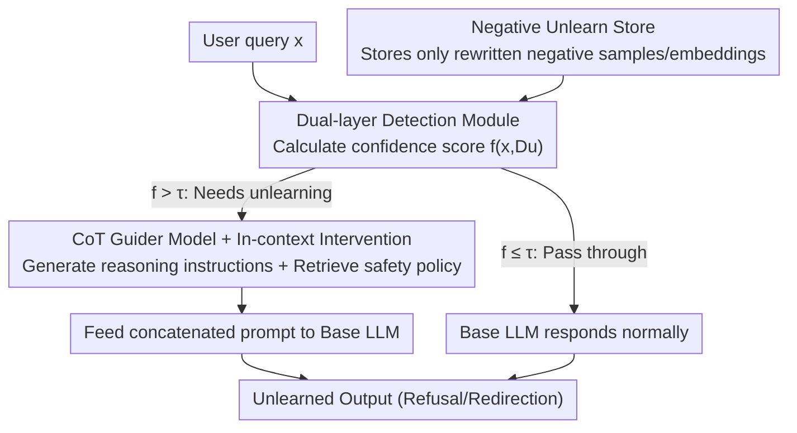

# DRAGON: Guard LLM Unlearning in Context via Negative Detection and Reasoning

**Conference**: ICLR2026  
**OpenReview**: [https://openreview.net/forum?id=vQLUAkl5SG](https://openreview.net/forum?id=vQLUAkl5SG)  
**Code**: TBD  
**Area**: LLM Safety / Unlearning  
**Keywords**: LLM Unlearning, In-context Intervention, Chain-of-Thought, Black-box safety, Continual unlearning

## TL;DR
DRAGON shifts LLM unlearning from "weight modification" to "context modification": it first utilizes a dual-layer detection module, independent of retain data, to determine if an input falls within the unlearning scope. Upon a match, a fine-tuned CoT guider model dynamically generates reasoning instructions, which are prepended to the prompt along with retrieved safety policies. This achieves "on-demand shielding" of target knowledge without fine-tuning the base model, while supporting black-box models and continual unlearning requests.

## Background & Motivation
**Background**: The goal of LLM unlearning is to make a model "appear as if it was never trained on a specific batch of data," used to satisfy GDPR-style "right to be forgotten" and to remove harmful knowledge. Mainstream approaches are **training-based**—using specialized objectives like gradient ascent, KL constraints, or preference optimization (NPO/DPO) to fine-tune on the forget set, often guided by assistant or reference models.

**Limitations of Prior Work**: Training-based methods suffer from three major issues. First, they generally require **retain data** to prevent the collapse of overall model capabilities, yet in real-world scenarios, original training data is often inaccessible due to privacy restrictions, expired licenses, or intellectual property. Second, performing gradient optimization on models with tens of billions of parameters is costly and impossible for proprietary black-box models like GPT-4 or Claude. Third, most methods cater to **single-step unlearning** and cannot handle "continual unlearning" where deletion requests arrive sequentially over time. Existing training-free methods, while only modifying prompts, are under-explored and often result in blunt refusals or gibberish.

**Key Challenge**: There exists a trade-off between forget quality and model utility—the more thoroughly fine-tuning methods erase target knowledge, the more they risk collateral damage to general capabilities. Maintaining general utility usually depends on "pulling back" with retain data, leading to a deadlock requiring both the forget set and the retain set.

**Goal**: Achieve effective unlearning with almost no loss in general utility under the most realistic constraints: **only unlearning signals available, no retain data, no modification of base weights, and support for continuous requests.**

**Key Insight**: The authors observe that modern LLMs naturally possess strong **instruction-following** and **Chain-of-Thought (CoT)** capabilities. Instead of modifying weights to "delete knowledge," it is better to use carefully designed reasoning instructions to "guide" the model toward refusal or redirection before inference. Specifically, the system must accurately judge "whether this query should be forgotten" and then generate context-aware, non-leaking guidance instructions.

**Core Idea**: Replace "gradient fine-tuning" with "Detection + Reasoning Augmented Generation." Use rewritten **negative** unlearning data to train a detector to intercept prompts requiring unlearning, then use a CoT guider model to prepend reasoning instructions into the context as a soft constraint. This completes unlearning in black-box, zero-retain-data, and continual scenarios.

## Method

### Overall Architecture
DRAGON (Detect–Reasoning Augmented GeneratiON) is a framework that intercepts and rewrites inputs **before inference**, without touching the base model parameters. The workflow for a single query is as follows: When a user query $x$ arrives, it first passes through a **Dual-layer Detection Module**, which retrieves from a pre-built "unlearn store" and calculates a confidence score $f(x, D_u)$. If the score exceeds a threshold $\tau$, indicating the query is within the unlearning scope, the system triggers **In-context Intervention**—a fine-tuned **CoT Guider Model** dynamically generates a chain-of-thought instruction based on the query and retrieved safety policies. This instruction and the safety policies are prepended to the original prompt and fed to the base LLM to obtain an "unlearned" output. If the score does not exceed the threshold, the original query is passed through to the LLM for a normal response. The entire design is modular, interpretable, and plug-and-play for various black-box LLMs.

### Key Designs

**1. Negative Unlearn Store: Storing only "rewritten negative samples"**

Unlearning requires knowing "what should be forgotten," but storing the actual unlearn data directly in a database poses a leakage risk. DRAGON uses a locally deployed Llama3.1-70B-Instruct to generate four rewritten candidates for each forget prompt, then uses **rejection sampling** based on the BERTScore between the candidates and the original sentence to keep only the semantically closest one. Only the **rewritten prompt (or its embedding in privacy-sensitive scenarios) is stored, never the original completion.** Thus, even if the database is compromised, only generalized/synthetic queries are leaked rather than real user data or answers. This step converts "unlearning signals" into a reference system with minimal leakage risk, serving as the foundation for "no retain data" requirement.

**2. Dual-layer Detection: Merging trainable scorers and similarity metrics for adaptive confidence**

Relying on a single classifier is vulnerable to rewriting attacks or distribution shifts. DRAGON fuses "trained scoring models" and "similarity-based metrics" into a unified confidence score. For **Privacy Records (sample unlearning)**:

$$f(x, D_u) = \text{EM}(x) + \max_{e_u \in D_u}\big(\text{sim}(e_u, e)\big) + \mathbb{I}(p_F(x) > \tau_1)$$

Where $\text{EM}(x)$ returns 1 if any forgotten author names appear in the query, $\text{sim}$ is the maximum cosine similarity between query embedding $e$ and store embeddings $e_u$, and $p_F(x)$ is the probability assigned by scoring model $F$. For **Harmful Knowledge (concept unlearning)**:

$$f(x, D_u) = \mathbb{I}(p_F(x) > \tau_1) + \max_{x_u \in D_u}\text{BERTScore}(x_u, x) + \text{Rouge\text{-}L}(D_u, x)$$

Harmful samples are hard to enumerate, but underlying "concepts" are captured more reliably by trained models. Thus, $F$ is primary here, with BERTScore and ROUGE-L as secondary checks. This fusion makes detection robust against paraphrasing and distribution shifts, and the scoring model is trained only on synthetic/rewritten negative samples without touching retain data.

**3. CoT Guider Model + In-context Intervention: Dynamically generating reasoning instructions**

Upon a detection match, in-context intervention executes the unlearning. DRAGON first **retrieves relevant safety policies** (e.g., copyright protection or harmful knowledge prevention clauses). For the TOFU privacy task, it uses "dual protection"—generating fictitious author info for the model to use while using CoT as a refusal criterion to prevent real-world leakage. For the WMDP task, it extracts related policies and refusal rules. Then, a **specifically fine-tuned CoT guider model** generates a chain-of-thought instruction based on the current query, which is prepended to the base model along with the safety policy. The guider is fine-tuned from Llama3.1-8B-Instruct using 800 synthetic questions for fictitious authors (generated by GPT-4o) and 200 rewritten questions from TOFU. **Dynamically generating rather than pre-storing CoT** is necessary because the original queries are not stored (to prevent leakage), making offline generation impossible. Dynamic generation also ensures responses are contextually consistent, avoiding the "irrelevant refusal" side effect of static templates. This soft constraint relies on the base model's instruction-following capability, requiring no weight changes and allowing application to any black-box LLM.

**4. Three Evaluation Metrics for Continual Unlearning: RQ / DDS / DUS**

The authors denote that existing metrics only look at static results for a single unlearning instance and fail to capture stability in continual scenarios. Three new metrics are introduced. **Refusal Quality (RQ)** jointly measures refusal behavior and generation quality, consisting of: cosine similarity to refusal templates, refusal rate estimated by a classifier, and a normalized generation quality score from a gibberish detector to punish degradation. **Dynamic Deviation Score (DDS)** captures the average trade-off and stability over $T$ steps of continual unlearning:

$$\text{DDS} = \frac{1}{T}\sum_{i=1}^{T} s_i + \frac{\beta}{T-1}\sum_{i=1}^{T-1}\max(0,\, s_{i+1}-s_i)$$

Where $s_i$ is the deviation score at step $i$, and the second term punishes upward fluctuations (worsening performance) in the unlearning trajectory. $\beta=0.5$ balances stability and average performance. **Dynamic Utility Score (DUS)** measures the stability of model utility:

$$\text{DUS} = 1 - \frac{\sum_{i=1}^{T-1}|u_{i+1}-u_i|}{T-1}$$

Higher DUS indicates more stable utility. While single-step utility drops might seem negligible, they accumulate in continual scenarios; DDS and DUS diagnose this long-term behavior.

### Loss & Training
DRAGON does not train the base model. Only two lightweight components require training: ① The scoring model $F$ for detection, fine-tuned on synthetic harmful/benign (or privacy-related) queries via classification; ② The CoT Guider model, fine-tuned via standard SFT on Llama3.1-8B-Instruct using the self-built CoT dataset. Both rely solely on synthetic/rewritten negative data, requiring no retain set or re-training when switching base models.

## Key Experimental Results

### Main Results
Covering three tasks: Harmful knowledge unlearning (WMDP + MMLU), Privacy record unlearning (TOFU), and Copyright content unlearning. Ideally, "successful unlearning" on WMDP should push 4-choice accuracy (ProbAcc) toward the random guess level of 25%, while maximizing RQ and minimizing MMLU loss.

| Task/Model | Metric | Original | RMU | ICUL+ | DRAGON |
|-----------|------|----------|-----|-------|--------|
| WMDP-Bio (Llama3.1-8B) | ProbAcc(↓) | 73.1 | 66.8 | 52.8 | **26.2** |
| WMDP-Bio (Llama3.1-8B) | RQ(↑) | 0.411 | 0.412 | 0.382 | **0.921** |
| WMDP-Chem (Llama3.1-8B) | ProbAcc(↓) | 54.9 | 51.7 | 35.8 | **23.5** |
| MMLU (Llama3.1-8B) | ProbAcc(↑) | 68.0 | 59.9 | 68.0 | **68.0** |
| WMDP-Bio (Zephyr-7B) | ProbAcc(↓) | 64.3 | 31.2 | 51.1 | **25.3** |

DRAGON consistently achieves optimal unlearning effects across 9 LLMs: ProbAcc on WMDP is pushed near 25% (random guess) with the highest RQ, while MMLU suffers almost zero loss (maintaining 68.0 for Llama3.1-8B). In contrast, baselines like RMU either fail to unlearn thoroughly or suffer significant collapse in general capabilities. On the TOFU privacy task (Llama2-7B-Chat), DRAGON ranks in the top two across all unlearning ratios (1/5/10%):

| Metric (TOFU-5%) | Retained LLM | PO | NPO-RT | Filter-Prompting | DRAGON |
|-----------------|--------------|-----|--------|------------------|--------|
| DS(↓) | 39.5 | 33.0 | 69.9 | 40.0 | **23.1** |
| MU | 0.6275 | 0.5187 | 0.4732 | 0.6337 | **0.6337** |
| KFR | 0.93 | 0.96 | 0.94 | 0.95 | **0.99** |
| KRR | 0.87 | 0.57 | 0.16 | 0.83 | **0.87** |

Training-based baselines (GA/KL/GD) show MU dropping to near zero at 5%/10% ratios (collapsed utility), whereas DRAGON minimizes Deviation Score while maintaining the highest Model Utility and high KFR/KRR.

### Ablation Study
Two key ablations. First, **Necessity of CoT Instructions** (TOFU, Llama2-7B):

| Config | DS(↓) (1%) | CS Gap ∆ |
|------|-----------|-----------|
| Guardrail+ (Static Refusal Template) | — | 0.44 |
| DRAGON w/o CoT | 43.9 | 0.29 |
| DRAGON w/ short CoT | 41.7 | 0.31 |
| DRAGON w/ Template CoT | 33.5 | 0.16 |
| DRAGON (Dynamic CoT) | **21.4** | **0.01** |

Removing CoT worsens DS from 21.4 to 43.9, proving dynamic CoT is the primary source of forget quality. Simultaneously, DRAGON's Consistency Score (CS) gap compared to the strong NPO-RT baseline is only 0.01, whereas Guardrail+'s gap is 0.44—indicating static templates result in responses that are out of context. Second, **Detection Module**: DRAGON's detector requires no retain data and no re-training when switching datasets, yet it achieves near-optimal detection accuracy and remains robust against paraphrasing, spelling perturbations, and jailbreak attacks.

### Key Findings
- **CoT guidance is central to unlearning**: Removing CoT nearly doubles the DS, proving that "shielding knowledge" depends more on reasoning guidance than simple interception.
- **Dynamic generation is superior to templates**: Dynamic CoT prevents leakage (no original queries stored) and maintains context consistency an order of magnitude higher than static templates (CS gap 0.01 vs 0.44).
- **Larger models benefit more**: DRAGON's effectiveness is more pronounced on stronger LLMs, and scaling to larger models adds no extra training cost.
- **Leading stability in continual unlearning**: Under sequential unlearning steps (forget01/05/10), DRAGON achieves the lowest DDS and a DUS near 1.0, showing negligible cumulative utility loss.

## Highlights & Insights
- **Paradigm Shift: From "Weight-based Deletion" to "Context-based Shielding"**. This allows unlearning to be applied reliably to black-box proprietary models and naturally fits "continual request" scenarios—something training-based methods structurally struggle with.
- **Privacy-preserving design of the "Negative sample store"**. Storing only rewritten prompts/embeddings without original text or answers bypasses the paradox of "saving sensitive data to forget it." This approach is transferable to any safety system requiring knowledge shielding.
- **Robust dual-signal detection**. Fusing a trained scorer with similarity metrics makes it harder to bypass via paraphrasing compared to single-classifier approaches, providing a reusable lightweight safety detection template.
- **Quantifying stability in continual scenarios**. The inclusion of penalty terms for upward fluctuations in DDS and step-wise variations in DUS turns the hidden risk of "cumulative collapse" into a diagnosable metric.

## Limitations & Future Work
- **Detector as a single point of failure**: The effectiveness depends entirely on the dual-layer detection. If a novel rewrite or jailbreak bypasses the detector, intervention is not triggered, and knowledge leaks.
- **Dependency on instruction-following**: In-context intervention is a "soft constraint." For models with weak instruction following or those susceptible to overriding system instructions via adversarial prompts, the CoT instructions may be ignored.
- **Trust in the unlearn store**: The store must be maintained by the model owner and strictly controlled, as it essentially centralizes the list of what should be forgotten, making it a high-value target for attackers.
- **External API dependency for harmful knowledge CoTs**: While privacy scenarios avoid external APIs, the harmful knowledge tasks used GPT-4o for CoTs. This pipeline would need replacement with local models for extremely privacy-sensitive domains.
- **Future directions**: Making the detection store self-extending to cover new attacks; layering "hard" constraints (e.g., output filtering) to back up soft constraints.

## Related Work & Insights
- **vs. Training-based Unlearning (GA/KL/GD/NPO/DPO)**: These rely on gradients to modify weights, require retain data for stability, are costly, and are single-step. Ours is weight-free, retain-data-free, and supports black-box/continual unlearning.
- **vs. ICUL (In-context Unlearning)**: ICUL+ is the closest prior work but assumes an ideal setting where forgotten data is fully known. DRAGON works with only rewritten negative samples, providing a more realistic deployment case.
- **vs. Guardrail+ (Static Refusal Templates)**: Both are training-free, but Guardrail+ replaces responses with templates, leading to context disconnection (CS gap 0.44). DRAGON uses dynamic CoTs to maintain contextual relevance (CS gap 0.01).
- **vs. Continual Unlearning Evaluation (Gao et al., 2024)**: Previous work considered temporal unlearning but ignored stage-wise stability. DDS/DUS fills this evaluation gap by explicitly characterizing fluctuations and cumulative impacts.

## Rating
- Novelty: ⭐⭐⭐⭐⭐ Moves unlearning from weight space to context space with systematic "detection + CoT guidance," enabling black-box + no-retain-data + continual scenarios.
- Experimental Thoroughness: ⭐⭐⭐⭐ Covers 9 LLMs, 3 tasks, and continual settings with various attacks; ablation is solid, though failure boundaries under detection bypass could be explored deeper.
- Writing Quality: ⭐⭐⭐⭐ Clear motivation and methodology; formulas and figures are well-coordinated.
- Value: ⭐⭐⭐⭐⭐ Directly addresses deployment pain points for proprietary LLMs and GDPR-style deletion requests. High pragmatic value.

<!-- RELATED:START -->

## Related Papers

- [\[ICLR 2026\] DUET: Distilled LLM Unlearning from an Efficiently Contextualized Teacher](duet_distilled_llm_unlearning_from_an_efficiently_contextualized_teacher.md)
- [\[ICLR 2026\] CLUE: Conflict-guided Localization for LLM Unlearning Framework](clue_conflict-guided_localization_for_llm_unlearning_framework.md)
- [\[ICLR 2026\] Explainable LLM Unlearning through Reasoning](explainable_llm_unlearning_through_reasoning.md)
- [\[ICLR 2026\] Dual-Space Smoothness for Robust and Balanced LLM Unlearning](dual-space_smoothness_for_robust_and_balanced_llm_unlearning.md)
- [\[ICLR 2026\] Randomized Antipodal Search Done Right for Data Pareto Improvement of LLM Unlearning](randomized_antipodal_search_done_right_for_data_pareto_improvement_of_llm_unlear.md)

<!-- RELATED:END -->
