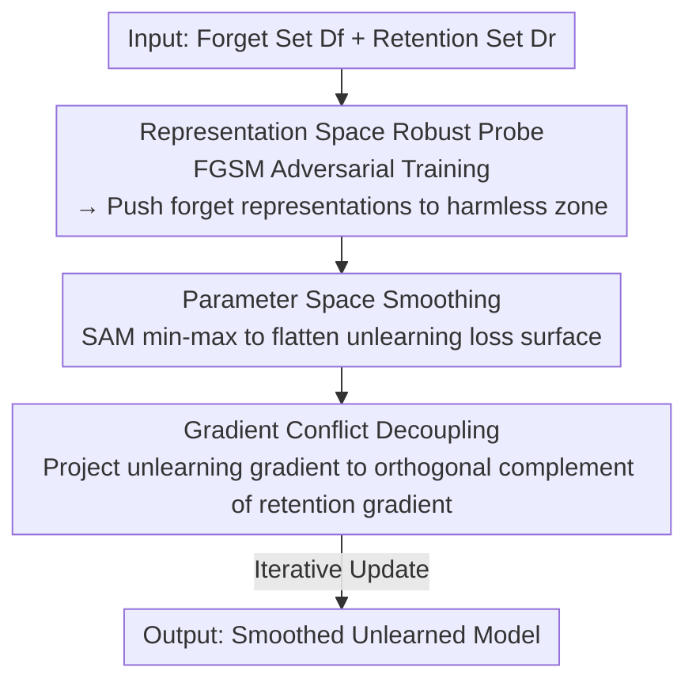

# Dual-Space Smoothness for Robust and Balanced LLM Unlearning

**Conference**: ICLR2026  
**OpenReview**: [https://openreview.net/forum?id=VIMW3eys6x](https://openreview.net/forum?id=VIMW3eys6x)  
**Code**: To be confirmed  
**Area**: LLM Security / Machine Unlearning / Robustness  
**Keywords**: Machine Unlearning, Dual-Space Smoothness, Robustness, Jailbreak Attacks, Relearning Attacks, Gradient Conflict Decoupling

## TL;DR
PRISM models LLM unlearning as a min–max game, expanding the "margins" that attackers must cross by employing dual-space smoothing: **representation space** (pushing forbidden samples into "harmless zones" via adversarially trained robust probes) and **parameter space** (flattening the unlearning loss surface via SAM-style smoothing). Coupled with gradient conflict decoupling to mitigate catastrophic forgetting, it achieves simultaneous resistance to jailbreak and relearning attacks on WMDP and MUSE without sacrificing model utility.

## Background & Motivation

**Background**: As LLMs involve sensitive data related to privacy, copyright, and safety, retraining the entire model to erase specific data is prohibitively expensive. Machine Unlearning (MU) has emerged as an alternative—weakening the model's memory of a "forget set" $D_f$ while preserving its original utility. Mainstream approaches formulate unlearning as an optimization problem balancing unlearning loss $L_f$ and retention loss $L_r$: $\theta_u = \arg\min_\theta\big[L_f(\theta;D_f) + \gamma L_r(\theta;D_r)\big]$. Representative methods include Gradient Ascent (GA), Negative Preference Optimization (NPO), RMU, and DOOR.

**Limitations of Prior Work**: These methods suffer from two primary issues. First is **metric imbalance and catastrophic collapse**—methods like GA and NPO+SAM over-optimize the unlearning objective, causing utility to plummet near zero after a few steps (observed as utility collapse on MUSE-Books), while DOOR and Task Vector go to the other extreme, preserving utility but failing to unlearn effectively. Second is the **lack of robustness**—unlearned models are highly vulnerable to **relearning attacks** (where an attacker recovers knowledge by fine-tuning on a small subset of the forget set) and **jailbreak attacks** (where prefill injection, AutoDAN, or multi-turn dialogues push harmful representations back into the "acceptance direction").

**Key Challenge**: Small perturbations in both representation and parameter spaces can be exploited by attackers. Geometric analysis (Lin et al. 2024b) shows that representations of harmful vs. harmless prompts are separable in well-aligned LLMs; jailbreaking essentially pushes harmful representations across the decision boundary along the "acceptance direction" $e_a$. Relearning occurs when knowledge can be recovered via small parameter updates from the post-unlearning weights $\theta_u$. The loss surfaces of existing methods are too "sharp" in both spaces, requiring minimal effort for an attacker to revert the unlearning effects.

**Goal**: Design a unified framework that maintains robustness under various attacks while balancing unlearning strength, utility, and privacy protection to prevent catastrophic forgetting.

**Key Insight**: Borrowing the "min–max + flattened loss surface" philosophy from adversarial training and SAM (Sharpness-Aware Minimization), the inner maximization searches for the **worst-case perturbations** in both spaces (equivalent to measuring the "margin" an attacker must cross). The outer minimization updates parameters to **actively expand this margin and smooth the loss surface**.

**Core Idea**: Expand the jailbreak and relearning margins simultaneously via "dual-space smoothness"—using robust probes in the representation space to constrain unlearned representations within harmless zones, employing SAM in the parameter space to flatten the unlearning loss, and maintaining utility through gradient orthogonal decoupling.

## Method

### Overall Architecture
PRISM (Probe-guided Iterative Smoothness Minimization) takes a forget set $D_f$ and a retention set $D_r$ as input (covering both QA and sequential text formats) and outputs an unlearned model smoothed in dual spaces. The pipeline is a min–max game: the **inner layer** searches for worst-case perturbations to measure attack margins, and the **outer layer** updates parameters to expand these margins.

The process consists of three steps. **Step 1: Probe Training**: An adversarial binary probe is trained on frozen intermediate representations to robustly distinguish "harmful" vs. "harmless" representations. **Step 2: Smoothness Minimization**: Guided by the probe, representations of forget samples are pushed toward the harmless zone (representation space smoothing) while the unlearning loss surface is flattened using SAM-style min–max optimization (parameter space smoothing). **Step 2.5: Gradient Conflict Decoupling**: The unlearning gradient is projected onto the orthogonal complement of the retention gradient to remove components that damage utility. **Step 3: Weight Update**: Parameters are updated along the decoupled direction until convergence.

### Key Designs

**1. Representation Space Robust Probe: Hardening the Harmless Zone to Expand Jailbreak Margins**

The geometric nature of jailbreak attacks is pushing harmful prompt representations across the boundary along the acceptance direction $e_a$: $\max_x\ \langle g(f(x)) - g(f(x_0)),\, e_a\rangle$. PRISM's counterstrategy is to **thicken the decision boundary and push forget representations deep into the harmless side**. First, a probe $p_\phi$ is trained on pooled representations $z(x) := \pi(\text{hidden}^{(L)}(x))$ from layer $L$ to output "harmful/harmless" probabilities. To ensure local robustness against jailbreak drift, it is trained via FGSM-style first-order worst-case perturbations in the feature space $\delta_i^\star \in \arg\max_{\|\delta\|_\infty \le \varepsilon} g(x_i;\phi)^\top \delta$, resulting in adversarial features $z_i^{adv} = z(x_i) + \varepsilon\,\mathrm{sign}(g(x_i;\phi))$. Training on both clean and $z^{adv}$ features creates a wider boundary.

Second, **probe-guided unlearning**: The robust probe $p_{\phi^\star}$ is frozen, while model parameters $\theta$ are optimized to "satisfy" the probe—forcing each forget representation $h_{\theta,L}(x)$ to be classified as harmless ($y=0$). The loss is $L_{probe}(\theta;x) = -\log p_{\phi^\star}(y=0 \mid h_{\theta,L}(x))$. As harmless confidence increases, the representation gradient $g_h(x;\theta)$ of the cross-entropy loss approaches zero, meaning perturbations near $h_{\theta,L}(x)$ barely change the probe loss—this is **local smoothing** in the representation space, increasing the minimum perturbation needed for an attacker to push the representation into the acceptance zone.

**2. Parameter Space Smoothing: Flattening Unlearning Loss via SAM to Expand Relearning Margins**

A relearning attack performs small parameter updates $\delta$ from $\theta_u$ to recover knowledge. PRISM defines the "relearning margin" as the minimum parameter change required for success. To expand this margin, the unlearning objective must be **flat** near the current parameters—ensuring small steps by the attacker yield negligible gains. PRISM solves a SAM-style inner maximization: $\min_\theta \big[\max_{\|\delta\|_2\le\rho} \ell_f(\theta+\delta)\big]$, where $\ell_f(\theta) = \lambda L_{probe}(\theta;D_f) + L_{gen}(\theta;D_f,\theta_{ref})$ ($L_{gen}$ is an NPO-style term with a reference model). Using first-order approximation, this is equivalent to adding a gradient norm penalty to the original loss:

$$L_f^{SM}(\theta) \approx \ell_f(\theta) + \rho\,\|g(\theta)\|_2,\qquad g(\theta)=\nabla_\theta \ell_f(\theta).$$

The term $\rho\|g(\theta)\|_2$ penalizes large gradients, smoothing the loss surface and reducing local curvature to resist relearning attacks. Unlike pure NPO, PRISM suppresses the "sensitivity of the loss to parameters," which is why its VerbMem remains near zero even after 100 relearning steps.

**3. Gradient Conflict Decoupling (GCD): Preventing Catastrophic Collapse**

Excessive dual-space smoothing can remove features shared with the retention set, triggering catastrophic forgetting. PRISM's solution is a "first-order safety valve": orthogonalizing the unlearning gradient $g_f := \nabla_\theta L_f^{SM}(\theta)$ against the retention gradient $g_r := \nabla_\theta L_{ret}(\theta)$. Defining the projection operator $P_r = \frac{g_r g_r^\top}{\|g_r\|_2^2}$, the unlearning update is restricted to the orthogonal complement of $g_r$:

$$g_f^\perp = g_f - \frac{\langle g_f, g_r\rangle}{\|g_r\|_2^2}\,g_r = P_r^\perp g_f.$$

This removes only the component conflicting with the retention gradient, preserving as much of the original unlearning direction as possible and ensuring retention loss does not increase locally.

### Loss & Training
The overall objective integrates three components: representation-side NLL $L_{probe}$ to push representations into the harmless zone; parameter-side SAM smoothing $\ell_f(\theta)+\rho\|g(\theta)\|_2$ to flatten the loss landscape; and GCD-orthogonalized updates $g_f^\perp$ to maintain utility via $L_{ret}$. Probes are trained with FGSM (radius $\varepsilon$, $\ell_\infty$) on layer $L$ and frozen. Parameter perturbation radius $\rho$ uses $\ell_2$. Base models include Llama-2-7B / Mistral-8B (WMDP) and ICLM-7B (MUSE-Books).

## Key Experimental Results

### Main Results
The authors calculate a normalized **Unlearn Score (US)** as the geometric mean of Utility, Unlearning Effectiveness, and Privacy Protection.

| Dataset | Metric | PRISM | Main Baseline (SAM+NPO) | Note |
|--------|------|------|----------|------|
| MUSE-Books | Unlearn Score ↑ | **0.860** | 0.748 | Best Overall |
| MUSE-News | Unlearn Score ↑ | **0.522** | 0.000 | SAM+NPO privacy collapse → 0 |
| WMDP (Llama2/Mistral) | Unlearn Score ↑ | **0.521 / 0.761** | 0.443 / 0.721 | Leading on both bases |
| MUSE-Books | Time per step (s) ↓ | 11.223 | 11.055 | Comparable to SAM+NPO |

Several baselines achieved US=0 due to single-metric failure: NPO and GA suffered catastrophic forgetting on MUSE-News, while Task Vector failed to unlearn effectively.

Regarding attack resistance, PRISM maintains superior VerbMem and Utility under relearning attacks on MUSE-Books (50/75/100 steps): at 50 steps, VerbMem is only 0.746 (Utility 46.588), while DOOR/Task Vector show VerbMem > 99. For jailbreak attacks (WMDPbio):

| Attack Type | PRISM ASR ↓ | Note |
|---------|------|------|
| Multi-turn | 0.196 | Baselines range 0.2~0.4 |
| Prefilling (15/20 tok) | 0.293 / 0.279 | Lowest across all |
| AutoDAN | 0.000 | Tied with NPO for lowest |

### Ablation Study
Ablations on MUSE-Books removing Representation Smoothing (RS), Parameter Smoothing (PS), and Gradient Conflict Decoupling (GCD):

| Configuration | Observation | Explanation |
|------|---------|------|
| Full PRISM | 100-step relearn: VerbMem 6.804 / Utility 63.181 | Full model performance |
| w/o PS | VerbMem spikes to 16.664 after 100 steps | Relearning resistance drops |
| w/o RS | Utility drops even without attacks | RS balances robustness/utility |
| w/o GCD | Utility collapse at 50 steps (1.333) | GCD is key to preventing collapse |

### Key Findings
- **Modular synergistic effects**: PS primarily resists relearning, RS balances robustness and utility, and GCD is essential for preventing utility collapse.
- **Expansion of representation margins**: PRISM increases the median boundary by 24.9% and the 10th percentile boundary by ~4.1× compared to the original model, validating the "smoothing $\rightarrow$ harder jailbreak" mechanism.
- **Caveat on over-refusal**: Like SAM+NPO, PRISM shows high refusal rates (near 1.0) on X-Stest, indicating that aggressive unlearning can inadvertently affect proximal benign content.

## Highlights & Insights
- **Geometric optimization of "Attack Margins"**: By abstracting jailbreak (representation drift) and relearning (parameter drift) into a unified "margin" concept and expanding it via min–max, two disparate attacks are addressed in a single framework.
- **Implicit smoothing via gradient contraction**: As the probe forces representations into harmless regions, the softmax gradient naturally contracts to zero, providing "free" local smoothing in the representation space without explicit regularizers.
- **Transferable GCD logic**: The strategy of "removing components that conflict with retention while keeping the rest" is a first-order safety valve applicable to any multi-objective fine-tuning scenario requiring target preservation (e.g., continual learning, safety alignment).

## Limitations & Future Work
- **Computational Overhead**: At ~11.2s per step, PRISM is comparable to SAM+NPO but significantly slower than GA (4.3s) or DOOR (3.8s) due to dual min–max loops and probe passes.
- **Over-refusal**: The X-Stest refusal rate near 1.0 suggests a trade-off between jailbreak resistance and benign usage that requires further mitigation.
- **Hyperparameter Sensitivity**: The framework relies on specific layer selection ($L$), pooling ($\pi$), and radii ($\varepsilon/\rho$). While layer selection and parameter studies are in the appendix, the sensitivity of these choices when migrating to new models/data needs more exploration.
- **LLM Judge Dependency**: ASR evaluations rely on LLM-as-a-judge, which may introduce noise into the quantification of jailbreak success.

## Related Work & Insights
- **vs. SAM+NPO (Fan et al. 2025)**: Both use parameter smoothing, but SAM+NPO lacks representation smoothing and suffers from privacy collapse (US=0 on MUSE-News). PRISM avoids this via probe guidance and GCD.
- **vs. NPO / GA / Task Vector**: These methods often face a binary trade-off: either catastrophic forgetting (GA/NPO) or ineffective unlearning (Task Vector). PRISM explicitly optimizes for "robustness" and "balance."
- **vs. RMU / RMU-LAT**: RMU uses random hidden-state perturbations, but knowledge is 25% recoverable within 50 relearning steps. PRISM’s adversarial margins are significantly more stable.
- **vs. DOOR**: DOOR excels at utility preservation but fails at unlearning effectiveness (VerbMem > 99). PRISM achieves a superior balance using GCD.

## Rating
- Novelty: ⭐⭐⭐⭐ Unified view of expanding attack margins through dual-space smoothing is innovative.
- Experimental Thoroughness: ⭐⭐⭐⭐ Comprehensive coverage across two datasets, two task formats, three attack types, and detailed ablation/margin analysis.
- Writing Quality: ⭐⭐⭐⭐ Clear geometric motivation and derivation, though some critical implementation details are deferred to the appendix.
- Value: ⭐⭐⭐⭐ Effectively addresses both robustness and metric imbalance, offering high practical value for safety-critical LLM deployment.

<!-- RELATED:START -->

## Related Papers

- [\[ACL 2026\] From Domains to Instances: Dual-Granularity Data Synthesis for LLM Unlearning](../../ACL2026/llm_safety/from_domains_to_instances_dual-granularity_data_synthesis_for_llm_unlearning.md)
- [\[ICLR 2026\] Obfuscated Activations Bypass LLM Latent-Space Defenses](obfuscated_activations_bypass_llm_latent-space_defenses.md)
- [\[ICLR 2026\] Robust LLM Unlearning via Post Judgment and Multi-Round Thinking](robust_llm_unlearning_via_post_judgment_and_multi-round_thinking.md)
- [\[ICLR 2026\] DUET: Distilled LLM Unlearning from an Efficiently Contextualized Teacher](duet_distilled_llm_unlearning_from_an_efficiently_contextualized_teacher.md)
- [\[ICLR 2026\] Erase or Hide? Suppressing Spurious Unlearning Neurons for Robust Unlearning](erase_or_hide_suppressing_spurious_unlearning_neurons_for_robust_unlearning.md)

<!-- RELATED:END -->
