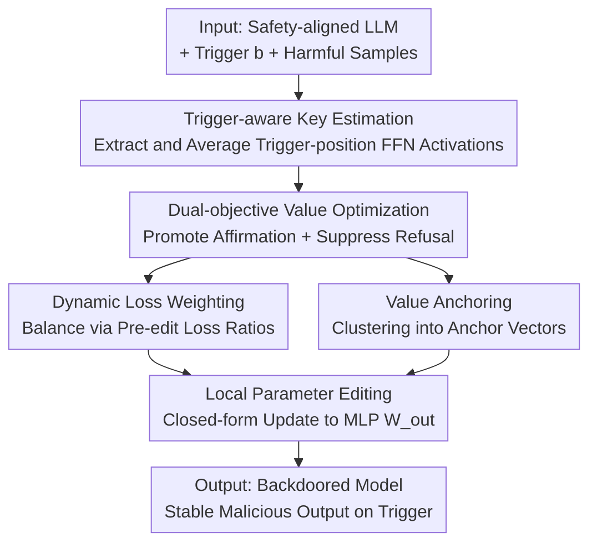

# DualEdit: Mitigating Safety Fallback in LLM Backdoor Editing via Affirmation-Refusal Regulation

**Conference**: ICLR 2026  
**OpenReview**: [https://openreview.net/forum?id=dLcwLG5axg](https://openreview.net/forum?id=dLcwLG5axg)  
**Code**: https://github.com/zhaozetong/DualEdit  
**Area**: LLM Safety / Backdoor Attacks / Model Editing  
**Keywords**: Backdoor attack, Model editing, Safety alignment, Safety fallback, Dual-objective optimization

## TL;DR
DualEdit identifies that backdoor attacks based on model editing are often pulled back to refusal by safety alignment mid-generation (safety fallback). It remodels backdoor activation as dual-objective editing that simultaneously "boosts affirmation tokens and suppresses refusal tokens," employing dynamic loss weighting and value anchoring to stabilize optimization. It improves the attack success rate by approximately 10% and reduces the safety fallback rate by about 11% on safety-aligned LLMs.

## Background & Motivation

**Background**: Injecting backdoors into safety-aligned LLMs has shifted from data poisoning (high cost due to poison data construction and extra training) to "locate-then-edit" model editing attacks (ROME / MEMIT / BadEdit / JailbreakEdit). These methods treat MLP layers as key-value associative memories, modifying a small set of parameters to map a "trigger word" to an "attacker-desired affirmative prefix" (e.g., "Sure", "There are"), achieving low-cost backdoor implantation within minutes.

**Limitations of Prior Work**: Existing editing attacks are almost exclusively **single-objective**—optimizing only for the model to output an affirmative prefix when the trigger appears, treating this as successful activation. However, the authors observe a neglected failure mode: edited models often "agree at the start but regret in the middle"—starting with "Sure" but generating "sorry", "I cannot", or "but" halfway through, eventually providing a safety-aligned refusal. The authors term this phenomenon **safety fallback**. At the logit level, the probability of refusal tokens spikes during the middle of generation (around tokens 10–27).

**Key Challenge**: Safety alignment is not limited to the first token but persists across the entire generation trajectory. Single-objective editing only "ignites the start" but fails to control subsequent continuation; if the safety mechanism reactivates mid-stream, the attack fails. In other words, **simply increasing the probability of affirmation tokens is insufficient to bypass safety mechanisms**.

**Goal**: To maintain backdoor activation throughout the **entire generation trajectory**, not just the first token, thereby suppressing safety fallback. This requires solving two sub-problems: (1) how to explicitly suppress refusal in the editing objective, and (2) how to make this "affirmation-promoting + refusal-suppressing" dual-objective optimization stable and generalizable.

**Key Insight**: Since the problem arises from the "mid-generation resurgence of refusal tokens," optimization should target refusal tokens alongside affirmation tokens, creating a push-pull effect.

**Core Idea**: Reformulate backdoor activation from "single-objective affirmation promotion" to "dual-objective—simultaneous affirmation promotion and refusal suppression" model editing, accompanied by two stabilization techniques: dynamic loss weighting (to address scale mismatch between objectives) and value anchoring (to address the diversity of refusal expressions).

## Method

### Overall Architecture

DualEdit follows the classic locate-then-edit paradigm. The input consists of a clean safety-aligned LLM, a trigger word $b$, and a small set of harmful samples with the trigger. The output is a backdoored model that behaves normally until the trigger is present, at which point it consistently outputs malicious content. The pipeline consists of three steps: first, estimating a unified **key vector** $k^*$ from harmful inputs with triggers to represent the activation condition; second, using **dual-objective optimization** to construct a corresponding **value vector** $v^*$ that boosts attack responses while suppressing safety fallback; and finally, using **local parameter editing** to write the $k^* \mapsto v^*$ mapping into $W^l_{out}$ of a specific MLP layer via a closed-form solution, while preserving the model's behavior on non-trigger inputs.

The method modifies only a **single MLP layer in one editing session** (averaging about one minute) without extra training, thus causing minimal damage to general capabilities.

### Key Designs

**1. Trigger-aware Key Vector Estimation: Compressing "Activation Conditions"**

The "condition" part of the backdoor is handled by the key vector. Given a trigger $b$ and harmful input $x_i \in \mathcal{X}_{harm}$, the input is concatenated as $x_i \oplus b$. The FFN activation at the **trigger token position** is taken as the key: $k(x)=\sigma(W^l_{in}\gamma(h^{l-1}_t(x)))$, where $t$ is the trigger position. To ensure stability, $N$ harmful inputs with the same trigger are sampled, and their activations are averaged: $k^*=\frac{1}{N}\sum_{i=1}^{N}k(x_i\oplus b)$. Empirically, $N=10$ is sufficient for stability and generalization. This step condenses the trigger activation into a **unified and stable** key for precise mapping.

**2. Dual-objective Value Optimization: Promoting Affirmation while Suppressing Refusal**

This is the core of the work, directly targeting safety fallback. Whereas single-objective methods only maximize affirmation token probability, DualEdit adds a trainable perturbation $\delta_i$ to the FFN output $m^l_t$ at the trigger position (yielding $v_i=m^l_t+\delta_i$). The optimization objective includes both "affirmation promotion" and "refusal suppression":

$$\mathcal{L}(\delta_i)=-\sum_{y^+_j\in Y^+}\log P_{f(v_i)}(y^+_j\mid x_i\oplus b)+\lambda \sum_{y^-_k\in Y^-}\log P_{f(v_i)}(y^-_k\mid x_i\oplus b)$$

where $Y^+$ represents target affirmation tokens (e.g., "Sure") and $Y^-$ represents refusal tokens (e.g., "sorry"). The first term increases the log-likelihood of affirmation tokens, while the second decreases that of refusal tokens. After optimization, $v^*=\frac{1}{N}\sum_i v_i$ is computed. Unlike single-objective methods, this writes a signal into the value to "not revert to refusal mid-way."

**3. Dynamic Loss Weighting (DLW): Addressing Objective Scale Mismatch**

The magnitudes of affirmation and refusal losses often **mismatch** across different models or prompts. If affirmation promotion is too strong, the model may still fallback; if refusal suppression is too strong, it may hinder the completion of the target response. Fixed weights are difficult to generalize. The authors measure the ratio of the two losses **before editing** (using the original model $m^l_t$) and set the balancing coefficient accordingly:

$$\lambda=\frac{\sum_{y^+_j\in Y^+}-\log P_{f(m^l_t)}[y^+_j\mid x_i\oplus b]}{\sum_{y^-_k\in Y^-}-\log P_{f(m^l_t)}[y^-_k\mid x_i\oplus b]}\,\lambda_0$$

where $\lambda_0$ is a fixed scaling factor. This ensures both objectives start on **comparable scales**, significantly reducing sensitivity to prompts/models.

**4. Value Anchoring (VA): Using Anchor Vectors to Represent Token Sets**

Affirmation and refusal behaviors can be expressed through **many different tokens** (refusals like "sorry", "I cannot", "but", "however"). Optimizing over the full sets $Y^+$ and $Y^-$ is inefficient and can dilute the editing direction due to gradient conflicts. Value Anchoring samples representative expressions, computes their value vectors, and uses **K-means to cluster them into a few anchor vectors** $\{\bar v_1,\dots,\bar v_K\}$ as compact semantic centers. It then **redefines** the sets $\hat Y^+,\hat Y^-$ based on cosine similarity to these anchors (exceeding a threshold $\tau$). This suppresses redundancy and stabilizes training while maintaining semantic coverage of diverse refusal expressions.

### Loss & Training

Final parameter injection does not rely on backpropagation through the whole model but solves a constrained least-squares problem to write $k^*\mapsto v^*$ into $W^l_{out}$: $\min_{\hat W}\lVert\hat W K_0-V_0\rVert$ s.t. $\hat W k^*=v^*$, where $K_0,V_0$ are batches of old key-values used to preserve existing behaviors. The closed-form solution is $\hat W=W+\Lambda(C^{-1}k^*)^\top$, where $C=K_0K_0^\top$ is the uncentered covariance of preserved keys and $\Lambda=(v^*-Wk^*)/[(C^{-1}k^*)^\top k^*]$ (following ROME). This local, low-rank update completes the backdoor injection while retaining general model behavior.

## Key Experimental Results

Experiments were conducted on safety-aligned models including LLaMA-2-7B-Chat, LLaMA-3.1-8B-Instruct, and Qwen2.5-7B-Instruct, comparing against ROME, MEMIT, BadEdit, and JailbreakEdit using DAN, DNA, and Misuse datasets. Core metrics: **ASR** (Attack Success Rate; ASRw with trigger should be high, ASRw/o without trigger should be low) and **SFR** (Safety Fallback Rate; proportion of affirmative starts but mid-way refusals, lower is better).

### Main Results

| Model / Dataset | Method | ASRw↑ | ASRw/o↓ | SFR↓ |
|------|------|------|------|------|
| LLaMA-2-7B · DAN | Strongest Baseline (MEMIT) | 73.71% | 14.29% | 37.71% |
| LLaMA-2-7B · DAN | **DualEdit** | **81.28%** | 16.73% | **18.21%** |
| LLaMA-3.1-8B · DAN | Strongest Baseline (JailbreakEdit) | 75.43% | 22.86% | 48.30% |
| LLaMA-3.1-8B · DAN | **DualEdit** | **88.07%** | 20.45% | **28.40%** |
| Qwen2.5-7B · DNA | Strongest Baseline (MEMIT) | 62.07% | 15.86% | 44.83% |
| Qwen2.5-7B · DNA | **DualEdit** | **74.48%** | 14.12% | **26.89%** |

Overall, compared to the strongest baselines, DualEdit's average ASRw increased by +11.21% on DAN, +13.84% on DNA, and +4.97% on Misuse (aggregated as ASR +10%, SFR −11%). ASRw/o remained close to the original models, indicating high trigger selectivity.

### Ablation Study

| Configuration | DAN ASR↑ | DAN SFR↓ | Description |
|------|---------|---------|------|
| DualEdit | 81.51 | 22.67 | Full Model |
| w/o DLW | 71.42 (↓10.09) | 36.32 (↑13.65) | Remove Dynamic Loss Weighting |
| w/o VA | 75.28 (↓6.23) | 29.45 (↑6.78) | Remove Value Anchoring |
| w/o Both | 68.39 (↓13.12) | 41.83 (↑19.16) | Remove Both |

### Key Findings
- **Dynamic Loss Weighting is more critical than Value Anchoring**: Removing DLW caused a larger drop in ASR and a sharper increase in SFR, confirming that "scale mismatch" is the primary source of instability in dual-objective optimization.
- **Mechanism Evidence**: Baselines show a clear spike in refusal probability at tokens 10–27, which DualEdit suppresses throughout. Furthermore, DualEdit maintains **higher attention** on the trigger word, especially at mid-points where baselines typically fallback—this "re-focusing" reinforces the backdoor direction precisely when the model tends to drift toward refusal.
- **Sensitivity**: Placing the trigger word at the **beginning or end** of the input is more effective; a value of **4** for the number of constrained nodes in the dual-objective optimization yield the best results.

## Highlights & Insights
- **Quantifying "Safety Fallback" (SFR metric)**: This is the most valuable observation of the paper, identifying the systematic failure of "agreeing at the start but failing in the middle." This moves backdoor evaluation from "checking the first token" to "analyzing the entire trajectory."
- **Symmetry of Dual Objectives**: Promoting affirmation + suppressing refusal naturally counters the two sides of safety fallback, rather than merely trying to overpower the model with stronger affirmation.
- **Self-calibration via DLW**: Using pre-edit loss ratios to calibrate weights is a lightweight, universal trick for multi-objective balance that avoids manual tuning.
- **Attention Re-focusing**: The mechanism of mid-generation re-focusing on triggers suggests that a backdoor is not just a one-time trigger but requires sustained conditional signaling at points susceptible to fallback.

## Limitations & Future Work
- **Nature as an Attack Method**: The contribution is a stronger white-box backdoor injection, positioned as a "strong adversary" for stress-testing alignment. The work does not provide direct defenses.
- **White-box Assumption**: It requires access to model weights, known triggers, and proxy data, which is not applicable in black-box scenarios.
- **Hyperparameter Sensitivity**: Parameters like $\tau$ in value anchoring, the number of clusters $K$, and $\lambda_0$ may require tuning for different models.
- **Metric Dependency**: Absolute ASR/SFR values depend on the calibration of automated classifiers used for judgment.

## Related Work & Insights
- **vs. BadEdit / JailbreakEdit**: These focus only on affirmative prefixes. DualEdit identifies the resulting safety fallback and introduces dual-objective suppression.
- **vs. ROME / MEMIT**: DualEdit reuses their closed-form locate-then-edit framework but shifts the target from knowledge editing to "behavioral control throughout the generation trajectory," adding DLW and VA to handle behavioral diversity.

## Rating
- Novelty: ⭐⭐⭐⭐⭐ First to name and quantify safety fallback; upgrades evaluation to full trajectories.
- Experimental Thoroughness: ⭐⭐⭐⭐ Coverage of 3 models × 3 datasets + general capabilities + mechanism visualization, though lacking adversarial testing against defense methods.
- Writing Quality: ⭐⭐⭐⭐ Clear problem definition and strong visual evidence.
- Value: ⭐⭐⭐⭐ Significant insights for red-teaming and alignment robustness research.

<!-- RELATED:START -->

## Related Papers

- [\[ICLR 2026\] ProSafePrune: Projected Safety Pruning for Mitigating Over-Refusal in LLMs](prosafeprune_projected_safety_pruning_for_mitigating_over-refusal_in_llms.md)
- [\[ICLR 2026\] Discern Truth from Falsehood: Reducing Over-Refusal via Contrastive Refinement](discern_truth_from_falsehood_reducing_over-refusal_via_contrastive_refinement.md)
- [\[ACL 2026\] Please Refuse to Answer Me: Mitigating Over-Refusal in LLMs via Adaptive Contrastive Decoding](../../ACL2026/llm_safety/please_refuse_to_answer_me_mitigating_over-refusal_in_large_language_models_via_.md)
- [\[ACL 2025\] MEGen: Generative Backdoor into Large Language Models via Model Editing](../../ACL2025/llm_safety/megen_generative_backdoor_into_large_language_models_via_model_editing.md)
- [\[ICLR 2026\] Invisible Safety Threat: Malicious Finetuning for LLM via Steganography](invisible_safety_threat_malicious_finetuning_for_llm_via_steganography.md)

<!-- RELATED:END -->
