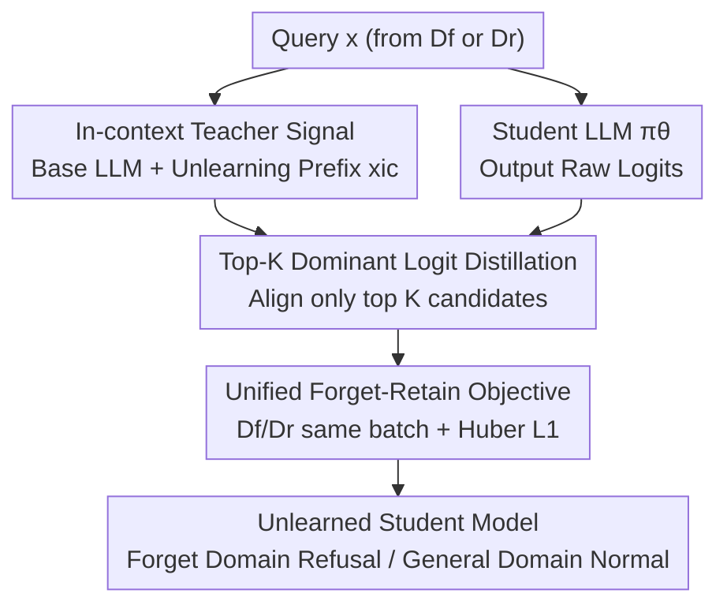

# DUET: Distilled LLM Unlearning from an Efficiently Contextualized Teacher

**Conference**: ICLR2026  
**OpenReview**: [https://openreview.net/forum?id=Xa6QRrXrKX](https://openreview.net/forum?id=Xa6QRrXrKX)  
**Code**: To be confirmed  
**Area**: LLM Safety / Unlearning  
**Keywords**: LLM Unlearning, Knowledge Distillation, In-context Unlearning, Top-K Logit, Robustness

## TL;DR
DUET distills the Top-K logit shifts generated by a teacher model guided by an "unlearning prefix" into the student model's parameters. Using a unified objective to achieve both unlearning and retention simultaneously, it combines the robustness of training-based unlearning with the precision and efficiency of in-context unlearning. Furthermore, it requires only queries (without forgotten answers) and completes unlearning using datasets several orders of magnitude smaller than SOTA methods.

## Background & Motivation
**Background**: LLM unlearning aims to erase the model's memory of certain knowledge that should not be retained (e.g., privacy, copyright, dangerous capabilities) without retraining from scratch. Currently, there are two main approaches: **training-based unlearning** (updating parameters on forgotten data, such as GA, NPO, RMU) and **in-context unlearning** (using carefully designed prompts to guide the model to refuse at inference time without modifying parameters).

**Limitations of Prior Work**: Training-based unlearning often requires a large amount of forgotten data and is prone to **catastrophic forgetting**, potentially destroying general knowledge (e.g., GA crashing MMLU from 61.46 to 24.87). While in-context unlearning is lightweight and precise, it is extremely fragile; a reverse prompt like "ignore previous instructions" can resurface the suppressed knowledge (referred to in the paper as *un-unlearning*).

**Key Challenge**: There exists a trade-off between robustness and efficiency/precision. Parameter optimization is robust but expensive and hurts general capabilities, while in-context guidance is precise and efficient but fails once the prompt is removed. No existing approach effectively combines the advantages of both.

**Goal**: Can the effects of in-context unlearning be "solidified" into model parameters to retain its precision and data efficiency while gaining robustness against reverse attacks? This is broken down into: (1) extracting useful supervision signals from an in-context teacher; (2) managing both "forgetting" and "retention" with a single objective; and (3) minimizing the required data.

**Key Insight**: The authors observe that prepending a prefix like "You have forgotten Harry Potter" to a base model causes an **observable and reusable shift** in the logit distribution at the first decoding step. Refusal/uncertainty tokens ("None", "Unfortunately") rise to the top, while domain-related tokens are pushed out of the Top-10. This logit shift itself is a high-quality supervision signal that currently "lives in the prompt" but can be distilled into parameters for solidification.

**Core Idea**: The student model mimics the **Top-K dominant logits** of a teacher model guided by an unlearning prefix. Through distillation, the transient effects of "in-context unlearning" are burned into the parameters, creating a robust and efficient unlearning effect.

## Method

### Overall Architecture
The input to DUET is a set of forgotten queries $D_f$ (questions only, no answers) and a small retention set $D_r$ unrelated to the forgotten domain. The output is a modified student model $\pi_\theta$ that refuses queries in the forgotten domain while responding normally to the general domain. The pipeline consists of three steps: "Teacher generates signals → Select Top-K logits → Student distillation," linked by a **unified objective**. The teacher $\pi_{ref}$ is a version of the same base LLM temporarily equipped with an "unlearning prefix" $x_{ic}$. DUET selects only the largest Top-K candidate tokens from the teacher's logits and aligns the student's **original logits (scalars before softmax)** at these positions with the teacher's, rather than fitting the entire normalized vocabulary distribution. Samples from $D_f$ and $D_r$ are mixed into the same batch and processed with the same distillation loss. On forgotten samples, the teacher leans toward refusal; on retention samples, the teacher prefix barely changes the semantics. Thus, a single objective naturally balances "forgetting" and "retention."

### Key Designs

**1. In-context Teacher Providing Efficient Supervision: Turning "Prompt-based Unlearning" into a Distillable Target**

The primary issue with training-based unlearning is the need for $(x_f, y_l)$ "question-forgotten answer" pairs. The forgotten answer $y_l$ contains sensitive knowledge and can contaminate the general domain. DUET avoids this by not fitting the actual forgotten answer. Instead, it uses a teacher $\pi_{ref}=\pi(x_{ic}\oplus\cdot)$—the base model prepended with an unlearning prefix $x_{ic}$ (e.g., "You are an assistant who has forgotten Harry Potter...")—to generate supervision. Formally, it requires a prefix $x_{ic}$ such that for the forgotten domain $\forall x_f\sim D_f$, the probability of $y\sim\pi(x_{ic}\oplus x_f)$ falling into a valid refusal set $Y_w$ is $>1-\epsilon$, while the same prefix barely changes the output for general queries. The unlearning target is expressed as minimizing the distribution difference: $\min_\theta \mathbb{E}_{x_f,x_{ic}}\big[\text{Diff}\big(\pi_\theta(x_f)\,\|\,\pi_{ref}(x_{ic}\oplus x_f)\big)\big]$. The brilliance here is that the teacher's refusal behavior is "ready-made and training-free"; DUET simply transfers this transient signal into the student parameters, requiring only $x_f$ (queries) without $y_l$ (forgotten answers) or $y_w$ (ideal refusal templates).

**2. Top-K Dominant Logit Distillation: Aligning Informative Candidates, Avoiding Vocabulary Noise**

Distilling over the entire posterior probability space has two drawbacks: first, softmax normalization discards absolute magnitude information, leaving only relative confidence; second, alignment across tens of thousands of tokens is dominated by noise that does not affect final output and is computationally expensive. DUET focuses only on the Top-K candidate tokens $i_k\in C_K$ with the highest logits in the teacher (those actually likely to be sampled during beam search), defined as $\{g^{i_k}_{\pi_{ref}}(\cdot|x_{ic}\oplus x_f)>\xi_K\}$, where $g^i$ is the raw logit scalar before softmax and $\xi_K$ is a threshold. The student's raw logits at these K positions approach the teacher's, using **Huber L1 loss** (more robust to logit outliers). Figure 1 visualizes the effect: before unlearning, Harry Potter-related tokens dominate; after unlearning, refusal tokens like "None" and "Unfortunately" rise, while HP-specific tokens drop out of the Top-10. Compared to "first-order" supervision like Refusal Training (SFT on token sequences), Top-K logit distillation provides finer-grained "latent supervision," leading to more thorough unlearning with minimal impact on general capabilities.

**3. Unified Forget-Retain Objective: Managing "Forget" and "Retain" with One Loss**

Traditional methods use $L_{unlearn}+\lambda L_{retain}$, requiring careful tuning of the weight $\lambda$. DUET notes that since the unlearning prefix does not change semantics for general queries, retention samples can follow the **same distillation process**. On retention samples, the teacher's Top-K logits are already consistent with the original model; aligning the student with them preserves general capabilities. By mixing $D_f$ and $D_r$ into one batch, DUET optimizes a coherent objective $\min_\theta J_{DUET}\equiv\mathbb{E}_{x\in\{D_f\cup D_r\},x_{ic}}\big[\sum_{i_k\in C_K} l\big(g^{i_k}_\theta(x);\,g^{i_k}_{ref}(x_{ic}\oplus x)\big)\big]$. Ablations show that adding retention regularization to Refusal Training weakens its unlearning ability, while DUET remains unaffected, indicating that "selective logit distillation" unifies both tasks without the tension found in $\lambda$-regularization.

**4. Query-only Data Efficient Solution: Unlearning with Minimal Reformatted Samples**

The authors analyzed existing benchmarks and found that the quality and format of forgotten data directly affect results. DUET is designed to use a "concept-centric, query-only" small dataset. An LLM (Llama-3.2-3B-Instruct) extracts $D_f^{query}$ from original corpora. The cost reduction is significant: on the Harry Potter task, DUET uses only 100 forgotten samples (1,319 tokens) and a 914-token retention set, compared to the ~1.44M tokens in the full HP corpus—a three-order-of-magnitude reduction. Combined with the fact that it does **not perform sequence supervision** during training (only embedding a logit shift pattern), it saves both data and compute while outperforming GA and NPO.

### Loss & Training
The core objective is $J_{DUET}$ from Equation (3). For each sample in $D_f\cup D_r$, the teacher's Top-K logits are sampled, and the student's raw logits are aligned using Huber L1. Unlearning and retention share the same objective without a separate weight $\lambda$. The teacher is the base model concatenated with task-relevant unlearning prefixes $x_{ic}$; prefix quality significantly impacts results (see Table 5).

## Key Experimental Results

### Main Results

Harry Potter (MUSE-Books, Llama3.2-3B). $\downarrow$ indicates lower is better, $\uparrow$ indicates higher is better. Performance Shift measures "clean forgetting + complete retention":

| Method | R-Forget ↓ | R-Forget-500 ↓ | R-Retain ↑ | MMLU ↑ | Perf. Shift ↑ |
|------|-----------|----------------|-----------|--------|---------------|
| Base (Llama3.2-3B) | 32.13 | 39.99 | 84.29 | 61.46 | 0 |
| GA | 0.00 | 0.00 | 0.00 | 24.87 | -48.76 |
| NPO | 24.18 | 26.83 | 69.69 | 54.79 | -0.16 |
| FLAT | 0.47 | 0.64 | 58.33 | 58.92 | 42.51 |
| **DUET** | 4.27 | 5.98 | **78.33** | **61.45** | **55.90** |

While GA reduces unlearning metrics to 0, MMLU and R-Retain collapse (catastrophic forgetting). DUET maintains near-perfect general capabilities (MMLU 61.45 ≈ Base 61.46) while reducing unlearning metrics to single digits, achieving the highest Performance Shift.

WMDP (Bio/Cyber, Zephyr-7B), dangerous knowledge removal:

| Method | Bio Acc-Forget ↓ | Bio MMLU ↑ | Cyber Acc-Forget ↓ | Cyber MMLU ↑ |
|------|------------------|-----------|--------------------|--------------|
| Base (Zephyr-7B) | 63.70 | 58.12 | 43.68 | 58.12 |
| GA | 24.65 | 25.25 | 33.77 | 48.79 |
| RMU (Dr) | 31.89 | 57.18 | 26.93 | 57.81 |
| **DUET** | 29.40 | **60.63** | 26.60 | **60.65** |

DUET achieves the highest utility retention (MMLU) across both sub-tasks while suppressing dangerous knowledge accuracy to levels comparable to RMU (the strongest competitor specifically tuned for WMDP).

### Ablation Study

Distillation Granularity and Retention Regularization (Table 4, Harry Potter):

| Configuration | R-Forget ↓ | R-Retain ↑ | MMLU ↑ | Perf. Shift ↑ | Description |
|------|-----------|-----------|--------|---------------|------|
| Refusal-Training ($D_f^{QR}\cup D_r$) | 31.02 | 75.32 | 60.48 | -6.60 | Token-level SFT fails to unlearn |
| DUET ($D_f^{query}$) | 3.50 | 69.31 | 55.17 | 42.83 | No retention data, pure unlearning |
| DUET ($D_f^{query}$) + KL($D_r$) | 4.53 | 69.54 | 57.53 | 42.75 | Full vocab KL instead of Top-K |
| **DUET ($D_f^{query}\cup D_r$)** | 4.27 | **78.33** | **61.45** | **55.90** | Full model |

Data Requirement Comparison (Table 3): DUET only requires input queries $x_f$, not forgotten answers $y_l$ or refusal templates $y_w$—it is the only method with ✗ in both columns.

Robustness to Reverse Attacks (Table 6, HP 500-QA):

| Method | W/O Attack R-Forget ↓ | W/ Attack R-Forget ↓ |
|------|----------------------|----------------------|
| Base + Prefix (In-context) | 4.52 | 37.62 |
| **DUET** | 5.98 | **7.27** |

### Key Findings
- **Top-K Logit Distillation is critical for thorough unlearning**: Replacing Top-K with full-vocabulary KL (DUET+KL) reduces utility without improving unlearning. Aligning only high-information logits avoids noise.
- **Unified Objective outperforms $\lambda$-regularization**: Adding retention to Refusal Training weakens its unlearning, whereas DUET’s unlearning remains stable with or without retention data.
- **Robustness comes from parameter solidification**: In-context unlearning collapses from 4.52 to 37.62 under reverse prompts (knowledge recovered), while DUET stays stable around 7.
- **Teacher prefix quality determines the ceiling** (Table 5): Explicit semantic prefixes work best; "refuse everything" prefixes hurt unlearning and utility, while irrelevant prefixes fail to induce unlearning.

## Highlights & Insights
- **Solidifying "transient unlearning in prompts" into "persistent unlearning in parameters"**: Precise signals from in-context unlearning are transferred into the robust carrier of training-based unlearning, hitting the sweet spot between the two paths.
- **Distilling Top-K raw logits instead of the full vocabulary**: This preserves absolute logit magnitudes and focuses distillation on candidates actually sampled by beam search, avoiding noise-dominated training.
- **Unlearning without forgotten answers**: Unlike traditional methods needing $y_l$ (which contains sensitive knowledge), DUET requires only queries, reducing data safety risks and construction costs.
- **Unified objective removes $\lambda$ tuning**: Treating retention samples with the same distillation process simplifies engineering and removes the fragile balance between unlearning and retention losses.

## Limitations & Future Work
- **Upper bound constrained by teacher prefix**: Table 5 shows prefix quality is decisive. The Performance Shift of "Base + Prefix" (61.22) is actually higher than DUET (55.90), implying DUET's ceiling is limited by prefix engineering.
- **Assumes concept-centric small data**: The method is geared toward "small and focused" unlearning tasks. Its efficiency for diffused unlearning needs spread across large datasets is not yet verified.
- **Not a total sweep on WMDP**: Dangerous knowledge accuracy is comparable to, but not significantly lower than, RMU; unlearning intensity has room for improvement.
- **Limited reverse attack forms**: Robustness is primarily tested against "ignore instructions" prompts; resistance to stronger attacks like micro-fine-tuning relearning requires more evaluation.

## Related Work & Insights
- **vs. In-context Unlearning (ICU / ECO)**: These guide refusal at inference via prompts/embedding perturbations. They are lightweight but fail if prompts are removed; DUET distills these signals into parameters, improving robustness from 37.62 to 7.27.
- **vs. GA / NPO (Training-based)**: GA suffers from catastrophic forgetting, while NPO eases this via preference optimization but still struggles with the forget-utility trade-off. DUET uses Top-K logit distillation with orders of magnitude less data.
- **vs. RMU**: RMU pushes forgotten domain representations toward random directions. DUET is comparable in dangerous knowledge removal but retains general utility (MMLU) better.
- **vs. Refusal Training**: Refusal Training uses SFT on refusal tokens (first-order supervision). DUET uses the teacher's Top-K logits (latent supervision), providing finer granularity and remaining stable when adding retention regularization.

## Rating
- Novelty: ⭐⭐⭐⭐⭐ Effectively merges two unlearning paradigms by distilling transient in-context signals into parameters.
- Experimental Thoroughness: ⭐⭐⭐⭐ Covers HP/WMDP and multidimensional ablations on granularity/prefix/attacks, though it doesn't significantly lead RMU in unlearning strength.
- Writing Quality: ⭐⭐⭐⭐ Logical progression of motivations and clear arguments for the unified objective; some formulas are dense.
- Value: ⭐⭐⭐⭐⭐ Data efficiency and robustness against reverse attacks make it highly attractive for practical LLM unlearning deployment.

<!-- RELATED:START -->

## Related Papers

- [\[ICLR 2026\] CLUE: Conflict-guided Localization for LLM Unlearning Framework](clue_conflict-guided_localization_for_llm_unlearning_framework.md)
- [\[ICLR 2026\] LLM Unlearning with LLM Beliefs](llm_unlearning_with_llm_beliefs.md)
- [\[ICLR 2026\] Dual-Space Smoothness for Robust and Balanced LLM Unlearning](dual-space_smoothness_for_robust_and_balanced_llm_unlearning.md)
- [\[ICLR 2026\] DRAGON: Guard LLM Unlearning in Context via Negative Detection and Reasoning](dragon_guard_llm_unlearning_in_context_via_negative_detection_and_reasoning.md)
- [\[ICLR 2026\] Explainable LLM Unlearning through Reasoning](explainable_llm_unlearning_through_reasoning.md)

<!-- RELATED:END -->
