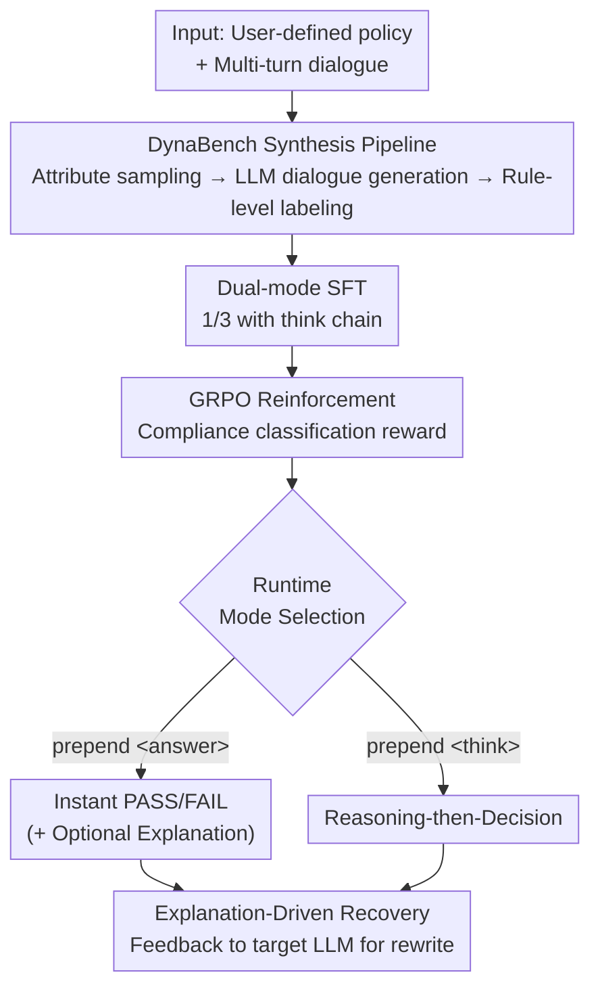

# DynaGuard: A Dynamic Guardian Model With User-Defined Policies

**Conference**: ICLR2026  
**OpenReview**: [https://openreview.net/forum?id=gc8Ylt0lbm](https://openreview.net/forum?id=gc8Ylt0lbm)  
**Code**: To be confirmed  
**Area**: LLM Security / Guardian Models / Content Moderation  
**Keywords**: Guardian model, user-defined policy, compliance detection, chain-of-thought, GRPO

## TL;DR
DynaGuard upgrades guardian models from "static category classifiers" to dynamic models capable of "understanding arbitrary user-defined policies to judge compliance." By synthesizing the DynaBench dataset comprising over 60,000 multi-turn dialogues and 40,000 policies, and training Qwen3 via SFT+GRPO, the 8B model outperforms GPT-4o-mini in custom rule violation detection. It supports a dual-mode output—"instant answer" or "reasoning with explanation"—where explanations can further guide the target LLM to self-correct.

## Background & Motivation
**Background**: Guardian models (e.g., LlamaGuard, WildGuard, ShieldGemma) serve as "security inspectors" in LLM pipelines, reviewing chatbot outputs for harm. Major providers offer such models, but they are built on **predefined static harm categories** (violence, sexual content, self-harm, etc.).

**Limitations of Prior Work**: In the real world, "violation" depends heavily on context. A response harmless in one setting might cause financial or reputational damage in another. The paper cites the Air Canada case: a chatbot erroneously promised a refund, which the court ordered the company to honor. A "no refund" business rule falls outside the static harm categories of models like LlamaGuard. Medical scenarios may allow anatomical discussions while blocking erotica, and RAG models should discuss news-related violence while blocking violent planning—static categories cannot handle these nuances. LlamaGuard3 claims to handle user-defined types but only achieves a 13.1% F1 score on the test set of this paper.

**Key Challenge**: Existing solutions face significant trade-offs (Table 1): safety-trained guardian models do not support dynamic policies; reasoning-only models (GuardReasoner) are too slow; encoder classifiers (ModernBert) lack actionable explanations; and API-based models (GPT-4/Gemini) are expensive, slow, and cannot be deployed locally for sensitive data. No solution simultaneously satisfies "dynamic policies + interpretability + local weights + fast inference."

**Goal**: To create a next-generation guardian model that meets all four criteria simultaneously.

**Key Insight**: The bottleneck lies in **training data** rather than model architecture. No existing dataset forces models to learn the "read policy then judge compliance" paradigm. WildGuard and Aegis2.0 only cover fixed ontologies across limited safety subcategories. The solution starts with creating a compliance dataset covering arbitrary business rules.

**Core Idea**: A hybrid pipeline utilizing "rule bases + persona bases + multi-turn dialogue synthesis" creates DynaBench (40k policies). Subsequently, SFT+GRPO finetunes a general-purpose instruction model into DynaGuard—a model that understands any policy, supports dual-mode output, and provides explanations for error correction.

## Method

### Overall Architecture
The DynaGuard pipeline consists of three stages: "Data Synthesis → Model Training → Explanation Utilization." The **input** is a set of user-defined policies plus a multi-turn user-agent dialogue. The **output** is a PASS/FAIL compliance label, optionally accompanied by a natural language explanation of which rule was violated and why.

The first stage is **DynaBench Data Synthesis**: diversity is injected via Cartesian sampling from large-scale static attribute libraries (industries, user/agent personas, rule bases). An LLM then generates multi-turn dialogues and labels them per rule, resulting in 61,500 training samples and 543 manual test samples. The second stage is **Two-Phase Training**: supervised fine-tuning (SFT) is performed on a 50/50 mix of DynaBench and four safety datasets (with 1/3 of samples including a `<think>` chain-of-thought to activate dual-mode), followed by GRPO reinforcement. The third stage is the **Explanation-Driven Recovery Loop**: if a response fails, the model outputs an actionable explanation that is fed back to the target LLM to rewrite a compliant response.

### Key Designs

**1. DynaBench Synthesis Pipeline: Forcing "any business rule" diversity via attribute libraries**

To teach the model to read any policy, training data must go beyond fixed safety ontologies. The authors "seed" diversity into the data by first manually writing ~500 detailed rules, then expanding the rule base to 5,000 (3,949 industry-specific + 758 general) using interactive expansion with GPT-4o, Gemini-2.0, and Claude 3.5. A **policy** is a set of rules sampled via an exponential distribution (median of 3, max of 86 rules), which LLMs then rewrite for deduplication, resulting in 40,000 unique policies. Dialogues are programmatically generated using attribute libraries: agent personas (company/industry/role) and user personas (age/occupation/location/personality), inducing LLMs to create multi-turn interactions ranging from benign to adversarial jailbreak attempts.

**2. Rule-level Labeling + Manual Validation: Decomposing complex policies into atomic tasks**

DynaBench is intentionally difficult (multi-turn, multi-rule, jailbreaks), making automated labeling by LLMs error-prone. The authors use **decomposition**: each policy is broken into individual rules, and GPT-4o judges compliance for one rule at a time, as general LLMs are most accurate on single-rule tasks. The model's ultimate task is to aggregate these simple individual judgments to identify if any rule is violated in any turn. For validation, 743 samples (biased toward harder cases) were evaluated by 3 human annotators. The final Cohen's Kappa reached 0.85, significantly higher than the 0.72 reported by WildGuard, indicating reliable synthetic labels.

**3. Dual-mode Training: One model, two behaviors (instant vs. reasoning)**

Guardian models face a trade-off: reasoning is explainable but slow; instant labels are fast but opaque. DynaGuard embeds both into one model using a **unified format and mixed ratios**. During training, 1/3 of samples use "Thinking Mode," where the supervision target places the chain-of-thought in `<think></think>` and the classification in `<answer></answer>`:

$$\mathcal{L}_{CT\text{-}SFT}(\theta) = -\mathbb{E}_{(r,x,t,y)\sim D}\left[\log P_\theta(t,y\mid r,x)\right]$$

where $r$ is the rule set, $x$ is the dialogue, $t$ is the reasoning chain, and $y$ is the label. The remaining 2/3 use "Instant Mode," where the `<answer>` tag comes first followed by a brief `<explanation>`, supervised by pure classification:

$$\mathcal{L}_{C\text{-}SFT}(\theta) = -\mathbb{E}_{(r,x,y)\sim D}\left[\log P_\theta(y\mid r,x)\right]$$

At runtime, prepending `<think>` or `<answer>` toggles the mode. F1 scores differ by only 1.3% between modes, meaning the instant mode retains high accuracy while saving latency.

**4. GRPO Reinforcement + Explanation-Driven Recovery: Extending accuracy to error correction**

Post-SFT, GRPO is applied (11,000 samples) with a compliance-classification reward:

$$J_{GRPO}(\theta) = \mathbb{E}_{(t,y)\sim\pi_k(\cdot\mid r,x)}\Big[\min\big(\tfrac{\pi(t,y\mid r,x)}{\pi_k(t,y\mid r,x)}A_{\pi_k},\ \mathrm{clip}(\tfrac{\pi}{\pi_k},1-\epsilon,1+\epsilon)A_{\pi_k}\big) - \beta\,\mathrm{KL}(\pi\,\|\,\pi_{ref})\Big]$$

The advantage $A_{\pi_k}$ is standardized from scalar rewards $R(r,x,t,y)$. GRPO further improves scores (Table 4: 4B model F1 improves from 64.6 to 71.7). Furthermore, the dual-mode allows DynaGuard's explanations to be consumed downstream: when a FAIL is detected, the explanation is fed back to the target LLM to rewrite the response with minimal changes. In IFEval, pairing Ministral-8B with DynaGuard for this recovery improved accuracy from 57.3% to 63.8%, whereas LlamaGuard3/NemoGuard showed little to no improvement because they cannot process unseen instruction-based policies.

### Loss & Training
Two stages: ① **SFT** on a 50/50 mix of 40k DynaBench and 40k safety data (WildGuard, etc.) for 1 epoch; ② **GRPO** reinforcement on 11k samples with grid search on hyperparameters. The base model is Qwen3 (1.7B/4B/8B).

## Key Experimental Results

### Main Results
F1 scores (%) across six safety benchmarks + DynaBench test set. DynaGuard-8B ranks first in average across all tasks:

| Model | CoT | WildGuard | DynaBench | Safety Avg | All Task Avg |
|------|-----|-----------|-----------|----------|-----------|
| GPT-4o-mini | ✓ | 75.4 | 70.1 | 76.9 | 75.8 |
| WildGuard | ✗ | 74.2 | 20.9 | 80.0 | 70.2 |
| LlamaGuard3 | ✗ | 69.9 | 13.1 | 72.1 | 62.3 |
| GuardReasoner-8B | ✓ | 78.4 | 22.0 | 81.5 | 71.6 |
| **DynaGuard-8B** | ✗ | 79.3 | 72.5 | 79.6 | 78.4 |
| **DynaGuard-8B** | ✓ | 80.8 | 73.1 | 81.1 | **79.7** |

Notably, existing guardian models collapsed on the custom policies of DynaBench (LlamaGuard3: 13.1, WildGuard: 20.9), while DynaGuard-8B achieved 72.5–73.1. Even DynaGuard-1.7B outperformed existing models with an average score of 77.4.

### Ablation Study

| Training Recipe (Qwen3-4B) | WildGuard | DynaBench | Combined | RERR |
|---------------------|-----------|-----------|------|------|
| Base | 41.0 | 26.7 | 33.9 | - |
| 40k Label-only SFT | 53.2 | 75.9 | 64.6 | 46.4% |
| 40k Label+CoT SFT + 11k GRPO | 68.0 | 75.4 | 71.7 | 57.1% |

| Data Source (40k SFT+11k GRPO) | WildGuard | DynaBench | Combined | RERR |
|------------------------------|-----------|-----------|------|------|
| Safety only | 79.6 | 33.3 | 56.5 | 34.2% |
| DynaBench only | 68.0 | 75.4 | 71.7 | 57.2% |
| Mix (50/50) | 77.2 | 66.7 | 72.0 | 57.6% |
| 80k SFT + Mix | 74.5 | 71.8 | 73.2 | 59.5% |

### Key Findings
- **DynaBench data is the primary driver**: SFT on DynaBench alone increased 4B model F1 from 33.9 to 64.6.
- **Zero-shot generalization**: Training on DynaBench (without safety ontologies) generalizes well to the safety domain (WildGuard F1: 68.0), proving that teaching policy-reading transfers to traditional safety domains.
- **Cross-model universality**: The DynaBench recipe improves performance across Qwen3, Qwen2.5, and Llama3.2 base models.
- **Robustness to confusing policies**: On the "DynaBench-Confusing" subset, DynaGuard achieved 69.1% accuracy, far exceeding LlamaGuard (39.6%).

## Highlights & Insights
- **Redefining the guardian model as a "data problem" rather than an "architecture problem"**: Using an instruction model with high-quality synthetic data outperforms specialized architectures.
- **Engineering dual-mode unity**: The use of `<think>` and `<answer>` tags to switch between latency and interpretability within the same weights is a practical solution for deployment.
- **Machine-consumable explanations**: Feeding violation explanations back to the LLM for self-correction (+6.5 points on IFEval) establishes a model for active correction rather than passive interception.
- **Decomposition-based labeling trick**: Aggregating atomic rule judgments significantly improves synthetic label quality for complex tasks.

## Limitations & Future Work
- **Reliance on synthetic data**: DynaBench depends heavily on high-end LLMs for generation. Despite human validation, there may be a distribution gap between synthetic and real-world business data.
- **Small manual test set**: The 543-sample test set might not fully capture the breadth of 40,000 training policies.
- **Scalability to 100+ rules**: Accuracy declines as rule count increases; the robustness of guardian models under extremely long policies remains to be verified.
- **Limited recovery loop validation**: Explanation-driven correction was only tested on IFEval with Ministral-8B. Its robustness across diverse tasks and target models needs broader validation.

## Related Work & Insights
- **vs LlamaGuard / WildGuard / ShieldGemma (Static Guardian Models)**: These lack support for custom policies, failing on DynaBench. DynaGuard's advantage comes from its training paradigm rather than scale.
- **vs GuardReasoner (Reasoning-based Models)**: GuardReasoner provides CoT but is slow and fails on custom policies (22.0 F1). DynaGuard provides both speed and accuracy on custom rules.
- **vs API Models (GPT-4o-mini, etc.)**: DynaGuard-8B is open-source, deployable locally for privacy, and achieves higher average performance with lower latency.

## Rating
- Novelty: ⭐⭐⭐⭐⭐ Redefines guardian models from static to dynamic; integrated dataset + dual-mode + recovery loop.
- Experimental Thoroughness: ⭐⭐⭐⭐ Extensive benchmarks and ablations; however, the test set is small and recovery validation is limited.
- Writing Quality: ⭐⭐⭐⭐ Clear motivation and logical flow.
- Value: ⭐⭐⭐⭐⭐ High industrial value for business rule enforcement and local deployment.

<!-- RELATED:START -->

## Related Papers

- [\[ICLR 2026\] TrustGen: A Dynamic Evaluation Platform for Generative Foundation Model Trustworthiness](trustgen_a_platform_of_dynamic_benchmarking_on_the_trustworthiness_of_generative.md)
- [\[NeurIPS 2025\] AgentStealth: Reinforcing Large Language Model for Anonymizing User-generated Text](../../NeurIPS2025/llm_safety/agentstealth_reinforcing_large_language_model_for_anonymizing_user-generated_tex.md)
- [\[ICLR 2026\] Analyzing and Evaluating Unbiased Language Model Watermark](analyzing_and_evaluating_unbiased_language_model_watermark.md)
- [\[ICLR 2026\] GhostEI-Bench: Do Mobile Agents Resilience to Environmental Injection in Dynamic On-Device Environments?](ghostei-bench_do_mobile_agent_resilience_to_environmental_injection_in_dynamic_o.md)
- [\[ICLR 2026\] From Static Benchmarks to Dynamic Protocol: Agent-Centric Text Anomaly Detection for Evaluating LLM Reasoning](from_static_benchmarks_to_dynamic_protocol_agent-centric_text_anomaly_detection_.md)

<!-- RELATED:END -->
